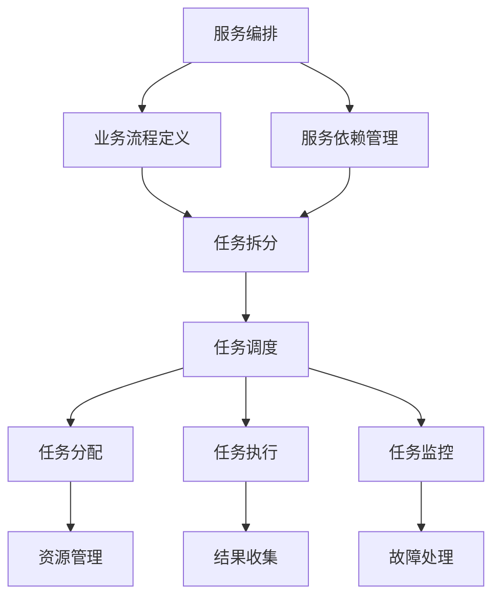
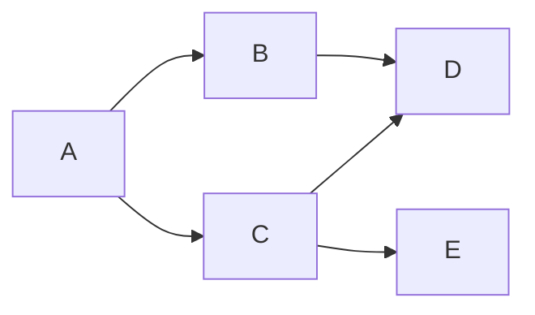
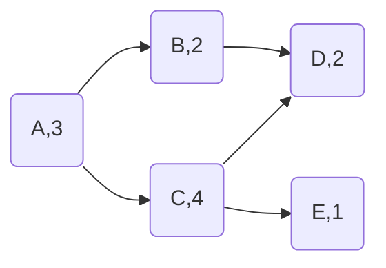

# 服务编排与任务调度原理与代码实战案例讲解

## 1. 背景介绍
### 1.1 服务编排与任务调度的重要性
在现代分布式系统和微服务架构中,服务编排与任务调度扮演着至关重要的角色。随着系统复杂度的不断增加,如何高效地协调和管理各个服务组件,实现业务流程的自动化和优化,成为了一个重大挑战。服务编排与任务调度技术应运而生,旨在解决这一难题,提高系统的可靠性、可扩展性和灵活性。

### 1.2 服务编排与任务调度的应用场景
服务编排与任务调度广泛应用于各个领域,包括但不限于:
- 云计算和微服务架构:协调和管理分布式系统中的服务组件,实现服务的自动化部署、扩缩容和故障恢复。
- 业务流程自动化:将业务流程抽象为一系列任务,通过编排和调度实现流程的自动化执行和优化。
- 数据处理和分析:协调和调度数据处理任务,实现数据的高效处理和分析。
- 物联网和边缘计算:协调和管理物联网设备和边缘节点,实现数据的实时处理和决策。

### 1.3 服务编排与任务调度面临的挑战
尽管服务编排与任务调度技术已经取得了长足的进步,但仍然面临着诸多挑战:
- 复杂性:随着系统规模和服务数量的增加,编排和调度的复杂性也在不断提高。
- 异构性:不同的服务组件可能采用不同的技术栈和通信协议,增加了编排和调度的难度。
- 动态性:服务组件的状态和性能可能随时间变化,需要编排和调度系统具备动态适应能力。
- 可靠性:编排和调度系统需要具备高可靠性,能够应对各种故障场景。

## 2. 核心概念与联系
### 2.1 服务编排
服务编排是指将多个服务组件组合成一个完整的业务流程或应用的过程。它通过定义服务之间的交互和依赖关系,实现服务的协同工作,完成特定的业务目标。服务编排的关键在于如何描述和管理服务之间的流程和数据流转。

### 2.2 任务调度
任务调度是指根据一定的规则和策略,将任务分配给合适的执行节点或资源的过程。它负责管理任务的生命周期,包括任务的创建、分配、执行、监控和结果收集等。任务调度的目标是实现任务的高效执行,最大化资源利用率,同时满足任务的约束条件和优先级。

### 2.3 服务编排与任务调度的关系
服务编排和任务调度是紧密相关的两个概念。服务编排定义了服务之间的流程和依赖关系,而任务调度负责将这些流程中的任务分配给合适的执行节点。可以说,服务编排是任务调度的上层抽象,它关注业务流程的定义和管理,而任务调度则关注具体任务的执行和资源分配。

下图展示了服务编排与任务调度之间的关系:



从图中可以看出,服务编排负责定义业务流程和管理服务依赖,将业务流程拆分为一系列任务。任务调度则负责将这些任务分配给合适的执行节点,监控任务的执行过程,收集任务结果,并处理可能出现的故障。

## 3. 核心算法原理具体操作步骤
### 3.1 有向无环图(DAG)
有向无环图(Directed Acyclic Graph,DAG)是服务编排和任务调度的核心数据结构。它用于表示服务或任务之间的依赖关系,其中每个节点表示一个服务或任务,有向边表示服务或任务之间的依赖关系。DAG 具有以下特点:
- 有向性:边具有方向,表示依赖关系的方向。
- 无环性:图中不存在环,即不存在一条路径可以从一个节点出发最终回到该节点。

DAG 的构建步骤如下:
1. 定义服务或任务节点,每个节点包含唯一标识、输入输出等属性。
2. 分析服务或任务之间的依赖关系,添加有向边连接相关节点。
3. 检查 DAG 的有效性,确保不存在环。

### 3.2 拓扑排序
拓扑排序是在 DAG 上进行调度的核心算法。它根据节点之间的依赖关系,确定一个合理的执行顺序,使得每个节点的所有前置节点都在其之前执行。拓扑排序的步骤如下:
1. 初始化一个入度为 0 的节点队列和一个结果队列。
2. 将所有入度为 0 的节点加入队列。
3. 如果队列不为空,则:
   - 取出队首节点,将其加入结果队列。
   - 对该节点的所有后继节点,将其入度减 1。
   - 如果某个后继节点的入度变为 0,将其加入队列。
4. 重复步骤 3,直到队列为空。
5. 如果结果队列中的节点数与 DAG 中的节点数相等,则拓扑排序成功,结果队列即为拓扑序列。否则,说明 DAG 中存在环,拓扑排序失败。

### 3.3 关键路径方法
关键路径方法(Critical Path Method,CPM)是一种在 DAG 上进行调度优化的算法。它通过计算每个节点的最早开始时间和最晚结束时间,确定整个 DAG 的关键路径,即决定整个流程完成时间的最长路径。关键路径上的任务被称为关键任务,其延迟会直接影响整个流程的完成时间。CPM 的步骤如下:
1. 正向遍历 DAG,计算每个节点的最早开始时间。
2. 反向遍历 DAG,计算每个节点的最晚结束时间。
3. 对于每个节点,如果其最早开始时间等于最晚结束时间,则该节点为关键节点,其所在路径为关键路径。
4. 优化关键路径上的任务,缩短关键任务的执行时间,从而缩短整个流程的完成时间。

## 4. 数学模型和公式详细讲解举例说明
### 4.1 DAG 的数学表示
DAG 可以用邻接矩阵或邻接表来表示。假设 DAG 有 n 个节点,则:
- 邻接矩阵:一个 n×n 的方阵 A,其中 $A[i][j]=1$ 表示节点 i 到节点 j 有一条有向边,否则为 0。
- 邻接表:一个长度为 n 的数组 A,其中 A[i] 存储了节点 i 的所有后继节点。

例如,对于下图所示的 DAG:



其邻接矩阵表示为:

$$
A=\begin{bmatrix}
0 & 1 & 1 & 0 & 0\\ 
0 & 0 & 0 & 1 & 0\\
0 & 0 & 0 & 1 & 1\\
0 & 0 & 0 & 0 & 0\\
0 & 0 & 0 & 0 & 0
\end{bmatrix}
$$

其邻接表表示为:

```
A: [B, C]
B: [D]
C: [D, E] 
D: []
E: []
```

### 4.2 拓扑排序的数学描述
拓扑排序可以用数学语言描述如下:
给定一个有向无环图 $G=(V,E)$,其中 $V$ 表示节点集合,$E$ 表示边集合。拓扑排序的目标是找到一个节点序列 $\{v_1,v_2,\dots,v_n\}$,使得对于任意的边 $(v_i,v_j)\in E$,都有 $i<j$。

例如,对于上图所示的 DAG,其拓扑序列可以是:
- A, B, C, D, E
- A, C, B, D, E
- A, C, B, E, D

### 4.3 关键路径方法的数学描述
关键路径方法可以用数学语言描述如下:
给定一个有向无环图 $G=(V,E)$,每个节点 $v_i$ 都有一个权重 $w_i$,表示该节点的执行时间。定义以下变量:
- $ES(i)$:节点 $v_i$ 的最早开始时间。
- $EF(i)$:节点 $v_i$ 的最早结束时间。
- $LS(i)$:节点 $v_i$ 的最晚开始时间。
- $LF(i)$:节点 $v_i$ 的最晚结束时间。

则有以下递推公式:

$$
\begin{aligned}
ES(i) &= \max\{EF(j)|(v_j,v_i)\in E\} \\
EF(i) &= ES(i) + w_i \\
LF(i) &= \min\{LS(j)|(v_i,v_j)\in E\} \\
LS(i) &= LF(i) - w_i
\end{aligned}
$$

其中,对于起始节点 $v_s$,有 $ES(s)=0$;对于终止节点 $v_t$,有 $LF(t)=EF(t)$。

节点 $v_i$ 的时间余量 $TF(i)$ 定义为:

$$
TF(i) = LF(i) - EF(i)
$$

如果 $TF(i)=0$,则节点 $v_i$ 为关键节点,其所在路径为关键路径。

例如,对于下图所示的 DAG,其中节点权重为 A:3,B:2,C:4,D:2,E:1:



可以计算出各节点的时间参数如下:

| 节点 | ES | EF | LS | LF | TF |
|:---:|:--:|:--:|:--:|:--:|:--:|
|  A  |  0 |  3 |  0 |  3 |  0 |
|  B  |  3 |  5 |  4 |  6 |  1 |
|  C  |  3 |  7 |  3 |  7 |  0 |
|  D  |  7 |  9 |  7 |  9 |  0 |
|  E  |  7 |  8 |  8 |  9 |  1 |

可以看出,关键路径为 A->C->D,关键任务为 A、C、D。

## 5. 项目实践:代码实例和详细解释说明
下面以一个简单的 Python 项目为例,演示如何实现服务编排与任务调度。

### 5.1 DAG 的构建
首先定义 DAG 节点类:

```python
class DAGNode:
    def __init__(self, name, duration):
        self.name = name
        self.duration = duration
        self.predecessors = []
        self.successors = []
        
    def add_successor(self, node):
        self.successors.append(node)
        node.predecessors.append(self)
```

其中,`name` 表示节点名称,`duration` 表示节点执行时间,`predecessors` 和 `successors` 分别表示节点的前驱和后继节点列表。

然后构建 DAG:

```python
# 创建节点
A = DAGNode('A', 3)
B = DAGNode('B', 2)
C = DAGNode('C', 4)
D = DAGNode('D', 2)
E = DAGNode('E', 1)

# 添加边
A.add_successor(B)
A.add_successor(C)
B.add_successor(D)
C.add_successor(D)
C.add_successor(E)
```

### 5.2 拓扑排序
实现拓扑排序算法:

```python
def topological_sort(nodes):
    # 初始化入度字典
    in_degree = {node: 0 for node in nodes}
    for node in nodes:
        for successor in node.successors:
            in_degree[successor] += 