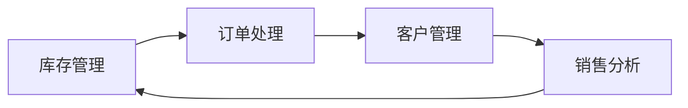

## 1.背景介绍
随着信息技术的飞速发展，电子商务已经成为了现代商业的重要组成部分。在这个大背景下，服装销售系统作为电子商务的一个重要应用，其重要性不言而喻。服装销售系统可以帮助企业实现对服装销售的全流程管理，提高销售效率，减少人力成本，提升客户体验。

## 2.核心概念与联系
服装销售系统的核心概念包括：库存管理、订单处理、客户管理、销售分析等。这些模块之间存在着紧密的联系，形成了系统的整体架构。



## 3.核心算法原理具体操作步骤
在设计服装销售系统时，我们需要考虑到系统的易用性、稳定性和扩展性。系统的核心算法主要包括库存管理算法、订单处理算法、客户管理算法和销售分析算法。

## 4.数学模型和公式详细讲解举例说明
在销售分析中，我们通常会使用一些数学模型和公式来进行数据分析和预测。例如，我们可以使用线性回归模型来预测未来的销售趋势。

假设我们的销售数据可以用以下公式表示：

$$
y = ax + b
$$

其中，$y$表示销售额，$x$表示时间，$a$和$b$是我们需要通过数据拟合得到的参数。

## 5.项目实践：代码实例和详细解释说明
接下来，我们来看一下如何使用Python来实现这个系统。首先，我们需要定义一个库存管理类，这个类负责管理所有的库存信息。

```python
class InventoryManagement:
    def __init__(self):
        self.inventory = {}

    def add_item(self, item, quantity):
        if item in self.inventory:
            self.inventory[item] += quantity
        else:
            self.inventory[item] = quantity

    def remove_item(self, item, quantity):
        if item in self.inventory and self.inventory[item] >= quantity:
            self.inventory[item] -= quantity
        else:
            print("Not enough inventory for this item.")
```

## 6.实际应用场景
服装销售系统可以广泛应用于各种线上和线下的服装销售场景，例如，大型的服装零售商、小型的服装店铺、线上的电商平台等。

## 7.工具和资源推荐
在开发服装销售系统时，我们可以使用一些现成的开源工具和资源，例如，Python的Django框架、数据库管理系统MySQL、前端框架React等。

## 8.总结：未来发展趋势与挑战
随着技术的发展，服装销售系统将会越来越智能，例如，通过机器学习和大数据分析，系统可以自动预测未来的销售趋势，帮助商家做出更好的决策。然而，这也带来了一些挑战，例如，如何保护用户的隐私，如何处理大量的数据等。

## 9.附录：常见问题与解答
Q: 服装销售系统需要实时更新库存吗？
A: 是的，为了保证系统的准确性，我们需要实时更新库存信息。

Q: 如何处理退货？
A: 退货是服装销售系统的一个重要部分，我们需要在系统中设计一个专门处理退货的模块。

作者：禅与计算机程序设计艺术 / Zen and the Art of Computer Programming