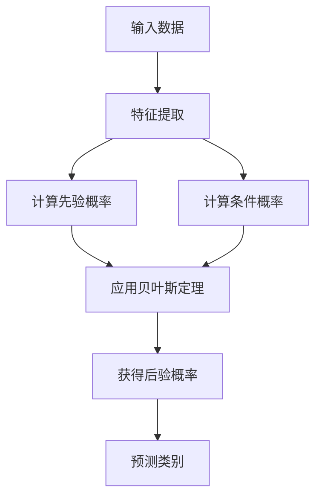

# 朴素贝叶斯 原理与代码实例讲解

## 1.背景介绍

### 1.1 什么是朴素贝叶斯

朴素贝叶斯是一种基于贝叶斯定理与特征条件独立假设的分类方法。它是一种有监督的机器学习算法,常用于文本分类、垃圾邮件过滤、情感分析等领域。

朴素贝叶斯分类器的"朴素"来源于其对于特征之间相互独立的假设简化。尽管这个假设在现实中并不总是成立,但朴素贝叶斯分类器通常仍然能够很好地工作。

### 1.2 朴素贝叶斯的优缺点

优点:

- 原理简单,易于实现
- 对缺失数据不太敏感
- 分类准确度高,在多数情况下可达到其他分类方法的水平

缺点: 

- 由于假设特征之间相互独立,有时会影响分类的准确性
- 对于输入数据的准备方式较为敏感

## 2.核心概念与联系

### 2.1 贝叶斯定理

朴素贝叶斯分类器的核心是贝叶斯定理。贝叶斯定理提供了在已知先验知识的条件下,如何计算条件概率的方法。

贝叶斯定理的公式:

$$P(A|B) = \frac{P(B|A)P(A)}{P(B)}$$

其中:
- $P(A|B)$ 是已知 $B$ 发生的情况下 $A$ 发生的条件概率
- $P(B|A)$ 是已知 $A$ 发生的情况下 $B$ 发生的条件概率 
- $P(A)$ 和 $P(B)$ 分别是 $A$ 和 $B$ 的先验概率或边缘概率

### 2.2 特征条件独立性假设

朴素贝叶斯分类器的"朴素"假设是:给定类别 $y$,特征 $x_1,x_2,...,x_n$ 之间是条件独立的。

数学表达式:
$$P(x_1,x_2,...,x_n|y) = \prod_{i=1}^{n}P(x_i|y)$$

这个假设虽然过于简单,但使得朴素贝叶斯分类器的训练和预测过程变得高效。

### 2.3 先验概率和条件概率

在朴素贝叶斯分类器中,需要计算每个类别的先验概率 $P(y)$ 和每个特征对于不同类别的条件概率 $P(x_i|y)$。这些概率通常从训练数据中估计得到。

## 3.核心算法原理具体操作步骤  

朴素贝叶斯分类器的工作原理可以总结为以下步骤:



1. **特征提取**: 从输入数据中提取特征,通常使用词袋模型(bag-of-words)等方法将文本数据转换为特征向量。

2. **计算先验概率**: 从训练数据中估计每个类别的先验概率 $P(y)$。

3. **计算条件概率**: 从训练数据中估计每个特征对于不同类别的条件概率 $P(x_i|y)$。常用的估计方法有最大似然估计和贝叶斯估计。

4. **应用贝叶斯定理**: 将先验概率和条件概率代入贝叶斯定理,计算后验概率 $P(y|x_1,x_2,...,x_n)$。

5. **预测类别**: 选择后验概率最大的类别作为预测结果。

## 4.数学模型和公式详细讲解举例说明

### 4.1 朴素贝叶斯分类器的数学模型

给定一个实例 $\mathbf{x} = (x_1, x_2, ..., x_n)$,其中 $x_i$ 是第 $i$ 个特征,我们需要找到使后验概率 $P(y|\mathbf{x})$ 最大的类别 $y$。根据贝叶斯定理:

$$P(y|\mathbf{x}) = \frac{P(\mathbf{x}|y)P(y)}{P(\mathbf{x})}$$

由于分母 $P(\mathbf{x})$ 对于所有类别是相同的,因此我们只需要最大化分子部分:

$$\underset{y}{\operatorname{argmax}}\ P(y|\mathbf{x}) = \underset{y}{\operatorname{argmax}}\ P(\mathbf{x}|y)P(y)$$

利用特征条件独立性假设,我们可以将 $P(\mathbf{x}|y)$ 分解为:

$$P(\mathbf{x}|y) = \prod_{i=1}^{n}P(x_i|y)$$

将上式代入,我们得到朴素贝叶斯分类器的数学模型:

$$\underset{y}{\operatorname{argmax}}\ P(y|\mathbf{x}) = \underset{y}{\operatorname{argmax}}\ P(y)\prod_{i=1}^{n}P(x_i|y)$$

在实际应用中,我们通常取对数,将乘法转换为加法,以避免下溢出:

$$\underset{y}{\operatorname{argmax}}\ \log P(y|\mathbf{x}) = \underset{y}{\operatorname{argmax}}\ \left\{\log P(y) + \sum_{i=1}^{n}\log P(x_i|y)\right\}$$

### 4.2 计算先验概率和条件概率

先验概率 $P(y)$ 可以通过在训练数据中统计每个类别的频率来估计:

$$P(y) = \frac{N_y}{N}$$

其中 $N_y$ 是训练数据中属于类别 $y$ 的实例数,而 $N$ 是训练数据的总数。

条件概率 $P(x_i|y)$ 的估计方法取决于特征的类型。对于离散型特征(如文本中的词),常用的估计方法是最大似然估计:

$$P(x_i|y) = \frac{N_{x_i,y} + \alpha}{N_y + \alpha n}$$

其中 $N_{x_i,y}$ 是训练数据中属于类别 $y$ 且包含特征 $x_i$ 的实例数,$\alpha$ 是一个小正数(通常取 1),用于避免概率为 0,$n$ 是特征的个数。

对于连续型特征(如数值型特征),通常假设其服从高斯分布,并估计均值和方差:

$$P(x_i|y) = \frac{1}{\sqrt{2\pi\sigma_y^2}}\exp\left(-\frac{(x_i - \mu_y)^2}{2\sigma_y^2}\right)$$

其中 $\mu_y$ 和 $\sigma_y^2$ 分别是训练数据中属于类别 $y$ 的实例在第 $i$ 个特征上的均值和方差。

### 4.3 举例说明

假设我们有一个文本分类问题,需要判断一封邮件是"垃圾邮件"还是"正常邮件"。我们提取了两个特征:邮件主题中是否包含"赢取"和"免费"这两个词。

设 $x_1$ 表示"赢取"这个特征, $x_2$ 表示"免费"这个特征,取值为 0 或 1。我们需要计算 $P(y=垃圾邮件|x_1, x_2)$ 和 $P(y=正常邮件|x_1, x_2)$,并选择概率更大的那个作为预测结果。

假设从训练数据中估计得到:

- $P(y=垃圾邮件) = 0.4$
- $P(y=正常邮件) = 0.6$
- $P(x_1=1|y=垃圾邮件) = 0.8$
- $P(x_1=1|y=正常邮件) = 0.2$
- $P(x_2=1|y=垃圾邮件) = 0.7$
- $P(x_2=1|y=正常邮件) = 0.1$

如果一封邮件的主题中包含"赢取"但不包含"免费",即 $x_1=1, x_2=0$,那么:

$$\begin{aligned}
P(y=垃圾邮件|x_1=1, x_2=0) &\propto P(y=垃圾邮件) \cdot P(x_1=1|y=垃圾邮件) \cdot P(x_2=0|y=垃圾邮件) \\
&= 0.4 \cdot 0.8 \cdot (1-0.7) \\
&= 0.096
\end{aligned}$$

$$\begin{aligned}
P(y=正常邮件|x_1=1, x_2=0) &\propto P(y=正常邮件) \cdot P(x_1=1|y=正常邮件) \cdot P(x_2=0|y=正常邮件) \\
&= 0.6 \cdot 0.2 \cdot (1-0.1) \\
&= 0.108
\end{aligned}$$

由于 $P(y=正常邮件|x_1=1, x_2=0) > P(y=垃圾邮件|x_1=1, x_2=0)$,因此我们将这封邮件预测为"正常邮件"。

## 5.项目实践:代码实例和详细解释说明

以下是使用Python中的scikit-learn库实现朴素贝叶斯分类器的代码示例,并对关键步骤进行了详细解释。

```python
from sklearn.datasets import load_iris
from sklearn.naive_bayes import GaussianNB
from sklearn.model_selection import train_test_split
from sklearn.metrics import accuracy_score

# 加载鸢尾花数据集
iris = load_iris()
X = iris.data
y = iris.target

# 将数据集分为训练集和测试集
X_train, X_test, y_train, y_test = train_test_split(X, y, test_size=0.3, random_state=42)

# 创建高斯朴素贝叶斯分类器对象
gnb = GaussianNB()

# 使用训练数据训练模型
gnb.fit(X_train, y_train)

# 对测试数据进行预测
y_pred = gnb.predict(X_test)

# 计算准确率
accuracy = accuracy_score(y_test, y_pred)
print(f"Accuracy: {accuracy:.2f}")
```

代码解释:

1. 导入所需的库和函数。
2. 加载鸢尾花数据集,将特征数据存储在 `X` 中,将目标变量存储在 `y` 中。
3. 使用 `train_test_split` 函数将数据集分为训练集和测试集,测试集占 30%。
4. 创建一个 `GaussianNB` 对象,这是一个实现了朴素贝叶斯算法的分类器,适用于连续型数据。
5. 使用训练数据 `X_train` 和 `y_train` 训练模型,调用 `fit` 方法。
6. 对测试数据 `X_test` 进行预测,调用 `predict` 方法。
7. 使用 `accuracy_score` 函数计算预测结果的准确率。

对于离散型数据(如文本分类),可以使用 `MultinomialNB` 或 `BernoulliNB` 分类器。以下是一个使用 `MultinomialNB` 进行文本分类的示例:

```python
from sklearn.datasets import fetch_20newsgroups
from sklearn.feature_extraction.text import CountVectorizer
from sklearn.naive_bayes import MultinomialNB
from sklearn.metrics import accuracy_score

# 加载20个新闻组数据集
newsgroups_train = fetch_20newsgroups(subset='train')
newsgroups_test = fetch_20newsgroups(subset='test')

# 将文本数据转换为特征向量
vectorizer = CountVectorizer()
X_train = vectorizer.fit_transform(newsgroups_train.data)
X_test = vectorizer.transform(newsgroups_test.data)
y_train = newsgroups_train.target
y_test = newsgroups_test.target

# 创建多项式朴素贝叶斯分类器对象
mnb = MultinomialNB()

# 训练模型
mnb.fit(X_train, y_train)

# 预测并计算准确率
y_pred = mnb.predict(X_test)
accuracy = accuracy_score(y_test, y_pred)
print(f"Accuracy: {accuracy:.2f}")
```

代码解释:

1. 导入所需的库和函数。
2. 加载20个新闻组数据集,分别获取训练集和测试集。
3. 使用 `CountVectorizer` 将文本数据转换为特征向量,这里使用的是词袋模型。
4. 创建一个 `MultinomialNB` 对象