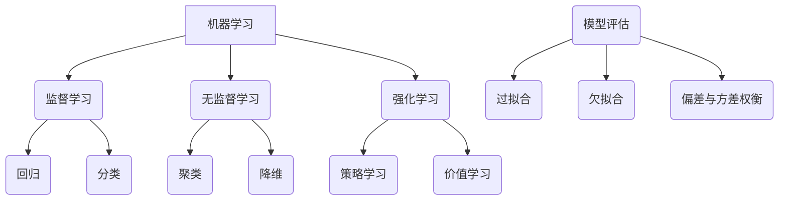
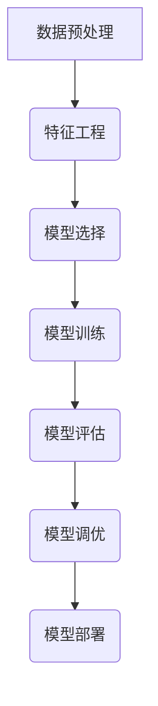

以下是标题为《机器学习(Machine Learning)原理与代码实战案例讲解》的技术博客文章正文内容:

# 机器学习(Machine Learning)原理与代码实战案例讲解

## 1.背景介绍

### 1.1 机器学习的重要性

在当今的数字时代,数据已经成为了新的燃料,推动着各行各业的创新和发展。机器学习作为人工智能的核心技术之一,正在以前所未有的方式改变着我们生活和工作的方式。它赋予计算机系统以智能,使其能够从数据中自主学习、建模并作出预测,而无需显式编程。

机器学习已广泛应用于图像识别、自然语言处理、推荐系统、金融风险管理等诸多领域,极大地提高了生产效率,优化了决策过程。随着大数据时代的到来,机器学习的重要性与日俱增,成为企业保持竞争力和创新力的关键所在。

### 1.2 机器学习发展历程

机器学习的概念可以追溯到20世纪50年代,当时人工智能的先驱们提出了"让计算机从数据中自动学习"的想法。经过数十年的发展,机器学习经历了多个阶段:

- 早期阶段(1950s-1960s):决策树、线性回归等简单算法问世
- 知识驱动阶段(1970s-1980s):专家系统、知识库等概念出现
- 统计学习阶段(1990s-2000s):支持向量机、随机森林等算法逐步成熟
- 深度学习时代(2010s-今):受益于大数据和计算能力的飞跃,深度神经网络取得了突破性进展

当前,机器学习正处于一个全新的发展阶段,不仅在传统领域表现卓越,更在自动驾驶、机器翻译等前沿领域大放异彩。

## 2.核心概念与联系

机器学习包含许多核心概念,这些概念相互关联、环环相扣,构成了完整的理论体系。理解这些概念及其内在联系,对于掌握机器学习原理至关重要。



### 2.1 监督学习与无监督学习

- **监督学习(Supervised Learning)**: 利用带有标签的训练数据,学习出一个从输入到输出的映射函数。常见任务包括回归(预测连续值输出)和分类(预测离散值输出)。
- **无监督学习(Unsupervised Learning)**: 仅利用无标签的训练数据,自动发现其中潜在的模式和结构。常见任务包括聚类(发现数据内在的簇)和降维(将高维数据压缩到低维空间)。

### 2.2 强化学习

**强化学习(Reinforcement Learning)**: 是一种基于环境交互的学习范式。智能体通过采取行动并观察环境的反馈(奖励或惩罚),不断优化自身的策略,以最大化长期累积奖励。强化学习常用于决策序列问题,如机器人控制、游戏AI等。

### 2.3 模型评估与偏差-方差权衡

**模型评估**是机器学习中一个重要环节,用于衡量模型在未见数据上的泛化能力。常用的评估方法包括训练/测试集分割、交叉验证等。

在模型评估过程中,需要平衡**偏差(Bias)**与**方差(Variance)**:

- 偏差:模型与真实函数之间的差距,偏差越大,模型越难拟合真实情况
- 方差:模型对训练数据扰动的敏感程度,方差越大,模型越容易过拟合

偏差-方差权衡是机器学习中一个核心概念,需要在模型复杂度和训练数据量之间寻求平衡。

## 3.核心算法原理具体操作步骤

机器学习算法种类繁多,但大多数算法都可以归纳为以下几个步骤:



### 3.1 数据预处理

数据预处理是机器学习的第一步,包括处理缺失值、去除异常值、标准化等操作,目的是将原始数据转换为算法可以接受的格式。常用的预处理技术有:

- 插值法(填充缺失值)
- 异常值剔除(基于统计或规则)
- 标准化(如Min-Max、Z-Score等)
- 编码分类变量(如One-Hot、Label等)

### 3.2 特征工程

特征工程是从原始数据中提取有意义的特征,对算法的性能至关重要。常用的特征工程技术包括:

- 特征选择(如Filter、Wrapper等)
- 特征提取(如PCA、LDA等)
- 特征构造(如多项式、交叉特征等)

### 3.3 模型选择

根据问题的性质,选择合适的机器学习算法模型。常用算法包括:

- 监督学习算法:线性回归、逻辑回归、决策树、支持向量机、神经网络等
- 无监督学习算法:K-Means、DBSCAN、PCA、自编码器等
- 强化学习算法:Q-Learning、Sarsa、Policy Gradient等

### 3.4 模型训练

利用训练数据,通过优化目标函数(如损失函数)的方式,来学习模型的参数。常用的优化算法有:

- 基于梯度的优化算法:梯度下降、随机梯度下降、动量优化、Adam等
- 基于启发式的优化算法:遗传算法、模拟退火、蚁群优化等

### 3.5 模型评估

使用保留的测试数据,评估模型的泛化能力。常用的评估指标包括:

- 回归任务:均方根误差(RMSE)、平均绝对误差(MAE)等
- 分类任务:准确率、精确率、召回率、F1分数、ROC曲线等

### 3.6 模型调优

根据模型评估的结果,对模型进行调优,提高其性能。常用的调优方法有:

- 正则化(如L1、L2正则)
- 超参数优化(如网格搜索、随机搜索等)
- 集成学习(如Bagging、Boosting、Stacking等)

### 3.7 模型部署

将训练好的模型集成到实际的应用系统中,并进行持续的监控和维护。

## 4.数学模型和公式详细讲解举例说明

机器学习算法大多基于数学模型和统计理论,掌握相关数学知识对于深入理解算法原理至关重要。以下我们将介绍几个核心的数学概念和公式。

### 4.1 线性回归

线性回归是最基础的监督学习算法之一,用于预测连续值的输出。其数学模型为:

$$y = w_0 + w_1x_1 + w_2x_2 + ... + w_nx_n$$

其中$y$为预测的输出值,$x_i$为第$i$个特征值,$w_i$为对应的权重系数。

线性回归的目标是通过最小化均方误差损失函数,来学习最优的权重系数$w$:

$$\min_{w}\sum_{i=1}^{m}(y_i - (w_0 + w_1x_{i1} + ... + w_nx_{in}))^2$$

上式中$m$为训练样本数量。

通过对损失函数取梯度并令其等于0,可以得到解析解:

$$w = (X^TX)^{-1}X^Ty$$

其中$X$为设计矩阵,$y$为标签向量。

### 4.2 逻辑回归

逻辑回归是一种常用的分类算法,可用于二分类和多分类问题。其数学模型为:

$$P(Y=k|X) = \frac{e^{\theta_k^TX}}{\sum_{j=1}^K e^{\theta_j^TX}}$$

其中$k \in \{1,2,...,K\}$为类别标签,$X$为特征向量,$\theta_k$为第$k$类的参数向量。

逻辑回归的目标是最大化训练数据的对数似然函数:

$$\max_\theta \sum_{i=1}^m \log P(y^{(i)}|x^{(i)};\theta)$$

常用的优化算法包括梯度下降、拟牛顿法等。

### 4.3 支持向量机

支持向量机(SVM)是一种有监督的非线性分类模型,其基本思想是在高维特征空间中构建一个超平面,将不同类别的数据分开,且与最近的数据点距离最大化。

对于线性可分的情况,SVM的数学模型为:

$$\begin{align*}
&\min_{\gamma, w, b}  &&\frac{1}{2}\|w\|^2\\
&\text{subject to} &&y_i(w^Tx_i+b) \geq 1, \quad i=1,...,m
\end{align*}$$

其中$\gamma = (w, b)$为超平面的法向量和截距,$m$为训练样本数量。

对于线性不可分的情况,需要引入松弛变量,并通过核技巧将数据映射到高维特征空间。常用的核函数包括线性核、多项式核、高斯核等。

### 4.4 K-Means聚类

K-Means是一种常用的无监督聚类算法,其目标是将$n$个样本数据划分为$K$个簇,使得簇内数据点之间的平方误差最小。

K-Means的目标函数为:

$$\min_{S} \sum_{i=1}^{K}\sum_{x \in S_i}\|x - \mu_i\|^2$$

其中$S = \{S_1, S_2, ..., S_K\}$为数据的簇划分,$\mu_i$为第$i$个簇的质心。

K-Means算法通过迭代的方式交替执行两个步骤:

1. 分配步骤:将每个数据点分配到与其最近的簇中
2. 更新步骤:重新计算每个簇的质心

直至簇划分不再发生变化或达到最大迭代次数。

### 4.5 主成分分析(PCA)

主成分分析(PCA)是一种常用的无监督降维技术,其目标是将高维数据投影到一个低维的子空间中,同时尽可能保留原始数据的方差信息。

PCA的数学原理是,对数据矩阵$X$进行特征值分解:

$$\Sigma = \frac{1}{m}X^TX = U\Lambda U^T$$

其中$\Sigma$为数据协方差矩阵,$U$为特征向量矩阵,$\Lambda$为对角特征值矩阵。

选取前$k$个最大的特征值对应的特征向量,即可得到一个$k$维的投影子空间。将原始数据投影到该子空间,就完成了降维操作:

$$z = U_k^T(x - \mu)$$

其中$z$为降维后的数据,$U_k$为前$k$个主成分,$\mu$为数据均值。

## 5.项目实践:代码实例和详细解释说明

理论知识固然重要,但要真正掌握机器学习,还需要通过实战项目来加深理解和锻炼编程能力。以下我们将使用Python的Scikit-Learn库,实现一个基于逻辑回归的手写数字识别项目。

### 5.1 项目概述

手写数字识别是机器学习中一个经典的案例,其目标是根据手写数字图像的像素值特征,对其所代表的数字(0-9)进行分类识别。我们将使用来自MNIST数据库的手写数字图像作为训练和测试数据。

### 5.2 导入库和数据

```python
from sklearn.datasets import fetch_openml
from sklearn.model_selection import train_test_split
from sklearn.linear_model import LogisticRegression
from sklearn.metrics import accuracy_score

# 加载MNIST数据集
X, y = fetch_openml('mnist_784', return_X_y=True)

# 划分训练集和测试集
X_train, X_test, y_train, y_test = train_test_split(X, y, random_state=42)
```

### 5.3 特征