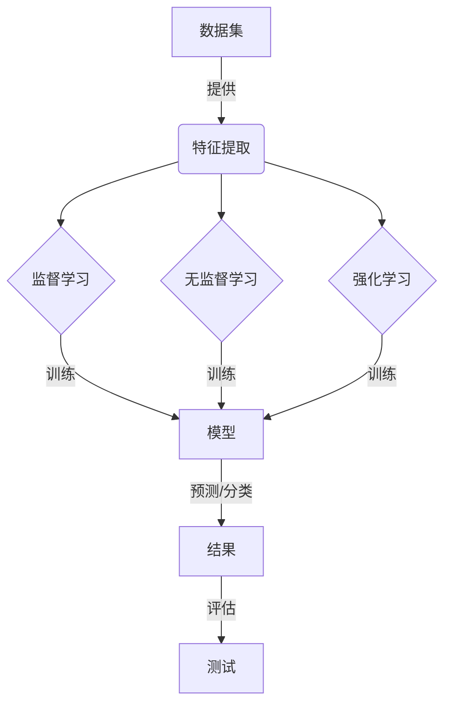

# 机器学习原理与代码实战案例讲解

## 1. 背景介绍

机器学习是人工智能领域的一个重要分支,旨在赋予计算机系统自主学习和改进的能力,而无需显式编程。随着大数据时代的到来,海量数据的出现为机器学习提供了广阔的应用空间。机器学习已广泛应用于图像识别、自然语言处理、推荐系统、金融预测等诸多领域,极大地提高了人类的工作效率和生活质量。

## 2. 核心概念与联系

机器学习的核心概念包括:

1. **数据集(Dataset)**: 用于训练和测试机器学习模型的数据集合。
2. **特征(Feature)**: 描述数据样本的属性或特征向量。
3. **标签(Label)**: 对应每个数据样本的真实值或类别。
4. **模型(Model)**: 根据数据集学习出的函数或算法,用于对新数据进行预测或分类。
5. **训练(Training)**: 使用数据集训练模型的过程,目标是找到最优模型参数。
6. **测试(Testing)**: 使用未见过的数据评估模型性能的过程。
7. **监督学习(Supervised Learning)**: 利用带标签的数据集进行训练的学习方式。
8. **无监督学习(Unsupervised Learning)**: 利用无标签数据集进行训练的学习方式。
9. **强化学习(Reinforcement Learning)**: 通过与环境交互并获得奖励信号进行学习的方式。

这些概念相互关联,构成了机器学习的基本框架。

## 3. 核心算法原理具体操作步骤

机器学习算法可分为监督学习、无监督学习和强化学习三大类。以下介绍几种核心算法的原理和操作步骤:

### 3.1 线性回归

线性回归是一种常用的监督学习算法,用于预测连续型变量。其基本思想是找到一条最佳拟合直线,使数据点到直线的距离之和最小。

算法步骤:

1. 准备数据集,包括特征矩阵 $X$ 和标签向量 $y$。
2. 初始化模型参数 $\theta$ (权重和偏置)。
3. 定义代价函数(损失函数) $J(\theta)$,如平方误差: $J(\theta) = \frac{1}{2m}\sum_{i=1}^m(h_\theta(x^{(i)}) - y^{(i)})^2$
4. 使用梯度下降法不断更新 $\theta$,最小化代价函数: $\theta_j := \theta_j - \alpha \frac{\partial}{\partial \theta_j}J(\theta)$
5. 重复第4步,直到收敛或达到停止条件。
6. 使用训练好的模型 $h_\theta(x) = \theta^Tx$ 对新数据进行预测。

其中, $h_\theta(x)$ 是假设函数(模型), $m$ 是训练样本数量, $\alpha$ 是学习率。

### 3.2 逻辑回归

逻辑回归是一种常用的监督学习算法,用于二分类问题。其基本思想是找到一个最佳分类面(对数几率回归模型),将数据点分为两类。

算法步骤:  

1. 准备数据集,包括特征矩阵 $X$ 和标签向量 $y$ (0或1)。
2. 初始化模型参数 $\theta$。
3. 定义假设函数(模型): $h_\theta(x) = g(\theta^Tx)$, 其中 $g(z) = \frac{1}{1 + e^{-z}}$ 是 Sigmoid 函数。
4. 定义代价函数(损失函数): $J(\theta) = -\frac{1}{m}\sum_{i=1}^m[y^{(i)}\log(h_\theta(x^{(i)})) + (1-y^{(i)})\log(1-h_\theta(x^{(i)}))]$
5. 使用梯度下降法不断更新 $\theta$,最小化代价函数。
6. 重复第5步,直到收敛或达到停止条件。
7. 使用训练好的模型对新数据进行分类: 若 $h_\theta(x) \geq 0.5$,则分类为1,否则为0。

### 3.3 K-均值聚类

K-均值聚类是一种常用的无监督学习算法,用于对数据进行聚类。其基本思想是将数据划分为 K 个簇,使得每个数据点到其所属簇的质心的距离之和最小。

算法步骤:

1. 选择 K 个初始质心(聚类中心)。
2. 对每个数据点,计算其到各个质心的距离,将其归入最近的簇。
3. 对每个簇,重新计算质心(所有点的均值)。
4. 重复步骤2和3,直到质心不再变化或达到最大迭代次数。

距离度量通常使用欧几里得距离或曼哈顿距离。算法收敛于局部最优解,因此初始质心的选择会影响最终结果。

### 3.4 决策树

决策树是一种常用的监督学习算法,可用于分类和回归问题。其基本思想是根据特征值将数据集递归地划分为更小的子集,构建一棵决策树。

算法步骤(以分类树为例):

1. 从根节点开始,对整个数据集计算一个适当的度量(如信息增益、基尼指数等),选择最优特征进行分裂。
2. 对每个子节点,重复步骤1,递归地构建决策树。
3. 直到满足停止条件(如所有样本属于同一类别、没有剩余特征等)。

决策树易于理解和解释,但存在过拟合风险。可通过剪枝、随机森林等方法来提高泛化能力。

## 4. 数学模型和公式详细讲解举例说明

机器学习算法通常建立在数学模型和公式的基础之上。以下对一些常见的数学模型进行详细讲解:

### 4.1 线性回归模型

线性回归模型的假设函数为:

$$h_\theta(x) = \theta^Tx = \theta_0 + \theta_1x_1 + \theta_2x_2 + \cdots + \theta_nx_n$$

其中, $x$ 是特征向量, $\theta$ 是模型参数(权重和偏置)。

为了找到最优参数 $\theta$,我们定义代价函数(均方误差):

$$J(\theta) = \frac{1}{2m}\sum_{i=1}^m(h_\theta(x^{(i)}) - y^{(i)})^2$$

通过梯度下降法不断更新 $\theta$,最小化代价函数:

$$\theta_j := \theta_j - \alpha\frac{1}{m}\sum_{i=1}^m(h_\theta(x^{(i)}) - y^{(i)})x_j^{(i)}$$

其中, $\alpha$ 是学习率,控制更新步长。

例如,给定一个数据集 $\{(x^{(i)}, y^{(i)})\}_{i=1}^m$,其中 $x^{(i)} = (1, x_1^{(i)}, x_2^{(i)})$,我们可以使用线性回归模型拟合这些数据点。假设最优参数为 $\theta = (0.5, 0.3, 0.2)$,则模型为:

$$h_\theta(x) = 0.5 + 0.3x_1 + 0.2x_2$$

对于新的输入 $x = (1, 2, 3)$,预测值为 $h_\theta(x) = 0.5 + 0.3 \times 2 + 0.2 \times 3 = 1.7$。

### 4.2 逻辑回归模型

逻辑回归模型的假设函数为:

$$h_\theta(x) = g(\theta^Tx) = \frac{1}{1 + e^{-\theta^Tx}}$$

其中, $g(z)$ 是 Sigmoid 函数,将输入值映射到 $(0, 1)$ 范围内。

为了找到最优参数 $\theta$,我们定义代价函数(对数似然损失):

$$J(\theta) = -\frac{1}{m}\sum_{i=1}^m[y^{(i)}\log(h_\theta(x^{(i)})) + (1-y^{(i)})\log(1-h_\theta(x^{(i)}))]$$

同样使用梯度下降法不断更新 $\theta$,最小化代价函数。

例如,给定一个二分类数据集 $\{(x^{(i)}, y^{(i)})\}_{i=1}^m$,其中 $y^{(i)} \in \{0, 1\}$。假设最优参数为 $\theta = (0.2, 0.4, -0.3)$,则模型为:

$$h_\theta(x) = \frac{1}{1 + e^{-(0.2 + 0.4x_1 - 0.3x_2)}}$$

对于新的输入 $x = (1, 2, 3)$,预测值为 $h_\theta(x) = 0.63$。由于 $0.63 > 0.5$,我们将其分类为1。

### 4.3 K-均值聚类模型

K-均值聚类算法的目标是最小化以下目标函数:

$$J(c^{(1)}, c^{(2)}, \ldots, c^{(K)}) = \sum_{i=1}^m\sum_{k=1}^K\mathbb{1}\{x^{(i)} \in S_k\}\|x^{(i)} - c^{(k)}\|^2$$

其中, $c^{(k)}$ 是第 $k$ 个簇的质心, $S_k$ 是第 $k$ 个簇, $\mathbb{1}\{\cdot\}$ 是指示函数,当 $x^{(i)}$ 属于 $S_k$ 时取值为1,否则为0。

算法通过迭代优化上述目标函数,直到收敛。在每一次迭代中:

1. 对每个数据点 $x^{(i)}$,计算其到各个质心的距离,将其分配到最近的簇 $S_k$。
2. 对每个簇 $S_k$,重新计算质心 $c^{(k)} = \frac{1}{|S_k|}\sum_{x^{(i)} \in S_k}x^{(i)}$。

例如,给定一个二维数据集 $\{x^{(i)}\}_{i=1}^m$,我们希望将其划分为 3 个簇。假设经过迭代后,最终的质心为 $c^{(1)} = (1, 2)$, $c^{(2)} = (4, 5)$, $c^{(3)} = (7, 8)$。那么,对于新的数据点 $x = (2, 3)$,它将被分配到第一个簇,因为 $\|x - c^{(1)}\| = \sqrt{(2-1)^2 + (3-2)^2} = \sqrt{2}$ 最小。

### 4.4 决策树模型

决策树模型的构建过程可以看作是一个递归地选择最优特征并划分数据集的过程。在每个节点,我们需要计算一个适当的度量,如信息增益或基尼指数,来选择最优特征进行分裂。

对于分类问题,信息增益定义为:

$$\text{Gain}(D, a) = \text{Entropy}(D) - \sum_{v \in \text{Values}(a)}\frac{|D^v|}{|D|}\text{Entropy}(D^v)$$

其中, $D$ 是当前数据集, $a$ 是特征, $D^v$ 是根据特征 $a$ 的值 $v$ 划分出的子集, $\text{Entropy}(D)$ 是数据集 $D$ 的信息熵。

信息熵定义为:

$$\text{Entropy}(D) = -\sum_{c \in \text{Classes}(D)}\frac{|D_c|}{|D|}\log_2\frac{|D_c|}{|D|}$$

其中, $\text{Classes}(D)$ 是数据集 $D$ 中的所有类别, $D_c$ 是属于类别 $c$ 的子集。

在每个节点,我们选择信息增益最大的特征进行分裂,递归地构建决策树。

例如,给定一个包含天气情况、温度和是否出门三个特征的数据集,我们可以构建一棵决策树来预测是否出门。假设在根节点,算法选择了天气情况作