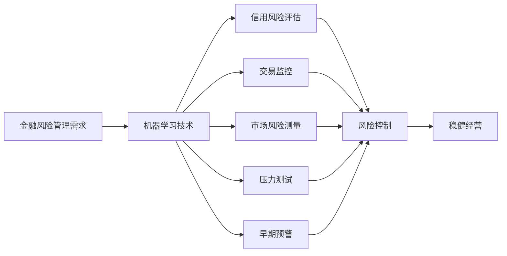
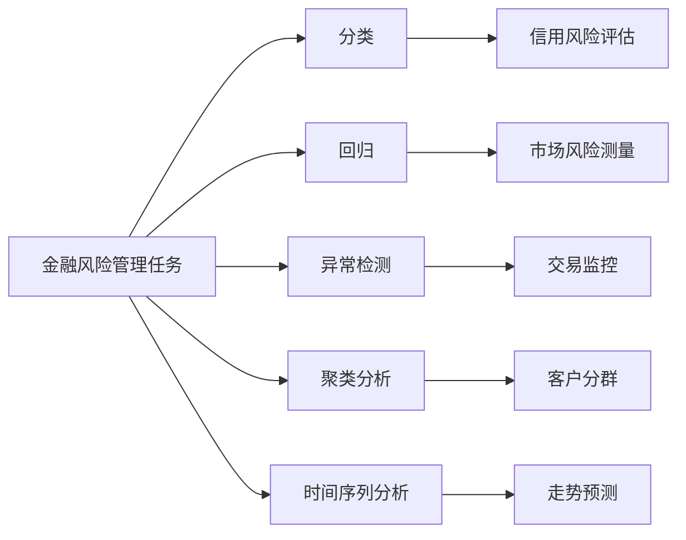

以下是标题为《机器学习在金融风险管理中的应用》的技术博客文章正文内容：

# 机器学习在金融风险管理中的应用

## 1.背景介绍

### 1.1 金融风险管理的重要性

在当今快节奏的金融环境中，有效的风险管理对于金融机构的生存和发展至关重要。金融风险可分为多种类型,包括信用风险、市场风险、操作风险、流动性风险等。这些风险若处理不当,可能导致重大财务损失,甚至引发系统性金融危机。因此,准确识别、测量和控制各类金融风险对金融机构而言是头等大事。

传统的风险管理方法主要依赖人工经验和定性分析,存在明显缺陷。随着大数据时代的到来和计算能力的飞速提升,机器学习(Machine Learning)技术在金融风险管理领域展现出巨大潜力和优势。

### 1.2 机器学习在金融风险管理中的作用

机器学习能够从海量历史数据中自动提取有价值的模式和规律,并据此进行预测和决策。在金融风险管理中,机器学习可以发挥以下重要作用:

1. 信用风险评估:利用机器学习对借款人的信用数据进行分析,评估其违约风险,为贷款审批提供决策支持。

2. 交易监控:通过分析大量历史交易数据,检测可疑交易活动,预防金融欺诈等操作风险。

3. 市场风险测量:基于机器学习对金融市场数据进行建模和预测,测量投资组合面临的潜在损失。

4. 压力测试:构建机器学习模型模拟极端市场情况,评估金融机构在压力情景下的抗风险能力。

5. 早期预警:利用机器学习及时发现潜在的风险信号,为风险管理提供预警和指引。

机器学习在金融风险管理中的应用不仅能提高风险识别和测量的准确性,还能提升决策效率,从而帮助金融机构更好地控制风险,维护稳健经营。

## 2.核心概念与联系

### 2.1 机器学习概述

机器学习是一门人工智能的分支,它赋予计算机在没有明确程序的情况下,通过利用数据或以往经验自动分析获得规律,并据此对新数据进行预测和决策的能力。机器学习算法按学习方式可分为监督学习、非监督学习和强化学习三大类。

在金融风险管理应用中,监督学习是使用最为广泛的机器学习范式。它利用已标注的历史数据训练模型,使模型能够学习输入和输出之间的映射关系,从而对新的未知数据做出预测。常见的监督学习算法有:

- 线性回归/逻辑回归
- 决策树
- 支持向量机(SVM)
- 神经网络
- 集成学习(随机森林、Boosting等)

### 2.2 金融风险管理中的机器学习任务

金融风险管理中的机器学习任务主要包括以下几类:

1. **分类任务**: 将样本数据划分为有限的离散类别,如信用风险评估中的"良好"或"违约"分类。

2. **回归任务**: 预测连续的数值输出,如市场风险测量中的投资组合潜在损失金额预测。

3. **异常检测**: 从正常数据中发现"异常"样本,如交易监控中的欺诈行为检测。

4. **聚类分析**: 根据相似性自动将数据划分为若干簇,如客户分群、交易模式挖掘等。

5. **时间序列分析**: 对随时间变化的序列数据(如股价走势)进行建模和预测。

这些任务需要采用不同的算法模型,并结合金融领域的专业知识进行特征工程、模型优化等,才能充分发挥机器学习的威力。

## 3.核心算法原理具体操作步骤

机器学习算法种类繁多,本节将重点介绍在金融风险管理中应用最为广泛的几种核心算法的原理和操作步骤。

### 3.1 逻辑回归

逻辑回归是一种常用的分类算法,适用于二分类问题,如信用风险评估的"良好/违约"分类。其基本思想是:

1. 构建逻辑函数(Logistic Function)将线性回归的输出值映射到(0,1)区间,作为样本属于正类的概率估计。

2. 最大似然估计法估计逻辑函数的系数,使正类概率估计值与真实标记值之间的交叉熵损失最小。

逻辑回归的操作步骤:

1) 数据预处理:填补缺失值、处理异常值、进行标准化等。

2) 特征工程:选择合适的特征,必要时进行特征构造。

3) 模型训练:使用梯度下降等优化算法估计逻辑函数系数。

4) 模型评估:使用准确率、ROC曲线等指标评估模型性能。

5) 模型调优:尝试不同正则化参数、特征组合,提高模型泛化能力。

6) 模型应用:对新数据进行分类预测,辅助决策。

### 3.2 决策树

决策树是一种常用的分类和回归算法,通过不断对特征进行条件分支构建决策树模型。优点是模型可解释性强,缺点是容易过拟合。典型的决策树算法有ID3、C4.5和CART等。

以CART决策树算法为例,其操作步骤为:

1) 数据预处理:处理缺失值和异常值。

2) 特征选择:计算各特征对目标变量的信息增益比,选择增益比最大的特征作为根节点。

3) 树构建:对根节点的每个取值,根据样本分布递归生成子节点,直至满足停止条件。

4) 树剪枝:合并相似的叶节点,防止过拟合。

5) 模型评估:使用准确率、平均方差等指标评估模型性能。

6) 模型应用:对新数据进行分类或回归预测。

### 3.3 随机森林

随机森林是一种非常流行的集成学习算法,它通过构建多个决策树,对单个决策树的高方差问题进行改善。具有很高的准确性和鲁棒性。

随机森林的操作步骤:

1) 数据采样:从原始样本集中使用有放回的方式随机采样生成多个子集。

2) 决策树构建:对每个子集分别使用决策树算法构建一个决策树,在节点分裂时只考虑随机选择的部分特征。

3) 模型集成:将多个决策树的预测结果进行组合,对于分类任务一般采用投票法,对于回归任务一般采用平均值。

4) 模型评估:使用袋外数据(Out-of-bag data)对随机森林进行无偏估计和评估。

5) 特征重要性评估:通过计算每个特征的袋外数据的平均预测误差,评估特征的重要性。

6) 模型应用:对新数据进行分类或回归预测。

随机森林通过集成多个决策树的预测结果,不仅能显著提高模型的准确性,而且能够有效避免过拟合,是金融风险建模的利器。

### 3.4 神经网络

神经网络是一种模拟生物神经网络进行信息处理的算法模型。近年来,在大数据和算力的驱动下,神经网络在多个领域取得了突破性进展,在金融风险管理中也展现出巨大潜力。

以多层感知器(Multilayer Perceptron)为例,其操作步骤如下:

1) 数据预处理:对特征数据进行标准化或归一化处理。

2) 网络初始化:设置网络的层数、每层神经元个数,并初始化权重和偏置。

3) 前向传播:输入样本数据,通过激活函数层层传递,得到输出层的预测值。

4) 损失计算:将预测值与真实标记值计算损失函数(如均方误差)。

5) 反向传播:使用反向传播算法,沿着网络层次计算每个权重的梯度。

6) 权重更新:使用优化算法(如梯度下降)更新网络权重,最小化损失函数。

7) 迭代训练:重复3-6步骤,直至模型收敛或达到最大迭代次数。

8) 模型评估和应用:在测试集上评估模型性能,并对新数据进行预测。

神经网络具有强大的非线性拟合能力,能够自动从数据中学习有效的特征表示,在处理高维、异构、非结构化数据时表现出色。但同时也存在黑盒性强、需要大量数据等缺点。

## 4.数学模型和公式详细讲解举例说明

机器学习算法背后蕴含着丰富的数学理论和模型,本节将对几种核心算法的数学模型进行详细讲解和举例说明。

### 4.1 逻辑回归

逻辑回归模型的目标是估计样本 $x$ 属于正类的条件概率 $P(Y=1|x)$。

首先使用线性函数 $z=w^Tx+b$ 对样本进行打分,然后通过 Logistic 函数(Sigmoid 函数)将打分值映射到(0,1)区间:

$$
P(Y=1|x)=\frac{1}{1+e^{-z}}=\frac{1}{1+e^{-(w^Tx+b)}}
$$

对给定的训练数据集 $\{(x_1,y_1),(x_2,y_2),...,(x_N,y_N)\}$,逻辑回归模型的目标是最小化如下的对数似然损失函数:

$$
J(w,b)=-\frac{1}{N}\sum_{i=1}^N[y_i\log P(Y=1|x_i)+(1-y_i)\log(1-P(Y=1|x_i))]
$$

通常采用梯度下降法对损失函数进行优化求解:

$$
w=w-\alpha\frac{\partial J(w,b)}{\partial w},b=b-\alpha\frac{\partial J(w,b)}{\partial b}
$$

其中 $\alpha$ 为学习率。

例如,在信用风险评估中,我们可以将借款人的年龄、收入、信用记录等作为特征 $x$,通过逻辑回归模型估计其违约概率 $P(Y=1|x)$,从而辅助贷款审批决策。

### 4.2 决策树

决策树算法的关键是如何选择最优特征进行节点分裂。常用的指标包括信息增益、信息增益比和基尼指数等。以基尼指数为例:

对于二分类任务,给定样本集合 $D$,正类样本集合 $D_1$,负类样本集合 $D_2$,基尼值定义为:

$$
\operatorname{Gini}(D)=1-\sum_{k=1}^2p_k^2=1-p_1^2-p_2^2=p_1p_2
$$

其中 $p_1=\frac{|D_1|}{|D|}$, $p_2=\frac{|D_2|}{|D|}$ 分别为正负类样本的概率。基尼值越小,数据集纯度越高。

在特征 $A$ 的条件下,将数据集 $D$ 分割为 $D_1,D_2,...,D_n$ 几个子集,则在特征 $A$ 上的基尼指数为:

$$
\operatorname{Gini}(D,A)=\sum_{i=1}^n\frac{|D_i|}{|D|}\operatorname{Gini}(D_i)
$$

选择使 $\operatorname{Gini}(D,A)