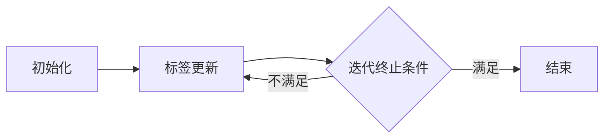

# 标签传播算法的挑战与机遇：探索算法的未来

## 1. 背景介绍
在机器学习领域，标签传播算法（Label Propagation Algorithm, LPA）是一种基于图的半监督学习方法。它通过网络结构中的节点传递信息，实现对未标记数据的分类。随着大数据和社交网络的兴起，LPA因其简单高效，在社区发现、推荐系统、信息检索等领域得到了广泛应用。

## 2. 核心概念与联系
### 2.1 标签传播算法概述
标签传播算法利用已标记节点的信息，通过网络的连接关系，将标签信息传递给未标记的节点，从而实现数据的分类。

### 2.2 图论基础
图论是研究图的数学理论，是LPA的理论基础。图由节点（Vertex）和边（Edge）组成，节点间的连接关系影响着标签的传播过程。

### 2.3 半监督学习
半监督学习介于监督学习和无监督学习之间，它使用少量的标记数据和大量的未标记数据进行模型训练。

## 3. 核心算法原理具体操作步骤
### 3.1 初始化
将已知标签的节点标记，未知标签的节点设置为未标记状态。

### 3.2 标签更新
根据节点的邻居节点标签，按照一定的规则更新节点的标签。

### 3.3 迭代终止
当标签变化小于某个阈值或达到预设的迭代次数时，算法停止。



## 4. 数学模型和公式详细讲解举例说明
标签传播算法的数学模型可以用以下公式表示：

$$
f_{t+1}(i) = \sum_{j \in N(i)} \frac{w_{ij}}{\sum_{k \in N(i)} w_{ik}} f_t(j)
$$

其中，$f_t(i)$ 是节点 $i$ 在时间 $t$ 的标签分布，$N(i)$ 是节点 $i$ 的邻居节点集合，$w_{ij}$ 是节点 $i$ 和节点 $j$ 之间的边权重。

## 5. 项目实践：代码实例和详细解释说明
以下是一个简单的标签传播算法的Python实现：

```python
import numpy as np

# 初始化标签
labels = np.array([0, -1, 0, 1, -1, 1])  # 其中-1表示未标记
W = np.array([[0, 1, 0, 0, 0, 0],  # 邻接矩阵
              [1, 0, 1, 0, 0, 0],
              [0, 1, 0, 1, 0, 0],
              [0, 0, 1, 0, 1, 0],
              [0, 0, 0, 1, 0, 1],
              [0, 0, 0, 0, 1, 0]])

# 标签传播
def label_propagation(W, labels, iterations=10):
    N = len(labels)
    F = np.zeros((N, N))
    for i in range(N):
        if labels[i] != -1:
            F[i, labels[i]] = 1
    
    for _ in range(iterations):
        F = np.dot(W, F)
        # 保持已知标签节点不变
        for i in range(N):
            if labels[i] != -1:
                F[i] = 0
                F[i, labels[i]] = 1
    return F

F = label_propagation(W, labels)
print(F)
```

## 6. 实际应用场景
标签传播算法在多个领域都有应用，例如：

- 社区发现：在社交网络中识别具有相似兴趣的用户群体。
- 推荐系统：基于用户的购买历史和浏览行为进行商品推荐。
- 文本分类：对未标记的文档进行自动分类。

## 7. 工具和资源推荐
- Scikit-learn：提供了标签传播算法的实现。
- NetworkX：用于创建、操作复杂网络的Python库。
- Gephi：一个开源的网络分析和可视化软件。

## 8. 总结：未来发展趋势与挑战
标签传播算法面临的挑战包括处理大规模数据、提高算法的鲁棒性和适应动态网络的变化。未来的发展趋势可能集中在算法的并行化、深度学习的结合以及跨域应用的研究。

## 9. 附录：常见问题与解答
### Q1: 标签传播算法如何选择合适的迭代次数？
A1: 迭代次数的选择通常基于交叉验证或者实验结果，需要平衡计算成本和算法性能。

### Q2: 如何处理标签冲突，即一个节点收到多个不同的标签？
A2: 标签冲突可以通过设置优先级、采用概率模型或者合并标签等策略来解决。

作者：禅与计算机程序设计艺术 / Zen and the Art of Computer Programming