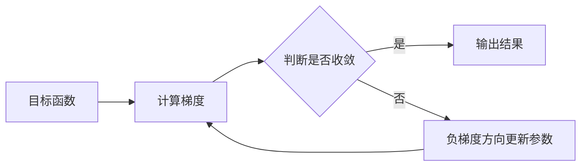

# 梯度下降(Gradient Descent) - 原理与代码实例讲解

## 1.背景介绍
### 1.1 机器学习中的优化问题
#### 1.1.1 无约束优化问题
#### 1.1.2 有约束优化问题 
#### 1.1.3 凸优化与非凸优化
### 1.2 梯度下降在机器学习中的重要性
#### 1.2.1 参数估计与模型训练
#### 1.2.2 损失函数最小化
#### 1.2.3 广泛应用于各类机器学习算法

## 2.核心概念与联系
### 2.1 梯度的概念
#### 2.1.1 方向导数
#### 2.1.2 梯度的几何意义
#### 2.1.3 梯度与等高线
### 2.2 梯度下降的基本思想 
#### 2.2.1 迭代搜索
#### 2.2.2 负梯度方向
#### 2.2.3 步长选择
### 2.3 梯度下降与优化理论的联系
#### 2.3.1 最速下降法
#### 2.3.2 牛顿法与拟牛顿法
#### 2.3.3 凸优化中的梯度下降

## 3.核心算法原理具体操作步骤
### 3.1 批量梯度下降(Batch Gradient Descent)
#### 3.1.1 算法流程
#### 3.1.2 收敛性分析
#### 3.1.3 优缺点
### 3.2 随机梯度下降(Stochastic Gradient Descent)
#### 3.2.1 算法流程
#### 3.2.2 收敛性分析 
#### 3.2.3 优缺点
### 3.3 小批量梯度下降(Mini-Batch Gradient Descent)  
#### 3.3.1 算法流程
#### 3.3.2 批量大小的选择
#### 3.3.3 优缺点

## 4.数学模型和公式详细讲解举例说明
### 4.1 无约束优化问题的数学模型
#### 4.1.1 目标函数与决策变量
#### 4.1.2 一阶必要条件与二阶充分条件
### 4.2 梯度下降的数学推导
#### 4.2.1 泰勒展开式与梯度
#### 4.2.2 负梯度方向的最速下降性质证明
### 4.3 线性回归与Logistic回归中的梯度下降
#### 4.3.1 线性回归的损失函数与梯度
#### 4.3.2 Logistic回归的损失函数与梯度
### 4.4 神经网络中的梯度下降与反向传播
#### 4.4.1 前向传播与损失函数
#### 4.4.2 反向传播算法与梯度计算
#### 4.4.3 链式法则与计算图

## 5.项目实践：代码实例和详细解释说明  
### 5.1 Python中的梯度下降实现
#### 5.1.1 批量梯度下降代码实例
#### 5.1.2 随机梯度下降代码实例
#### 5.1.3 小批量梯度下降代码实例
### 5.2 线性回归中使用梯度下降的完整案例
#### 5.2.1 生成模拟数据
#### 5.2.2 定义模型与损失函数 
#### 5.2.3 参数初始化与梯度下降求解
#### 5.2.4 结果可视化与分析
### 5.3 Logistic回归中使用梯度下降的完整案例
#### 5.3.1 加载数据集
#### 5.3.2 定义模型与损失函数
#### 5.3.3 参数初始化与梯度下降求解
#### 5.3.4 分类结果评估
### 5.4 PyTorch中使用梯度下降训练神经网络
#### 5.4.1 定义网络结构
#### 5.4.2 定义损失函数与优化器
#### 5.4.3 训练循环与梯度下降过程
#### 5.4.4 测试集评估

## 6.实际应用场景
### 6.1 计算机视觉中的应用
#### 6.1.1 图像分类
#### 6.1.2 目标检测
#### 6.1.3 语义分割
### 6.2 自然语言处理中的应用  
#### 6.2.1 词向量训练
#### 6.2.2 语言模型
#### 6.2.3 机器翻译
### 6.3 推荐系统中的应用
#### 6.3.1 矩阵分解
#### 6.3.2 因子分解机
#### 6.3.3 深度学习推荐模型

## 7.工具和资源推荐
### 7.1 常用的深度学习框架
#### 7.1.1 TensorFlow
#### 7.1.2 PyTorch
#### 7.1.3 Keras
### 7.2 自动微分工具
#### 7.2.1 Autograd
#### 7.2.2 JAX
### 7.3 可视化工具
#### 7.3.1 TensorBoard
#### 7.3.2 Visdom
### 7.4 相关学习资源
#### 7.4.1 在线课程
#### 7.4.2 经典书籍
#### 7.4.3 研究论文

## 8.总结：未来发展趋势与挑战
### 8.1 自适应学习率方法
#### 8.1.1 AdaGrad
#### 8.1.2 RMSProp
#### 8.1.3 Adam
### 8.2 分布式与并行化梯度下降
#### 8.2.1 参数服务器架构
#### 8.2.2 Ring AllReduce算法
#### 8.2.3 梯度压缩与稀疏通信
### 8.3 基于梯度的对抗攻击与防御
#### 8.3.1 对抗样本生成
#### 8.3.2 对抗训练
#### 8.3.3 梯度掩码

## 9.附录：常见问题与解答  
### 9.1 梯度消失与梯度爆炸问题
#### 9.1.1 问题描述
#### 9.1.2 解决方案
### 9.2 如何选择合适的学习率
#### 9.2.1 学习率对收敛的影响
#### 9.2.2 学习率调节策略
### 9.3 局部最优与全局最优问题
#### 9.3.1 问题描述
#### 9.3.2 解决方案
### 9.4 过拟合与欠拟合问题
#### 9.4.1 问题描述
#### 9.4.2 解决方案

梯度下降作为机器学习中最基础也是最重要的优化算法之一，在当前的人工智能浪潮中扮演着至关重要的角色。无论是传统的机器学习算法，还是当前火热的深度学习技术，都离不开梯度下降的支撑。

梯度本质上是一个向量，指向函数值增长最快的方向。而梯度下降的基本思想就是沿着负梯度方向迭代搜索，不断逼近目标函数的最小值点。通过合理地选择步长，梯度下降可以在合适的时间内收敛到一个局部最优解，甚至是全局最优解。

在实际应用中，根据数据规模和算力限制，我们通常会选择批量梯度下降(BGD)、随机梯度下降(SGD)或小批量梯度下降(MBGD)。BGD每次迭代使用所有样本，对于凸问题可以收敛到全局最优，但是当数据量很大时，每轮迭代的时间开销也会很高。而SGD每次只使用一个样本来近似真实的梯度，虽然收敛速度快，但是解的质量通常不如BGD。MBGD则在二者之间取得了一个平衡，通过选择合适的批量大小，可以兼顾收敛速度和解的质量。

除了经典的BGD、SGD和MBGD之外，研究者们还提出了许多改进的梯度下降变种，如Momentum、Nesterov Accelerated Gradient、Adagrad、Adadelta、RMSprop、Adam等。这些变种引入了自适应学习率、动量项等机制，可以加速收敛、跳出局部最优。在实践中，Adam优化器因其良好的收敛性能，已经成为深度学习任务的默认选择。

随着深度学习模型的参数规模不断增大，分布式与并行化的梯度下降优化技术也得到了广泛关注。通过参数服务器架构、Ring AllReduce算法、梯度压缩、稀疏通信等手段，我们可以充分利用多个计算节点的算力，高效地训练大规模的神经网络模型。

梯度下降虽然是一个简单的概念，但是其蕴含的优化思想却异常深刻。在可预见的未来，梯度下降依然会是机器学习和人工智能领域的核心算法。研究者们还将继续探索更高效、更智能的梯度下降优化技术，推动人工智能的发展。同时，我们也要警惕梯度信息被恶意利用而产生的对抗攻击问题，需要并行发展相应的防御手段。

总之，梯度下降是一把打开机器学习大门的钥匙。对其原理和实现的深入理解，将助力我们在人工智能的道路上走得更远。让我们一起探索这个神奇的优化世界吧！

梯度下降核心概念与算法流程 Mermaid 图：

作者：禅与计算机程序设计艺术 / Zen and the Art of Computer Programming