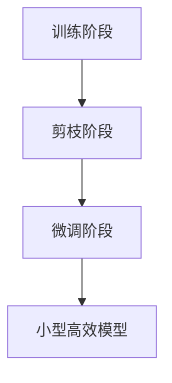

# 模型剪枝:去除冗余参数的黑科技

## 1.背景介绍

随着深度学习模型变得越来越大和复杂,它们需要大量的计算资源和存储空间。这不仅增加了部署和推理的成本,也使得在资源受限的环境(如移动设备和边缘设备)中运行这些模型变得更加困难。为了解决这个问题,研究人员提出了一种称为"模型剪枝"的技术,旨在通过移除模型中的冗余参数来缩小模型的大小,从而提高其效率,同时尽量保持模型的性能。

模型剪枝已经成为深度学习领域的一个重要研究方向,它可以应用于各种类型的神经网络,包括卷积神经网络(CNN)、循环神经网络(RNN)和transformer等。通过剪枝,我们可以显著减少模型的参数数量,从而降低计算和存储需求,使模型更易于部署和推理。

## 2.核心概念与联系

模型剪枝的核心思想是识别和移除那些对模型性能影响较小的参数或连接。这可以通过多种方式实现,例如基于参数值的剪枝、基于连接重要性的剪枝或基于神经元重要性的剪枝等。

以下是一些常见的模型剪枝技术:

1. **权重剪枝(Weight Pruning)**: 这种方法通过移除权重值接近于零的连接来减少模型的参数数量。

2. **神经元剪枝(Neuron Pruning)**: 这种方法通过移除对模型输出影响较小的神经元来减少模型的参数数量。

3. **滤波器剪枝(Filter Pruning)**: 这种方法专门针对卷积神经网络,通过移除对模型输出影响较小的卷积滤波器来减少模型的参数数量。

4. **知识蒸馏(Knowledge Distillation)**: 这种方法通过将一个大型模型(教师模型)的知识转移到一个小型模型(学生模型)上,从而获得一个性能接近于大型模型但参数更少的小型模型。

模型剪枝通常分为三个主要步骤:

1. **训练阶段**: 在这个阶段,我们训练一个过参数化的大型模型,以获得良好的性能。

2. **剪枝阶段**: 在这个阶段,我们应用剪枝算法来识别和移除冗余的参数或连接。

3. **微调阶段**: 在这个阶段,我们对剪枝后的小型模型进行微调,以恢复可能损失的性能。

通过这些步骤,我们可以获得一个参数更少但性能接近原始大型模型的小型模型。



## 3.核心算法原理具体操作步骤

模型剪枝算法的核心思想是识别和移除那些对模型性能影响较小的参数或连接。以下是一些常见的模型剪枝算法及其具体操作步骤:

### 3.1 权重剪枝算法

1. 训练一个过参数化的大型模型,以获得良好的性能。

2. 计算每个权重的重要性得分,通常使用绝对值或二范数等方法。

3. 根据预设的剪枝率(pruning rate),移除重要性得分最低的权重连接。

4. 对剪枝后的小型模型进行微调,以恢复可能损失的性能。

5. 重复步骤2-4,直到达到所需的压缩率或性能目标。

### 3.2 神经元剪枝算法

1. 训练一个过参数化的大型模型,以获得良好的性能。

2. 计算每个神经元的重要性得分,通常使用该神经元的激活值或梯度等方法。

3. 根据预设的剪枝率,移除重要性得分最低的神经元及其相关连接。

4. 对剪枝后的小型模型进行微调,以恢复可能损失的性能。

5. 重复步骤2-4,直到达到所需的压缩率或性能目标。

### 3.3 滤波器剪枝算法(针对卷积神经网络)

1. 训练一个过参数化的大型卷积神经网络模型,以获得良好的性能。

2. 计算每个卷积滤波器的重要性得分,通常使用该滤波器的权重范数或梯度等方法。

3. 根据预设的剪枝率,移除重要性得分最低的卷积滤波器及其相关连接。

4. 对剪枝后的小型模型进行微调,以恢复可能损失的性能。

5. 重复步骤2-4,直到达到所需的压缩率或性能目标。

### 3.4 知识蒸馏算法

1. 训练一个过参数化的大型模型(教师模型),以获得良好的性能。

2. 定义一个小型模型(学生模型),其参数数量远小于教师模型。

3. 使用知识蒸馏技术,将教师模型的知识转移到学生模型上。

4. 训练学生模型,使其能够模仿教师模型的输出分布。

5. 对训练好的学生模型进行微调,以进一步提高其性能。

通过这些算法,我们可以有效地减少模型的参数数量,从而提高其效率和可部署性,同时尽量保持模型的性能。

## 4.数学模型和公式详细讲解举例说明

在模型剪枝算法中,我们需要计算每个参数或连接的重要性得分,以确定哪些参数或连接应该被移除。常见的重要性得分计算方法包括:

### 4.1 基于权重值的剪枝

对于基于权重值的剪枝,我们通常使用权重的绝对值或二范数作为重要性得分。对于一个权重矩阵 $W$,其中每个元素 $w_{ij}$ 表示从第 $i$ 个神经元到第 $j$ 个神经元的连接权重,我们可以计算每个权重的重要性得分如下:

$$\text{importance}(w_{ij}) = |w_{ij}|$$

或者

$$\text{importance}(w_{ij}) = \sqrt{\sum_{k} w_{ik}^2}$$

其中 $k$ 表示输入神经元的索引。

我们可以设置一个阈值 $\theta$,将所有重要性得分低于 $\theta$ 的权重连接移除。

### 4.2 基于神经元激活值的剪枝

对于基于神经元激活值的剪枝,我们通常使用神经元的平均激活值或绝对平均激活值作为重要性得分。对于一个神经元 $n_i$,其激活值序列为 $a_i^{(1)}, a_i^{(2)}, \ldots, a_i^{(T)}$,我们可以计算其重要性得分如下:

$$\text{importance}(n_i) = \frac{1}{T} \sum_{t=1}^T |a_i^{(t)}|$$

或者

$$\text{importance}(n_i) = \frac{1}{T} \sum_{t=1}^T a_i^{(t)}$$

我们可以设置一个阈值 $\theta$,将所有重要性得分低于 $\theta$ 的神经元及其相关连接移除。

### 4.3 基于梯度的剪枝

对于基于梯度的剪枝,我们通常使用权重或神经元的梯度范数作为重要性得分。对于一个权重 $w_{ij}$,其梯度为 $\frac{\partial L}{\partial w_{ij}}$,我们可以计算其重要性得分如下:

$$\text{importance}(w_{ij}) = \left\|\frac{\partial L}{\partial w_{ij}}\right\|_2$$

对于一个神经元 $n_i$,其梯度为 $\frac{\partial L}{\partial n_i}$,我们可以计算其重要性得分如下:

$$\text{importance}(n_i) = \left\|\frac{\partial L}{\partial n_i}\right\|_2$$

我们可以设置一个阈值 $\theta$,将所有重要性得分低于 $\theta$ 的权重或神经元及其相关连接移除。

通过这些数学模型和公式,我们可以量化每个参数或连接的重要性,从而指导模型剪枝过程。需要注意的是,不同的剪枝算法可能会使用不同的重要性度量方法,并且在实际应用中,我们还需要考虑剪枝率、性能损失等因素,以达到最佳的模型压缩效果。

## 5.项目实践:代码实例和详细解释说明

在本节中,我们将提供一个基于PyTorch的代码示例,演示如何使用权重剪枝算法来压缩一个卷积神经网络模型。

首先,让我们定义一个简单的卷积神经网络模型:

```python
import torch
import torch.nn as nn

class ConvNet(nn.Module):
    def __init__(self):
        super(ConvNet, self).__init__()
        self.conv1 = nn.Conv2d(1, 10, kernel_size=5)
        self.conv2 = nn.Conv2d(10, 20, kernel_size=5)
        self.fc1 = nn.Linear(320, 50)
        self.fc2 = nn.Linear(50, 10)

    def forward(self, x):
        x = nn.functional.relu(nn.functional.max_pool2d(self.conv1(x), 2))
        x = nn.functional.relu(nn.functional.max_pool2d(self.conv2(x), 2))
        x = x.view(-1, 320)
        x = nn.functional.relu(self.fc1(x))
        x = self.fc2(x)
        return x
```

接下来,我们定义一个权重剪枝函数,用于移除权重绝对值较小的连接:

```python
import torch.nn.utils.prune as prune

def weight_pruning(model, pruning_rate):
    for name, module in model.named_modules():
        if isinstance(module, nn.Conv2d) or isinstance(module, nn.Linear):
            prune.l1_unstructured(module, 'weight', pruning_rate)
            prune.remove(module, 'weight')
```

在这个函数中,我们使用PyTorch提供的 `prune.l1_unstructured` 方法来标记权重绝对值较小的连接,然后使用 `prune.remove` 方法实际移除这些连接。

现在,我们可以创建一个模型实例,训练它,然后应用权重剪枝:

```python
# 创建模型实例
model = ConvNet()

# 训练模型
# ... 训练代码

# 应用权重剪枝
pruning_rate = 0.3  # 设置剪枝率为 30%
weight_pruning(model, pruning_rate)

# 微调剪枝后的模型
# ... 微调代码
```

在这个示例中,我们将剪枝率设置为 30%,这意味着我们将移除权重绝对值最小的 30% 的连接。在剪枝后,我们需要对剪枝后的模型进行微调,以恢复可能损失的性能。

通过这个示例,您可以看到如何在PyTorch中实现权重剪枝算法。对于其他剪枝算法,如神经元剪枝或滤波器剪枝,您可以采用类似的方式,只需修改重要性得分的计算方式和剪枝策略即可。

## 6.实际应用场景

模型剪枝技术已经在许多实际应用场景中得到了广泛的应用,以下是一些典型的应用场景:

### 6.1 移动和嵌入式设备

在移动设备和嵌入式系统中,计算资源和存储空间通常是有限的。通过模型剪枝,我们可以显著减小深度学习模型的大小,从而使它们更易于部署和运行在这些资源受限的环境中。例如,在移动设备上运行计算机视觉或自然语言处理任务时,模型剪枝可以大大提高模型的效率和响应速度。

### 6.2 云服务和在线系统

在云服务和在线系统中,模型剪枝可以帮助降低计算和存储成本,提高系统的可扩展性和响应能力。例如,在大规模推荐系统或在线翻译服务中,使用剪枝后的小型高效模型可以显著减少服务器的负载,从而提高系统的整体性能和可靠性。

### 6.3 边缘计算和物联网

在边缘计算和物联网领域,模型剪枝技术可以使深度学习模型更容易部署在资源受限的边缘设备上。例如,在智能家居、自动驾