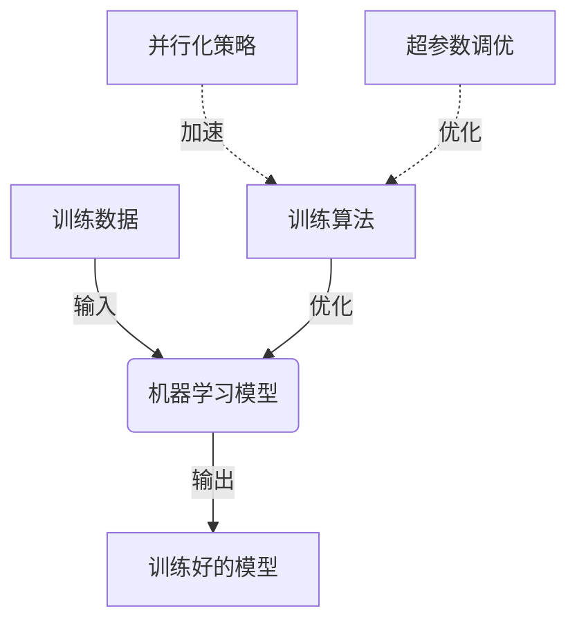

# 模型训练的未来：展望AI的下一个十年

## 1.背景介绍

### 1.1 人工智能的飞速发展

人工智能(AI)在过去十年中取得了令人难以置信的进步。从深度学习算法的突破性发展,到大规模并行计算能力的提升,再到海量数据的积累,这些因素共同推动了AI技术的飞速发展。我们目睹了从计算机视觉、自然语言处理到推理决策等领域中,AI系统不断刷新着人类的认知极限。

而驱动这一切进步的核心,正是大规模模型的训练。通过在海量数据上进行迭代训练,AI模型不断学习和优化,最终获得了超乎想象的能力。这种"用数据堆砌智能"的范式,正在彻底改变着我们对智能的理解和追求方式。

### 1.2 模型训练的重要性

然而,模型训练并非一蹴而就。它需要大量的计算资源、优化的训练策略,以及对训练数据的审慎甄别和处理。训练过程往往是一个漫长而艰难的过程,需要不断地尝试和调整各种超参数,直至获得理想的模型性能。

此外,随着模型规模的不断扩大,训练的复杂性也与日俱增。大规模模型需要更多的数据、更强的计算能力,以及更高效的并行化策略。如何高效地训练这些庞大的模型,已经成为制约AI发展的瓶颈之一。

因此,深入探讨模型训练的未来发展趋势和挑战,对于推动AI技术的持续进步至关重要。只有不断优化和革新训练过程,我们才能最终实现通用人工智能(AGI)的宏伟目标。

## 2.核心概念与联系

在探讨模型训练的未来之前,我们有必要先回顾一些核心概念,并梳理它们之间的关联。

### 2.1 机器学习模型

机器学习模型是AI系统的核心,它通过学习数据中蕴含的模式和规律,从而获得一定的智能能力。常见的模型类型包括:

- 监督学习模型(如卷积神经网络、递归神经网络等)
- 无监督学习模型(如自编码器、生成对抗网络等)
- 强化学习模型(如深度Q网络、策略梯度等)

不同类型的模型适用于不同的任务场景,但它们都需要经过训练才能发挥作用。

### 2.2 训练数据

训练数据是模型学习的基础。高质量的训练数据不仅能提高模型的准确性,还能增强模型的泛化能力。常见的训练数据包括:

- 结构化数据(如表格、数据库等)
- 非结构化数据(如图像、文本、音频等)
- 标注数据(带有人工标注的数据)
- 未标注数据(原始数据,需要进行预处理)

训练数据的质量和数量直接影响着模型的性能表现。因此,如何高效获取和处理大规模高质量训练数据,是模型训练中的一大挑战。

### 2.3 训练算法

训练算法是指用于优化模型参数的算法,它决定了模型如何从数据中学习。常见的训练算法包括:

- 梯度下降及其变体(如随机梯度下降、动量梯度下降等)
- 基于拟牛顿法的优化算法(如L-BFGS等)
- 基于期望的算法(如期望最大化算法等)

不同的训练算法在收敛速度、计算复杂度、并行性等方面存在差异,需要根据具体问题和模型类型进行选择和调优。

### 2.4 并行化策略

由于模型训练过程通常需要大量的计算资源,因此并行化训练是提高训练效率的关键手段。常见的并行化策略包括:

- 数据并行(将训练数据划分到多个设备上进行并行计算)
- 模型并行(将模型划分到多个设备上进行并行计算)
- 混合并行(结合数据并行和模型并行)

不同的并行化策略在通信开销、内存使用、计算效率等方面存在权衡,需要根据硬件条件和模型特征进行优化。

### 2.5 超参数调优

超参数是指在训练过程中需要预先设置的一些参数,如学习率、批大小、正则化系数等。合理的超参数设置对模型性能有着重要影响。超参数调优通常采用以下策略:

- 网格搜索(枚举所有可能的超参数组合)
- 随机搜索(随机采样超参数组合)
- 贝叶斯优化(基于先验知识和历史结果进行优化)

随着模型复杂度的增加,超参数调优的难度也在不断加大,需要更智能化的调优方法。

以上这些核心概念相互关联、相辅相成,共同构建了模型训练的整体流程。只有全面把控这些关键环节,才能最终获得出色的模型性能。

## 3.核心算法原理具体操作步骤

在上一节中,我们介绍了模型训练的核心概念。接下来,我们将深入探讨一些核心算法的原理和具体操作步骤,以加深对训练过程的理解。

### 3.1 梯度下降算法

梯度下降算法是最常用的训练算法之一,它通过不断迭代地沿着梯度的反方向更新模型参数,从而最小化损失函数。其具体操作步骤如下:

1. 初始化模型参数 $\theta$
2. 计算损失函数 $J(\theta)$ 对参数 $\theta$ 的梯度 $\nabla_\theta J(\theta)$
3. 更新参数 $\theta$ 沿梯度反方向移动一小步: $\theta = \theta - \alpha \nabla_\theta J(\theta)$,其中 $\alpha$ 为学习率
4. 重复步骤2和3,直到收敛或达到最大迭代次数

梯度下降算法虽然简单,但在实际应用中存在一些问题,如容易陷入局部最优、收敛速度慢等。为了解决这些问题,研究人员提出了多种改进的变体算法,例如:

- 随机梯度下降(SGD):每次迭代只使用一个或一小批数据进行更新,减小了计算开销,但引入了一定噪声。
- 动量梯度下降:在参数更新时加入了"动量"项,有助于加速收敛并跳出局部最优。
- Adagrad/RMSProp/Adam等自适应学习率算法:自动调整每个参数的学习率,提高了收敛速度。

### 3.2 反向传播算法

反向传播算法是训练深度神经网络模型的关键算法,它用于计算损失函数对网络参数的梯度。其基本思想是利用链式法则,从输出层开始逐层向前计算每个节点的误差,并将误差逐层传播回去,从而得到每个参数的梯度。具体步骤如下:

1. 前向传播:输入数据 $x$ 通过网络层层计算,得到输出 $\hat{y}$
2. 计算输出层误差:$\delta^L = \nabla_a C(y, \hat{y}) \odot \sigma'(z^L)$,其中 $C$ 为损失函数, $\sigma'$ 为激活函数的导数
3. 反向传播误差:$\delta^{l} = ((W^{l+1})^T \delta^{l+1}) \odot \sigma'(z^l)$
4. 计算梯度:$\nabla_W C = \delta^l (a^{l-1})^T, \nabla_b C = \delta^l$
5. 更新权重和偏置:$W^l = W^l - \alpha \nabla_W C, b^l = b^l - \alpha \nabla_b C$

反向传播算法的计算复杂度较高,但可以通过并行化、检查点重新启动等策略来提高效率。此外,还有一些改进的变体算法,如直接反馈对齐、可逆架构等,旨在进一步优化反向传播过程。

### 3.3 生成对抗网络训练

生成对抗网络(GAN)是一种无监督学习模型,它由一个生成器网络和一个判别器网络组成,两者通过对抗训练相互促进,最终使生成器能够生成逼真的数据。其训练过程可概括为:

1. 从真实数据 $x$ 和噪声 $z$ 采样,将它们分别输入判别器 $D$ 和生成器 $G$
2. 更新判别器 $D$ 的参数,максим化 $\log D(x) + \log(1 - D(G(z)))$,使其能够较好地区分真实数据和生成数据
3. 更新生成器 $G$ 的参数,最小化 $\log(1 - D(G(z)))$,使其能够生成足以欺骗判别器的逼真数据
4. 重复步骤2和3,直至收敛

GAN 训练过程中,生成器和判别器相互对抗、相互促进,是一个动态的过程。为了提高训练稳定性,研究人员提出了诸多改进方法,如使用 Wasserstein 距离、增加正则化项、改进网络架构等。

以上介绍了三种典型的训练算法,它们分别适用于不同的模型和任务场景。除此之外,还有许多其他训练算法,如强化学习中的策略梯度算法、变分自编码器中的重参数技巧等,这些都是训练过程中不可或缺的重要组成部分。

## 4.数学模型和公式详细讲解举例说明

在上一节中,我们介绍了一些核心训练算法的原理和步骤。这些算法往往涉及到一些数学模型和公式,理解它们对于掌握算法的本质至关重要。接下来,我们将详细讲解一些常见的数学模型和公式,并结合实例加深理解。

### 4.1 损失函数

损失函数用于衡量模型预测值与真实值之间的差异,是训练过程中需要最小化的目标函数。常见的损失函数包括:

1. **均方误差(MSE)**: $\text{MSE}(y, \hat{y}) = \frac{1}{n} \sum_{i=1}^{n} (y_i - \hat{y}_i)^2$

   MSE 是回归问题中最常用的损失函数,它对于异常值较为敏感。

2. **交叉熵(Cross-Entropy)**: $\text{CE}(y, \hat{y}) = -\sum_{i=1}^{n} y_i \log \hat{y}_i$

   交叉熵通常用于分类问题,它可以直接反映模型预测的概率分布与真实分布之间的差异。

3. **Huber 损失**: $\text{Huber}(y, \hat{y}) = \begin{cases} \frac{1}{2}(y - \hat{y})^2, & \text{if }|y - \hat{y}| \leq \delta \\ \delta(|y - \hat{y}| - \frac{1}{2}\delta), & \text{otherwise} \end{cases}$

   Huber 损失函数是均方误差和绝对误差的结合,对异常值的鲁棒性较强。

不同的损失函数适用于不同的任务场景,选择合适的损失函数对模型性能有着重要影响。此外,还可以根据具体需求设计定制化的损失函数,以更好地满足特定任务的要求。

让我们通过一个实例来加深对损失函数的理解。假设我们有一个二分类问题,其中 $y \in \{0, 1\}$ 表示真实标签, $\hat{y} \in [0, 1]$ 表示模型预测的概率值。我们可以使用二元交叉熵作为损失函数:

$$\text{BCE}(y, \hat{y}) = -[y \log(\hat{y}) + (1 - y) \log(1 - \hat{y})]$$

假设真实标签为 $y = 1$,模型预测值为 $\hat{y} = 0.8$,则损失值为:

$$\text{BCE}(1, 0.8) = -(1 \log 0.8 + 0 \log 0.2) = -0.223$$

通过最小化这个损失值