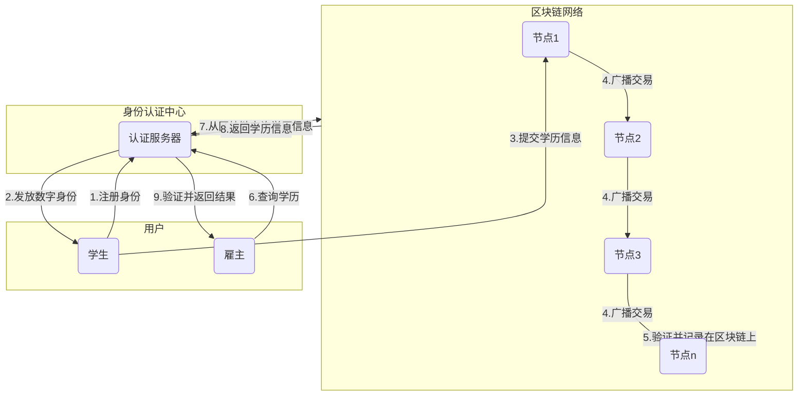

# 毕业生学历证明系统设计与实现

## 1.背景介绍

### 1.1 学历证明系统的重要性

在当今社会中,学历证明在求职、深造等诸多场合扮演着重要的角色。毕业生的学历证明不仅反映了其接受教育的水平,也是一种权威认证,对于求职者而言,这是一张通往理想事业的通行证。然而,传统的纸质学历证明存在着诸多弊端,如容易遗失、被伪造等,给学生和用人单位带来了诸多不便。因此,构建一个安全可靠、高效便捷的学历证明系统,对于规范教育体系、维护社会公平具有重要意义。

### 1.2 现有系统存在的问题

目前,虽然一些高校和机构已经建立了基于网络的学历证明查询系统,但仍然存在以下几个主要问题:

1. **数据孤岛**:各高校的学历数据相互独立,无法实现信息共享和互通互认。
2. **安全性低**:大多数系统采用简单的用户名密码认证,安全性无法得到保证。
3. **效率低下**:需要人工审核和发放证明,效率低下且容易出错。
4. **防伪能力差**:电子证明的防伪能力有限,难以彻底杜绝伪造行为。

为了解决这些问题,迫切需要构建一个全新的、安全高效的学历证明系统。

## 2.核心概念与联系

### 2.1 区块链技术

区块链技术由于其去中心化、不可篡改、可追溯等特性,为解决学历证明系统中的数据共享、防伪等难题提供了新的技术路径。

在区块链网络中,每个节点都是平等的,不存在中心化的控制点,从而避免了单点故障和数据被篡改的风险。同时,区块链上的数据通过加密技术链接在一起,形成一条无法被伪造的信任链条,保证了数据的真实性和不可篡改性。

### 2.2 数字身份认证

在学历证明系统中,对个人身份的准确识别是关键环节。数字身份认证技术可以为每个用户分配一个唯一的数字身份,并通过密码学算法对身份进行加密保护,从而确保身份的真实性和不可冒充性。

常见的数字身份认证技术包括数字证书、生物特征识别(指纹、面部等)等。这些技术可以与区块链技术相结合,为学历证明系统提供安全可靠的身份认证机制。

### 2.3 智能合约

智能合约是区块链技术中的一个重要概念,它是一种自动执行的计算机程序,可以根据预先设定的条件和规则,自动执行特定的操作。

在学历证明系统中,智能合约可以用于自动发放和验证学历证明,避免了人工干预,从而提高了效率和准确性。同时,智能合约的执行过程也会被永久记录在区块链上,具有不可篡改的特性,进一步增强了系统的可信度。

### 2.4 隐私保护

学历证明涉及大量个人隐私信息,如何在保护隐私的同时实现信息共享是一个需要解决的重要问题。区块链技术中的隐私保护机制可以为此提供解决方案。

常见的隐私保护技术包括加密技术、零知识证明、环签名等。这些技术可以对个人信息进行加密和匿名化处理,只有经过授权的人才能访问相关信息,从而实现隐私保护和信息共享的平衡。

### 2.5 系统架构

基于上述核心概念,我们可以设计一种全新的学历证明系统架构,如下图所示:

该架构的工作流程如下:

1. 学生向身份认证中心注册身份,获取数字身份。
2. 学生通过区块链网络提交自己的学历信息。
3. 区块链网络中的节点对交易进行验证,并将学历信息永久记录在区块链上。
4. 雇主向身份认证中心查询学历信息。
5. 身份认证中心从区块链上查询相关学历信息,并进行验证。
6. 身份认证中心将查询结果返回给雇主。

这种架构具有以下优点:

- 去中心化,避免单点故障风险。
- 基于区块链,学历信息不可篡改。
- 身份认证中心提供身份认证服务,确保身份真实可靠。
- 隐私保护机制保护个人隐私信息。
- 智能合约自动化发放和验证学历证明,提高效率。

## 3.核心算法原理具体操作步骤

### 3.1 数字身份生成算法

为了确保身份的真实性和唯一性,我们需要为每个用户生成一个数字身份。常见的数字身份生成算法包括:

1. **基于RSA算法的数字证书生成**

   RSA算法是一种广泛使用的非对称加密算法,它可以用于生成数字证书。具体步骤如下:

   1) 选择两个大质数p和q,计算n=p*q。
   2) 计算欧拉函数φ(n)=(p-1)*(q-1)。
   3) 选择一个与φ(n)互质的整数e,作为公钥指数。
   4) 计算d,使得(d*e)%φ(n)=1,d作为私钥指数。
   5) 公钥为(e,n),私钥为(d,n)。
   6) 使用私钥对用户身份信息进行签名,生成数字证书。

2. **基于椭圆曲线密码学的数字签名**

   椭圆曲线密码学(ECC)是一种新型的公钥密码体制,具有更高的安全性和效率。生成数字签名的步骤如下:

   1) 选择一条合适的椭圆曲线E,以及基点G。
   2) 选择一个整数d作为私钥,计算Q=d*G作为公钥。
   3) 对用户身份信息进行哈希运算,得到消息摘要M。
   4) 使用私钥d对M进行签名,得到签名(r,s)。
   5) 公钥Q和签名(r,s)即为用户的数字身份。

上述算法均可确保生成的数字身份具有唯一性、不可冒充性和真实可信的特点,为后续的身份认证奠定基础。

### 3.2 区块链存证算法

学历证明信息需要被永久且不可篡改地记录在区块链上,以确保其真实性和可追溯性。常见的区块链存证算法包括:

1. **基于工作量证明(PoW)的存证**

   工作量证明是比特币等加密货币所采用的共识机制,它通过计算机进行大量的哈希运算来验证交易的有效性。具体步骤如下:

   1) 将待存证的学历信息打包成一个交易块。
   2) 计算交易块的哈希值,并将其与目标值进行比较。
   3) 如果哈希值小于目标值,则交易块被认为有效,否则需要改变交易块中的随机数,重复步骤2)。
   4) 有效的交易块被广播到全网,其他节点验证后将其永久记录在区块链上。

2. **基于权益证明(PoS)的存证**

   权益证明是一种新型的共识机制,它根据节点持有的加密货币数量来决定节点的权重,从而避免了大量的算力浪费。具体步骤如下:

   1) 每个节点根据持有的加密货币数量获得一定的权重。
   2) 系统随机选择一个节点,由其打包并广播交易块。
   3) 其他节点验证交易块的有效性,如果有效则记录在区块链上。
   4) 打包节点获得一定的奖励,作为维护系统的动力。

上述算法均可确保学历信息被安全、永久地记录在区块链上,从而实现不可篡改和可追溯的目标。

### 3.3 智能合约执行算法

智能合约是区块链技术中的一个重要概念,它可以自动执行预先设定的条件和规则。在学历证明系统中,智能合约可以用于自动发放和验证学历证明,提高效率和准确性。常见的智能合约执行算法包括:

1. **基于以太坊虚拟机(EVM)的执行**

   以太坊是目前最流行的智能合约平台,它采用了一种基于栈的虚拟机EVM来执行智能合约。具体步骤如下:

   1) 用户向智能合约发送一笔交易,包含执行条件和参数。
   2) EVM根据交易中的数据,从智能合约的字节码中加载指令。
   3) EVM执行指令,根据条件和规则进行相应的操作。
   4) 执行结果被记录在区块链上,并向用户返回执行结果。

2. **基于UTXO模型的执行**

   UTXO(Unspent Transaction Output)模型是比特币所采用的交易模型,它可以用于执行简单的智能合约。具体步骤如下:

   1) 用户构造一笔特殊的交易,其输入为智能合约的条件,输出为执行结果。
   2) 交易被广播到全网,并由矿工节点进行验证和执行。
   3) 执行结果被记录在区块链上,作为新的UTXO。
   4) 用户可以查询该UTXO,获取智能合约的执行结果。

通过智能合约,我们可以自动化学历证明的发放和验证过程,提高系统的效率和可靠性。同时,智能合约的执行过程也会被永久记录在区块链上,具有不可篡改的特性,进一步增强了系统的可信度。

## 4.数学模型和公式详细讲解举例说明

在学历证明系统中,数学模型和公式主要应用于密码学算法和区块链共识机制等方面,为系统的安全性和可靠性提供理论基础。下面我们将详细介绍几种常见的数学模型和公式。

### 4.1 RSA算法

RSA算法是一种广泛使用的非对称加密算法,它可以用于数字签名、密钥交换等多种应用场景。RSA算法的数学原理基于大数的因数分解难题,具体如下:

已知两个大质数p和q,计算它们的乘积n=p*q是容易的,但是从n出发求解p和q却是一个NP难题。RSA算法利用了这一特性,其公钥和私钥的生成过程如下:

1. 选择两个大质数p和q,计算n=p*q。
2. 计算欧拉函数φ(n)=(p-1)*(q-1)。
3. 选择一个与φ(n)互质的整数e,作为公钥指数。
4. 计算d,使得(d*e)%φ(n)=1,d作为私钥指数。

公钥为(e,n),私钥为(d,n)。加密和解密的过程如下:

- 加密: 将明文M加密为密文C,C = M^e mod n
- 解密: 将密文C解密为明文M,M = C^d mod n

RSA算法的安全性依赖于大数的因数分解难题,目前还没有有效的算法可以在可接受的时间内