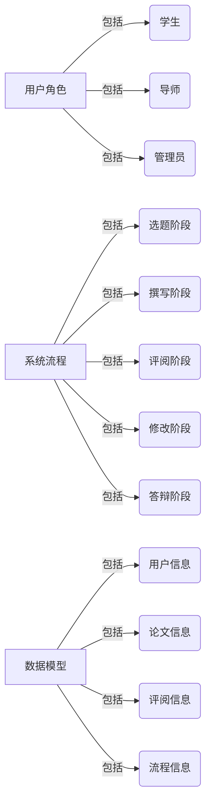
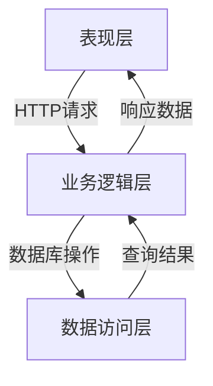

# 毕业论文管理系统详细设计与具体代码实现

## 1.背景介绍

毕业论文是高等教育中非常重要的一个环节,它不仅是学生综合运用所学知识的一个机会,也是培养学生独立思考、分析问题和解决问题能力的重要途径。随着高等教育的不断发展,毕业论文的数量也在不断增加,传统的手工管理方式已经无法满足日益增长的需求。因此,开发一个高效、方便的毕业论文管理系统就显得尤为重要。

毕业论文管理系统的主要目的是为学生、导师和管理人员提供一个集中、高效的平台,用于管理毕业论文的选题、撰写、评阅等各个环节。该系统可以极大地提高管理效率,减轻管理人员的工作负担,同时也为学生和导师提供了便利。

## 2.核心概念与联系

在设计和实现毕业论文管理系统之前,我们需要了解一些核心概念及其之间的关系。

### 2.1 用户角色

毕业论文管理系统主要包括以下三种用户角色:

1. **学生**: 学生可以在系统中选择论文题目、提交论文初稿、修改论文等。
2. **导师**: 导师可以在系统中发布论文选题、审阅学生论文、评分等。
3. **管理员**: 管理员负责系统的整体运行,包括用户管理、流程管理等。

### 2.2 系统流程

毕业论文管理系统的核心流程包括以下几个阶段:

1. **选题阶段**: 导师在系统中发布论文选题,学生根据自己的兴趣选择题目。
2. **撰写阶段**: 学生根据选定的题目撰写论文初稿,并在系统中提交。
3. **评阅阶段**: 导师审阅学生提交的论文初稿,给出修改意见和评分。
4. **修改阶段**: 学生根据导师的意见修改论文,并重新提交。
5. **答辩阶段**: 学生进行论文答辩,最终通过毕业论文。

以上各个阶段有严格的时间节点,系统需要对整个流程进行监控和管理。

### 2.3 数据模型

毕业论文管理系统的核心数据模型包括以下几个部分:

1. **用户信息**: 包括学生、导师和管理员的基本信息。
2. **论文信息**: 包括论文题目、摘要、正文等内容。
3. **评阅信息**: 包括导师对学生论文的评语和分数。
4. **流程信息**: 包括各个阶段的时间节点、状态等。

这些数据模型之间存在着复杂的关系,需要在系统设计时予以考虑。



## 3.核心算法原理具体操作步骤

### 3.1 论文匹配算法

为了帮助学生选择合适的论文题目,系统需要实现一种高效的论文匹配算法。该算法的主要思路是:

1. 学生在系统中填写自己的兴趣爱好、擅长领域等信息。
2. 导师在发布论文选题时,需要为每个选题添加关键词。
3. 系统根据学生的信息和选题关键词,计算出一个匹配分数。
4. 系统按照匹配分数为学生推荐合适的论文选题。

匹配分数的计算可以采用多种方法,例如基于文本相似度的方法、基于主题模型的方法等。具体实现细节如下:

1. **文本预处理**: 对学生信息和选题关键词进行分词、去停用词等预处理。
2. **特征提取**: 将预处理后的文本转换为特征向量,可以使用TF-IDF、Word2Vec等方法。
3. **相似度计算**: 计算学生信息和选题关键词的特征向量之间的相似度,可以使用余弦相似度、欧几里得距离等方法。
4. **匹配分数计算**: 根据相似度计算出一个0到1之间的匹配分数。

以上算法的时间复杂度主要取决于特征提取和相似度计算的方法,通常情况下时间复杂度为$O(n \times m)$,其中$n$为学生数量,$m$为选题数量。

### 3.2 论文重复率检测算法

为了保证论文的原创性,系统需要实现一种高效的论文重复率检测算法。该算法的主要思路是:

1. 将学生提交的论文与已有论文进行对比。
2. 计算出论文之间的相似度分数。
3. 如果相似度分数超过一定阈值,则判定为重复论文。

相似度分数的计算可以采用多种方法,例如基于字符串匹配的方法、基于语义相似度的方法等。具体实现细节如下:

1. **文本预处理**: 对论文进行分词、去停用词等预处理。
2. **特征提取**: 将预处理后的文本转换为特征向量,可以使用TF-IDF、Word2Vec等方法。
3. **相似度计算**: 计算两篇论文的特征向量之间的相似度,可以使用余弦相似度、欧几里得距离等方法。
4. **重复率判断**: 如果相似度分数超过预设阈值,则判定为重复论文。

以上算法的时间复杂度主要取决于特征提取和相似度计算的方法,通常情况下时间复杂度为$O(n \times m)$,其中$n$为学生论文数量,$m$为已有论文数量。

需要注意的是,重复率检测算法只是一种辅助手段,最终还需要人工审核和判断。

## 4.数学模型和公式详细讲解举例说明

在论文匹配算法和重复率检测算法中,我们需要计算文本之间的相似度。相似度计算是一个非常重要的数学模型,在自然语言处理领域有着广泛的应用。

### 4.1 TF-IDF模型

TF-IDF(Term Frequency-Inverse Document Frequency)是一种常用的文本特征提取方法。它的基本思想是:如果某个词在一篇文档中出现的频率越高,同时在整个语料库中出现的频率越低,那么这个词对于该文档就越有区分能力,应该赋予更高的权重。

TF-IDF的计算公式如下:

$$\text{TF-IDF}(t,d) = \text{TF}(t,d) \times \text{IDF}(t)$$

其中:

- $\text{TF}(t,d)$表示词$t$在文档$d$中出现的频率。
- $\text{IDF}(t) = \log\frac{N}{n_t}$,其中$N$表示语料库中文档的总数,$n_t$表示包含词$t$的文档数量。

例如,在一个包含1000篇文档的语料库中,如果词"算法"出现在800篇文档中,那么它的$\text{IDF}$值为$\log\frac{1000}{800} \approx 0.1$。如果在某一篇文档中,"算法"这个词出现了10次,文档的总词数为1000,那么它在该文档中的$\text{TF}$值为$\frac{10}{1000} = 0.01$。因此,"算法"这个词在该文档中的$\text{TF-IDF}$值为$0.01 \times 0.1 = 0.001$。

通过计算每个词的TF-IDF值,我们可以构建出一个文档的特征向量,用于后续的相似度计算。

### 4.2 余弦相似度

余弦相似度是一种常用的向量相似度计算方法。它的基本思想是:将两个向量看作是在高维空间中的两个向量,计算它们之间的夹角的余弦值。夹角越小,余弦值越大,说明两个向量越相似。

余弦相似度的计算公式如下:

$$\text{CosineSimilarity}(\vec{a}, \vec{b}) = \frac{\vec{a} \cdot \vec{b}}{||\vec{a}|| \times ||\vec{b}||}$$

其中:

- $\vec{a}$和$\vec{b}$分别表示两个向量。
- $\vec{a} \cdot \vec{b}$表示两个向量的点积。
- $||\vec{a}||$和$||\vec{b}||$分别表示两个向量的模长。

例如,设有两个向量$\vec{a} = (1, 2, 3)$和$\vec{b} = (2, 3, 4)$,它们的点积为$1 \times 2 + 2 \times 3 + 3 \times 4 = 26$,模长分别为$\sqrt{1^2 + 2^2 + 3^2} = \sqrt{14}$和$\sqrt{2^2 + 3^2 + 4^2} = \sqrt{29}$。因此,它们的余弦相似度为:

$$\text{CosineSimilarity}(\vec{a}, \vec{b}) = \frac{26}{\sqrt{14} \times \sqrt{29}} \approx 0.8$$

余弦相似度的取值范围为$[0, 1]$,值越大表示两个向量越相似。

通过计算两个文档的特征向量之间的余弦相似度,我们可以判断它们的相似程度,从而实现论文匹配和重复率检测功能。

## 5.项目实践:代码实例和详细解释说明

在本节中,我们将通过具体的代码示例,演示如何实现毕业论文管理系统的核心功能。

### 5.1 系统架构

毕业论文管理系统采用了经典的三层架构,包括表现层(前端)、业务逻辑层(后端)和数据访问层。



- **表现层**:使用React框架开发,负责渲染用户界面和处理用户交互。
- **业务逻辑层**:使用Python Flask框架开发,负责处理业务逻辑和数据处理。
- **数据访问层**:使用SQLAlchemy ORM框架连接MySQL数据库,负责数据的持久化存储。

### 5.2 论文匹配功能

我们以论文匹配功能为例,展示具体的代码实现。

#### 5.2.1 前端代码

前端使用React框架开发,主要负责渲染用户界面和发送HTTP请求。以下是一个简单的论文匹配页面组件:

```jsx
import React, { useState } from 'react';
import axios from 'axios';

const ThesisMatchingPage = () => {
  const [interests, setInterests] = useState('');
  const [matchedTheses, setMatchedTheses] = useState([]);

  const handleSubmit = async (e) => {
    e.preventDefault();
    try {
      const response = await axios.post('/api/match_theses', { interests });
      setMatchedTheses(response.data);
    } catch (error) {
      console.error(error);
    }
  };

  return (
    <div>
      <h1>论文匹配</h1>
      <form onSubmit={handleSubmit}>
        <label>
          请输入您的兴趣爱好:
          <textarea value={interests} onChange={(e) => setInterests(e.target.value)} />
        </label>
        <button type="submit">匹配论文</button>
      </form>
      <ul>
        {matchedTheses.map((thesis) => (
          <li key={thesis.id}>{thesis.title}</li>
        ))}
      </ul>
    </div>
  );
};

export default ThesisMatchingPage;
```

该组件包含一个文本区域,用于输入学生的兴趣爱好。当点击"匹配论文"按钮时,会向后端发送HTTP POST请求,获取匹配的论文列表,并在页面上渲染出来。

#### 5.2.2 后端代码

后端使用Python Flask框架开发,负责处理业务逻辑和数据处理。以下是论文匹配功能的后端代码:

```python
from flask import Flask, request, jsonify
from