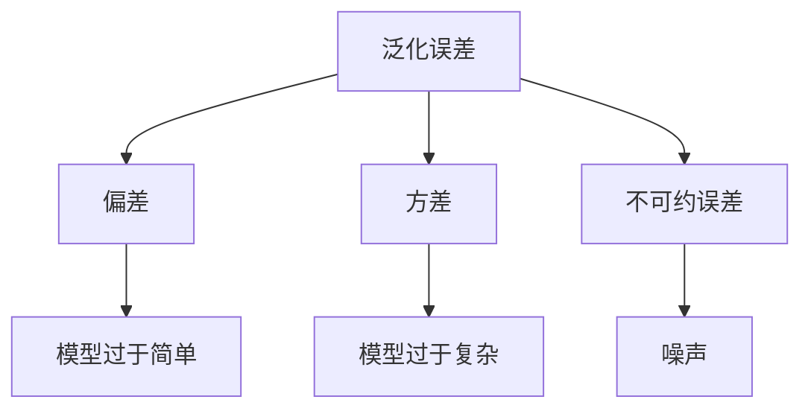
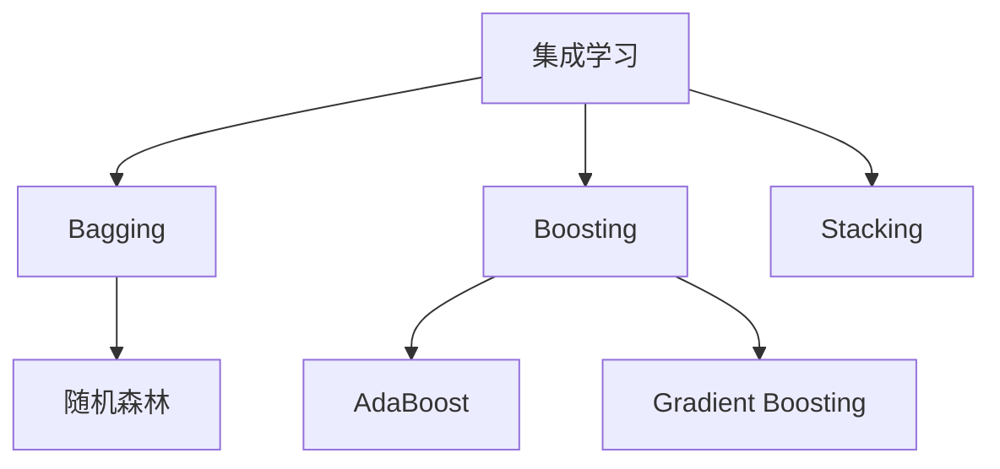
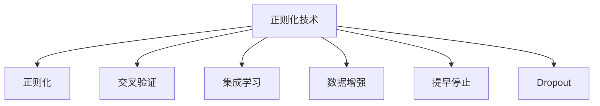

# 泛化误差：理解模型的预测能力

## 1.背景介绍

在机器学习和深度学习领域中,模型的泛化能力是衡量模型性能的关键指标之一。泛化误差指的是模型在新的、未见过的数据上的预测误差,它反映了模型对新数据的适应能力。理解和控制泛化误差对于构建高质量的机器学习模型至关重要。

### 1.1 什么是泛化?

泛化(Generalization)是指模型能够很好地适应新的、未见过的数据,而不仅仅是对训练数据有很好的拟合能力。一个好的机器学习模型应该具备良好的泛化能力,才能在实际应用中发挥作用。

### 1.2 泛化误差与训练误差

我们通常使用训练数据来训练模型,并在训练过程中最小化训练误差(Training Error),即模型在训练数据上的预测误差。但是,过度拟合训练数据会导致模型在新的数据上表现不佳,这种情况被称为过拟合(Overfitting)。因此,我们更关注模型在新数据上的泛化误差(Generalization Error),它反映了模型对未见过数据的预测能力。

## 2.核心概念与联系

### 2.1 经验风险最小化原理

经验风险最小化(Empirical Risk Minimization, ERM)原理是机器学习的核心思想之一。它认为,通过最小化模型在训练数据上的经验风险(训练误差),可以获得良好的泛化能力。然而,这种假设并不总是成立,因为存在过拟合的风险。

### 2.2 结构风险最小化原理

为了解决过拟合问题,结构风险最小化(Structural Risk Minimization, SRM)原理被提出。它通过在模型复杂度和训练误差之间寻求平衡,来获得更好的泛化能力。具体来说,SRM原理认为,对于给定的训练数据,存在一个最优的模型复杂度,使得模型在训练数据上的误差和模型复杂度之和最小,从而获得最小的泛化误差。

### 2.3 偏差-方差分解

偏差-方差分解(Bias-Variance Decomposition)为我们理解泛化误差提供了另一种视角。它将泛化误差分解为偏差(Bias)、方差(Variance)和不可约误差(Irreducible Error)三个部分:

$$
\begin{aligned}
\text{泛化误差} &= \underbrace{\text{偏差}^2}_{\text{模型过于简单}} + \underbrace{\text{方差}}_{\text{模型过于复杂}} + \underbrace{\text{不可约误差}}_{\text{噪声}}\\
&= \mathbb{E}\left[\left(f(x) - \mathbb{E}[y|x]\right)^2\right] + \mathbb{E}\left[\left(\mathbb{E}[f(x)] - f(x)\right)^2\right] + \sigma^2
\end{aligned}
$$

其中,偏差表示模型的预测值与真实值之间的系统性偏离程度,反映了模型的简单程度;方差表示模型对训练数据的微小变化的敏感程度,反映了模型的复杂程度;不可约误差是由于数据本身的噪声造成的,无法通过改进模型来减小。

通过分析偏差和方差,我们可以更好地理解模型过拟合或欠拟合的原因,并采取相应的策略来降低泛化误差。

## 3.核心算法原理具体操作步骤

控制泛化误差是机器学习中的一个核心挑战,有多种算法和技术可以帮助我们实现这一目标。下面我们将介绍几种常见的方法。

### 3.1 正则化

正则化(Regularization)是一种常用的防止过拟合的技术。它通过在损失函数中加入惩罚项,限制模型的复杂度,从而降低模型的方差。常见的正则化方法包括L1正则化(Lasso回归)、L2正则化(Ridge回归)和弹性网络正则化等。

$$
\begin{aligned}
\text{L1正则化:} &\quad J(\theta) = \frac{1}{2m}\sum_{i=1}^m\left(h_\theta(x^{(i)}) - y^{(i)}\right)^2 + \lambda\sum_{j=1}^n|\theta_j|\\
\text{L2正则化:} &\quad J(\theta) = \frac{1}{2m}\sum_{i=1}^m\left(h_\theta(x^{(i)}) - y^{(i)}\right)^2 + \lambda\sum_{j=1}^n\theta_j^2
\end{aligned}
$$

其中,$\lambda$是正则化参数,用于控制惩罚项的强度。通过调整$\lambda$的值,我们可以在模型复杂度和训练误差之间寻求平衡,从而获得更好的泛化能力。

### 3.2 交叉验证

交叉验证(Cross-Validation)是一种评估模型泛化能力的有效方法。它将数据集划分为训练集和验证集,在训练集上训练模型,在验证集上评估模型的性能。通过多次重复这个过程,并对结果取平均,我们可以获得更加可靠的泛化误差估计。

常见的交叉验证方法包括留一交叉验证(Leave-One-Out Cross-Validation)、k折交叉验证(k-Fold Cross-Validation)和stratified k-fold交叉验证等。

### 3.3 集成学习

集成学习(Ensemble Learning)是通过组合多个弱学习器来构建一个强大的预测模型的方法。常见的集成学习算法包括Bagging、Boosting和Stacking等。

集成学习可以有效降低模型的方差,从而提高泛化能力。例如,随机森林(Random Forest)算法通过构建多个决策树,并对它们的预测结果进行平均,可以显著降低模型的方差,提高泛化性能。

### 3.4 数据增强

数据增强(Data Augmentation)是一种通过对训练数据进行一些变换(如旋转、平移、缩放等)来人为扩大训练数据集的技术。它可以有效减少过拟合的风险,提高模型的泛化能力。

在计算机视觉和自然语言处理等领域,数据增强技术被广泛应用。例如,在图像分类任务中,我们可以通过旋转、翻转和裁剪等操作来增强训练数据集。

### 3.5 提早停止

提早停止(Early Stopping)是一种防止过拟合的常用技术,它通过监控模型在验证集上的性能,在性能开始下降时停止训练,从而避免过度拟合。

这种方法通常应用于迭代训练过程中,如梯度下降法。我们可以定期在验证集上评估模型的性能,当验证集上的性能开始下降时,就停止训练过程。

### 3.6 dropout

Dropout是一种常用的正则化技术,它通过在训练过程中随机丢弃一部分神经元,来防止神经网络过拟合。Dropout可以看作是一种模型集成的近似,它通过共享权重,在训练时构建了一个模型的子空间,从而降低了模型的复杂度和方差。

在实际应用中,我们可以在神经网络的不同层中应用Dropout,并调整丢弃神经元的比例,来获得最佳的泛化性能。

## 4.数学模型和公式详细讲解举例说明

在讨论泛化误差时,我们需要引入一些数学模型和公式来更好地理解和量化这个概念。下面我们将详细讲解一些重要的公式和模型。

### 4.1 泛化误差的数学定义

让我们首先正式定义泛化误差。假设我们有一个学习算法$\mathcal{A}$,它基于训练数据$\mathcal{D}$学习出一个模型$f$。我们用$\mathcal{L}(f(x), y)$表示模型在输入$x$和真实标签$y$上的损失函数。那么,模型$f$在数据分布$\mathcal{P}$上的泛化误差可以定义为:

$$
R(f) = \mathbb{E}_{(x, y) \sim \mathcal{P}}[\mathcal{L}(f(x), y)]
$$

这个公式表示,泛化误差是模型在整个数据分布上的平均损失。由于我们无法获知真实的数据分布$\mathcal{P}$,因此无法直接计算泛化误差。在实践中,我们通常使用经验风险(训练误差)作为泛化误差的估计:

$$
\hat{R}(f) = \frac{1}{m}\sum_{i=1}^m\mathcal{L}(f(x_i), y_i)
$$

其中,$\{(x_i, y_i)\}_{i=1}^m$是训练数据集。

### 4.2 泛化误差上界

虽然我们无法精确计算泛化误差,但我们可以给出它的一个上界。这个上界可以帮助我们理解影响泛化误差的关键因素,并为我们设计算法提供理论指导。

假设我们的模型$f$来自一个假设空间$\mathcal{F}$,其VC维(Vapnik-Chervonenkis Dimension)为$d$。根据VC理论,对于任意的置信水平$0 < \delta < 1$,以概率至少$1 - \delta$,有:

$$
R(f) \leq \hat{R}(f) + \sqrt{\frac{8d\log(2m/d)}{m}} + \sqrt{\frac{\log(4/\delta)}{2m}}
$$

这个不等式给出了泛化误差的一个上界,它由三个部分组成:

1. $\hat{R}(f)$是经验风险(训练误差),反映了模型在训练数据上的拟合程度。
2. $\sqrt{\frac{8d\log(2m/d)}{m}}$是一个与假设空间的复杂度(VC维)和训练数据集大小有关的项,反映了模型复杂度对泛化误差的影响。
3. $\sqrt{\frac{\log(4/\delta)}{2m}}$是一个与置信水平和训练数据集大小有关的项,反映了估计的统计置信度。

从这个不等式中,我们可以看出,要降低泛化误差的上界,我们需要:

1. 降低训练误差$\hat{R}(f)$,即提高模型在训练数据上的拟合程度。
2. 降低假设空间的复杂度$d$,即使用更简单的模型。
3. 增加训练数据集的大小$m$。

这为我们设计算法和选择模型提供了重要的理论指导。

### 4.3 偏差-方差分解举例

为了更好地理解偏差-方差分解,让我们来看一个具体的例子。假设我们有一个回归问题,目标是学习一个函数$f(x)$来预测连续的目标变量$y$。我们使用平方损失函数:

$$
\mathcal{L}(f(x), y) = (f(x) - y)^2
$$

根据偏差-方差分解公式,我们可以将泛化误差分解为:

$$
\begin{aligned}
R(f) &= \mathbb{E}_{x, y}[(f(x) - y)^2]\\
     &= \mathbb{E}_x\left[\left(f(x) - \mathbb{E}[y|x]\right)^2\right] + \mathbb{E}_x\left[\left(\mathbb{E}[f(x)] - \mathbb{E}[y|x]\right)^2\right] + \mathbb{E}_x\left[\text{Var}[y|x]\right]\\
     &= \text{Bias}^2(f) + \text{Var}(f) + \sigma^2
\end{aligned}
$$

其中:

- $\text{Bias}^2(f) = \mathbb{E}_x\left[\left(\mathbb{E}[f(x)] - \mathbb{E}[y|x]\right)^2\right]$是偏差项,反映了模