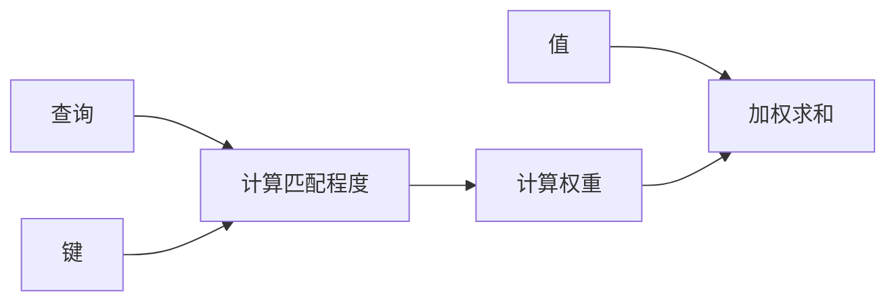

## 1.背景介绍

在深度学习领域，我们常常需要处理序列数据，比如音频、文本、时间序列等。传统的方法，如循环神经网络（RNN）和其变体（如LSTM和GRU），在处理这类问题时存在一些局限性，例如梯度消失问题，以及无法并行化计算等。为了克服这些问题，研究者们发明了一种全新的方法，即注意力机制。

注意力机制的灵感来源于人类的视觉注意力机制，我们在处理视觉任务时，往往会集中注意力在视觉场景的某一部分，而忽视其他部分。同样地，注意力机制也会在处理序列数据时，给予部分数据更高的权重，而忽视其他部分。这种机制在处理长序列数据，尤其是自然语言处理任务中，表现出了极大的优势。

## 2.核心概念与联系

注意力机制主要包括两个部分：查询（Query）、键值对（Key-Value）。查询是我们要求的信息，键值对则是数据库中的信息。注意力机制的工作就是通过查询和键的匹配程度，来决定值的权重，最后将所有的值按照权重加权求和，得到最终的输出。

在实际应用中，查询、键、值通常来自神经网络的中间层，查询和键的匹配程度则通过点积或者其他函数来计算。这种机制可以看作是一种动态的权重分配，使得模型可以关注到更重要的信息，从而提升模型的性能。

## 3.核心算法原理具体操作步骤

注意力机制的基本步骤如下：

1. 计算查询和所有键的匹配程度，通常是通过点积或者其他函数来计算。
2. 将匹配程度通过softmax函数转化为权重，使得所有权重的和为1。
3. 将所有的值按照权重加权求和，得到最终的输出。

这个过程可以用下面的Mermaid流程图来表示：



## 4.数学模型和公式详细讲解举例说明

注意力机制的数学模型可以表示为：

$$
\text{Attention}(Q, K, V) = \text{softmax}\left(\frac{QK^T}{\sqrt{d_k}}\right)V
$$

其中，$Q$是查询，$K$是键，$V$是值，$d_k$是键的维度。$\frac{QK^T}{\sqrt{d_k}}$计算了查询和所有键的匹配程度，然后通过softmax函数转化为权重，最后将所有的值按照权重加权求和，得到最终的输出。

## 5.项目实践：代码实例和详细解释说明

下面是一个使用PyTorch实现的注意力机制的例子：

```python
import torch
import torch.nn.functional as F

def attention(query, key, value, mask=None, dropout=None):
    d_k = query.size(-1)
    scores = torch.matmul(query, key.transpose(-2, -1)) / math.sqrt(d_k)
    if mask is not None:
        scores = scores.masked_fill(mask == 0, -1e9)
    p_attn = F.softmax(scores, dim = -1)
    if dropout is not None:
        p_attn = dropout(p_attn)
    return torch.matmul(p_attn, value), p_attn
```

这段代码首先计算了查询和所有键的匹配程度，然后通过softmax函数转化为权重，最后将所有的值按照权重加权求和，得到最终的输出。

## 6.实际应用场景

注意力机制在许多领域都有广泛的应用，例如：

- 自然语言处理：在机器翻译、文本摘要、情感分析等任务中，注意力机制可以帮助模型关注到更重要的单词或者短语，提升模型的性能。
- 计算机视觉：在图像分类、目标检测、图像生成等任务中，注意力机制可以帮助模型关注到更重要的区域，提升模型的性能。
- 语音识别：在语音识别任务中，注意力机制可以帮助模型关注到更重要的音素，提升模型的性能。

## 7.工具和资源推荐

如果你想进一步学习和研究注意力机制，下面的工具和资源可能会对你有所帮助：

- TensorFlow和PyTorch：这两个都是非常流行的深度学习框架，提供了丰富的API和教程，可以帮助你更好地理解和实现注意力机制。
- Transformer：这是一个基于注意力机制的模型，被广泛应用于自然语言处理任务。
- 论文《Attention is All You Need》：这篇论文首次提出了Transformer模型，详细介绍了注意力机制的工作原理和实现方法。

## 8.总结：未来发展趋势与挑战

注意力机制由于其优越的性能和广泛的应用，已经成为了深度学习领域的一个重要研究方向。未来，我们可以预见到以下的发展趋势：

- 更深入的理解：尽管注意力机制已经被广泛应用，但其理论基础仍然不够清晰。未来，我们需要更深入地理解注意力机制的工作原理和性质。
- 更多的应用：注意力机制可以应用于许多领域，未来，我们可能会看到更多的应用场景。
- 更大的挑战：随着应用的增多和模型的复杂度的提高，如何有效地训练和优化注意力模型将成为一个重要的挑战。

## 9.附录：常见问题与解答

Q: 注意力机制和RNN有什么区别？

A: 注意力机制和RNN都是处理序列数据的方法，但它们的工作原理完全不同。RNN是通过时间步的迭代来处理序列，而注意力机制则是通过计算权重来处理序列。因此，注意力机制可以并行化计算，而RNN则不能。

Q: 注意力机制有什么优点？

A: 注意力机制的优点主要有两个：一是可以关注到更重要的信息，提升模型的性能；二是可以并行化计算，提升计算效率。

Q: 注意力机制有什么缺点？

A: 注意力机制的主要缺点是计算复杂度高，需要计算所有查询和键的匹配程度，因此在处理大规模数据时，可能会遇到内存和计算资源的问题。

作者：禅与计算机程序设计艺术 / Zen and the Art of Computer Programming