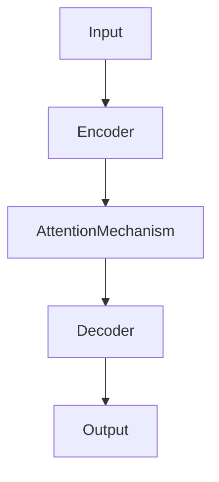

# 测试Transformer模型

## 1. 背景介绍
### 1.1 Transformer模型的兴起
### 1.2 Transformer模型的重要性
### 1.3 测试Transformer模型的必要性

## 2. 核心概念与联系
### 2.1 Transformer模型的核心组件
#### 2.1.1 Encoder
#### 2.1.2 Decoder  
#### 2.1.3 Attention机制
### 2.2 测试Transformer模型涉及的关键概念
#### 2.2.1 Perplexity
#### 2.2.2 BLEU评估指标
#### 2.2.3 人工评估

## 3. 核心算法原理与具体操作步骤
### 3.1 Transformer模型的训练过程
### 3.2 使用训练好的Transformer模型进行推理
### 3.3 评估Transformer模型性能的步骤
#### 3.3.1 准备测试数据集
#### 3.3.2 使用训练好的模型对测试集进行预测
#### 3.3.3 计算评估指标

## 4. 数学模型和公式详解
### 4.1 Transformer中的Self-Attention计算
### 4.2 Perplexity的数学定义与计算
### 4.3 BLEU评分的数学原理

## 5. 项目实践：代码实例与详解
### 5.1 使用PyTorch构建Transformer模型
### 5.2 在WMT数据集上训练Transformer模型
### 5.3 对训练好的模型进行测试与评估
#### 5.3.1 计算测试集的Perplexity
#### 5.3.2 使用BLEU对翻译质量进行自动评估
#### 5.3.3 人工评估翻译结果

## 6. 实际应用场景
### 6.1 机器翻译
### 6.2 文本摘要
### 6.3 对话系统
### 6.4 语言模型预训练

## 7. 工具和资源推荐 
### 7.1 PyTorch官方Transformer教程
### 7.2 Hugging Face Transformers库
### 7.3 WMT数据集
### 7.4 BLEU评估工具

## 8. 总结：未来发展趋势与挑战
### 8.1 Transformer模型的优势与局限性
### 8.2 Transformer模型的改进方向 
### 8.3 测试与评估方法的创新

## 9. 附录：常见问题与解答
### 9.1 如何选择Transformer模型的超参数？
### 9.2 训练Transformer模型需要多少数据？
### 9.3 如何处理Transformer模型过拟合的问题？

Transformer模型自从2017年被提出以来，迅速成为自然语言处理领域的研究热点。凭借其强大的特征提取和上下文编码能力，Transformer在机器翻译、文本分类、命名实体识别等任务上取得了显著的性能提升。作为一种通用的序列建模框架，Transformer为NLP领域带来了新的突破。

测试Transformer模型是确保其性能和泛化能力的关键一环。通过在不同的数据集和任务上评估Transformer，我们可以深入了解其优势和局限性，为进一步改进模型提供依据。本文将系统地介绍测试Transformer模型的各个方面，包括核心概念、评估指标、数学原理、代码实践等，帮助读者全面掌握Transformer测试的要点。

Transformer的核心组件包括Encoder、Decoder和Attention机制。Encoder负责对输入序列进行特征提取和编码，Decoder根据Encoder的输出和之前的解码结果生成目标序列。Attention机制则用于计算序列中不同位置之间的相关性，使模型能够更好地捕捉长距离依赖关系。下图展示了Transformer的整体架构：



测试Transformer模型时，我们主要关注以下几个核心概念：

1. Perplexity：衡量语言模型预测能力的指标，值越低表示模型性能越好。
2. BLEU评估指标：用于评估机器翻译质量的自动化指标，通过比较候选译文与参考译文的n-gram重合度来打分。
3. 人工评估：由人工对模型生成的结果进行主观评判，可以更全面地评估模型的实际表现。

为了测试Transformer模型，我们需要执行以下步骤：

1. 准备测试数据集，确保其与训练数据集的分布一致，且覆盖了不同难度和类型的样本。
2. 使用训练好的Transformer模型对测试集进行预测，生成相应的输出序列。
3. 使用Perplexity、BLEU等自动化指标对预测结果进行评分，量化模型的性能表现。
4. 由人工对预测结果进行主观评判，评估模型在实际应用中的效果。

在数学层面上，Transformer中的Self-Attention可以表示为：

$$
Attention(Q,K,V) = softmax(\frac{QK^T}{\sqrt{d_k}})V
$$

其中，$Q$、$K$、$V$分别表示Query、Key、Value矩阵，$d_k$为Key向量的维度。

Perplexity的定义为：

$$
PPL = exp(-\frac{1}{N}\sum_{i=1}^N \log p(x_i|x_1,...,x_{i-1}))
$$

其中，$N$为测试集样本数，$p(x_i|x_1,...,x_{i-1})$表示模型在给定前$i-1$个token的情况下，对第$i$个token的预测概率。

下面是使用PyTorch实现Transformer模型并进行测试的简要代码示例：

```python
import torch
import torch.nn as nn
from transformers import TransformerModel, AdamW

# 加载预训练的Transformer模型
model = TransformerModel.from_pretrained('transformer-base')

# 准备测试数据集
test_data = ...

# 对测试集进行预测
model.eval()
with torch.no_grad():
    outputs = model(test_data)
    predictions = outputs.logits.argmax(dim=-1)

# 计算Perplexity
criterion = nn.CrossEntropyLoss()
loss = criterion(outputs.logits.view(-1, model.config.vocab_size), 
                 test_data['labels'].view(-1))
perplexity = torch.exp(loss)

# 使用BLEU评估翻译质量
from nltk.translate.bleu_score import corpus_bleu

references = ...  # 参考译文
candidates = ...  # 模型生成的译文

bleu_score = corpus_bleu(references, candidates)
```

Transformer模型在实际应用中有广泛的用途，如机器翻译、文本摘要、对话系统等。以机器翻译为例，我们可以使用Transformer构建端到端的翻译模型，无需中间的对齐过程，大大简化了翻译流程。同时，Transformer强大的特征提取能力使其能够更好地处理长句子和复杂句式，提高翻译质量。

为了进一步提升Transformer模型的性能，研究者们提出了许多改进方案，如引入Pre-Normalization、使用相对位置编码、设计更深的网络结构等。这些改进有效地缓解了Transformer的局限性，如梯度消失/爆炸问题、位置信息缺失等。

测试与评估方法的创新也是一个值得关注的方向。传统的Perplexity和BLEU指标虽然简单高效，但难以全面反映模型的实际性能。因此，研究者们提出了更加细粒度和语义化的评估指标，如BERTScore、BLEURT等，从不同角度评判模型生成的结果。人机交互式评估也是一种有前景的方案，通过收集用户反馈动态优化模型，使其更贴近实际需求。

总之，Transformer模型为NLP领域带来了新的突破，其强大的特征提取和建模能力使其在多个任务上取得了显著的性能提升。测试Transformer模型是一项复杂而重要的工作，需要从多个角度系统地评估其性能。未来，Transformer模型的改进和测试方法的创新将继续推动NLP技术的发展，让机器能够更好地理解和生成人类语言。

作者：禅与计算机程序设计艺术 / Zen and the Art of Computer Programming