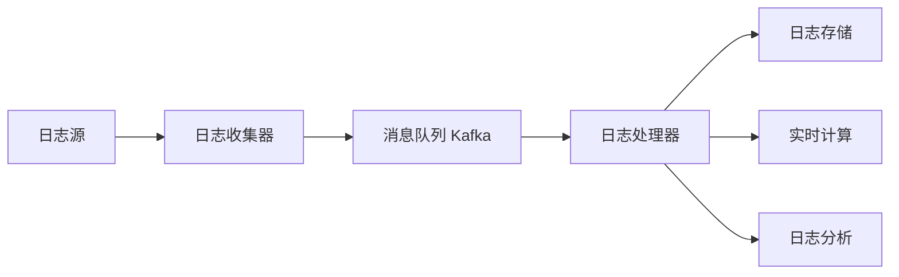

# 消息队列在分布式日志收集中的应用

## 1. 背景介绍
### 1.1 分布式系统中的日志收集挑战
#### 1.1.1 海量日志数据
#### 1.1.2 多源异构环境
#### 1.1.3 实时性要求
### 1.2 传统日志收集方案的局限性
#### 1.2.1 性能瓶颈
#### 1.2.2 可靠性问题
#### 1.2.3 扩展性不足

## 2. 核心概念与联系
### 2.1 消息队列概述
#### 2.1.1 消息队列的定义与特点
#### 2.1.2 消息队列的工作原理
### 2.2 分布式日志收集
#### 2.2.1 分布式日志收集的定义
#### 2.2.2 分布式日志收集的关键要素
### 2.3 消息队列在分布式日志收集中的作用
#### 2.3.1 解耦与异步
#### 2.3.2 削峰填谷
#### 2.3.3 数据持久化

## 3. 核心算法原理具体操作步骤
### 3.1 生产者-消费者模型
#### 3.1.1 生产者的工作流程
#### 3.1.2 消费者的工作流程
#### 3.1.3 消息确认机制
### 3.2 分区与负载均衡
#### 3.2.1 分区的概念与作用
#### 3.2.2 分区策略
#### 3.2.3 消费者负载均衡
### 3.3 消息持久化与可靠性保证
#### 3.3.1 消息持久化机制
#### 3.3.2 消息重复与丢失的处理
#### 3.3.3 消息顺序性保证

## 4. 数学模型和公式详细讲解举例说明
### 4.1 排队论模型
#### 4.1.1 M/M/1 队列模型
#### 4.1.2 M/M/c 队列模型
#### 4.1.3 排队论在消息队列中的应用
### 4.2 负载均衡算法
#### 4.2.1 轮询算法
#### 4.2.2 最少连接算法
#### 4.2.3 哈希算法
### 4.3 数据压缩算法
#### 4.3.1 无损压缩算法
#### 4.3.2 有损压缩算法
#### 4.3.3 压缩算法选择

## 5. 项目实践：代码实例和详细解释说明
### 5.1 基于 Kafka 的分布式日志收集系统
#### 5.1.1 系统架构设计
#### 5.1.2 生产者代码实现
#### 5.1.3 消费者代码实现
### 5.2 日志数据处理与分析
#### 5.2.1 日志解析与结构化
#### 5.2.2 实时计算与聚合
#### 5.2.3 日志可视化与报警
### 5.3 性能优化与监控
#### 5.3.1 生产者性能优化
#### 5.3.2 消费者性能优化
#### 5.3.3 监控与告警

## 6. 实际应用场景
### 6.1 电商平台日志收集与分析
#### 6.1.1 业务场景与需求
#### 6.1.2 系统设计与实现
#### 6.1.3 效果与收益
### 6.2 金融风控系统日志处理
#### 6.2.1 业务场景与需求
#### 6.2.2 系统设计与实现
#### 6.2.3 效果与收益
### 6.3 物联网设备日志采集与监控
#### 6.3.1 业务场景与需求
#### 6.3.2 系统设计与实现
#### 6.3.3 效果与收益

## 7. 工具和资源推荐
### 7.1 开源消息队列系统
#### 7.1.1 Apache Kafka
#### 7.1.2 RabbitMQ
#### 7.1.3 RocketMQ
### 7.2 日志收集与处理工具
#### 7.2.1 Logstash
#### 7.2.2 Fluentd
#### 7.2.3 Filebeat
### 7.3 学习资源
#### 7.3.1 官方文档
#### 7.3.2 博客与教程
#### 7.3.3 社区与论坛

## 8. 总结：未来发展趋势与挑战
### 8.1 消息队列技术的发展趋势
#### 8.1.1 云原生与无服务器架构
#### 8.1.2 流处理与实时计算
#### 8.1.3 人工智能与机器学习
### 8.2 分布式日志收集面临的挑战
#### 8.2.1 数据安全与隐私保护
#### 8.2.2 海量数据存储与管理
#### 8.2.3 异构环境适配与集成
### 8.3 展望与总结
#### 8.3.1 消息队列在分布式系统中的重要性
#### 8.3.2 技术创新与业务融合
#### 8.3.3 开放性与生态建设

## 9. 附录：常见问题与解答
### 9.1 消息队列与传统数据库的区别
### 9.2 如何选择适合的消息队列系统
### 9.3 消息队列的性能瓶颈与优化策略
### 9.4 分布式日志收集的最佳实践
### 9.5 消息队列在大数据领域的应用

---

在当今分布式系统日益复杂的环境下,高效可靠的日志收集与处理已成为系统运维与监控的关键。传统的日志收集方案面临着性能瓶颈、可靠性问题以及扩展性不足等挑战。而消息队列以其解耦异步、削峰填谷、数据持久化等特性,为分布式日志收集提供了一种高效可靠的解决方案。

本文将深入探讨消息队列在分布式日志收集中的应用。首先,我们将介绍分布式系统中日志收集所面临的挑战,以及传统日志收集方案的局限性。接着,我们将阐述消息队列的核心概念与工作原理,并分析其在分布式日志收集中的作用。

在技术实现层面,我们将详细讲解消息队列的核心算法,包括生产者-消费者模型、分区与负载均衡、消息持久化与可靠性保证等。同时,我们还将引入数学模型与公式,如排队论模型、负载均衡算法、数据压缩算法等,以更深入地理解消息队列的工作原理。

为了更直观地展示消息队列在分布式日志收集中的应用,我们将提供基于 Kafka 的项目实践,包括系统架构设计、生产者与消费者代码实现、日志数据处理与分析、性能优化与监控等方面。通过这些实际案例,读者可以更全面地掌握消息队列在分布式日志收集中的应用。

此外,我们还将探讨消息队列在电商平台、金融风控、物联网等领域的实际应用场景,分析其业务需求、系统设计与实现,以及带来的效果与收益。这些实践经验可以为读者提供宝贵的参考与启发。

为了帮助读者更好地掌握消息队列与分布式日志收集相关技术,我们还将推荐一些优秀的开源消息队列系统、日志收集与处理工具,以及学习资源,如官方文档、博客教程、社区论坛等。

最后,我们将展望消息队列技术的未来发展趋势,如云原生与无服务器架构、流处理与实时计算、人工智能与机器学习等,以及分布式日志收集所面临的挑战,如数据安全与隐私保护、海量数据存储与管理、异构环境适配与集成等。我们相信,随着技术的不断创新与业务的深度融合,消息队列将在分布式系统中扮演越来越重要的角色。

在附录部分,我们还将解答一些读者关心的常见问题,如消息队列与传统数据库的区别、如何选择适合的消息队列系统、消息队列的性能瓶颈与优化策略、分布式日志收集的最佳实践,以及消息队列在大数据领域的应用等。

通过本文的深入探讨与实践分享,我们希望能够帮助读者全面掌握消息队列在分布式日志收集中的应用,提升系统的可靠性、性能与扩展性,更好地应对分布式环境下的日志收集与处理挑战。让我们一起探索消息队列在分布式日志收集中的无限可能吧!



在上图所示的架构中,日志源产生的日志数据首先被日志收集器采集,然后发送到消息队列 Kafka 中。Kafka 作为一个高吞吐、低延迟、高可靠的分布式消息系统,可以很好地解耦日志收集与处理,并提供数据持久化与可靠性保证。

日志处理器从 Kafka 中消费日志数据,对其进行解析、转换、过滤等处理,然后将结果发送到下游的日志存储、实时计算、日志分析等模块。这种架构可以实现日志收集与处理的解耦,提高系统的灵活性与可扩展性。

在具体实现中,我们可以使用 Kafka 的生产者 API 来实现日志收集器,将日志数据发送到 Kafka 的特定主题(Topic)中。而日志处理器则通过 Kafka 的消费者 API 来消费日志数据,并进行相应的处理。

下面是一个简单的 Kafka 生产者示例代码:

```java
Properties props = new Properties();
props.put("bootstrap.servers", "localhost:9092");
props.put("key.serializer", "org.apache.kafka.common.serialization.StringSerializer");
props.put("value.serializer", "org.apache.kafka.common.serialization.StringSerializer");

KafkaProducer<String, String> producer = new KafkaProducer<>(props);

String topic = "log-topic";
String log = "This is a log message";

ProducerRecord<String, String> record = new ProducerRecord<>(topic, log);
producer.send(record);

producer.close();
```

在上述代码中,我们首先配置了 Kafka 生产者的属性,包括 Kafka 服务器地址、键和值的序列化器等。然后创建了一个 KafkaProducer 对象,并构造一个 ProducerRecord,指定要发送的主题和日志消息。最后,调用 producer.send() 方法发送消息,并关闭生产者。

对应地,Kafka 消费者的示例代码如下:

```java
Properties props = new Properties();
props.put("bootstrap.servers", "localhost:9092");
props.put("group.id", "log-consumer-group");
props.put("key.deserializer", "org.apache.kafka.common.serialization.StringDeserializer");
props.put("value.deserializer", "org.apache.kafka.common.serialization.StringDeserializer");

KafkaConsumer<String, String> consumer = new KafkaConsumer<>(props);

String topic = "log-topic";
consumer.subscribe(Collections.singletonList(topic));

while (true) {
    ConsumerRecords<String, String> records = consumer.poll(Duration.ofMillis(100));
    for (ConsumerRecord<String, String> record : records) {
        String log = record.value();
        // 处理日志数据
        System.out.println("Received log: " + log);
    }
}
```

在消费者代码中,我们同样配置了 Kafka 消费者的属性,然后创建了一个 KafkaConsumer 对象。我们订阅了指定的主题,并在一个无限循环中不断调用 consumer.poll() 方法拉取消息。对于每个接收到的消息,我们可以进行相应的日志处理逻辑。

通过 Kafka 生产者和消费者 API,我们可以方便地实现日志数据的收集与处理。Kafka 提供了高吞吐、低延迟、可靠性等特性,使得我们能够构建高效可靠的分布式日志收集系统。

除了 Java 客户端之外,Kafka 还提供了多种编程语言的客户端支持,如 Python、Go、C++ 等,可以满足不同的开发需求。同时,Kafka 还提供了丰富的配置参数,如批次大小、压缩算法、消息保留策略等,可以根据实际场景进行优化与调整。

在实际应用中,我们还需要考虑日志数据的处理与分析。常见的日志处理方式包括:

1. 日志解析:将非结构化的日志数据解析为结构化的格式,如 JSON、CSV