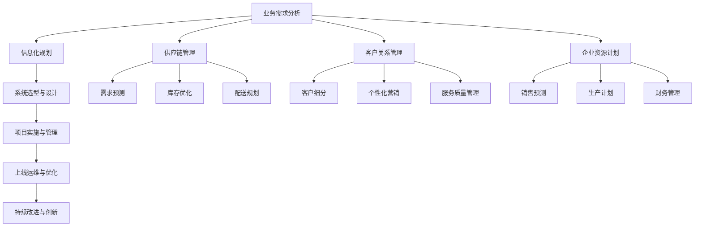

# 消费品行业信息化整体建设和管理工作

## 1. 背景介绍
### 1.1 消费品行业面临的挑战
#### 1.1.1 市场竞争加剧
#### 1.1.2 消费者需求多样化
#### 1.1.3 供应链管理复杂
### 1.2 信息化建设的必要性
#### 1.2.1 提高运营效率
#### 1.2.2 优化资源配置
#### 1.2.3 增强决策支持

## 2. 核心概念与联系
### 2.1 消费品行业信息化
#### 2.1.1 定义与内涵
#### 2.1.2 发展历程
### 2.2 信息化建设的关键领域
#### 2.2.1 供应链管理
#### 2.2.2 客户关系管理
#### 2.2.3 企业资源计划
### 2.3 信息化建设与业务发展的关系
#### 2.3.1 支撑业务创新
#### 2.3.2 驱动业务变革
#### 2.3.3 赋能业务决策

## 3. 核心算法原理具体操作步骤
### 3.1 供应链优化算法
#### 3.1.1 需求预测
#### 3.1.2 库存优化
#### 3.1.3 配送路径规划
### 3.2 客户细分算法
#### 3.2.1 RFM模型
#### 3.2.2 K-means聚类
#### 3.2.3 关联规则挖掘
### 3.3 销售预测算法
#### 3.3.1 时间序列分析
#### 3.3.2 机器学习模型
#### 3.3.3 集成学习方法

## 4. 数学模型和公式详细讲解举例说明
### 4.1 供应链优化模型
#### 4.1.1 经济订货批量模型(EOQ)
$$EOQ = \sqrt{\frac{2DS}{H}}$$
其中，$D$为年需求量，$S$为单次订货成本，$H$为单位存货成本。

#### 4.1.2 供应商选择模型(AHP)
通过构建层次分析模型，对供应商进行综合评估和选择。
### 4.2 客户细分模型  
#### 4.2.1 RFM模型
根据客户的最近购买时间(Recency)、购买频率(Frequency)和购买金额(Monetary)进行客户价值评估和细分。
#### 4.2.2 K-means聚类
通过最小化簇内样本到簇中心的距离平方和，将客户划分为不同的群体。
$$\min \limits_{C} \sum \limits^{K}_{i=1} \sum \limits_{x \in C_i} ||x-\mu_i||^2$$
其中，$\mu_i$为第$i$个簇的中心，$C_i$为第$i$个簇，$K$为簇的个数。

### 4.3 销售预测模型
#### 4.3.1 ARIMA模型
通过自回归(AR)、差分(I)和移动平均(MA)对时间序列数据进行建模和预测。
$$y_t = c + \phi_1 y_{t-1} + \cdots + \phi_p y_{t-p} + \theta_1 \varepsilon_{t-1} + \cdots + \theta_q \varepsilon_{t-q} + \varepsilon_t$$
其中，$y_t$为时间$t$的观测值，$\varepsilon_t$为时间$t$的随机扰动，$p$为自回归阶数，$q$为移动平均阶数。

#### 4.3.2 支持向量回归(SVR)
利用支持向量机的结构风险最小化原则，构建回归模型进行销售预测。
$$f(x) = \sum_{i=1}^N (\alpha_i - \alpha_i^*) K(x_i, x) + b$$
其中，$\alpha_i$和$\alpha_i^*$为拉格朗日乘子，$K(x_i, x)$为核函数，$b$为偏置项。

## 5. 项目实践：代码实例和详细解释说明
### 5.1 供应链优化系统
#### 5.1.1 需求预测模块
使用Python的Statsmodels库实现ARIMA模型进行需求预测：
```python
from statsmodels.tsa.arima.model import ARIMA

# 创建并拟合ARIMA模型
model = ARIMA(data, order=(p, d, q))
model_fit = model.fit()

# 进行需求预测
forecast = model_fit.forecast(steps=n)
```

#### 5.1.2 库存优化模块
基于EOQ模型，使用Python实现库存优化：
```python
import math

def calculate_eoq(demand, order_cost, holding_cost):
    eoq = math.sqrt(2 * demand * order_cost / holding_cost)
    return eoq

# 计算最优订货批量
optimal_order_quantity = calculate_eoq(annual_demand, order_cost, holding_cost)
```

#### 5.1.3 配送路径规划模块
利用遗传算法，使用Python的Geatpy库实现配送路径优化：
```python
import geatpy as ga

# 定义问题类
class RoutingProblem(ea.Problem):
    def __init__(self, cities, dist_mat):
        self.cities = cities
        self.dist_mat = dist_mat
        # 其他问题参数设置...

    def aimFunc(self, pop):
        # 目标函数定义...

# 创建问题实例
problem = RoutingProblem(cities, dist_matrix)

# 创建种群并进行进化
population = ga.Population(problem)
result = ga.minimize(problem, population)

# 获取最优解
best_route = result['Vars']
```

### 5.2 客户关系管理系统
#### 5.2.1 客户细分模块
使用Python的Scikit-learn库实现K-means聚类进行客户细分：
```python
from sklearn.cluster import KMeans

# 创建并拟合K-means模型
kmeans = KMeans(n_clusters=k)
kmeans.fit(customer_data)

# 获取客户群体划分
labels = kmeans.labels_
```

#### 5.2.2 个性化推荐模块
基于关联规则挖掘，使用Python的Mlxtend库实现个性化商品推荐：
```python
from mlxtend.frequent_patterns import apriori
from mlxtend.frequent_patterns import association_rules

# 生成频繁项集
frequent_itemsets = apriori(transaction_data, min_support=0.01)

# 生成关联规则
rules = association_rules(frequent_itemsets, metric="lift", min_threshold=1.2)

# 根据关联规则进行商品推荐
recommended_items = rules[rules['lift'] > 1.5]['consequents']
```

### 5.3 企业资源计划系统
#### 5.3.1 销售预测模块
使用Python的Scikit-learn库实现支持向量回归进行销售预测：
```python
from sklearn.svm import SVR

# 创建并拟合SVR模型
svr = SVR(kernel='rbf', C=1e3, gamma=0.1)
svr.fit(train_data, train_labels)

# 进行销售预测
predictions = svr.predict(test_data)
```

#### 5.3.2 生产计划模块
基于销售预测结果，使用Python的PuLP库实现生产计划优化：
```python
from pulp import *

# 创建线性规划问题
prob = LpProblem("Production Planning", LpMinimize)

# 定义决策变量
x = LpVariable.dicts("ProductionQuantity", products, lowBound=0, cat='Integer')

# 定义目标函数
prob += lpSum([cost[i] * x[i] for i in products])

# 添加约束条件
for i in products:
    prob += x[i] >= demand[i]
    prob += x[i] <= capacity[i]

# 求解线性规划问题
prob.solve()

# 获取最优生产计划
optimal_plan = {i: x[i].value() for i in products}
```

## 6. 实际应用场景
### 6.1 快消品零售企业
- 通过供应链优化，减少库存积压，提高配送效率
- 利用客户细分和个性化推荐，提升客户满意度和复购率
- 结合销售预测和生产计划优化，实现供需平衡，降低成本

### 6.2 食品饮料制造企业
- 运用需求预测技术，准确把握市场需求变化
- 优化生产计划和排程，提高生产效率和灵活性
- 利用大数据分析，实现精准营销和渠道管理

### 6.3 服装鞋帽企业
- 通过销售预测和库存优化，减少季末积压，提高周转率
- 运用客户细分和关联分析，进行精准营销和交叉销售
- 优化供应链网络设计，实现柔性化生产和快速响应

## 7. 工具和资源推荐
### 7.1 开源软件
- Python数据分析库：Pandas、Numpy、Scikit-learn等
- 优化求解工具：PuLP、OR-Tools等
- 可视化工具：Matplotlib、Seaborn、Plotly等

### 7.2 商业软件
- SAP（企业资源计划系统）
- Oracle（供应链管理系统）
- Salesforce（客户关系管理系统）
- JDA（供应链计划与优化平台）

### 7.3 学习资源
- Coursera在线课程：《Supply Chain Management》、《Customer Analytics》等
- 书籍推荐：《数据挖掘导论》、《Python机器学习》、《运筹学导论》等
- 行业报告：Gartner、IDC等咨询公司发布的行业研究报告

## 8. 总结：未来发展趋势与挑战
### 8.1 数字化转型加速
消费品企业将加速数字化转型步伐，利用大数据、人工智能等技术实现业务创新和优化。

### 8.2 供应链弹性化
面对市场不确定性，企业需要构建更加弹性化的供应链体系，提高响应速度和抗风险能力。

### 8.3 消费者洞察深化
企业将更加重视消费者洞察，通过数据分析和用户研究，深入理解消费者需求，实现精准营销和服务。

### 8.4 人才与组织变革
信息化建设需要企业进行人才结构调整和组织变革，培养复合型人才，建立敏捷组织。

### 8.5 数据安全与隐私保护
在数据驱动的背景下，企业需要高度重视数据安全与隐私保护，建立完善的数据治理体系。

## 9. 附录：常见问题与解答
### 9.1 如何选择适合企业的信息化建设方案？
需要结合企业发展战略、业务特点、技术基础等因素，选择匹配度高、性价比好的方案。可以借助第三方咨询机构的专业评估。

### 9.2 信息化建设的关键成功因素有哪些？
- 高层领导的重视和支持
- 全面的业务流程梳理和优化
- 合理的系统架构设计和技术选型
- 有效的项目管理和变更管理
- 持续的培训与变革管理

### 9.3 如何评估信息化建设的投资回报？
- 建立科学的评估指标体系，包括财务指标和非财务指标
- 开展投资回报分析，评估系统的成本节约和收益提升
- 引入用户满意度调查，评估系统的使用效果和业务影响
- 定期评审和持续改进，动态优化系统功能和业务流程

### 9.4 如何应对信息化建设过程中的变更和风险？
- 建立有效的变更管理机制，及时识别和评估变更需求
- 加强与业务部门的沟通协调，确保变更的可行性和必要性
- 实施全面的风险管理，识别并应对潜在的风险因素
- 建立应急预案和备份机制，最小化风险影响

以下是消费品行业信息化整体建设和管理的核心流程图：



消费品行业信息化建设是一个系统性工程，需要从业务需求出发，制定整体规划，选择合适的技术方案，高效实施项目，并在后期进行持续的运维优化和改进创新。其中，供应链管理、客户关系管理和企业资源计划是三大核心领域，通过数据分析和算法优化，