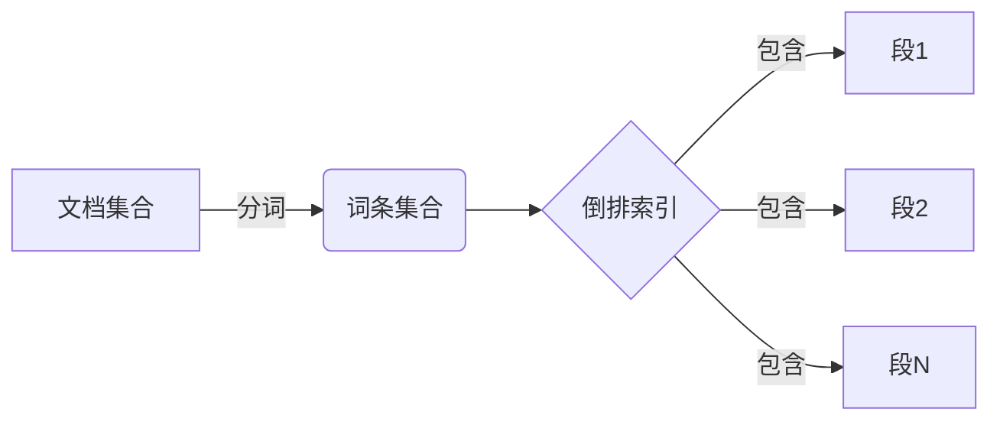
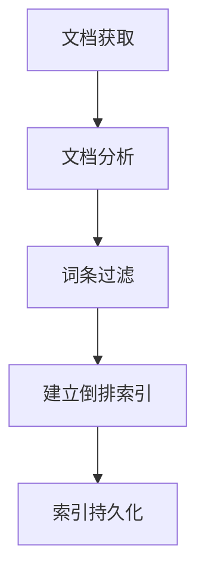
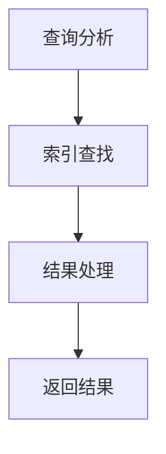
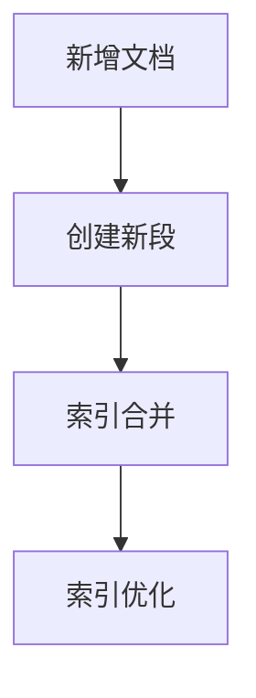

# 深入剖析Lucene的索引结构与存储机制

## 1.背景介绍

### 1.1 什么是Lucene

Apache Lucene是一个高性能、全功能的搜索引擎库,由Java编写,提供了完整的查询引擎和索引引擎功能。它是目前最流行和最成熟的开源搜索引擎库之一,被广泛应用于全文检索和数据挖掘领域。

Lucene的主要特点包括:

- 高性能、高可扩展性
- 支持各种文档格式(PDF、Word、HTML等)
- 跨平台、开源免费
- 支持中文分词、同义词等高级功能

### 1.2 Lucene的应用场景

Lucene广泛应用于各种需要全文检索和数据挖掘功能的场景,例如:

- 网站站内搜索
- 电商产品搜索
- 知识库/文档管理系统
- 日志分析和挖掘
- 大数据分析等

### 1.3 索引的重要性

索引是Lucene实现高效全文检索的关键。索引的质量直接决定了搜索的性能和准确性。因此,深入理解Lucene的索引结构和存储机制,对于合理设计和优化索引至关重要。

## 2.核心概念与联系

### 2.1 核心概念

要理解Lucene的索引结构,首先需要了解几个核心概念:

- **文档(Document)**: 被索引的基本数据单元,由一组字段(Field)组成。
- **词条(Term)**: 被索引的最小单元,通常是经过分词处理后的单词。
- **倒排索引(Inverted Index)**: Lucene采用的索引结构,记录每个词条对应的文档列表。
- **段(Segment)**: 索引被逻辑划分为多个只读的段,以提高并发性能。



### 2.2 概念联系

这些概念之间的联系如下:

- 文档被分词后形成词条集合
- 倒排索引记录每个词条对应的文档列表
- 索引被逻辑划分为多个段,每个段包含部分倒排索引
- 查询时需要在所有段中搜索,合并结果

理解这些核心概念及其联系,是深入掌握Lucene索引结构的基础。

## 3.核心算法原理具体操作步骤 

### 3.1 索引构建过程

Lucene的索引构建过程包括以下几个主要步骤:

1. **文档获取**: 从数据源(文件系统、数据库等)获取原始文档数据。
2. **文档分析**: 使用分词器(Analyzer)将文档内容分割为词条序列。
3. **词条过滤**: 通过词条过滤器(TokenFilter)移除无用词条,如停用词。
4. **建立倒排索引**: 遍历处理后的词条序列,为每个词条创建倒排索引项。
5. **索引持久化**: 将内存中的倒排索引数据刷新到磁盘文件中。



### 3.2 索引查询过程

查询过程是索引构建的反向操作:

1. **查询分析**: 将查询语句分词,得到查询词条序列。
2. **索引查找**: 在倒排索引中查找匹配的文档列表。
3. **结果处理**: 根据评分公式,对匹配文档进行排序、过滤等处理。
4. **返回结果**: 返回最终的查询结果文档列表。



### 3.3 索引合并与优化

为提高查询性能,Lucene会定期执行索引合并和优化操作:

1. **索引合并**: 将文件系统中的多个小段合并为更大的段,减少读取开销。
2. **索引优化**: 对合并后的大段进行优化,如删除已删除文档的数据,提高查询效率。



通过深入理解这些核心算法原理和操作步骤,可以更好地设计、优化和调试Lucene索引。

## 4.数学模型和公式详细讲解举例说明

### 4.1 评分模型

Lucene使用复合评分模型(Composite Scoring Model)对匹配文档进行评分排序,该模型由以下几个部分组成:

1. **词条频率(TF)**: 词条在文档中出现的频率,用于衡量词条的重要性。

   $$
   TF(t,d) = \sqrt{freq(t,d)}
   $$

   其中,t为词条,d为文档,freq(t,d)为词条t在文档d中出现的频率。

2. **反向文档频率(IDF)**: 词条在整个文档集合中的稀有程度,用于降低常见词条的权重。

   $$
   IDF(t) = \log\frac{N+1}{df(t)+1} + 1
   $$

   其中,N为文档总数,df(t)为包含词条t的文档数量。

3. **字段规范化(Field Norm)**: 根据字段的长度和增量对字段权重进行规范化。
4. **查询规范化(Query Norm)**: 对查询中每个词条的权重进行规范化。
5. **协同权重(Coord Factor)**: 考虑查询中多个词条同时出现在文档中的情况。

最终的文档评分公式为:

$$
\text{Score}(q,d) = \sum_{t \in q} \text{TF}(t,d) \cdot \text{IDF}(t) \cdot \text{FieldNorm}(t,d) \cdot \text{QueryNorm}(t) \cdot \text{CoordFactor}(q,d)
$$

其中,q为查询,d为文档,t为查询中的词条。

通过合理设置这些参数,可以优化搜索结果的相关性排序。

### 4.2 相似度算法

Lucene支持多种相似度算法(Similarity),用于计算文档与查询的相似程度。常见的相似度算法包括:

1. **TF-IDF相似度**: 上述评分模型中使用的经典TF-IDF算法。
2. **BM25相似度**: 一种基于概率模型的相似度算法,常用于Web搜索。

   $$
   \text{Score}_{BM25}(q,d) = \sum_{t \in q} \text{IDF}(t) \cdot \frac{TF(t,d) \cdot (k_1 + 1)}{TF(t,d) + k_1 \cdot (1 - b + b \cdot \frac{|d|}{avgdl})}
   $$

   其中,k1和b是可调参数,|d|为文档长度,avgdl为平均文档长度。

3. **LMDirichletSimilarity**: 一种基于语言模型的相似度算法。

通过选择合适的相似度算法,可以提高搜索结果的相关性和准确性。

## 5.项目实践:代码实例和详细解释说明

下面是一个使用Lucene进行索引和搜索的简单Java示例:

### 5.1 创建索引

```java
// 创建索引目录
Directory indexDir = FSDirectory.open(Paths.get("index"));

// 创建IndexWriterConfig
IndexWriterConfig config = new IndexWriterConfig(new StandardAnalyzer());

// 创建IndexWriter
IndexWriter writer = new IndexWriter(indexDir, config);

// 添加文档
for (String text : texts) {
    Document doc = new Document();
    doc.add(new TextField("content", text, Field.Store.YES));
    writer.addDocument(doc);
}

// 提交并关闭
writer.commit();
writer.close();
```

代码解释:

1. 创建索引目录,用于存储索引文件。
2. 创建IndexWriterConfig,设置分词器等参数。
3. 创建IndexWriter,用于添加和更新索引。
4. 遍历文档数据,创建Document对象并添加字段。
5. 提交并关闭IndexWriter,确保索引被正确写入磁盘。

### 5.2 执行搜索

```java
// 创建索引目录
Directory indexDir = FSDirectory.open(Paths.get("index")); 

// 创建IndexReader
IndexReader reader = DirectoryReader.open(indexDir);

// 创建IndexSearcher
IndexSearcher searcher = new IndexSearcher(reader);

// 创建查询
QueryParser parser = new QueryParser("content", new StandardAnalyzer());
Query query = parser.parse(queryString);

// 执行搜索并获取TopDocs
TopDocs topDocs = searcher.search(query, 10);

// 遍历TopDocs并输出结果
for (ScoreDoc sd : topDocs.scoreDocs) {
    Document doc = searcher.doc(sd.doc);
    System.out.println(doc.get("content"));
}

// 关闭资源
reader.close();
```

代码解释:

1. 打开索引目录,获取IndexReader。
2. 创建IndexSearcher,用于执行查询。
3. 创建QueryParser,解析查询语句为Query对象。
4. 执行search方法,获取TopDocs对象,包含匹配文档的ID和评分。
5. 遍历TopDocs,获取每个匹配文档的内容并输出。
6. 关闭IndexReader,释放资源。

通过这些代码示例,你可以了解到如何使用Lucene进行索引构建和搜索查询的基本流程。

## 6.实际应用场景

### 6.1 电商网站产品搜索

在电商网站中,Lucene可以用于构建高效的产品搜索引擎。索引包括产品标题、描述、类别等字段,并支持各种查询方式,如关键词搜索、范围查询、过滤等。同时,Lucene的评分模型可以根据产品的热度、销量等因素对结果进行个性化排序。

### 6.2 知识库/文档管理系统

Lucene可以为知识库和文档管理系统提供全文检索功能。系统中的文档、wiki页面、技术手册等内容可以被索引,用户可以通过关键词快速查找所需信息。索引可以包括文档标题、正文内容、元数据等字段,并支持模糊查询、短语查询等高级功能。

### 6.3 日志分析和挖掘

在大型分布式系统中,日志数据是进行故障诊断和性能优化的重要数据源。Lucene可以用于构建日志分析系统,对海量日志数据进行全文索引,支持根据各种条件(如时间范围、级别、关键词等)快速查询和挖掘日志信息。

### 6.4 其他应用场景

除上述场景外,Lucene还可以应用于网站站内搜索、代码搜索、社交网络内容检索、大数据分析等多个领域。凭借其优秀的性能和灵活的扩展性,Lucene为各种需要全文检索功能的应用提供了强有力的支持。

## 7.工具和资源推荐

### 7.1 Lucene官方资源

- Lucene官网: https://lucene.apache.org/
- Lucene文档: https://lucene.apache.org/core/
- Lucene源码: https://github.com/apache/lucene

官方网站和文档是学习Lucene的权威资源,包括教程、API文档、常见问题解答等。同时,阅读Lucene的源代码也是深入理解其内部实现的好方法。

### 7.2 第三方资源

- Lucene实战(第2版) - 作者:埃里斯·普拉哈拉德,本·亨德里克斯
- Lucene革命 - 作者:迈克尔·麦考利斯特
- Lucene开发指南 - 作者:Erik Hatcher,Otis Gospodnetic

这些书籍深入介绍了Lucene的原理、使用方法和最佳实践,是学习Lucene的绝佳参考资料。

### 7.3 在线社区

- Lucene邮件列表: https://lucene.apache.org/core/discussion.html
- Lucene Stack Overflow标签: https://stackoverflow.com/questions/tagged/lucene

这些在线社区汇集了来自世界各地的Lucene用户和开发者,是获取帮助、解决疑难问题的好去处。

## 8.总结:未来发展趋势与挑战

### 8.1 未来发展趋势

Lucene作为成熟的搜索引擎库,未来的发展趋势包括:

1. **更好的分布式支持**: 以提高并行处理能力,满足大数据场景