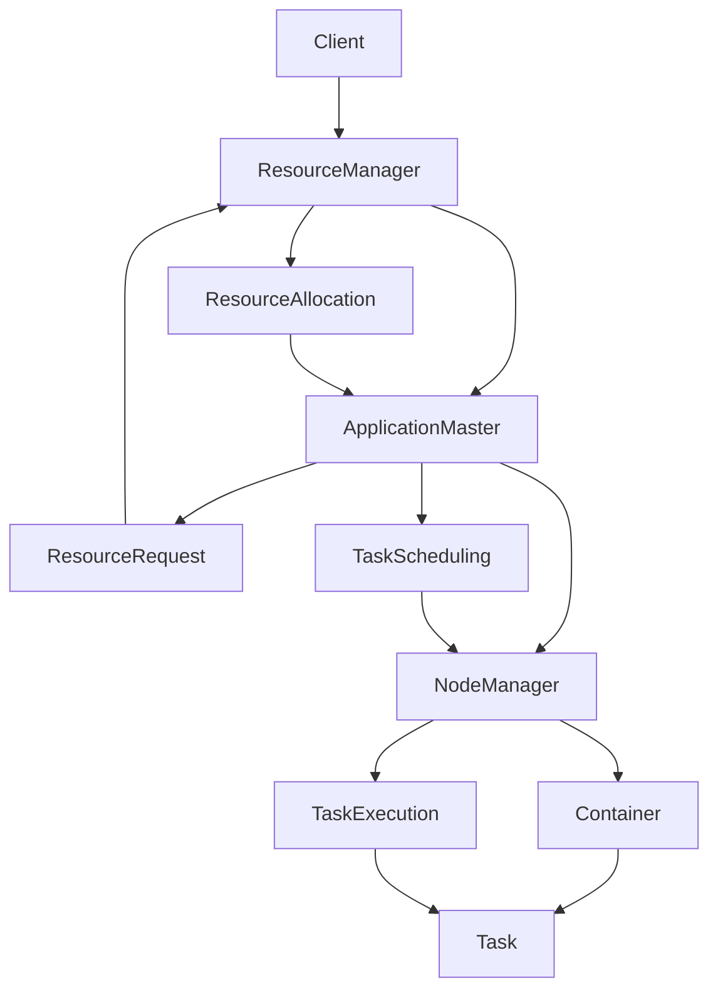

# 深入理解ApplicationMaster架构及其作用

## 1. 背景介绍
### 1.1 大数据处理框架的发展历程
#### 1.1.1 传统数据处理方式的局限性
#### 1.1.2 Hadoop的诞生与发展
#### 1.1.3 Yarn资源管理器的出现
### 1.2 ApplicationMaster的提出背景
#### 1.2.1 Yarn架构下的资源分配问题  
#### 1.2.2 任务调度与管理的复杂性
#### 1.2.3 ApplicationMaster应运而生

## 2. 核心概念与联系
### 2.1 Yarn架构概述
#### 2.1.1 ResourceManager
#### 2.1.2 NodeManager
#### 2.1.3 ApplicationMaster
### 2.2 ApplicationMaster的定义与职责
#### 2.2.1 ApplicationMaster的概念
#### 2.2.2 ApplicationMaster在Yarn中的角色
#### 2.2.3 ApplicationMaster的主要功能
### 2.3 ApplicationMaster与其他组件的关系
#### 2.3.1 ApplicationMaster与ResourceManager的交互
#### 2.3.2 ApplicationMaster与NodeManager的协作
#### 2.3.3 ApplicationMaster与Container的管理

## 3. 核心算法原理具体操作步骤
### 3.1 ApplicationMaster的启动流程
#### 3.1.1 用户提交应用程序
#### 3.1.2 ResourceManager分配Container
#### 3.1.3 ApplicationMaster在Container中启动
### 3.2 ApplicationMaster的资源请求与分配
#### 3.2.1 ApplicationMaster向ResourceManager请求资源
#### 3.2.2 ResourceManager根据调度策略分配资源
#### 3.2.3 ApplicationMaster获取分配的资源
### 3.3 ApplicationMaster的任务调度与管理
#### 3.3.1 ApplicationMaster将任务分解为多个Task
#### 3.3.2 ApplicationMaster为Task请求资源并分配
#### 3.3.3 ApplicationMaster监控Task执行状态并管理

## 4. 数学模型和公式详细讲解举例说明
### 4.1 资源请求与分配的数学模型
#### 4.1.1 资源需求的表示方法
#### 4.1.2 资源分配的优化目标
#### 4.1.3 资源分配的约束条件
### 4.2 任务调度的数学模型
#### 4.2.1 任务依赖关系的表示
#### 4.2.2 任务调度的优化目标
#### 4.2.3 任务调度的约束条件
### 4.3 数学模型的求解与优化
#### 4.3.1 资源分配问题的求解方法
#### 4.3.2 任务调度问题的求解方法
#### 4.3.3 启发式算法与近似算法的应用

## 5. 项目实践：代码实例和详细解释说明
### 5.1 基于Yarn的MapReduce应用程序
#### 5.1.1 MapReduce应用程序的开发流程
#### 5.1.2 ApplicationMaster的实现与配置
#### 5.1.3 MapReduce任务的提交与执行
### 5.2 基于Yarn的Spark应用程序
#### 5.2.1 Spark应用程序的开发流程
#### 5.2.2 Spark ApplicationMaster的实现与配置
#### 5.2.3 Spark任务的提交与执行
### 5.3 代码实例与详细解释
#### 5.3.1 MapReduce ApplicationMaster的代码实现
#### 5.3.2 Spark ApplicationMaster的代码实现
#### 5.3.3 关键代码的解释与说明

## 6. 实际应用场景
### 6.1 大数据处理领域的应用
#### 6.1.1 日志分析与处理
#### 6.1.2 用户行为分析
#### 6.1.3 推荐系统的构建
### 6.2 机器学习与数据挖掘的应用
#### 6.2.1 分布式机器学习算法的实现
#### 6.2.2 大规模数据挖掘任务的处理
#### 6.2.3 深度学习模型的训练与推理
### 6.3 实时数据处理的应用
#### 6.3.1 实时流处理系统的构建
#### 6.3.2 实时数据分析与可视化
#### 6.3.3 实时异常检测与告警

## 7. 工具和资源推荐
### 7.1 开源大数据处理框架
#### 7.1.1 Hadoop生态系统
#### 7.1.2 Spark生态系统
#### 7.1.3 Flink生态系统
### 7.2 开发工具与IDE
#### 7.2.1 IntelliJ IDEA
#### 7.2.2 Eclipse
#### 7.2.3 Visual Studio Code
### 7.3 学习资源与社区
#### 7.3.1 官方文档与教程
#### 7.3.2 在线课程与视频教程
#### 7.3.3 技术博客与论坛

## 8. 总结：未来发展趋势与挑战
### 8.1 ApplicationMaster的优势与局限性
#### 8.1.1 ApplicationMaster带来的灵活性与可扩展性
#### 8.1.2 ApplicationMaster面临的性能瓶颈与优化
#### 8.1.3 ApplicationMaster在资源利用率方面的挑战
### 8.2 大数据处理框架的发展趋势
#### 8.2.1 云原生架构的兴起
#### 8.2.2 Serverless计算模型的应用
#### 8.2.3 AI与大数据的融合发展
### 8.3 未来研究方向与展望
#### 8.3.1 ApplicationMaster的智能化与自适应调度
#### 8.3.2 多租户环境下的资源隔离与管理
#### 8.3.3 大数据处理的安全与隐私保护

## 9. 附录：常见问题与解答
### 9.1 ApplicationMaster的容错机制
#### 9.1.1 ApplicationMaster失败的影响
#### 9.1.2 ApplicationMaster的重启与恢复
#### 9.1.3 容错性的提升策略
### 9.2 ApplicationMaster的性能调优
#### 9.2.1 资源请求与分配的优化
#### 9.2.2 任务调度策略的选择
#### 9.2.3 数据本地性的考虑
### 9.3 ApplicationMaster的监控与诊断
#### 9.3.1 监控指标的选择
#### 9.3.2 日志分析与问题定位
#### 9.3.3 性能瓶颈的识别与优化



ApplicationMaster是Yarn资源管理框架中的核心组件之一,它在Yarn的架构中扮演着至关重要的角色。ApplicationMaster负责管理和调度单个应用程序的生命周期,包括资源的请求、分配、任务的调度和执行等。

当用户提交一个应用程序时,ResourceManager会为该应用程序分配一个Container,并在其中启动ApplicationMaster。ApplicationMaster启动后,会向ResourceManager请求所需的资源,如内存、CPU等。ResourceManager根据集群的资源情况和调度策略,将资源分配给ApplicationMaster。

获得资源后,ApplicationMaster将应用程序的逻辑划分为多个Task,并为每个Task请求所需的资源。ApplicationMaster会监控Task的执行状态,如果Task失败,它会重新调度该Task。同时,ApplicationMaster还负责管理Task的依赖关系,确保Task按照正确的顺序执行。

在数学建模方面,资源请求与分配可以抽象为一个优化问题。目标是在满足应用程序资源需求的同时,最大化集群资源的利用率。这可以表示为一个带约束的优化问题:

$$
\begin{aligned}
\max \quad & \sum_{i=1}^{n} x_i \\
\textrm{s.t.} \quad & \sum_{i=1}^{n} r_i x_i \leq R \\
& x_i \in \{0, 1\}, \quad i = 1, \ldots, n
\end{aligned}
$$

其中,$x_i$表示是否将资源分配给第$i$个任务,$r_i$表示第$i$个任务的资源需求,R表示集群的总资源量。约束条件确保分配的资源不超过集群的总资源。

任务调度问题可以建模为一个有向无环图(DAG),其中节点表示任务,边表示任务之间的依赖关系。目标是找到一个调度方案,使得所有任务能够在满足依赖关系的前提下尽快完成。这可以表示为一个最小化完成时间的优化问题:

$$
\begin{aligned}
\min \quad & \max_{i=1}^{n} C_i \\
\textrm{s.t.} \quad & C_i \geq C_j + p_i, \quad \forall (j, i) \in E \\
& C_i \geq 0, \quad i = 1, \ldots, n
\end{aligned}
$$

其中,$C_i$表示任务$i$的完成时间,$p_i$表示任务$i$的执行时间,E表示任务之间的依赖关系。约束条件确保任务的完成时间不早于其前驱任务的完成时间加上自身的执行时间。

下面是一个简单的MapReduce ApplicationMaster的代码示例:

```java
public class MapReduceApplicationMaster {
    public static void main(String[] args) throws Exception {
        Configuration conf = new Configuration();
        String[] otherArgs = new GenericOptionsParser(conf, args).getRemainingArgs();
        
        // 创建并启动ApplicationMaster
        ApplicationMaster appMaster = new ApplicationMaster(conf, otherArgs);
        appMaster.run();
    }
}

class ApplicationMaster {
    private Configuration conf;
    private String[] args;
    
    public ApplicationMaster(Configuration conf, String[] args) {
        this.conf = conf;
        this.args = args;
    }
    
    public void run() throws Exception {
        // 创建并提交资源请求
        List<ResourceRequest> resourceRequests = createResourceRequests();
        submitResourceRequests(resourceRequests);
        
        // 创建并提交任务
        List<Task> tasks = createTasks();
        submitTasks(tasks);
        
        // 监控任务执行状态
        monitorTaskStatus();
        
        // 应用程序完成,释放资源
        finish();
    }
    
    // 创建资源请求
    private List<ResourceRequest> createResourceRequests() {
        // ...
    }
    
    // 提交资源请求
    private void submitResourceRequests(List<ResourceRequest> requests) {
        // ...
    }
    
    // 创建任务
    private List<Task> createTasks() {
        // ...
    }
    
    // 提交任务
    private void submitTasks(List<Task> tasks) {
        // ...
    }
    
    // 监控任务状态
    private void monitorTaskStatus() {
        // ...
    }
    
    // 释放资源,结束应用程序
    private void finish() {
        // ...
    }
}
```

在实际应用中,ApplicationMaster被广泛应用于大数据处理、机器学习、实时计算等领域。例如,在日志分析场景中,ApplicationMaster可以调度和管理一系列的MapReduce任务,对海量日志数据进行清洗、转换和聚合分析。在机器学习领域,ApplicationMaster可以调度分布式的训练任务,实现模型的并行训练和参数更新。

未来,ApplicationMaster将向着更加智能化和自适应的方向发展。通过引入机器学习技术,ApplicationMaster可以根据历史数据和当前集群状态,动态调整资源请求和任务调度策略,实现更加高效和智能的资源管理。此外,在多租户环境下,ApplicationMaster还需要考虑不同用户和应用之间的资源隔离和公平性问题,确保每个用户都能获得合理的资源份额。

总之,ApplicationMaster作为Yarn架构中的核心组件,在大数据处理领域发挥着至关重要的作用。深入理解ApplicationMaster的架构原理和工作机制,对于开发高效、可扩展的大数据应用具有重要意义。随着大数据技术的不断发展,ApplicationMaster也将迎来新的机遇和挑战,为数据处理和分析带来更多的可能性。

作者：禅与计算机程序设计艺术 / Zen and the Art of Computer Programming