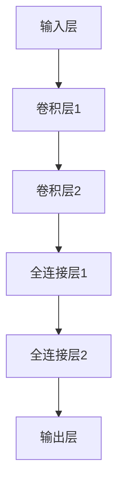

# 深度 Q-learning：在网格计算中的应用

## 1. 背景介绍

### 1.1 网格计算概述

网格计算是一种将分散的计算机资源虚拟化为一个统一的计算平台的技术。它通过将地理上分布的异构计算机、存储设备和网络资源整合在一起,为用户提供高性能的计算环境。网格计算的主要目标是充分利用分布式资源,提高资源利用率,降低计算成本。

### 1.2 网格计算中的资源调度问题

在网格计算环境中,合理调度计算任务对于提高系统性能至关重要。资源调度是指将计算任务分配到适当的计算节点上执行,以实现负载均衡、缩短任务完成时间等目标。传统的资源调度算法通常基于一些简化的假设和经验规则,难以适应网格计算环境的动态性和复杂性。

### 1.3 强化学习在资源调度中的应用

强化学习是一种基于试错的机器学习方法,通过与环境的交互来学习最优策略。由于其能够处理复杂的动态环境,强化学习在网格计算资源调度领域受到了广泛关注。其中,Q-learning是一种经典的强化学习算法,但是传统的Q-learning在处理大规模、高维度的问题时存在一些局限性。

### 1.4 深度 Q-learning 算法

深度 Q-learning (Deep Q-Network, DQN) 是一种结合了深度神经网络和 Q-learning 的强化学习算法。它使用神经网络来近似 Q 函数,从而克服了传统 Q-learning 在处理高维状态空间时的困难。深度 Q-learning 算法在许多领域都取得了卓越的成绩,如视频游戏、机器人控制等。

本文将探讨如何将深度 Q-learning 算法应用于网格计算资源调度问题,以提高资源利用率和任务执行效率。

## 2. 核心概念与联系

### 2.1 强化学习基本概念

强化学习是一种基于试错的机器学习方法,其目标是通过与环境的交互来学习一种最优策略。强化学习系统由以下几个基本元素组成:

- 环境 (Environment): 指代理与之交互的外部世界。
- 状态 (State): 环境的当前状况。
- 动作 (Action): 代理可以执行的操作。
- 奖励 (Reward): 代理执行动作后从环境获得的反馈。
- 策略 (Policy): 定义了在给定状态下代理应该采取何种动作的规则。

强化学习的目标是找到一种最优策略,使得在长期内获得的累积奖励最大化。

### 2.2 Q-learning 算法

Q-learning 是一种基于时序差分 (Temporal Difference, TD) 的无模型强化学习算法。它通过估计状态-动作值函数 Q(s, a) 来学习最优策略,其中 Q(s, a) 表示在状态 s 下执行动作 a 后可获得的期望累积奖励。

Q-learning 算法的核心是通过不断更新 Q 值来逼近真实的 Q 函数。更新规则如下:

$$Q(s_t, a_t) \leftarrow Q(s_t, a_t) + \alpha \left[ r_t + \gamma \max_{a} Q(s_{t+1}, a) - Q(s_t, a_t) \right]$$

其中:

- $\alpha$ 是学习率,控制新信息对 Q 值的影响程度。
- $\gamma$ 是折扣因子,用于权衡即时奖励和未来奖励的重要性。
- $r_t$ 是在时刻 t 获得的即时奖励。
- $\max_{a} Q(s_{t+1}, a)$ 是在下一状态 $s_{t+1}$ 下可获得的最大期望累积奖励。

通过不断更新 Q 值,算法最终会收敛到最优的 Q 函数,从而获得最优策略。

### 2.3 深度 Q-learning 算法

传统的 Q-learning 算法使用表格或者其他参数化函数来近似 Q 值,在处理高维状态空间时会遇到维数灾难的问题。深度 Q-learning (DQN) 算法则利用深度神经网络来近似 Q 函数,从而克服了这一局限性。

DQN 算法的核心思想是使用一个深度神经网络作为 Q 函数的近似器,其输入为当前状态,输出为每个可能动作的 Q 值。在训练过程中,通过minimizing下式来更新网络参数:

$$L = \mathbb{E}_{(s, a, r, s')\sim U(D)}\left[\left(r + \gamma \max_{a'} Q(s', a'; \theta^-) - Q(s, a; \theta)\right)^2\right]$$

其中:

- $\theta$ 和 $\theta^-$ 分别表示在线网络和目标网络的参数。
- $U(D)$ 是从经验回放池 D 中均匀采样的转换样本。
- $r$ 是即时奖励, $s'$ 是下一状态。

通过不断优化网络参数,DQN 算法可以逐步学习到近似最优的 Q 函数。

### 2.4 网格计算资源调度建模

将网格计算资源调度问题建模为强化学习问题,需要定义以下几个核心要素:

- 环境: 网格计算环境,包括计算节点、任务队列等。
- 状态: 描述当前环境状态的特征向量,如节点负载、任务队列长度等。
- 动作: 将任务分配到特定节点上执行。
- 奖励: 根据任务完成时间、资源利用率等指标设计奖励函数。

通过与环境交互并不断优化策略,强化学习算法可以学习到一种高效的资源调度策略。

## 3. 核心算法原理具体操作步骤

### 3.1 深度 Q-网络结构

深度 Q-网络 (DQN) 是一种使用深度神经网络来近似 Q 函数的强化学习算法。DQN 的网络结构通常包括以下几个关键组件:

1. **输入层**: 接收当前环境状态作为输入,通常是一个高维向量。
2. **卷积层**: 用于从高维输入中提取特征,常用于处理图像或网格状态等结构化数据。
3. **全连接层**: 将卷积层的输出映射到 Q 值输出。
4. **输出层**: 输出每个可能动作对应的 Q 值,维度等于动作空间的大小。

下图展示了一种典型的 DQN 网络结构:

在训练过程中,网络会不断调整参数,使得输出的 Q 值逼近真实的 Q 函数。

### 3.2 经验回放池

为了提高数据利用率并减少相关性,DQN 算法引入了经验回放池 (Experience Replay) 的概念。经验回放池是一个存储代理与环境交互过程中获得的转换样本 $(s_t, a_t, r_t, s_{t+1})$ 的数据结构,通常使用循环队列实现。

在训练过程中,DQN 算法会从经验回放池中随机采样一批样本,并基于这些样本更新网络参数。通过重复利用历史经验,可以避免相关性问题,提高数据利用效率。

### 3.3 目标网络

为了提高训练稳定性,DQN 算法引入了目标网络 (Target Network) 的概念。目标网络是在线网络的一个副本,用于计算 $\max_{a'} Q(s', a'; \theta^-)$ 项。

目标网络的参数 $\theta^-$ 会每隔一定步数从在线网络复制过来,而不是每次迭代都更新。这种延迟更新的机制可以减少目标值的波动,提高训练稳定性。

### 3.4 DQN 算法步骤

DQN 算法的具体步骤如下:

1. 初始化在线网络 $Q(s, a; \theta)$ 和目标网络 $Q(s, a; \theta^-)$ 的参数,并创建经验回放池 D。
2. 对于每个时间步 t:
    a. 从当前状态 $s_t$ 出发,根据 $\epsilon$-贪婪策略选择动作 $a_t$。
    b. 执行动作 $a_t$,观察到下一状态 $s_{t+1}$ 和即时奖励 $r_t$。
    c. 将转换样本 $(s_t, a_t, r_t, s_{t+1})$ 存储到经验回放池 D 中。
    d. 从经验回放池 D 中随机采样一批样本 $(s_j, a_j, r_j, s_{j+1})$。
    e. 计算目标值 $y_j = r_j + \gamma \max_{a'} Q(s_{j+1}, a'; \theta^-)$。
    f. 优化损失函数 $L = \frac{1}{N} \sum_{j} \left(y_j - Q(s_j, a_j; \theta)\right)^2$,更新在线网络参数 $\theta$。
    g. 每隔一定步数,将目标网络参数 $\theta^-$ 更新为当前在线网络参数 $\theta$。
3. 重复步骤 2,直到算法收敛或达到最大迭代次数。

通过不断优化网络参数,DQN 算法可以逐步学习到近似最优的 Q 函数,从而获得高效的资源调度策略。

## 4. 数学模型和公式详细讲解举例说明

### 4.1 强化学习数学模型

强化学习问题可以建模为一个马尔可夫决策过程 (Markov Decision Process, MDP),由一个五元组 $\langle S, A, P, R, \gamma \rangle$ 表示:

- $S$ 是状态空间集合,表示环境可能的状态。
- $A$ 是动作空间集合,表示代理可以执行的动作。
- $P(s' | s, a)$ 是状态转移概率,表示在状态 $s$ 下执行动作 $a$ 后,转移到状态 $s'$ 的概率。
- $R(s, a, s')$ 是奖励函数,表示在状态 $s$ 下执行动作 $a$ 并转移到状态 $s'$ 时获得的即时奖励。
- $\gamma \in [0, 1)$ 是折扣因子,用于权衡即时奖励和未来奖励的重要性。

强化学习的目标是找到一个最优策略 $\pi^*$,使得在该策略下的期望累积奖励最大化:

$$\pi^* = \arg\max_\pi \mathbb{E}_\pi \left[ \sum_{t=0}^\infty \gamma^t R(s_t, a_t, s_{t+1}) \right]$$

其中 $\mathbb{E}_\pi$ 表示在策略 $\pi$ 下的期望值。

### 4.2 Q-learning 算法公式推导

Q-learning 算法的核心是估计状态-动作值函数 $Q(s, a)$,其定义为:

$$Q(s, a) = \mathbb{E}_\pi \left[ \sum_{t=0}^\infty \gamma^t R(s_t, a_t, s_{t+1}) | s_0 = s, a_0 = a \right]$$

即在状态 $s$ 下执行动作 $a$ 后,可获得的期望累积奖励。

根据 Bellman 方程,可以将 $Q(s, a)$ 分解为即时奖励和下一状态的期望值:

$$Q(s, a) = R(s, a) + \gamma \sum_{s'} P(s' | s, a) \max_{a'} Q(s', a')$$

基于上式,Q-learning 算法通过不断更新 Q 值来逼近真实的 Q 函数:

$$Q(s_t, a_t) \leftarrow Q(s_t, a_t) + \alpha \left[ r_t + \gamma \max_{a} Q(s_{t+1}, a) - Q(s_t, a_t) \right]$$

其中 $\alpha$ 是学习率,控制新信息对 Q 值的影响程度。

通过不断更新 Q 值,算法最终会收敛到最优的 Q 函数,从而获得最优策略 $\pi^*(s) = \arg\max_a Q^*(s, a)$。

### 4.3 深度 Q-网络损失函数

深度 Q-网络 (DQN) 使用神经网络来近似 Q 函数,其损失函数定义如下:

$$L = \mathbb