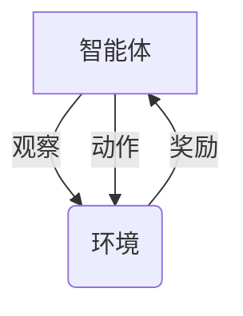
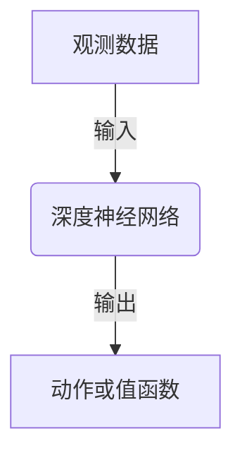

# 深度强化学习在机器人控制中的应用原理与代码实战案例讲解

## 1.背景介绍

### 1.1 机器人控制的重要性

在当今科技飞速发展的时代,机器人技术已经广泛应用于各个领域,从工业制造到家庭服务,机器人正在改变着我们的生活方式。然而,要实现高效智能的机器人控制,仍然面临着诸多挑战。传统的机器人控制方法通常依赖于预先编程的规则和模型,难以适应复杂动态环境的变化。因此,需要一种更加智能、灵活的控制方法来应对这些挑战。

### 1.2 强化学习在机器人控制中的作用

强化学习(Reinforcement Learning)作为机器学习的一个重要分支,为解决机器人控制问题提供了新的思路。它通过与环境的交互,让智能体(Agent)自主学习如何采取最优策略,以获得最大的累积奖励。与监督学习不同,强化学习不需要提供精确的输入输出样本对,而是通过试错和奖惩机制来学习。这种自主学习的特性使得强化学习在处理复杂动态环境时具有巨大的潜力。

### 1.3 深度强化学习的兴起

尽管传统的强化学习算法取得了一定成功,但在处理高维观测数据和连续动作空间时仍然存在局限性。深度神经网络的引入为强化学习注入了新的活力,催生了深度强化学习(Deep Reinforcement Learning)这一新兴领域。深度强化学习将深度学习的强大表示能力与强化学习的决策优化能力相结合,使得智能体能够直接从原始高维数据中学习策略,大大拓展了强化学习的应用范围。

### 1.4 深度强化学习在机器人控制中的应用

机器人控制是深度强化学习的一个重要应用场景。通过将机器人的传感器数据作为观测输入,将控制指令作为动作输出,深度强化学习算法可以自主学习出最优的控制策略,实现高效智能的机器人控制。与传统方法相比,深度强化学习不需要手工设计复杂的控制规则和模型,能够更好地适应复杂动态环境,并具有更强的泛化能力。

## 2.核心概念与联系

### 2.1 强化学习的核心概念

在深入探讨深度强化学习在机器人控制中的应用之前,我们先来回顾一下强化学习的核心概念:

- **智能体(Agent)**: 在环境中进行观察并采取行动的主体。
- **环境(Environment)**: 智能体所处的外部世界,智能体通过与环境交互来获取观测和反馈。
- **状态(State)**: 描述环境当前状况的信息集合。
- **动作(Action)**: 智能体在当前状态下可以采取的操作。
- **奖励(Reward)**: 环境对智能体当前行为的反馈,用于指导智能体朝着正确方向学习。
- **策略(Policy)**: 智能体在各种状态下选择动作的行为准则,是强化学习的最终目标。

强化学习的目标是找到一个最优策略,使得智能体在与环境交互过程中获得的累积奖励最大化。

### 2.2 深度强化学习的核心思想

深度强化学习的核心思想是将深度神经网络引入强化学习框架中,用于近似智能体的策略或值函数。传统的强化学习算法通常使用表格或函数拟合等方法来表示策略或值函数,但在面对高维观测数据和连续动作空间时,这些方法往往会遇到维数灾难或泛化能力差的问题。

深度神经网络则可以直接从原始高维数据中学习出策略或值函数的表示,克服了传统方法的局限性。同时,深度神经网络还具有强大的非线性拟合能力和端到端的训练方式,能够更好地捕捉观测数据和动作之间的复杂映射关系。

### 2.3 深度强化学习算法分类

深度强化学习算法可以分为基于值函数(Value-based)、基于策略(Policy-based)和基于Actor-Critic两大类:

1. **基于值函数(Value-based)算法**:
   - 例如:深度Q网络(Deep Q-Network,DQN)、双重深度Q网络(Double DQN)等。
   - 这类算法旨在学习状态值函数或状态-动作值函数,并根据值函数的最大化来选择动作。

2. **基于策略(Policy-based)算法**:  
   - 例如:策略梯度(Policy Gradient)算法、深度确定性策略梯度(Deep Deterministic Policy Gradient,DDPG)等。
   - 这类算法直接学习策略函数,通过梯度上升的方式优化策略参数,使得期望累积奖励最大化。

3. **基于Actor-Critic算法**:
   - 例如:优势Actor-Critic(Advantage Actor-Critic,A2C)、异步优势Actor-Critic(Asynchronous Advantage Actor-Critic,A3C)、深度确定性策略梯度(Deep Deterministic Policy Gradient,DDPG)等。
   - 这类算法同时学习值函数和策略函数,值函数用于评估策略的优劣,策略函数则根据值函数的评估来更新参数。

不同类型的算法各有优缺点,需要根据具体问题的特点来选择合适的算法。

## 3.核心算法原理具体操作步骤

在本节中,我们将重点介绍两种广泛应用于机器人控制的深度强化学习算法:深度Q网络(DQN)和深度确定性策略梯度(DDPG),并详细阐述它们的原理和具体操作步骤。

### 3.1 深度Q网络(DQN)

#### 3.1.1 Q学习回顾

Q学习是一种基于值函数的强化学习算法,它旨在学习状态-动作值函数Q(s,a),即在状态s下采取动作a后可获得的期望累积奖励。Q值函数满足下式:

$$Q(s,a) = \mathbb{E}[r_t + \gamma r_{t+1} + \gamma^2 r_{t+2} + \cdots | s_t=s, a_t=a, \pi]$$

其中,r是即时奖励,$\gamma$是折现因子,用于权衡当前奖励和未来奖励的重要性,$\pi$是策略函数。

Q值函数可以通过下面的迭代方式进行更新:

$$Q(s_t,a_t) \leftarrow Q(s_t,a_t) + \alpha[r_t + \gamma\max_{a'}Q(s_{t+1},a') - Q(s_t,a_t)]$$

其中,$\alpha$是学习率,用于控制更新的幅度。

#### 3.1.2 DQN算法原理

DQN算法的核心思想是使用深度神经网络来近似Q值函数,从而解决传统Q学习在处理高维观测数据时的困难。具体来说,DQN算法包含以下几个关键组件:

1. **深度Q网络**:使用深度神经网络参数化的Q值函数近似器,输入为当前状态s,输出为各个动作a对应的Q值Q(s,a)。
2. **经验回放池(Experience Replay Buffer)**: 用于存储智能体与环境交互过程中的转换样本(s,a,r,s')。通过从经验回放池中随机采样小批量样本进行训练,可以打破样本之间的相关性,提高数据利用效率。
3. **目标Q网络(Target Q-Network)**: 一个独立的Q网络,用于生成Q值目标,以提高训练稳定性。目标Q网络的参数是主Q网络参数的移动平均,定期进行软更新。

在训练过程中,DQN算法将当前状态s输入到主Q网络,获取各个动作a对应的Q值Q(s,a)。然后,根据$\epsilon$-贪婪策略选择动作a,执行该动作并观察到下一状态s'和即时奖励r。将转换样本(s,a,r,s')存入经验回放池。

接下来,从经验回放池中随机采样一个小批量的转换样本,计算目标Q值:

$$y_i = r_i + \gamma \max_{a'} Q'(s'_i,a';{\theta^-})$$

其中,$Q'$是目标Q网络,$\theta^-$是目标Q网络的参数。

使用均方误差损失函数,优化主Q网络的参数$\theta$:

$$L(\theta) = \mathbb{E}_{(s,a,r,s')\sim U(D)}[(y_i - Q(s_i,a_i;\theta))^2]$$

其中,D是经验回放池,U(D)表示从D中均匀采样。

通过不断地与环境交互并优化Q网络,DQN算法可以逐步学习到最优的Q值函数,并据此选择最优动作。

#### 3.1.3 DQN算法步骤

1. 初始化主Q网络和目标Q网络,两个网络的参数相同。
2. 初始化经验回放池D。
3. 对每一个episode:
    1. 初始化环境,获取初始状态s。
    2. 对每一个时间步长t:
        1. 根据$\epsilon$-贪婪策略从主Q网络输出的Q值Q(s,a)中选择动作a。
        2. 执行动作a,观察到下一状态s'和即时奖励r。
        3. 将转换样本(s,a,r,s')存入经验回放池D。
        4. 从经验回放池D中随机采样一个小批量的转换样本。
        5. 计算目标Q值y_i = r_i + $\gamma$ max_{a'} Q'(s'_i,a';$\theta^-$)。
        6. 优化主Q网络的参数$\theta$,使得均方误差损失函数L($\theta$) = $\mathbb{E}_{(s,a,r,s')\sim U(D)}[(y_i - Q(s_i,a_i;\theta))^2]$最小化。
        7. 每隔一定步长,使用主Q网络的参数$\theta$软更新目标Q网络的参数$\theta^-$。
        8. 更新状态s = s'。
    3. episode结束。
4. 返回最终的主Q网络。

### 3.2 深度确定性策略梯度(DDPG)

#### 3.2.1 策略梯度回顾

策略梯度是一种基于策略的强化学习算法,它直接学习策略函数$\pi_\theta(a|s)$,表示在状态s下选择动作a的概率,其中$\theta$是策略函数的参数。策略梯度算法的目标是最大化期望累积奖励:

$$J(\theta) = \mathbb{E}_{\tau\sim\pi_\theta}[R(\tau)]$$

其中,$\tau$是由策略$\pi_\theta$生成的状态-动作序列,R($\tau$)是该序列对应的累积奖励。

为了最大化J($\theta$),我们可以计算其关于$\theta$的梯度:

$$\nabla_\theta J(\theta) = \mathbb{E}_{\tau\sim\pi_\theta}[\sum_t\nabla_\theta\log\pi_\theta(a_t|s_t)Q^{\pi_\theta}(s_t,a_t)]$$

其中,Q^{$\pi_\theta$}(s_t,a_t)是在状态s_t下采取动作a_t后可获得的期望累积奖励。通过梯度上升的方式更新策略参数$\theta$,就可以使期望累积奖励J($\theta$)最大化。

#### 3.2.2 DDPG算法原理

DDPG算法是一种基于Actor-Critic架构的深度强化学习算法,用于解决连续动作空间的控制问题。它包含以下几个关键组件:

1. **Actor网络**:使用深度神经网络参数化的确定性策略函数$\mu_\theta(s)$,输入为当前状态s,输出为对应的动作a。
2. **Critic网络**:使用深度神经网络参数化的Q值函数Q_$\phi$(s,a),输入为当前状态s和动作a,输出为对应的Q值。
3. **目标Actor网络和目标Critic网络**:与DQN算法类似,DDPG也引入了目标网络,用于提高训练稳定性。

在训练过程中,Actor网络根据当前状态s输出动作a = $\