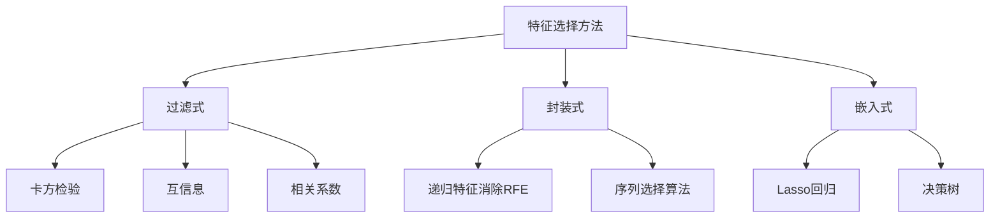

# 特征选择原理与代码实例讲解

## 1. 背景介绍

在现代数据科学和机器学习领域中,特征选择是一个至关重要的过程。随着数据量的不断增加和特征维度的持续扩大,有效地选择相关特征对于构建高性能的机器学习模型至关重要。特征选择不仅可以提高模型的准确性,还能减少计算复杂度,加快模型训练速度,并提高模型的可解释性。

### 1.1 特征选择的必要性

- **降维**:高维数据不仅增加了计算复杂度,还容易导致"维数灾难"问题,即随着特征数量的增加,所需要的训练样本数量呈指数级增长。
- **去噪**:数据集中通常包含一些无关或冗余的特征,这些特征会对模型的性能产生负面影响,需要将它们剔除。
- **可解释性**:通过特征选择,可以识别出对模型预测结果影响最大的特征,从而提高模型的可解释性。

### 1.2 特征选择的挑战

- **特征冗余**:某些特征之间可能存在高度相关性,导致模型过度拟合。
- **特征相关性**:单独考虑时,某些特征可能看起来无关,但与其他特征组合时却具有很强的预测能力。
- **维数灾难**:随着特征数量的增加,搜索最优特征子集的计算复杂度呈指数级增长。

## 2. 核心概念与联系

### 2.1 特征选择与特征提取

特征选择和特征提取是两个不同但相关的概念:

- **特征选择**:从原始特征集合中选择一个最优特征子集。
- **特征提取**:从原始特征集合中构造一组新的特征,这些新特征能更好地表示数据的内在结构。

特征选择和特征提取都旨在降低数据维度,但特征选择保留了原始特征的语义,而特征提取则创建了新的特征表示。

### 2.2 特征选择方法分类

特征选择方法可以分为三大类:

1. **过滤式(Filter)**:根据特征与目标变量的相关性评分,选择相关性最高的特征。常用方法包括卡方检验、互信息和相关系数等。
2. **封装式(Wrapper)**:将特征选择过程包装在机器学习模型的训练过程中,根据模型的预测性能来评估特征子集。常用方法包括递归特征消除(RFE)和序列选择算法等。
3. **嵌入式(Embedded)**:在机器学习模型的训练过程中自动进行特征选择。常用方法包括Lasso回归、决策树等。

## 3. 核心算法原理具体操作步骤

### 3.1 过滤式方法

过滤式方法通过计算特征与目标变量之间的相关性评分,选择评分最高的特征。常用的过滤式方法包括:

1. **卡方检验(Chi-Square Test)**:用于检验特征与目标变量之间的独立性。对于离散型特征和目标变量,计算卡方统计量作为评分。
2. **互信息(Mutual Information)**:衡量特征与目标变量之间的相关性,可用于连续型和离散型特征。
3. **相关系数(Correlation Coefficient)**:用于测量连续型特征与目标变量之间的线性相关程度。常用的相关系数包括皮尔逊相关系数、斯皮尔曼相关系数等。

过滤式方法的优点是计算简单、高效,缺点是只考虑单个特征与目标变量的相关性,忽略了特征之间的相互关系。

### 3.2 封装式方法

封装式方法将特征选择过程包装在机器学习模型的训练过程中,通过评估模型的预测性能来选择最优特征子集。常用的封装式方法包括:

1. **递归特征消除(Recursive Feature Elimination, RFE)**:基于模型的权重或重要性评分,反复删除最不重要的特征,直到达到期望的特征数量。
2. **序列选择算法(Sequential Selection Algorithms)**:包括序列向前选择(SFS)和序列向后选择(SBS)。SFS从空集开始,每次添加一个提高模型性能最多的特征;SBS从完整特征集开始,每次删除一个降低模型性能最少的特征。

封装式方法的优点是能够考虑特征之间的相互关系,缺点是计算复杂度较高,需要反复训练模型。

### 3.3 嵌入式方法

嵌入式方法在机器学习模型的训练过程中自动进行特征选择,常用的嵌入式方法包括:

1. **Lasso回归(Least Absolute Shrinkage and Selection Operator)**:通过L1正则化,自动将一些特征的系数缩减为0,从而实现特征选择。
2. **决策树(Decision Tree)**:在构建决策树时,会自动选择最优分裂特征,特征的重要性可以通过计算每个特征的基尼指数或信息增益来确定。

嵌入式方法的优点是计算效率较高,能够自动处理特征之间的相关性。缺点是特征选择的结果依赖于所选择的机器学习模型。

## 4. 数学模型和公式详细讲解举例说明

### 4.1 卡方检验

卡方检验是一种用于检验特征与目标变量之间独立性的统计方法。对于离散型特征和目标变量,卡方统计量可以计算如下:

$$\chi^2 = \sum_{i=1}^{r}\sum_{j=1}^{c}\frac{(O_{ij}-E_{ij})^2}{E_{ij}}$$

其中:
- $r$是特征的类别数量
- $c$是目标变量的类别数量
- $O_{ij}$是观测频数,即特征的第$i$个类别和目标变量的第$j$个类别同时出现的次数
- $E_{ij}$是期望频数,即在特征和目标变量相互独立的假设下,期望出现的频数

卡方统计量的值越大,说明特征与目标变量之间的相关性越强。通常,我们可以设置一个阈值,将卡方统计量大于该阈值的特征选为重要特征。

**示例**:假设我们有一个包含"年龄"和"是否患糖尿病"两个特征的数据集,其中"年龄"特征有三个类别:青年(0-30岁)、中年(31-60岁)和老年(61岁及以上)。我们想检验"年龄"特征与"是否患糖尿病"之间是否存在相关性。

观测频数矩阵如下:

|        | 患糖尿病 | 未患糖尿病 |
|--------|----------|------------|
| 青年   | 10       | 200        |
| 中年   | 50       | 300        |
| 老年   | 80       | 160        |

根据边际频数,我们可以计算期望频数矩阵:

|        | 患糖尿病 | 未患糖尿病 |
|--------|----------|------------|
| 青年   | 35       | 175        |
| 中年   | 70       | 350        |
| 老年   | 35       | 175        |

接下来,我们可以计算卡方统计量:

$$\chi^2 = \frac{(10-35)^2}{35} + \frac{(200-175)^2}{175} + \frac{(50-70)^2}{70} + \frac{(300-350)^2}{350} + \frac{(80-35)^2}{35} + \frac{(160-175)^2}{175} \approx 96.43$$

在自由度为2的情况下,当显著性水平为0.05时,卡方临界值为5.99。由于计算得到的卡方统计量96.43大于临界值,因此我们可以拒绝"年龄"与"是否患糖尿病"相互独立的原假设,即这两个特征存在相关性。

### 4.2 互信息

互信息是一种衡量两个随机变量之间相关性的度量,可用于连续型和离散型特征。对于离散型特征$X$和目标变量$Y$,互信息可以计算如下:

$$I(X;Y) = \sum_{x\in X}\sum_{y\in Y}p(x,y)\log\frac{p(x,y)}{p(x)p(y)}$$

其中:
- $p(x,y)$是$X$和$Y$的联合概率分布
- $p(x)$和$p(y)$分别是$X$和$Y$的边际概率分布

互信息的值越大,说明特征$X$与目标变量$Y$之间的相关性越强。通常,我们可以设置一个阈值,将互信息大于该阈值的特征选为重要特征。

**示例**:假设我们有一个包含"天气"和"打球"两个特征的数据集,其中"天气"特征有三个类别:晴天、阴天和雨天;"打球"特征有两个类别:打球和不打球。我们想计算"天气"特征与"打球"之间的互信息。

给定的数据如下:

| 天气 | 打球 | 不打球 |
|------|------|--------|
| 晴天 | 0.4  | 0.1    |
| 阴天 | 0.2  | 0.1    |
| 雨天 | 0.05 | 0.15   |

首先,我们计算边际概率分布:

- $p(晴天) = 0.4 + 0.1 = 0.5$
- $p(阴天) = 0.2 + 0.1 = 0.3$
- $p(雨天) = 0.05 + 0.15 = 0.2$
- $p(打球) = 0.4 + 0.2 + 0.05 = 0.65$
- $p(不打球) = 0.1 + 0.1 + 0.15 = 0.35$

接下来,我们计算互信息:

$$\begin{aligned}
I(天气;打球) &= 0.4\log\frac{0.4}{0.5\times0.65} + 0.1\log\frac{0.1}{0.5\times0.35} + 0.2\log\frac{0.2}{0.3\times0.65} + 0.1\log\frac{0.1}{0.3\times0.35} \\
&\quad + 0.05\log\frac{0.05}{0.2\times0.65} + 0.15\log\frac{0.15}{0.2\times0.35} \\
&\approx 0.1335
\end{aligned}$$

由于互信息的值较大,说明"天气"特征与"打球"之间存在较强的相关性,因此我们可以将"天气"特征选为重要特征。

### 4.3 相关系数

相关系数是一种衡量两个连续型随机变量之间线性相关程度的度量。常用的相关系数包括皮尔逊相关系数和斯皮尔曼相关系数。

**皮尔逊相关系数**:用于测量两个连续型随机变量之间的线性相关程度,计算公式如下:

$$r = \frac{\sum_{i=1}^{n}(x_i-\bar{x})(y_i-\bar{y})}{\sqrt{\sum_{i=1}^{n}(x_i-\bar{x})^2}\sqrt{\sum_{i=1}^{n}(y_i-\bar{y})^2}}$$

其中:
- $n$是样本数量
- $x_i$和$y_i$分别是第$i$个样本的特征值和目标值
- $\bar{x}$和$\bar{y}$分别是特征值和目标值的均值

皮尔逊相关系数的取值范围是$[-1,1]$,绝对值越大,说明两个变量之间的线性相关程度越强。通常,我们可以设置一个阈值,将相关系数的绝对值大于该阈值的特征选为重要特征。

**斯皮尔曼相关系数**:用于测量两个连续型或顺序型随机变量之间的单调相关程度,计算公式如下:

$$\rho = 1 - \frac{6\sum_{i=1}^{n}d_i^2}{n(n^2-1)}$$

其中:
- $n$是样本数量
- $d_i$是第$i$个样本的特征值和目标值的秩之差

斯皮尔