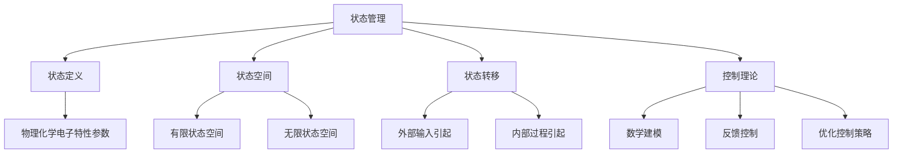
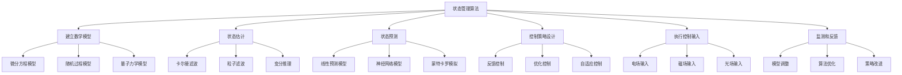

# 状态管理与纳米技术：管理纳米尺度设备状态

## 1.背景介绍

### 1.1 纳米技术的兴起

纳米技术是一种跨学科的新兴技术领域,旨在操纵和控制原子和分子尺度的物质。随着科技的不断进步,人类已经能够制造出尺寸小于100纳米的纳米器件和系统。这些纳米尺度的设备具有独特的物理、化学和生物学特性,为各个领域带来了前所未有的机遇和挑战。

### 1.2 纳米尺度设备的复杂性

与传统的大型设备相比,纳米尺度设备由于其微小的尺寸和特殊的物理特性,具有更高的复杂性和不确定性。它们的行为可能会受到量子效应、热噪声和环境干扰等多种因素的影响。因此,有效地管理和控制这些设备的状态变得至关重要。

### 1.3 状态管理的重要性

状态管理是确保纳米尺度设备正常运行和实现预期功能的关键。它涉及监控、分析和调整设备的内部状态,以维持其在所需条件下的稳定性和可靠性。有效的状态管理策略可以提高设备的性能、延长使用寿命,并减少故障和错误的发生。

## 2.核心概念与联系  

### 2.1 状态的定义

在纳米技术领域,状态是指描述纳米尺度设备在特定时间点上的物理、化学或电子特性的一组参数。这些参数可能包括温度、压力、电荷分布、结构形态等。准确地测量和表征这些状态参数对于理解和控制设备的行为至关重要。

### 2.2 状态空间

状态空间是指所有可能的状态参数组合的集合。对于一个给定的纳米尺度设备,其状态空间可能是有限的,也可能是无限的,这取决于设备的复杂性和所涉及的物理过程。状态空间的大小和维度决定了状态管理的难易程度。

### 2.3 状态转移

状态转移是指纳米尺度设备从一个状态转变到另一个状态的过程。这种转移可能是由外部输入或内部过程引起的。理解和控制状态转移对于维持设备的稳定性和可靠性至关重要。

### 2.4 状态管理与控制理论

状态管理与控制理论密切相关。控制理论提供了一种系统的方法来分析和控制动态系统的行为,包括纳米尺度设备。通过建立数学模型、设计反馈控制器和优化控制策略,可以实现对纳米尺度设备状态的有效管理。



## 3.核心算法原理具体操作步骤

管理纳米尺度设备状态的核心算法原理可以概括为以下几个步骤:

### 3.1 建立数学模型

第一步是建立描述纳米尺度设备行为的数学模型。这个模型应该能够准确捕捉设备的物理、化学和电子特性,以及它们之间的相互作用。常用的建模方法包括微分方程、随机过程和量子力学模型等。

### 3.2 状态估计

由于纳米尺度设备的状态通常无法直接观测,因此需要基于有限的测量数据来估计其内部状态。常用的状态估计算法包括卡尔曼滤波、粒子滤波和变分推理等。这些算法可以融合来自多个传感器的测量数据,并提供状态的最优估计值及其不确定性。

### 3.3 状态预测

基于当前的状态估计和系统模型,可以预测纳米尺度设备在未来某个时间点的状态。这对于提前检测潜在的故障或异常情况非常有帮助。常用的预测算法包括线性预测模型、神经网络模型和蒙特卡罗模拟等。

### 3.4 控制策略设计

根据所需的性能指标和约束条件,设计合适的控制策略来调整纳米尺度设备的状态。常用的控制策略包括反馈控制、优化控制和自适应控制等。这些策略可以基于状态估计和预测,生成控制输入以维持设备在所需的状态范围内。

### 3.5 执行控制输入

将设计好的控制输入应用到纳米尺度设备上,以实现对其状态的调整和管理。控制输入可以是电场、磁场、光场或其他形式的能量输入,具体取决于设备的特性和控制目标。

### 3.6 监测和反馈

持续监测纳米尺度设备的状态,评估控制策略的有效性。根据监测结果,对数学模型、状态估计算法和控制策略进行必要的调整和优化,形成闭环控制系统。



## 4.数学模型和公式详细讲解举例说明

在状态管理的过程中,数学模型扮演着至关重要的角色。它们为纳米尺度设备的行为提供了理论描述,并为状态估计、预测和控制算法奠定了基础。以下是一些常用的数学模型及其公式:

### 4.1 微分方程模型

微分方程模型通常用于描述纳米尺度设备的动力学行为。例如,一个简单的质量-弹簧-阻尼系统可以用下面的二阶微分方程来表示:

$$m\ddot{x}(t) + c\dot{x}(t) + kx(t) = F(t)$$

其中 $x(t)$ 表示质量的位移, $m$ 是质量, $c$ 是阻尼系数, $k$ 是弹簧刚度, $F(t)$ 是外部作用力。

对于更复杂的系统,可以使用偏微分方程来描述。例如,描述纳米尺度传感器中电荷分布的泊松方程:

$$\nabla^2\phi(x,y,z) = -\frac{\rho(x,y,z)}{\epsilon_0}$$

其中 $\phi$ 是电位, $\rho$ 是电荷密度, $\epsilon_0$ 是真空介电常数。

### 4.2 随机过程模型

由于纳米尺度设备受到热噪声和量子效应的影响,它们的行为往往具有随机性。因此,随机过程模型非常适合描述这种情况。例如,布朗运动可以用下面的随机微分方程来表示:

$$dX(t) = \mu dt + \sigma dW(t)$$

其中 $X(t)$ 是粒子的位置, $\mu$ 是漂移速率, $\sigma$ 是扩散系数, $W(t)$ 是维纳过程(布朗运动)。

### 4.3 量子力学模型

对于一些基于量子效应的纳米尺度设备,量子力学模型是必不可少的。例如,描述一个自旋 $1/2$ 粒子的状态可以使用下面的矢量:

$$|\psi\rangle = \alpha|+\frac{1}{2}\rangle + \beta|-\frac{1}{2}\rangle$$

其中 $\alpha$ 和 $\beta$ 是复数系数,满足 $|\alpha|^2 + |\beta|^2 = 1$,表示粒子处于 $+1/2$ 和 $-1/2$ 自旋态的概率。

粒子的动力学演化则由薛定谔方程描述:

$$i\hbar\frac{\partial}{\partial t}|\psi(t)\rangle = H|\psi(t)\rangle$$

其中 $\hbar$ 是约化普朗克常数, $H$ 是哈密顿量(能量算符)。

通过建立合适的数学模型,我们可以更好地理解和预测纳米尺度设备的行为,为状态估计和控制算法提供理论基础。

## 5.项目实践:代码实例和详细解释说明

为了更好地理解状态管理的实际应用,我们将通过一个具体的项目实践来演示相关的代码实现。在这个例子中,我们将模拟一个纳米尺度的质量-弹簧-阻尼系统,并设计一个基于卡尔曼滤波的状态估计和反馈控制算法来管理其状态。

### 5.1 系统模型

我们首先定义质量-弹簧-阻尼系统的参数和初始条件:

```python
import numpy as np

# 系统参数
m = 1e-18  # 质量 (kg)
k = 1.0    # 弹簧刚度 (N/m)
c = 0.1    # 阻尼系数 (N.s/m)

# 初始条件
x0 = 1e-9  # 初始位移 (m)
v0 = 0.0   # 初始速度 (m/s)

# 时间步长
dt = 1e-12 # 时间步长 (s)
```

然后,我们定义一个函数来模拟系统的动力学行为:

```python
def system_dynamics(x, v, t, F):
    """
    质量-弹簧-阻尼系统的动力学方程
    
    参数:
    x: 当前位移
    v: 当前速度
    t: 当前时间
    F: 外部作用力
    
    返回:
    x_dot: 位移导数
    v_dot: 速度导数
    """
    x_dot = v
    v_dot = (-k * x - c * v + F) / m
    return x_dot, v_dot
```

### 5.2 状态估计

为了估计系统的状态,我们将使用卡尔曼滤波算法。首先,我们定义一个函数来实现卡尔曼滤波:

```python
def kalman_filter(x, P, z, Q, R):
    """
    卡尔曼滤波算法
    
    参数:
    x: 先验状态估计
    P: 先验估计协方差
    z: 测量值
    Q: 过程噪声协方差
    R: 测量噪声协方差
    
    返回:
    x: 后验状态估计
    P: 后验估计协方差
    """
    # 预测步骤
    x_pred = x
    P_pred = P + Q
    
    # 更新步骤
    K = P_pred * (1 / (P_pred + R))
    x = x_pred + K * (z - x_pred)
    P = (1 - K) * P_pred
    
    return x, P
```

接下来,我们将模拟系统的运行,并使用卡尔曼滤波算法估计其状态:

```python
# 初始化状态和协方差
x_est = np.array([x0, v0])  # 初始状态估计
P_est = np.eye(2) * 1e-16   # 初始协方差矩阵

# 噪声协方差
Q = np.eye(2) * 1e-20  # 过程噪声协方差
R = 1e-16             # 测量噪声方差

# 模拟和估计
x_true = [x0]
v_true = [v0]
x_est_list = [x_est[0]]
v_est_list = [x_est[1]]

for t in np.arange(0, 1e-9, dt):
    # 模拟真实系统
    x_dot, v_dot = system_dynamics(x_true[-1], v_true[-1], t, 0)