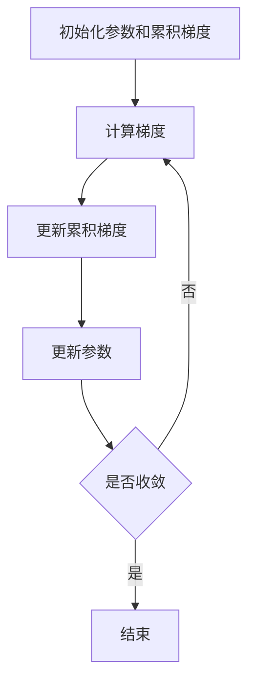

# 理解AdaGrad：核心概念与联系

## 1.背景介绍

在机器学习和深度学习领域，优化算法是模型训练的核心。优化算法的选择直接影响模型的收敛速度和最终性能。AdaGrad（Adaptive Gradient Algorithm）作为一种自适应学习率优化算法，自提出以来在各种应用中表现出色。本文将深入探讨AdaGrad的核心概念、算法原理、数学模型、实际应用及其未来发展趋势。

## 2.核心概念与联系

### 2.1 自适应学习率

传统的梯度下降算法使用固定的学习率，这在处理稀疏数据或高维数据时可能会遇到困难。AdaGrad通过自适应调整每个参数的学习率，使得在训练过程中能够更有效地处理不同特征的梯度变化。

### 2.2 梯度累积

AdaGrad的核心思想是对每个参数的梯度进行累积，并根据累积的梯度调整学习率。具体来说，梯度较大的参数会有较小的学习率，而梯度较小的参数会有较大的学习率。这种机制使得AdaGrad在处理稀疏数据时表现尤为出色。

### 2.3 与其他优化算法的联系

AdaGrad是自适应学习率优化算法的先驱，后续的优化算法如RMSProp和Adam在AdaGrad的基础上进行了改进。理解AdaGrad有助于更好地理解这些后续算法的设计思想和改进点。

## 3.核心算法原理具体操作步骤

### 3.1 初始化

在算法开始时，初始化所有参数的累积梯度为零。设定初始学习率 $\eta$ 和一个小常数 $\epsilon$，以防止除零错误。

### 3.2 计算梯度

在每次迭代中，计算损失函数 $L(\theta)$ 对参数 $\theta$ 的梯度 $\nabla_{\theta} L(\theta)$。

### 3.3 更新累积梯度

将当前梯度的平方累加到累积梯度中：
$$
G_{t} = G_{t-1} + \nabla_{\theta} L(\theta)^2
$$

### 3.4 更新参数

根据累积梯度调整参数：
$$
\theta_{t+1} = \theta_{t} - \frac{\eta}{\sqrt{G_{t}} + \epsilon} \nabla_{\theta} L(\theta)
$$

### 3.5 重复迭代

重复步骤3.2到3.4，直到达到预定的迭代次数或损失函数收敛。

以下是AdaGrad算法的Mermaid流程图：



## 4.数学模型和公式详细讲解举例说明

### 4.1 数学模型

AdaGrad的数学模型基于梯度下降算法，通过对每个参数的梯度进行累积，并根据累积的梯度调整学习率。具体公式如下：

$$
G_{t} = G_{t-1} + \nabla_{\theta} L(\theta)^2
$$

$$
\theta_{t+1} = \theta_{t} - \frac{\eta}{\sqrt{G_{t}} + \epsilon} \nabla_{\theta} L(\theta)
$$

### 4.2 举例说明

假设我们有一个简单的线性回归问题，目标是最小化以下损失函数：

$$
L(\theta) = \frac{1}{2m} \sum_{i=1}^{m} (y_i - \theta x_i)^2
$$

在每次迭代中，我们计算梯度：

$$
\nabla_{\theta} L(\theta) = -\frac{1}{m} \sum_{i=1}^{m} (y_i - \theta x_i) x_i
$$

然后更新累积梯度和参数：

$$
G_{t} = G_{t-1} + \left( -\frac{1}{m} \sum_{i=1}^{m} (y_i - \theta x_i) x_i \right)^2
$$

$$
\theta_{t+1} = \theta_{t} - \frac{\eta}{\sqrt{G_{t}} + \epsilon} \left( -\frac{1}{m} \sum_{i=1}^{m} (y_i - \theta x_i) x_i \right)
$$

## 5.项目实践：代码实例和详细解释说明

### 5.1 代码实例

以下是使用Python实现AdaGrad的代码示例：

```python
import numpy as np

def adagrad(X, y, theta, eta=0.01, epsilon=1e-8, iterations=1000):
    m = len(y)
    G = np.zeros(theta.shape)
    
    for t in range(iterations):
        gradient = - (1/m) * X.T @ (y - X @ theta)
        G += gradient ** 2
        adjusted_gradient = gradient / (np.sqrt(G) + epsilon)
        theta -= eta * adjusted_gradient
        
        if t % 100 == 0:
            loss = (1/(2*m)) * np.sum((y - X @ theta) ** 2)
            print(f"Iteration {t}: Loss = {loss}")
    
    return theta

# 示例数据
X = np.array([[1, 2], [1, 3], [1, 4], [1, 5]])
y = np.array([7, 6, 5, 4])
theta = np.array([0.1, 0.1])

# 运行AdaGrad
theta = adagrad(X, y, theta)
print(f"Optimized parameters: {theta}")
```

### 5.2 详细解释

1. **初始化**：初始化参数 $\theta$ 和累积梯度 $G$。
2. **计算梯度**：在每次迭代中，计算损失函数对参数的梯度。
3. **更新累积梯度**：将当前梯度的平方累加到累积梯度中。
4. **调整参数**：根据累积梯度调整参数。
5. **输出结果**：每100次迭代输出一次损失值，最终输出优化后的参数。

## 6.实际应用场景

### 6.1 自然语言处理

在自然语言处理（NLP）任务中，特征通常是高维且稀疏的。AdaGrad通过自适应调整学习率，使得在处理稀疏数据时表现出色。例如，在词向量训练中，AdaGrad可以有效地处理不同词频的梯度变化。

### 6.2 图像处理

在图像处理任务中，特征的梯度变化较大。AdaGrad通过累积梯度的方式，使得在训练过程中能够更好地适应不同特征的梯度变化，从而提高模型的收敛速度和性能。

### 6.3 推荐系统

在推荐系统中，用户和物品的特征通常是稀疏的。AdaGrad通过自适应调整学习率，使得在处理稀疏数据时能够更有效地优化模型参数，从而提高推荐系统的性能。

## 7.工具和资源推荐

### 7.1 工具

1. **TensorFlow**：一个开源的机器学习框架，支持多种优化算法，包括AdaGrad。
2. **PyTorch**：另一个流行的开源深度学习框架，提供了对AdaGrad的支持。
3. **Scikit-learn**：一个简单易用的机器学习库，适合初学者使用，支持多种优化算法。

### 7.2 资源

1. **《深度学习》**：由Ian Goodfellow等人编写的经典教材，详细介绍了各种优化算法，包括AdaGrad。
2. **Coursera上的机器学习课程**：由Andrew Ng教授讲授的机器学习课程，涵盖了优化算法的基本概念和应用。
3. **arXiv论文**：可以在arXiv上查找关于AdaGrad及其改进算法的最新研究论文。

## 8.总结：未来发展趋势与挑战

### 8.1 未来发展趋势

随着深度学习和机器学习的不断发展，优化算法也在不断演进。AdaGrad作为自适应学习率优化算法的先驱，其思想在后续的优化算法中得到了广泛应用。未来，优化算法将更加智能化和自适应，以更好地适应不同任务和数据的需求。

### 8.2 挑战

尽管AdaGrad在处理稀疏数据时表现出色，但在处理非稀疏数据时可能会遇到学习率过小的问题。为了解决这一问题，后续的优化算法如RMSProp和Adam在AdaGrad的基础上进行了改进。未来的研究将继续探索如何在不同任务和数据场景下设计更高效的优化算法。

## 9.附录：常见问题与解答

### 9.1 AdaGrad适用于哪些场景？

AdaGrad适用于处理稀疏数据和高维数据的场景，如自然语言处理、图像处理和推荐系统。

### 9.2 AdaGrad的主要优点是什么？

AdaGrad的主要优点是自适应调整学习率，使得在处理不同特征的梯度变化时能够更有效地优化模型参数。

### 9.3 AdaGrad的主要缺点是什么？

AdaGrad的主要缺点是在处理非稀疏数据时，累积梯度可能会导致学习率过小，从而影响模型的收敛速度。

### 9.4 如何解决AdaGrad的缺点？

为了解决AdaGrad的缺点，可以使用RMSProp或Adam等改进算法，这些算法在AdaGrad的基础上进行了优化，能够更好地适应不同任务和数据的需求。

---

作者：禅与计算机程序设计艺术 / Zen and the Art of Computer Programming