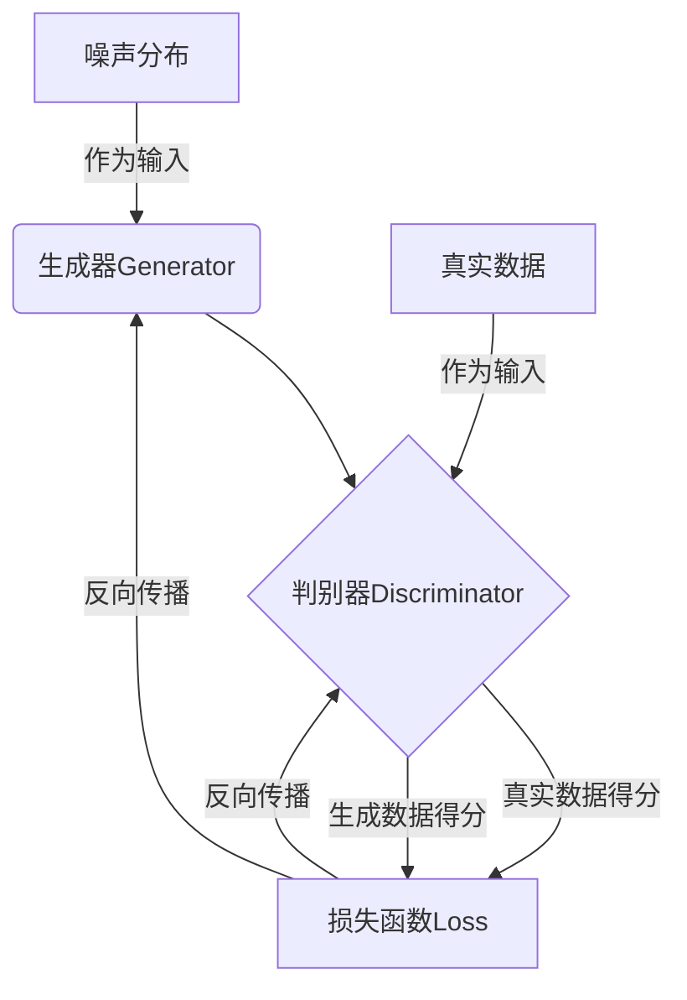

# 生成对抗网络GAN原理与代码实例讲解

## 1.背景介绍

### 1.1 人工智能的新里程碑

人工智能领域一直在不断发展和进化,近年来出现了一种全新的机器学习模型——生成对抗网络(Generative Adversarial Networks, GAN)。GAN的出现被认为是人工智能领域的一个重大突破,开启了全新的研究和应用前景。

### 1.2 GAN的重要意义

GAN能够从噪声分布中生成逼真的图像、语音、视频等数据,在图像生成、语音合成、数据增广等领域展现出巨大的潜力。GAN的核心思想是通过对抗训练的方式,使生成器(Generator)学会生成逼真的数据分布,使判别器(Discriminator)无法区分生成的数据和真实数据。

### 1.3 GAN的应用前景

GAN在计算机视觉、自然语言处理、信号处理等多个领域都有广泛的应用前景,例如图像生成、图像翻译、语音合成、数据增广等。随着GAN理论和算法的不断完善,它将为人工智能领域带来更多创新和突破。

## 2.核心概念与联系

### 2.1 生成模型与判别模型

在传统的机器学习中,常见的任务是判别模型(Discriminative Model),即根据输入数据预测输出标签。而生成模型(Generative Model)则是学习数据的概率分布,从而能够生成新的数据样本。

GAN正是一种生成模型,它由两个神经网络组成:生成器(Generator)和判别器(Discriminator)。生成器的目标是从噪声分布中生成逼真的数据样本,而判别器则需要判断输入的数据是真实的还是由生成器生成的。

### 2.2 对抗训练过程

GAN的核心思想是生成器和判别器通过对抗训练的方式相互竞争,促进双方的性能不断提高。具体来说,生成器的目标是尽可能欺骗判别器,使其无法区分生成的数据和真实数据;而判别器则需要努力区分真实数据和生成数据。

这种对抗训练过程可以用一个二人零和博弈(Two-player Zero-sum Game)来描述。生成器和判别器相互对抗,最终达到一个纳什均衡(Nash Equilibrium),使得生成器能够生成逼真的数据分布,而判别器也能够很好地区分真实数据和生成数据。



## 3.核心算法原理具体操作步骤

GAN的训练过程可以分为以下几个主要步骤:

### 3.1 初始化生成器和判别器

首先,我们需要初始化生成器和判别器的神经网络结构和参数。生成器通常由全连接层或卷积层组成,输入是一个噪声向量,输出是一个数据样本(如图像)。判别器也是一个神经网络,输入是一个数据样本,输出是一个标量,表示该数据样本是真实的还是生成的。

### 3.2 生成器生成样本

在每一次迭代中,生成器从噪声分布(如高斯分布或均匀分布)中采样一个噪声向量,并将其输入到生成器网络中,生成一个数据样本(如图像)。

### 3.3 判别器评估样本

将生成器生成的样本和真实数据样本输入到判别器网络中,判别器会输出每个样本为真实数据的概率得分。

### 3.4 计算损失函数

根据判别器的输出结果,我们可以计算生成器和判别器的损失函数。生成器的目标是最小化判别器将生成样本判别为假的概率,而判别器的目标是最大化正确判别真实样本和生成样本的概率。

常用的GAN损失函数有:

1) 最小二乘损失(Least Squares Loss)
2) 交叉熵损失(Cross Entropy Loss)
3) Wasserstein损失(Wasserstein Loss)
4) Hinge损失(Hinge Loss)

### 3.5 反向传播和优化

根据计算得到的损失函数值,使用反向传播算法计算生成器和判别器网络参数的梯度,并使用优化算法(如Adam或RMSProp)更新网络参数,使损失函数值最小化。

### 3.6 重复训练

重复上述步骤,直到生成器和判别器达到收敛状态,即生成器能够生成逼真的数据样本,而判别器也能够很好地区分真实数据和生成数据。

## 4.数学模型和公式详细讲解举例说明

### 4.1 GAN的形式化定义

让我们用数学符号来形式化定义GAN的目标函数。假设数据样本$x$服从真实数据分布$p_{data}(x)$,生成器$G$将噪声向量$z$映射为生成数据$G(z)$,判别器$D$则输出一个标量,表示输入数据为真实数据的概率$D(x)$。

GAN的目标是找到一个生成器$G$,使得生成数据分布$p_g(x)$最大程度地逼近真实数据分布$p_{data}(x)$。同时,判别器$D$需要最大化正确区分真实数据和生成数据的能力。这可以形式化为一个二人零和博弈问题:

$$\min_G \max_D V(D,G) = \mathbb{E}_{x\sim p_{data}(x)}[\log D(x)] + \mathbb{E}_{z\sim p_z(z)}[\log(1-D(G(z)))]$$

其中,$p_z(z)$是噪声向量$z$的先验分布,通常采用高斯分布或均匀分布。

在理想情况下,生成器$G$会学习到真实数据分布$p_{data}(x)$,而判别器$D$将对所有真实数据和生成数据都输出0.5的概率。

### 4.2 GAN训练的收敛性

然而,在实践中,GAN的训练过程并不总是能够收敛到理想状态。这主要是由于以下几个原因:

1. **优化困难**: GAN的目标函数是一个非凸优化问题,存在许多局部最优解,很容易陷入梯度消失或梯度爆炸的问题。

2. **模式坍缩**: 生成器可能会倾向于只生成少数几种模式的数据样本,而忽略了真实数据分布的多样性。

3. **内在不稳定性**: GAN的训练过程存在内在的不稳定性,生成器和判别器的性能波动较大,很难达到平衡。

为了解决这些问题,研究人员提出了多种改进的GAN变体算法,如WGAN、WGAN-GP、LSGAN、DRAGAN等,使用不同的目标函数和正则化技术来提高GAN的训练稳定性和生成质量。

### 4.3 GAN的评估指标

评估GAN生成数据的质量是一个挑战,因为很难直观地比较生成数据和真实数据的相似程度。常用的GAN评估指标包括:

1. **inception分数(Inception Score)**: 使用预训练的inception模型对生成图像进行分类,计算类别预测的均值和方差,得分越高表示生成图像质量越好。

2. **Fréchet inception距离(Fréchet Inception Distance, FID)**: 计算真实数据和生成数据在inception模型的特征空间中的Fréchet距离,距离越小表示生成数据质量越高。

3. **核评分(Kernel Score)**: 使用核技巧计算真实数据和生成数据在特征空间中的最大均值差异,得分越高表示生成数据质量越好。

4. **人工评估**: 由人工专家对生成数据进行主观评分,评估生成数据的逼真程度和多样性。

## 5.项目实践:代码实例和详细解释说明

在这一部分,我们将通过一个实例项目,使用PyTorch框架实现一个基本的GAN模型,并在MNIST手写数字数据集上进行训练和测试。

### 5.1 导入所需库

```python
import torch
import torch.nn as nn
import torchvision
import torchvision.transforms as transforms
import matplotlib.pyplot as plt
import numpy as np
```

### 5.2 加载MNIST数据集

```python
# 下载MNIST数据集
transform = transforms.Compose([transforms.ToTensor(), transforms.Normalize((0.5,), (0.5,))])
trainset = torchvision.datasets.MNIST(root='./data', train=True, download=True, transform=transform)
trainloader = torch.utils.data.DataLoader(trainset, batch_size=128, shuffle=True)

# 展示部分真实图像
real_batch = next(iter(trainloader))
plt.figure(figsize=(8,8))
plt.axis("off")
plt.title("Training Images")
plt.imshow(np.transpose(vutils.make_grid(real_batch[0].to(device)[:64], padding=2, normalize=True).cpu(),(1,2,0)))
```

### 5.3 定义生成器

```python
class Generator(nn.Module):
    def __init__(self, z_dim=100, img_dim=784):
        super(Generator, self).__init__()
        self.z_dim = z_dim
        
        # 全连接层
        self.gen = nn.Sequential(
            nn.Linear(z_dim, 256),
            nn.LeakyReLU(0.2),
            nn.Linear(256, img_dim),
            nn.Tanh()
        )
        
    def forward(self, z):
        img = self.gen(z)
        img = img.view(img.size(0), 1, 28, 28)
        return img
```

### 5.4 定义判别器

```python
class Discriminator(nn.Module):
    def __init__(self, img_dim=784):
        super(Discriminator, self).__init__()
        
        # 全连接层
        self.disc = nn.Sequential(
            nn.Linear(img_dim, 256),
            nn.LeakyReLU(0.2),
            nn.Linear(256, 1),
            nn.Sigmoid()
        )
        
    def forward(self, img):
        img_flat = img.view(img.size(0), -1)
        validity = self.disc(img_flat)
        return validity
```

### 5.5 初始化模型和优化器

```python
# 初始化生成器和判别器
device = torch.device("cuda" if torch.cuda.is_available() else "cpu")
z_dim = 100
generator = Generator(z_dim).to(device)
discriminator = Discriminator().to(device)

# 初始化优化器
lr = 0.0002
g_optimizer = torch.optim.Adam(generator.parameters(), lr=lr)
d_optimizer = torch.optim.Adam(discriminator.parameters(), lr=lr)

# 损失函数
criterion = nn.BCELoss()
```

### 5.6 GAN训练循环

```python
# 训练循环
n_epochs = 200
sample_period = 100  # 每100个batch保存一次生成图像

for epoch in range(n_epochs):
    for i, (real_imgs, _) in enumerate(trainloader):
        
        # 真实图像和噪声数据
        real_imgs = real_imgs.view(real_imgs.size(0), -1).to(device)
        z = torch.randn(real_imgs.size(0), z_dim).to(device)
        
        # 训练判别器
        d_optimizer.zero_grad()
        real_preds = discriminator(real_imgs)
        real_loss = criterion(real_preds, torch.ones_like(real_preds))
        fake_imgs = generator(z)
        fake_preds = discriminator(fake_imgs.detach())
        fake_loss = criterion(fake_preds, torch.zeros_like(fake_preds))
        d_loss = (real_loss + fake_loss) / 2
        d_loss.backward()
        d_optimizer.step()
        
        # 训练生成器
        g_optimizer.zero_grad()
        fake_imgs = generator(z)
        fake_preds = discriminator(fake_imgs)
        g_loss = criterion(fake_preds, torch.ones_like(fake_preds))
        g_loss.backward()
        g_optimizer.step()
        
        # 保存生成图像
        if (i+1) % sample_period == 0:
            print(f"Epoch [{epoch+1}/{n_epochs}], Step [{i+1}/{len(trainloader)}], D Loss: {d_loss.item():.4f}, G Loss: {g_loss.item():.4f}")
            with torch.no_grad():
                sample_imgs = generator(torch.randn(64, z_dim).to(device)).cpu()
            save_image(sample_imgs.view(64, 1, 28, 28), f"samples/sample_{epoch+1}_{i+1}.png")
```

### 5.7 展示生成结果

```python
# 展示生成图像
sample_imgs = generator(torch.randn(64, z_dim).to(device)).cpu()
plt.