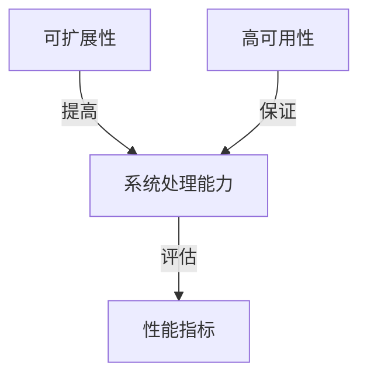

# 电商重要活动技术保障：高并发的峰值系统问题解决

## 1.背景介绍

在电商行业中,重要活动如双11、618等大促活动期间,系统往往会面临巨大的访问流量,这种突发的高并发访问场景被称为"峰值场景"。如果系统架构设计不当,就很容易导致服务器超载、响应延迟或甚至系统崩溃,从而造成严重的经济损失和用户体验下降。因此,如何保证电商重要活动期间系统的高可用性和稳定性,已经成为电商公司必须解决的重大技术挑战。

### 1.1 高并发场景的特点

高并发场景具有以下几个主要特点:

- **突发性流量** :活动开始时,会在短时间内产生大量的访问请求,形成流量洪峰。
- **不确定性** :由于活动的热度和用户参与度无法精确预测,实际产生的流量峰值难以事先评估。
- **持续时间短暂** :虽然访问量剧增,但这种高峰状态往往持续时间较短,可能只有几分钟或几个小时。

### 1.2 高并发带来的挑战

高并发场景给系统带来了以下几个主要挑战:

- **高负载压力** :大量并发请求会给服务器CPU、内存、网络IO等资源带来巨大的压力。
- **数据库压力** :读写请求的集中会导致数据库连接数过多、锁争用、表空间满等问题。
- **缓存命中率下降** :缓存被压垮后,绝大多数请求都会落到数据库,加重数据库负担。
- **上下游系统传导** :如果某个环节出现瓶颈,就会影响整个系统的处理能力。

### 1.3 解决高并发问题的意义

解决高并发问题,能够保证电商活动期间系统的可靠性和用户体验,从而:

- 避免因系统瘫痪而导致的经济损失
- 提升用户对电商平台的信赖度
- 赢得良好的品牌形象和口碑
- 在同行业中占据技术优势

## 2.核心概念与联系

为了解决高并发场景下的系统问题,我们需要理解以下几个核心概念及其联系:

### 2.1 系统性能指标

常用的系统性能指标包括:

- **响应时间(RT)** :系统处理一个请求所花费的时间。
- **每秒查询率(QPS)** :系统每秒能够处理的查询请求数。
- **吞吐量(TPS)** :系统每秒能够处理的事务数。

这些指标反映了系统的处理能力,是评估系统性能的重要标准。

### 2.2 可扩展性(Scalability)

可扩展性是指当系统的工作负载增加时,可以通过添加资源(如CPU、内存、存储等)来提高系统的处理能力。良好的可扩展性能够应对突发的高并发场景。

### 2.3 高可用性(High Availability)

高可用性是指系统能够在发生硬件故障或者系统故障时,仍然可以保证业务的连续性,避免系统中断或数据丢失。实现高可用需要采用冗余、负载均衡、容错等技术手段。

### 2.4 核心关系

上述三个概念相互关联、相互影响:

- 良好的可扩展性有助于提高系统的处理能力,应对高并发场景。
- 高可用性能够避免单点故障,保证系统在高并发压力下的稳定运行。
- 优秀的性能指标是可扩展性和高可用性设计的最终目标。

因此,在设计高并发系统时,需要全面考虑可扩展性、高可用性和性能指标,并采取相应的技术措施进行优化。

## 3.核心算法原理具体操作步骤

为了解决高并发场景下的系统瓶颈问题,我们可以从多个层面采取一些常用的算法和策略,下面将详细介绍其原理和具体操作步骤。

### 3.1 限流算法

限流是一种暂时限制系统负载的策略,可以防止系统被压垮。常用的限流算法有:

#### 3.1.1 计数器算法

**原理:** 在一个统计周期内,计算请求总数,当请求总数超过设置的阈值时,新的请求将被拒绝。

**步骤:**

1. 设置时间窗口大小(如1秒)和请求阈值
2. 使用计数器记录时间窗口内的请求数
3. 每当有新请求到来:
    - 如果计数器值小于阈值,则计数器+1,请求通过
    - 如果计数器值大于等于阈值,则拒绝请求
4. 时间窗口结束后,重置计数器为0

**优点:** 简单、高效
**缺点:** 如果请求突发到来,可能会在时间窗口开始时暂时压垮系统

#### 3.1.2 漏桶算法

**原理:** 所有请求先进入漏桶,漏桶以固定速率流出请求,当漏桶溢出时,新的请求会被拒绝。

**步骤:**

1. 设置漏桶容量和流出速率
2. 新请求到来时,先将请求放入漏桶
3. 以固定速率从漏桶中取出请求,处理请求
4. 如果漏桶已满,新的请求将被拒绝

**优点:** 能够控制请求的流出速率,可以有效避免流量突发
**缺点:** 无法应对长期的高并发场景,只能起到暂时的作用

#### 3.1.3 令牌桶算法

**原理:** 系统会以固定速率生成令牌放入令牌桶,每次请求需要先从桶中获取令牌,当桶中没有令牌时,请求被阻塞或拒绝。

**步骤:**

1. 设置令牌桶的容量和每秒令牌生成速率
2. 新请求到来时,尝试从令牌桶中获取令牌
    - 如果有令牌,则请求通过,令牌被消耗
    - 如果没有令牌,则请求被阻塞或拒绝
3. 系统以固定速率往令牌桶中添加新令牌

**优点:** 能够限制总体请求速率,同时允许某种程度的临时突发
**缺点:** 无法对临时突发流量做出足够控制,算法实现相对复杂

限流算法可以根据具体场景进行选择和组合使用,在一定程度上缓解系统压力,但无法从根本上解决高并发问题。

### 3.2 缓存优化

合理使用缓存技术可以大幅减少对数据库的访问,提高系统的响应能力。常用的缓存优化策略有:

#### 3.2.1 缓存预热

**原理:** 在业务开始之前,先将热点数据加载到缓存中。

**步骤:**

1. 分析并确定热点数据,可以根据历史数据或是预估
2. 在业务开始前,提前将热点数据从数据库加载到缓存中
3. 业务开始后,大部分请求直接从缓存中获取数据

**优点:** 可以有效避免缓存穿透和冷启动时的压力
**缺点:** 占用额外的资源,需要提前预热

#### 3.2.2 缓存雪崩

**原理:** 当大量缓存数据同时失效时,会给后端系统带来巨大压力,称为缓存雪崩。采取不同的失效策略可以有效避免这种情况。

**步骤:**

1. **设置不同的失效时间:** 为缓存数据设置不同的失效时间,让它们分散失效
2. **缓存数据主动更新:** 在缓存数据失效前,主动从后端加载新的数据,更新缓存
3. **缓存永不失效:** 为热点数据设置永不过期,由运维人员主动更新缓存

**优点:** 能够有效防止大量缓存同时失效
**缺点:** 需要付出额外的维护成本

#### 3.2.3 缓存穿透

**原理:** 当查询的数据在缓存和数据库中都不存在时,就会发生缓存穿透,给后端系统带来压力。

**步骤:**

1. **缓存空对象:** 将不存在的数据也缓存起来,设置合理的过期时间
2. **布隆过滤器:** 使用布隆过滤器提前过滤掉不存在的数据,避免对后端系统的查询
3. **增加缓存层级:** 增加分级缓存,让一部分请求能够命中缓存

**优点:** 能够有效防止缓存穿透问题
**缺点:** 需要付出额外的存储和计算开销

### 3.3 异步化

将一些非关键、耗时的操作异步化,可以提高系统的响应速度。常用的异步化手段有:

#### 3.3.1 消息队列

**原理:** 将一些耗时的操作(如发送邮件、消息推送等)转移到消息队列中,由消费者异步执行。

**步骤:**

1. 将需要异步执行的操作封装为消息,发送到消息队列
2. 消费者从消息队列中获取消息,执行相应的操作
3. 生产者只需等待消息入队即可返回,无需等待操作完成

**优点:** 提高了系统的响应速度和吞吐量
**缺点:** 引入了额外的消息队列组件,增加了系统复杂度

#### 3.3.2 工作线程池

**原理:** 将耗时的任务分配给工作线程池中的线程异步执行。

**步骤:**

1. 创建一个工作线程池,设置线程数量和队列大小
2. 当有新的耗时任务到来时,将其提交到工作线程池中
3. 工作线程从队列中获取任务,执行相应的操作

**优点:** 避免了为每个请求创建新线程的开销
**缺点:** 线程池的大小需要合理设置,否则可能导致资源浪费或任务堆积

### 3.4 分布式系统

将单体系统拆分为多个子系统,通过分布式部署和负载均衡等手段,可以显著提高系统的处理能力。

#### 3.4.1 分布式缓存

**原理:** 使用分布式缓存系统(如Redis集群)代替单机缓存,提高缓存的存储能力和并发读写能力。

**步骤:**

1. 规划分布式缓存集群的节点数量和部署方式
2. 配置缓存数据的分片策略,将数据分布到不同节点
3. 在应用程序中使用分布式缓存客户端访问缓存集群

**优点:** 突破了单机缓存的瓶颈,大幅提高了缓存的性能
**缺点:** 引入了额外的缓存集群,增加了部署和运维的复杂度

#### 3.4.2 分布式数据库

**原理:** 使用分布式数据库系统(如分库分表)代替单机数据库,提高数据库的存储能力和并发读写能力。

**步骤:**

1. 规划分布式数据库的分库分表方案
2. 根据分库分表策略,将数据分布到不同的库表中
3. 在应用程序中使用分库分表中间件访问分布式数据库

**优点:** 突破了单机数据库的瓶颈,大幅提高了数据库的性能
**缺点:** 引入了额外的分库分表中间件,增加了部署和运维的复杂度

#### 3.4.3 负载均衡

**原理:** 在多台服务器之间合理分配请求负载,避免单台服务器过载。

**步骤:**

1. 规划负载均衡器的部署方式(硬件或软件)
2. 配置负载均衡策略(如轮询、最小连接等)
3. 在应用程序中使用负载均衡器的地址访问服务

**优点:** 提高了系统的可扩展性和高可用性
**缺点:** 引入了额外的负载均衡器,增加了部署和运维的复杂度

## 4.数学模型和公式详细讲解举例说明

在高并发系统中,合理评估系统性能和容量规划是非常重要的。我们可