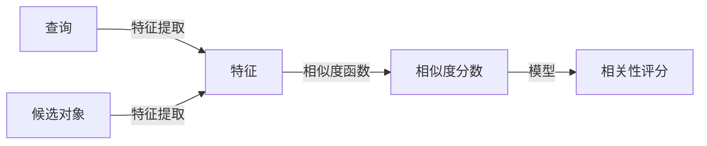

# 相关性评分 原理与代码实例讲解

## 1.背景介绍

在信息检索、推荐系统、广告投放等领域,相关性评分是一个非常重要的概念和技术。它旨在量化一个查询(query)和一个候选对象(如文档、商品、广告等)之间的相关程度,从而为用户提供最相关的结果。相关性评分广泛应用于搜索引擎、个性化推荐、在线广告等领域,对于提高用户体验和系统效率至关重要。

## 2.核心概念与联系

相关性评分涉及以下几个核心概念:

1. **查询(Query)**: 用户输入的搜索词或查询语句,表达了用户的需求和意图。

2. **候选对象(Candidate)**: 可以是文档、商品、广告等待匹配的对象。

3. **特征(Feature)**: 描述查询和候选对象之间相关性的各种属性,如词频、相位等。

4. **相似度函数(Similarity Function)**: 基于特征计算查询和候选对象之间的相似度分数。

5. **模型(Model)**: 将多个相似度函数的分数综合起来,得到最终的相关性评分。

这些概念之间的关系如下所示:



## 3.核心算法原理具体操作步骤

相关性评分的核心算法原理可以分为以下几个步骤:

### 3.1 特征提取

首先需要从查询和候选对象中提取相关的特征,这些特征将用于后续的相似度计算。常用的特征包括:

- **词频(Term Frequency, TF)**: 词项在文档中出现的频率。
- **逆文档频率(Inverse Document Frequency, IDF)**: 衡量词项在整个文档集中的重要程度。
- **词位置(Term Proximity)**: 词项在文档中的位置分布。
- **词序(Term Order)**: 词项在查询中的顺序。

### 3.2 相似度函数

根据提取的特征,使用相似度函数计算查询和候选对象之间的相似度分数。常用的相似度函数包括:

- **TF-IDF**: 结合词频和逆文档频率,是最经典的相似度函数之一。
- **BM25**: 一种概率模型,在TF-IDF的基础上进行了改进。
- **语义相似度**: 基于词向量或神经网络模型计算语义相似度。

### 3.3 模型集成

单一的相似度函数可能无法完全捕捉查询和候选对象之间的相关性,因此需要将多个相似度函数的分数综合起来,得到最终的相关性评分。常用的模型包括:

- **线性模型**: 对不同的相似度函数分数进行加权求和。
- **树模型**: 使用决策树或梯度提升树等模型进行综合。
- **神经网络模型**: 利用深度学习模型自动学习特征的组合方式。

### 3.4 模型训练和优化

相关性评分模型需要基于大量的标注数据进行训练和优化,以提高模型的准确性和泛化能力。常用的优化目标包括:

- **准确率(Accuracy)**: 模型预测的相关性评分与真实标注的一致性。
- **排序损失(Ranking Loss)**: 衡量模型对候选对象排序的准确性。
- **在线指标(Online Metrics)**: 如点击率、转化率等,反映模型在实际应用中的表现。

## 4.数学模型和公式详细讲解举例说明

### 4.1 TF-IDF

TF-IDF(Term Frequency-Inverse Document Frequency)是一种经典的相似度计算方法,它结合了词频(TF)和逆文档频率(IDF)两个因素。

**词频(TF)**表示一个词项在文档中出现的频率,可以用以下公式计算:

$$
tf(t,d) = \frac{n_{t,d}}{\sum_{t' \in d} n_{t',d}}
$$

其中,$n_{t,d}$表示词项$t$在文档$d$中出现的次数,$\sum_{t' \in d} n_{t',d}$表示文档$d$中所有词项出现次数的总和。

**逆文档频率(IDF)**衡量一个词项在整个文档集中的重要程度,通常使用以下公式计算:

$$
idf(t,D) = \log \frac{|D|}{|\{d \in D: t \in d\}|}
$$

其中,$|D|$表示文档集$D$中文档的总数,$|\{d \in D: t \in d\}|$表示包含词项$t$的文档数量。

**TF-IDF**则将TF和IDF相乘,公式如下:

$$
tfidf(t,d,D) = tf(t,d) \times idf(t,D)
$$

对于一个查询$q$和一个文档$d$,它们的相似度可以用所有词项的TF-IDF值之和来表示:

$$
sim_{tfidf}(q,d) = \sum_{t \in q \cap d} tfidf(t,d,D)
$$

例如,假设我们有一个查询"机器学习算法",以及两个候选文档:

文档1: "机器学习是人工智能的一个分支,它使用统计方法从数据中学习。常见的机器学习算法包括决策树、支持向量机等。"

文档2: "深度学习是机器学习的一种,它使用神经网络模型进行训练。深度学习在图像识别、自然语言处理等领域取得了巨大成功。"

假设在整个文档集中,"机器学习"出现在100个文档中,总文档数为1000。"算法"出现在500个文档中。那么它们的TF-IDF值为:

- $tfidf("机器学习",文档1) = \frac{2}{11} \times \log \frac{1000}{100} \approx 0.18$
- $tfidf("算法",文档1) = \frac{1}{11} \times \log \frac{1000}{500} \approx 0.07$
- $tfidf("机器学习",文档2) = \frac{1}{12} \times \log \frac{1000}{100} \approx 0.09$
- $tfidf("算法",文档2) = 0$

根据TF-IDF相似度计算公式,文档1与查询的相似度为0.18+0.07=0.25,文档2与查询的相似度为0.09。因此,文档1与查询的相关性更高。

### 4.2 BM25

BM25是一种概率模型,它在TF-IDF的基础上进行了改进,引入了一些调节参数,使得模型更加灵活和robust。BM25的计算公式如下:

$$
sim_{BM25}(q,d) = \sum_{t \in q} idf(t) \cdot \frac{tf(t,d) \cdot (k_1 + 1)}{tf(t,d) + k_1 \cdot (1 - b + b \cdot \frac{|d|}{avgdl})}
$$

其中:

- $tf(t,d)$表示词项$t$在文档$d$中的词频
- $idf(t)$表示词项$t$的逆文档频率
- $|d|$表示文档$d$的长度(词数)
- $avgdl$表示文档集中平均文档长度
- $k_1$和$b$是两个调节参数,通常取值$k_1 \in [1.2, 2.0]$, $b = 0.75$

与TF-IDF相比,BM25引入了两个调节参数$k_1$和$b$,可以更好地控制词频和文档长度对相似度的影响。当$k_1$较大时,词频的影响会减小;当$b$较大时,文档长度的影响会增大。

例如,假设我们有一个查询"机器学习算法",以及两个候选文档:

文档1: "机器学习是人工智能的一个分支,它使用统计方法从数据中学习。常见的机器学习算法包括决策树、支持向量机等。"(文档长度为11个词)

文档2: "深度学习是机器学习的一种,它使用神经网络模型进行训练。深度学习在图像识别、自然语言处理等领域取得了巨大成功。"(文档长度为12个词)

假设在整个文档集中,平均文档长度为10,并且"机器学习"出现在100个文档中,总文档数为1000;"算法"出现在500个文档中。取$k_1=1.5$, $b=0.75$,那么BM25相似度为:

- $sim_{BM25}("机器学习",文档1) = \log \frac{1000}{100} \cdot \frac{2 \cdot (1.5 + 1)}{2 + 1.5 \cdot (1 - 0.75 + 0.75 \cdot \frac{11}{10})} \approx 0.52$
- $sim_{BM25}("算法",文档1) = \log \frac{1000}{500} \cdot \frac{1 \cdot (1.5 + 1)}{1 + 1.5 \cdot (1 - 0.75 + 0.75 \cdot \frac{11}{10})} \approx 0.15$
- $sim_{BM25}("机器学习",文档2) = \log \frac{1000}{100} \cdot \frac{1 \cdot (1.5 + 1)}{1 + 1.5 \cdot (1 - 0.75 + 0.75 \cdot \frac{12}{10})} \approx 0.24$
- $sim_{BM25}("算法",文档2) = 0$

文档1与查询的相似度为0.52+0.15=0.67,文档2与查询的相似度为0.24。因此,根据BM25模型,文档1与查询的相关性更高。

## 5.项目实践：代码实例和详细解释说明

以下是一个使用Python实现TF-IDF和BM25相似度计算的示例代码:

```python
import math
from collections import Counter

def tf(term, doc):
    """计算词频(Term Frequency)"""
    return doc.count(term) / len(doc)

def idf(term, docs):
    """计算逆文档频率(Inverse Document Frequency)"""
    doc_count = sum(1 for doc in docs if term in doc)
    return math.log(len(docs) / (doc_count + 1)) + 1

def tfidf(term, doc, docs):
    """计算TF-IDF"""
    return tf(term, doc) * idf(term, docs)

def sim_tfidf(query, doc, docs):
    """计算TF-IDF相似度"""
    query_terms = set(query)
    doc_terms = set(doc)
    common_terms = query_terms.intersection(doc_terms)
    score = sum(tfidf(term, doc, docs) for term in common_terms)
    return score

def sim_bm25(query, doc, docs, k1=1.5, b=0.75):
    """计算BM25相似度"""
    score = 0
    doc_len = len(doc)
    avg_doc_len = sum(len(d) for d in docs) / len(docs)

    for term in set(query):
        tf_val = doc.count(term) / (doc_len + k1 * (1 - b + b * doc_len / avg_doc_len))
        idf_val = idf(term, docs)
        score += idf_val * tf_val

    return score

# 示例用法
docs = [
    "机器 学习 是 人工智能 的 一个 分支 它 使用 统计 方法 从 数据 中 学习".split(),
    "常见 的 机器 学习 算法 包括 决策树 支持 向量机 等".split(),
    "深度 学习 是 机器 学习 的 一种 它 使用 神经网络 模型 进行 训练".split(),
    "深度 学习 在 图像 识别 自然 语言 处理 等 领域 取得 了 巨大 成功".split()
]

query = "机器 学习 算法".split()

print("TF-IDF相似度:")
for doc in docs:
    score = sim_tfidf(query, doc, docs)
    print(f"文档: {' '.join(doc)}, 相似度: {score:.2f}")

print("\nBM25相似度:")
for doc in docs:
    score = sim_bm25(query, doc, docs)
    print(f"文档: {' '.join(doc)}, 相似度: {score:.2f}")
```

上述代码中实现了以下功能:

1. `tf(term, doc)`: 计算词项在文档中的词频。
2. `idf(term, docs)`: 计算词项的逆文档频率。
3. `tfidf(term, doc, docs)`: 计算词项在文档中的TF-IDF值。
4. `sim_tfidf(query, doc, docs)`: 计算查询和文档之间的TF-IDF相似度。
5. `sim_bm25(query, doc, docs, k1=1.5