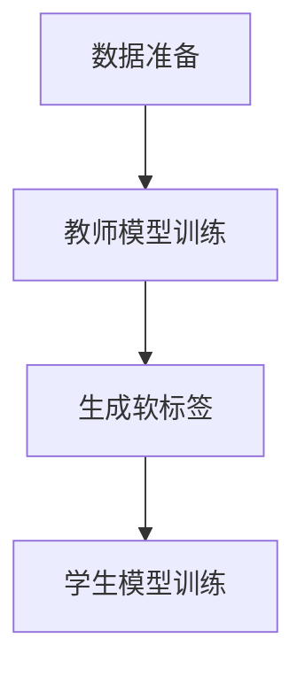

# 知识蒸馏在隐私保护领域的应用前景

## 1.背景介绍

随着人工智能和机器学习技术的迅猛发展，数据隐私问题日益凸显。隐私保护成为了各行各业关注的焦点，尤其是在医疗、金融和社交媒体等领域。传统的隐私保护方法，如数据加密和访问控制，虽然在一定程度上能够保护数据隐私，但在面对复杂的机器学习模型时，仍然存在诸多挑战。知识蒸馏（Knowledge Distillation）作为一种新兴的技术，提供了一种在不直接访问原始数据的情况下，训练高效模型的方法。本文将探讨知识蒸馏在隐私保护领域的应用前景。

## 2.核心概念与联系

### 2.1 知识蒸馏的定义

知识蒸馏是一种模型压缩技术，通过将一个复杂的“教师模型”中的知识传递给一个较小的“学生模型”，从而实现模型的简化和加速。教师模型通常是一个性能优越但计算复杂度高的模型，而学生模型则是一个计算复杂度较低的模型。

### 2.2 隐私保护的定义

隐私保护指的是在数据处理和分析过程中，确保个人数据不被未经授权的访问和使用。隐私保护技术包括数据加密、差分隐私、联邦学习等。

### 2.3 知识蒸馏与隐私保护的联系

知识蒸馏在隐私保护中的应用主要体现在以下几个方面：

1. **数据隐私保护**：通过知识蒸馏，可以在不直接访问原始数据的情况下，训练出高效的学生模型，从而保护数据隐私。
2. **模型隐私保护**：知识蒸馏可以防止模型被逆向工程，从而保护模型的知识产权。

## 3.核心算法原理具体操作步骤

### 3.1 知识蒸馏的基本流程

知识蒸馏的基本流程如下：

1. **训练教师模型**：首先，使用原始数据训练一个性能优越的教师模型。
2. **生成软标签**：使用教师模型对训练数据进行预测，生成软标签（Soft Labels）。
3. **训练学生模型**：使用软标签和原始数据训练一个较小的学生模型。

### 3.2 具体操作步骤

以下是知识蒸馏的具体操作步骤：

1. **数据准备**：准备好训练数据集。
2. **教师模型训练**：使用训练数据集训练一个复杂的教师模型。
3. **生成软标签**：使用教师模型对训练数据集进行预测，生成软标签。
4. **学生模型训练**：使用训练数据集和软标签训练一个较小的学生模型。



## 4.数学模型和公式详细讲解举例说明

### 4.1 知识蒸馏的数学模型

知识蒸馏的核心在于通过软标签传递知识。软标签是教师模型对输入数据的预测概率分布。假设教师模型的输出为 $T(x)$，学生模型的输出为 $S(x)$，则知识蒸馏的目标是最小化以下损失函数：

$$
L = \alpha L_{hard} + \beta L_{soft}
$$

其中，$L_{hard}$ 是学生模型对原始标签的交叉熵损失，$L_{soft}$ 是学生模型对软标签的交叉熵损失，$\alpha$ 和 $\beta$ 是权重参数。

### 4.2 公式详细讲解

1. **交叉熵损失**：交叉熵损失用于衡量预测概率分布与真实概率分布之间的差异。对于原始标签 $y$ 和预测概率 $p$，交叉熵损失定义为：

$$
L_{hard} = -\sum_{i} y_i \log(p_i)
$$

2. **软标签交叉熵损失**：对于软标签 $T(x)$ 和学生模型的预测 $S(x)$，交叉熵损失定义为：

$$
L_{soft} = -\sum_{i} T(x)_i \log(S(x)_i)
$$

### 4.3 举例说明

假设我们有一个简单的二分类问题，教师模型的输出为 $T(x) = [0.7, 0.3]$，学生模型的输出为 $S(x) = [0.6, 0.4]$，原始标签为 $y = [1, 0]$。则交叉熵损失和软标签交叉熵损失分别为：

$$
L_{hard} = - (1 \cdot \log(0.6) + 0 \cdot \log(0.4)) = 0.5108
$$

$$
L_{soft} = - (0.7 \cdot \log(0.6) + 0.3 \cdot \log(0.4)) = 0.6365
$$

最终的损失函数为：

$$
L = \alpha \cdot 0.5108 + \beta \cdot 0.6365
$$

## 5.项目实践：代码实例和详细解释说明

### 5.1 环境准备

在开始项目实践之前，我们需要准备好开发环境。本文使用 Python 和 TensorFlow 进行实现。

### 5.2 教师模型训练

首先，我们使用原始数据训练一个复杂的教师模型。以下是一个简单的示例代码：

```python
import tensorflow as tf
from tensorflow.keras.models import Sequential
from tensorflow.keras.layers import Dense

# 数据准备
(x_train, y_train), (x_test, y_test) = tf.keras.datasets.mnist.load_data()
x_train, x_test = x_train / 255.0, x_test / 255.0

# 教师模型定义
teacher_model = Sequential([
    Dense(128, activation='relu', input_shape=(784,)),
    Dense(64, activation='relu'),
    Dense(10, activation='softmax')
])

# 教师模型编译
teacher_model.compile(optimizer='adam',
                      loss='sparse_categorical_crossentropy',
                      metrics=['accuracy'])

# 教师模型训练
teacher_model.fit(x_train, y_train, epochs=5)
```

### 5.3 生成软标签

使用教师模型对训练数据进行预测，生成软标签：

```python
# 生成软标签
soft_labels = teacher_model.predict(x_train)
```

### 5.4 学生模型训练

使用软标签和原始数据训练一个较小的学生模型：

```python
# 学生模型定义
student_model = Sequential([
    Dense(64, activation='relu', input_shape=(784,)),
    Dense(32, activation='relu'),
    Dense(10, activation='softmax')
])

# 学生模型编译
student_model.compile(optimizer='adam',
                      loss='sparse_categorical_crossentropy',
                      metrics=['accuracy'])

# 学生模型训练
student_model.fit(x_train, soft_labels, epochs=5)
```

### 5.5 代码解释

上述代码首先加载了 MNIST 数据集，并对数据进行了归一化处理。然后定义并训练了一个教师模型，接着使用教师模型生成了软标签，最后使用软标签和原始数据训练了一个较小的学生模型。

## 6.实际应用场景

### 6.1 医疗领域

在医疗领域，患者数据的隐私保护至关重要。通过知识蒸馏，可以在不直接访问患者数据的情况下，训练出高效的医疗诊断模型，从而保护患者隐私。

### 6.2 金融领域

在金融领域，客户数据的隐私保护同样重要。知识蒸馏可以帮助金融机构在不泄露客户数据的情况下，训练出高效的风险评估模型。

### 6.3 社交媒体

在社交媒体领域，用户数据的隐私保护是一个重要问题。通过知识蒸馏，可以在不直接访问用户数据的情况下，训练出高效的推荐系统，从而保护用户隐私。

## 7.工具和资源推荐

### 7.1 开发工具

1. **TensorFlow**：一个开源的机器学习框架，适用于知识蒸馏的实现。
2. **PyTorch**：另一个流行的开源机器学习框架，同样适用于知识蒸馏的实现。

### 7.2 数据集

1. **MNIST**：一个手写数字识别数据集，适用于知识蒸馏的入门实践。
2. **CIFAR-10**：一个图像分类数据集，适用于知识蒸馏的进阶实践。

### 7.3 参考文献

1. Hinton, G., Vinyals, O., & Dean, J. (2015). Distilling the Knowledge in a Neural Network. arXiv preprint arXiv:1503.02531.
2. Papernot, N., McDaniel, P., Sinha, A., & Wellman, M. (2016). Towards the Science of Security and Privacy in Machine Learning. arXiv preprint arXiv:1611.03814.

## 8.总结：未来发展趋势与挑战

### 8.1 未来发展趋势

知识蒸馏在隐私保护领域具有广阔的应用前景。随着技术的不断发展，知识蒸馏有望在更多领域得到应用，如智能家居、自动驾驶等。此外，结合差分隐私和联邦学习等技术，知识蒸馏有望进一步提升隐私保护的效果。

### 8.2 挑战

尽管知识蒸馏在隐私保护领域具有诸多优势，但仍然面临一些挑战：

1. **模型性能**：如何在保证学生模型性能的同时，最大程度地保护数据隐私，是一个重要的研究方向。
2. **计算复杂度**：知识蒸馏的计算复杂度较高，如何优化计算过程，是另一个需要解决的问题。
3. **安全性**：如何防止知识蒸馏过程中的信息泄露，是一个亟待解决的安全问题。

## 9.附录：常见问题与解答

### 9.1 知识蒸馏是否适用于所有类型的模型？

知识蒸馏主要适用于深度学习模型，尤其是神经网络模型。对于传统的机器学习模型，如决策树和支持向量机，知识蒸馏的效果可能不如神经网络模型显著。

### 9.2 知识蒸馏是否会影响模型的准确性？

知识蒸馏的目标是通过传递教师模型的知识，训练出一个性能接近教师模型的学生模型。在大多数情况下，学生模型的准确性会略低于教师模型，但计算复杂度和存储需求会显著降低。

### 9.3 如何选择教师模型和学生模型的结构？

教师模型通常选择性能优越但计算复杂度高的模型，如深度神经网络。学生模型则选择计算复杂度较低的模型，如浅层神经网络。具体的模型结构选择需要根据实际应用场景和计算资源进行权衡。

### 9.4 知识蒸馏是否可以与其他隐私保护技术结合使用？

是的，知识蒸馏可以与差分隐私、联邦学习等其他隐私保护技术结合使用，以进一步提升隐私保护效果。例如，可以在知识蒸馏过程中引入差分隐私机制，防止信息泄露。

### 9.5 知识蒸馏的实现是否需要大量的计算资源？

知识蒸馏的实现确实需要一定的计算资源，尤其是在训练教师模型和生成软标签的过程中。然而，通过优化算法和使用高效的计算资源，如 GPU 和 TPU，可以显著降低计算复杂度。

---

作者：禅与计算机程序设计艺术 / Zen and the Art of Computer Programming