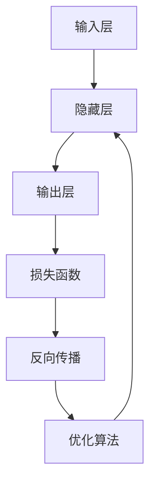
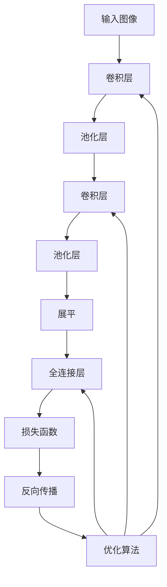
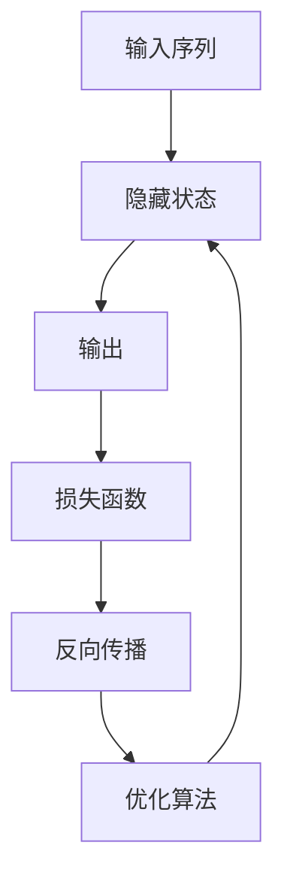

非常感谢您的任务要求,我会尽最大努力遵循约束条件,撰写一篇高质量的技术博客文章。下面是正文部分:

# 神经网络 原理与代码实例讲解

## 1.背景介绍

### 1.1 神经网络的起源

神经网络的概念源于对生物神经系统的研究和模拟。1943年,神经心理学家沃伦·麦卡洛克(Warren McCulloch)和逻辑学家沃尔特·皮茨(Walter Pitts)提出了第一个神经网络模型,被称为M-P神经元模型。该模型将神经元抽象为一个带有阈值的加权求和计算单元。

### 1.2 神经网络的发展历程

神经网络在20世纪50年代开始兴起,但由于缺乏足够的计算能力和训练数据,发展一度陷入停滞。直到20世纪80年代,反向传播算法的提出以及硬件计算能力的飞速提升,推动了神经网络的复兴。近年来,深度学习的兴起进一步推动了神经网络的发展,在计算机视觉、自然语言处理、语音识别等领域取得了突破性进展。

### 1.3 神经网络的应用前景

神经网络展现出强大的模式识别和数据建模能力,在众多领域具有广阔的应用前景,如图像识别、语音识别、自然语言处理、推荐系统、金融预测等。随着算力的不断提升和数据的积累,神经网络将在更多领域发挥重要作用。

## 2.核心概念与联系

### 2.1 神经元

神经元是神经网络的基本计算单元,模拟生物神经元的工作原理。每个神经元接收来自其他神经元或外部输入的加权信号,并通过激活函数产生输出信号。

### 2.2 网络结构

神经网络由多个神经元按特定模式相互连接而成。常见的网络结构包括前馈神经网络、卷积神经网络和递归神经网络等。网络结构决定了信息在网络中的流动方式和计算过程。

### 2.3 激活函数

激活函数引入非线性,使神经网络能够拟合复杂的非线性映射关系。常用的激活函数包括Sigmoid函数、ReLU函数、Tanh函数等。

### 2.4 损失函数

损失函数用于衡量神经网络的输出与期望输出之间的差异,是训练过程中需要优化的目标函数。常见的损失函数有均方误差、交叉熵等。

### 2.5 优化算法

优化算法用于调整神经网络的可训练参数,使损失函数最小化。常用的优化算法包括梯度下降、随机梯度下降、动量优化、自适应学习率优化等。

### 2.6 正则化

正则化是一种防止过拟合的技术,通过在损失函数中引入惩罚项或者对网络参数施加约束,提高神经网络的泛化能力。常见的正则化方法有L1正则化、L2正则化、Dropout等。

### 2.7 核心概念之间的联系

上述核心概念相互关联,共同构建了神经网络的理论基础和工作机制。神经元是基本计算单元,激活函数引入非线性,网络结构决定计算过程,损失函数衡量模型性能,优化算法调整参数,正则化防止过拟合。这些概念有机结合,使神经网络能够从数据中学习,解决复杂的任务。

## 3.核心算法原理具体操作步骤

### 3.1 前馈神经网络

前馈神经网络是最基本的神经网络结构,信息只在单一方向传播,不存在回路。前馈神经网络的工作原理如下:

1. 输入层接收输入数据
2. 隐藏层对输入数据进行加权求和计算,并通过激活函数得到隐藏层输出
3. 输出层对隐藏层输出进行加权求和计算,并通过激活函数得到最终输出
4. 将输出与期望输出计算损失函数
5. 通过反向传播算法计算梯度,并使用优化算法更新网络参数
6. 重复上述过程,直至损失函数收敛



### 3.2 卷积神经网络

卷积神经网络在计算机视觉领域表现出色,擅长处理图像等高维数据。卷积神经网络的核心操作包括卷积和池化。

1. 卷积层:使用多个滤波器(卷积核)在输入数据上滑动,提取局部特征
2. 池化层:对卷积层输出进行下采样,减小数据量,提取主要特征
3. 全连接层:将卷积层和池化层的输出展平,并进行全连接计算
4. 损失函数、反向传播和优化算法与前馈神经网络相同



### 3.3 递归神经网络

递归神经网络擅长处理序列数据,如自然语言处理、语音识别等。递归神经网络的核心思想是将当前输入与上一时刻的隐藏状态相结合,产生新的隐藏状态。

1. 初始化隐藏状态
2. 将当前输入与上一时刻隐藏状态相结合,计算新的隐藏状态
3. 根据新的隐藏状态计算输出
4. 重复上述过程,直至序列结束
5. 损失函数、反向传播和优化算法与前馈神经网络相同



## 4.数学模型和公式详细讲解举例说明

### 4.1 神经元模型

神经元模型是神经网络的基本计算单元,可以用如下公式表示:

$$
y = f\left(\sum_{i=1}^{n}w_ix_i + b\right)
$$

其中:
- $x_i$是第$i$个输入
- $w_i$是第$i$个输入对应的权重
- $b$是偏置项
- $f$是激活函数

激活函数引入非线性,使神经网络能够拟合复杂的非线性映射关系。常用的激活函数包括:

1. Sigmoid函数:

$$
f(x) = \frac{1}{1 + e^{-x}}
$$

2. ReLU函数:

$$
f(x) = \max(0, x)
$$

3. Tanh函数:

$$
f(x) = \frac{e^x - e^{-x}}{e^x + e^{-x}}
$$

### 4.2 损失函数

损失函数用于衡量神经网络的输出与期望输出之间的差异,是训练过程中需要优化的目标函数。

对于回归问题,常用的损失函数是均方误差(Mean Squared Error, MSE):

$$
\text{MSE} = \frac{1}{n}\sum_{i=1}^{n}(y_i - \hat{y}_i)^2
$$

其中:
- $n$是样本数量
- $y_i$是第$i$个样本的真实值
- $\hat{y}_i$是第$i$个样本的预测值

对于分类问题,常用的损失函数是交叉熵(Cross Entropy):

$$
\text{CE} = -\frac{1}{n}\sum_{i=1}^{n}\sum_{j=1}^{m}y_{ij}\log(\hat{y}_{ij})
$$

其中:
- $n$是样本数量
- $m$是类别数量
- $y_{ij}$是第$i$个样本属于第$j$类的真实标签(0或1)
- $\hat{y}_{ij}$是第$i$个样本属于第$j$类的预测概率

### 4.3 反向传播算法

反向传播算法是训练神经网络的核心算法,通过计算损失函数对网络参数的梯度,并使用优化算法更新参数,从而最小化损失函数。

假设神经网络有$L$层,第$l$层的输入为$a^{(l-1)}$,权重为$W^{(l)}$,偏置为$b^{(l)}$,激活函数为$f^{(l)}$,则第$l$层的输出可以表示为:

$$
z^{(l)} = W^{(l)}a^{(l-1)} + b^{(l)}\\
a^{(l)} = f^{(l)}(z^{(l)})
$$

反向传播算法的步骤如下:

1. 前向传播,计算每层的输出
2. 计算输出层的误差:$\delta^{(L)} = \nabla_aJ(a^{(L)})$,其中$J$是损失函数
3. 反向计算每层的误差:$\delta^{(l)} = ((W^{(l+1)})^T\delta^{(l+1)})\odot f'^{(l)}(z^{(l)})$
4. 计算每层权重和偏置的梯度:
   $$
   \frac{\partial J}{\partial W^{(l)}} = \delta^{(l+1)}(a^{(l)})^T\\
   \frac{\partial J}{\partial b^{(l)}} = \delta^{(l+1)}
   $$
5. 使用优化算法更新网络参数

### 4.4 优化算法

优化算法用于调整神经网络的可训练参数,使损失函数最小化。常用的优化算法包括:

1. 梯度下降(Gradient Descent):
   $$
   \theta = \theta - \alpha\nabla_\theta J(\theta)
   $$
   其中$\theta$是参数向量,$\alpha$是学习率,$\nabla_\theta J(\theta)$是损失函数对参数的梯度。

2. 随机梯度下降(Stochastic Gradient Descent, SGD):
   在每次迭代中,只使用一个或一小批样本计算梯度,从而加快收敛速度。

3. 动量优化(Momentum):
   $$
   v_t = \gamma v_{t-1} + \alpha\nabla_\theta J(\theta)\\
   \theta = \theta - v_t
   $$
   其中$v_t$是当前动量向量,$\gamma$是动量系数。动量优化可以加速收敛,并帮助跳出局部最优解。

4. 自适应学习率优化(Adaptive Learning Rate Optimization):
   例如AdaGrad、RMSProp和Adam等算法,可以根据参数的更新情况动态调整每个参数的学习率,提高收敛速度和稳定性。

## 5.项目实践:代码实例和详细解释说明

以下是使用Python和PyTorch框架实现一个简单的前馈神经网络的示例代码:

```python
import torch
import torch.nn as nn

# 定义神经网络模型
class FeedforwardNeuralNet(nn.Module):
    def __init__(self, input_size, hidden_size, output_size):
        super(FeedforwardNeuralNet, self).__init__()
        self.fc1 = nn.Linear(input_size, hidden_size)  # 输入层到隐藏层
        self.relu = nn.ReLU()  # 激活函数
        self.fc2 = nn.Linear(hidden_size, output_size)  # 隐藏层到输出层

    def forward(self, x):
        out = self.fc1(x)
        out = self.relu(out)
        out = self.fc2(out)
        return out

# 创建模型实例
model = FeedforwardNeuralNet(input_size=10, hidden_size=20, output_size=5)

# 定义损失函数和优化器
criterion = nn.CrossEntropyLoss()  # 交叉熵损失函数
optimizer = torch.optim.SGD(model.parameters(), lr=0.01)  # 随机梯度下降优化器

# 训练循环
for epoch in range(100):
    # 前向传播
    outputs = model(inputs)
    loss = criterion(outputs, labels)

    # 反向传播和优化
    optimizer.zero_grad()
    loss.backward()
    optimizer.step()

    # 打印损失
    if (epoch + 1) % 10 == 0:
        print(f'Epoch [{epoch+1}/100], Loss: {loss.item():.4f}')
```

代码解释:

1. 首先定义了一个前