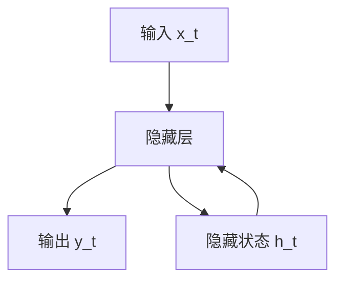
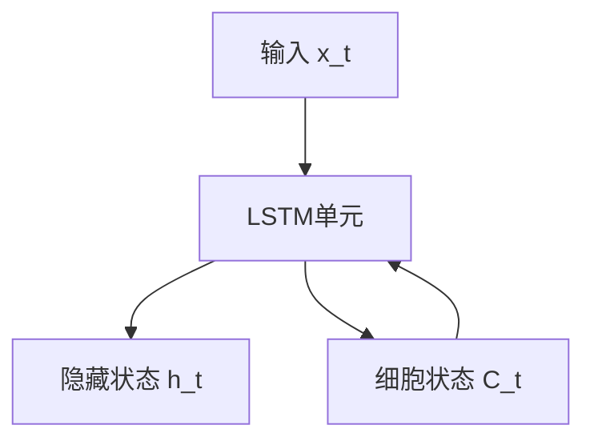
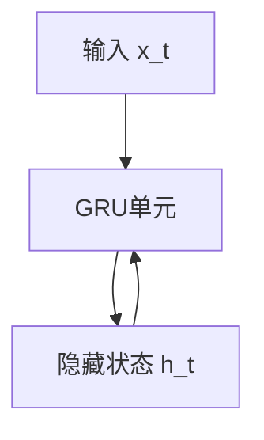

# 第三部分：循环神经网络

## 1.背景介绍

循环神经网络(Recurrent Neural Networks, RNNs)是一种特殊类型的人工神经网络,专门用于处理序列数据,如文本、语音、视频等。与传统的前馈神经网络不同,RNNs具有内部记忆状态,可以捕捉序列数据中的动态行为和长期依赖关系。

RNNs在自然语言处理、语音识别、机器翻译等领域有着广泛的应用。它们能够处理可变长度的输入序列,并产生相应的输出序列,非常适合于序列到序列(Sequence-to-Sequence)的任务。

## 2.核心概念与联系

### 2.1 循环神经网络的基本结构

循环神经网络的核心思想是在每个时间步都重复使用相同的神经网络,并将前一时间步的隐藏状态作为当前时间步的输入之一。这种循环结构使得网络能够捕捉序列数据中的长期依赖关系。



上图展示了RNNs的基本结构,其中:

- $x_t$表示时间步t的输入
- $h_t$表示时间步t的隐藏状态,它是前一时间步隐藏状态$h_{t-1}$和当前输入$x_t$的函数
- $y_t$表示时间步t的输出,它是隐藏状态$h_t$的函数

### 2.2 长期依赖问题

虽然RNNs理论上可以捕捉任意长度的序列依赖关系,但在实践中,它们很难有效地学习长期依赖关系。这是由于在反向传播过程中,梯度会随时间步的增加而呈指数级衰减或爆炸,这被称为"梯度消失"或"梯度爆炸"问题。

为了解决这个问题,研究人员提出了长短期记忆网络(Long Short-Term Memory, LSTM)和门控循环单元(Gated Recurrent Unit, GRU)等变体,它们通过引入门控机制来更好地捕捉长期依赖关系。

## 3.核心算法原理具体操作步骤

### 3.1 LSTM(长短期记忆网络)

LSTM是RNNs的一种变体,它通过引入门控机制和记忆单元来解决长期依赖问题。LSTM的核心思想是使用一个称为"细胞状态"(Cell State)的向量来传递相关信息,并通过门控机制来控制细胞状态的更新和输出。

LSTM在每个时间步都执行以下操作:

1. **忘记门(Forget Gate)**: 决定从上一个细胞状态中丢弃哪些信息。
   $$f_t = \sigma(W_f \cdot [h_{t-1}, x_t] + b_f)$$

2. **输入门(Input Gate)**: 决定从当前输入和上一隐藏状态中获取哪些信息。
   $$i_t = \sigma(W_i \cdot [h_{t-1}, x_t] + b_i)$$
   $$\tilde{C}_t = \tanh(W_C \cdot [h_{t-1}, x_t] + b_C)$$

3. **更新细胞状态(Update Cell State)**: 根据忘记门和输入门的输出,更新细胞状态。
   $$C_t = f_t * C_{t-1} + i_t * \tilde{C}_t$$

4. **输出门(Output Gate)**: 决定细胞状态中的哪些信息将被输出到隐藏状态。
   $$o_t = \sigma(W_o \cdot [h_{t-1}, x_t] + b_o)$$
   $$h_t = o_t * \tanh(C_t)$$

其中,$\sigma$是sigmoid函数,$\tanh$是双曲正切函数,$W$和$b$是可学习的权重和偏置参数。



### 3.2 GRU(门控循环单元)

GRU是另一种流行的RNNs变体,它相比LSTM结构更加简单,但在许多任务上表现也非常出色。GRU在每个时间步执行以下操作:

1. **更新门(Update Gate)**: 决定从上一个隐藏状态和当前输入中获取多少信息。
   $$z_t = \sigma(W_z \cdot [h_{t-1}, x_t] + b_z)$$

2. **重置门(Reset Gate)**: 决定从上一个隐藏状态中丢弃多少信息。
   $$r_t = \sigma(W_r \cdot [h_{t-1}, x_t] + b_r)$$

3. **候选隐藏状态(Candidate Hidden State)**: 计算当前时间步的候选隐藏状态。
   $$\tilde{h}_t = \tanh(W \cdot [r_t * h_{t-1}, x_t] + b)$$

4. **更新隐藏状态(Update Hidden State)**: 根据更新门的输出,更新隐藏状态。
   $$h_t = (1 - z_t) * h_{t-1} + z_t * \tilde{h}_t$$

与LSTM相比,GRU没有单独的细胞状态,而是将隐藏状态作为主要状态向量。



## 4.数学模型和公式详细讲解举例说明

在前面的部分,我们已经介绍了LSTM和GRU的核心算法步骤,现在让我们深入探讨一下它们的数学模型和公式。

### 4.1 LSTM的数学模型

LSTM的数学模型可以表示为:

$$\begin{aligned}
f_t &= \sigma(W_f \cdot [h_{t-1}, x_t] + b_f) \\
i_t &= \sigma(W_i \cdot [h_{t-1}, x_t] + b_i) \\
\tilde{C}_t &= \tanh(W_C \cdot [h_{t-1}, x_t] + b_C) \\
C_t &= f_t * C_{t-1} + i_t * \tilde{C}_t \\
o_t &= \sigma(W_o \cdot [h_{t-1}, x_t] + b_o) \\
h_t &= o_t * \tanh(C_t)
\end{aligned}$$

其中:

- $f_t$是忘记门,决定从上一个细胞状态中丢弃哪些信息。
- $i_t$是输入门,决定从当前输入和上一隐藏状态中获取哪些信息。
- $\tilde{C}_t$是候选细胞状态,它是当前输入和上一隐藏状态的函数。
- $C_t$是当前细胞状态,它是上一细胞状态$C_{t-1}$和候选细胞状态$\tilde{C}_t$的组合。
- $o_t$是输出门,决定细胞状态中的哪些信息将被输出到隐藏状态。
- $h_t$是当前隐藏状态,它是细胞状态$C_t$和输出门$o_t$的函数。

让我们通过一个具体的例子来理解LSTM的工作原理。假设我们有一个序列"the cat sat on the mat",我们希望LSTM能够捕捉到"the"和"mat"之间的长期依赖关系。

在第一个时间步,LSTM读取单词"the",并初始化细胞状态$C_0$和隐藏状态$h_0$。随着时间步的推移,LSTM逐步处理每个单词,并根据门控机制更新细胞状态和隐藏状态。

当LSTM读取到单词"mat"时,它可以从细胞状态中获取之前存储的关于"the"的信息,从而捕捉到"the"和"mat"之间的关联。这就是LSTM能够有效处理长期依赖关系的原因。

### 4.2 GRU的数学模型

GRU的数学模型可以表示为:

$$\begin{aligned}
z_t &= \sigma(W_z \cdot [h_{t-1}, x_t] + b_z) \\
r_t &= \sigma(W_r \cdot [h_{t-1}, x_t] + b_r) \\
\tilde{h}_t &= \tanh(W \cdot [r_t * h_{t-1}, x_t] + b) \\
h_t &= (1 - z_t) * h_{t-1} + z_t * \tilde{h}_t
\end{aligned}$$

其中:

- $z_t$是更新门,决定从上一个隐藏状态和当前输入中获取多少信息。
- $r_t$是重置门,决定从上一个隐藏状态中丢弃多少信息。
- $\tilde{h}_t$是候选隐藏状态,它是当前输入和上一隐藏状态的函数。
- $h_t$是当前隐藏状态,它是上一隐藏状态$h_{t-1}$和候选隐藏状态$\tilde{h}_t$的组合。

与LSTM相比,GRU没有单独的细胞状态,而是将隐藏状态作为主要状态向量。这使得GRU的结构更加简单,但在许多任务上表现也非常出色。

让我们再次以序列"the cat sat on the mat"为例,来理解GRU的工作原理。

在第一个时间步,GRU读取单词"the",并初始化隐藏状态$h_0$。随着时间步的推移,GRU逐步处理每个单词,并根据更新门和重置门的输出,更新隐藏状态。

当GRU读取到单词"mat"时,它可以从隐藏状态中获取之前存储的关于"the"的信息,从而捕捉到"the"和"mat"之间的关联。与LSTM类似,GRU也能够有效处理长期依赖关系。

## 5.项目实践:代码实例和详细解释说明

为了更好地理解循环神经网络的工作原理,我们将使用Python和PyTorch框架实现一个简单的LSTM模型,用于对IMDB电影评论数据集进行情感分类。

### 5.1 数据准备

首先,我们需要导入必要的库和数据集:

```python
import torch
import torch.nn as nn
from torchtext.datasets import IMDB

# 加载IMDB数据集
train_data, test_data = IMDB(root='data', split=('train', 'test'))
```

我们使用torchtext库中的IMDB数据集,它包含25,000条带标签的电影评论,用于二元情感分类任务(正面或负面)。

### 5.2 数据预处理

接下来,我们需要对数据进行预处理,包括构建词汇表、将文本转换为数字序列等:

```python
from torchtext.data import get_tokenizer
from torchtext.vocab import build_vocab_from_iterator

# 构建词汇表
tokenizer = get_tokenizer('basic_english')
def yield_tokens(data_iter):
    for text, _ in data_iter:
        yield tokenizer(text)

vocab = build_vocab_from_iterator(yield_tokens(train_data), specials=['<unk>'])
vocab.set_default_index(vocab['<unk>'])

# 将文本转换为数字序列
text_pipeline = lambda x: vocab(tokenizer(x))
label_pipeline = lambda x: 1 if x == 'pos' else 0

def collate_batch(batch):
    label_list, text_list = [], []
    for text, label in batch:
        label_list.append(label_pipeline(label))
        processed_text = torch.tensor(text_pipeline(text), dtype=torch.int64)
        text_list.append(processed_text)

    label_list = torch.tensor(label_list, dtype=torch.int64)
    text_list = nn.utils.rnn.pad_sequence(text_list, batch_first=True, padding_value=vocab['<unk>'])
    return text_list, label_list
```

我们使用torchtext提供的tokenizer将文本拆分为单词序列,并构建词汇表。然后,我们定义了一个collate_batch函数,用于将一批文本和标签转换为PyTorch张量,并对文本序列进行填充。

### 5.3 LSTM模型实现

现在,我们可以定义LSTM模型了:

```python
class LSTMClassifier(nn.Module):
    def __init__(self, vocab_size, embedding_dim, hidden_dim, output_dim, n_layers, dropout):
        super().__init__()
        self.embedding = nn.Embedding(vocab_size, embedding_dim)
        self.lstm = nn.LSTM(embedding_dim, hidden_dim, n_layers, dropout=dropout, batch_first=True)
        self.fc = nn.Linear(hidden_dim, output_dim)
        self.dropout = nn.Dropout(dropout)

    def forward(self, text):
        embedded = self.dropout(self.embedding(text))