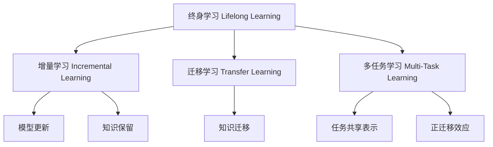

# 终身学习Lifelong Learning原理与代码实例讲解

## 1.背景介绍

在当今快速变化的世界中,人工智能系统需要不断学习和适应新的环境、任务和数据。传统的机器学习模型通常在固定的数据集上训练,并在部署后保持静态不变。然而,现实世界中的数据分布往往是动态变化的,这就要求人工智能系统具备持续学习的能力,以应对新出现的情况。这种不断获取新知识并将其融入现有模型的过程被称为"终身学习"(Lifelong Learning)。

终身学习的概念源于人类学习的本质。人类在整个生命周期中都在持续学习,将新获得的知识与已有的经验相结合,不断完善自身的认知模型。类似地,人工智能系统也需要具备这种学习能力,以确保其在动态环境中保持高效和准确。

### 1.1 传统机器学习的局限性

传统的机器学习方法通常假设训练数据和测试数据来自相同的固定分布。然而,在实际应用中,这个假设往往不成立。例如,一个用于识别交通标志的系统可能最初在某个特定地区的数据上训练,但在部署到其他地区时,会遇到新的交通标志样式和环境条件。如果系统无法学习这些新的模式,其性能将会下降。

此外,大多数传统机器学习算法都是在离线模式下进行训练的,这意味着一旦模型部署,它就无法继续学习新的数据。这种静态特性使得系统无法适应动态变化的环境,也限制了它们的应用范围。

### 1.2 终身学习的重要性

终身学习旨在解决上述局限性,使人工智能系统能够持续学习和适应新的环境。这不仅可以提高系统的鲁棒性和泛化能力,还能够减少重新训练整个模型的需求,从而节省计算资源和时间成本。

在许多实际应用中,终身学习都扮演着重要角色。例如,在自动驾驶汽车领域,车辆需要不断学习新的道路情况、交通规则和驾驶模式,以确保安全高效的行驶。在医疗诊断领域,人工智能系统需要持续学习新的疾病案例和治疗方法,以提高诊断准确性。在自然语言处理领域,语言模型需要适应不断变化的语言习惯和新词汇,以保持与人类自然交互的能力。

总的来说,终身学习是实现通用人工智能(Artificial General Intelligence, AGI)的关键步骤之一。它赋予人工智能系统持续学习和自我完善的能力,使其能够更好地模拟人类的认知过程,并在更广泛的领域发挥作用。

## 2.核心概念与联系

### 2.1 增量学习 (Incremental Learning)

增量学习是终身学习的核心概念之一。它指的是机器学习系统在接收到新数据时,能够逐步更新现有模型,而无需从头开始重新训练整个模型。这种方式可以显著提高学习效率,并且避免了由于重新训练而导致的"灾难性遗忘"(Catastrophic Forgetting)问题。

增量学习算法通常分为两个主要步骤:

1. **模型更新**:当新数据到来时,算法会根据新数据对现有模型进行更新,以纳入新的知识。
2. **知识保留**:在更新模型的同时,算法还需要保留模型对之前学习的知识的掌握,避免遗忘旧知识。

实现增量学习的一种常见方法是使用"基于示例的"(instance-based)学习算法,如最近邻居(Nearest Neighbor)算法。这些算法直接存储训练示例,并在新数据到来时,根据相似性对模型进行更新。另一种流行的方法是使用基于神经网络的模型,并采用特殊的训练策略(如权重约束、正则化等)来缓解灾难性遗忘问题。

增量学习为终身学习奠定了基础,但它也面临一些挑战,如如何平衡新旧知识的重要性、如何高效地管理不断增长的数据量等。研究人员正在探索各种新颖的方法来解决这些挑战。

### 2.2 迁移学习 (Transfer Learning)

迁移学习是另一个与终身学习密切相关的概念。它指的是将在一个领域或任务中学习到的知识,应用到另一个相关但不同的领域或任务上。这种方法可以显著减少新任务所需的训练数据和计算资源,从而提高学习效率。

迁移学习的核心思想是,不同任务之间往往存在一些共享的底层知识或模式。通过从源任务中提取这些通用知识,并将其迁移到目标任务中,可以加速目标任务的学习过程。

在深度学习领域,迁移学习通常通过模型微调(fine-tuning)或特征提取等技术来实现。例如,在计算机视觉任务中,我们可以使用在ImageNet数据集上预训练的卷积神经网络作为起点,然后在目标数据集上进行微调,以适应新的视觉任务。

迁移学习为终身学习提供了一种高效的知识迁移机制,使得系统能够从以前的经验中获益,而不必每次都从头开始学习。然而,迁移学习也面临一些挑战,如如何确定源任务和目标任务之间的相关性、如何避免负迁移(negative transfer)等。

### 2.3 多任务学习 (Multi-Task Learning)

多任务学习是另一种与终身学习相关的技术。它指的是同时学习多个相关任务,利用这些任务之间的相关性来提高整体学习效率和性能。

在多任务学习中,不同的任务共享一部分底层模型参数或表示,这些共享的部分捕获了任务之间的共同知识或模式。通过联合训练,模型可以同时学习多个任务,并利用任务之间的相关性来相互增强。

多任务学习的优点在于,它可以提高模型的泛化能力,减少过拟合的风险,并提高计算效率。此外,在某些情况下,联合学习多个任务还可以提高单个任务的性能,这被称为"正迁移"(positive transfer)效应。

在深度学习中,多任务学习通常通过共享网络的底层或中间层来实现。不同的任务可以共享这些层,同时在顶层拥有专门的任务特定层。通过联合训练,共享层可以学习到多个任务之间的通用表示,而专门层则捕获每个任务的特定模式。

多任务学习为终身学习提供了一种同时学习多个相关任务的框架,使得系统可以更高效地获取和整合不同领域的知识。然而,它也面临一些挑战,如如何确定任务之间的相关性、如何平衡不同任务的重要性等。

### 2.4 Mermaid流程图

下面的Mermaid流程图展示了终身学习的核心概念及其相互关系:

## 3.核心算法原理具体操作步骤

在这一部分,我们将介绍一些常见的终身学习算法及其具体操作步骤。

### 3.1 基于实例的增量学习算法

基于实例的增量学习算法是一种简单但有效的方法。它们直接存储训练实例,并在新数据到来时,根据相似性对模型进行更新。

一种常见的基于实例的算法是**增量最近邻居算法**(Incremental Nearest Neighbor, INN)。它的具体步骤如下:

1. 初始化一个空的训练集 $\mathcal{D}_0$。
2. 对于每一批新数据 $\mathcal{B}_t$:
   a. 将 $\mathcal{B}_t$ 合并到训练集中,得到新的训练集 $\mathcal{D}_t = \mathcal{D}_{t-1} \cup \mathcal{B}_t$。
   b. 使用 $\mathcal{D}_t$ 训练一个新的最近邻居模型 $\mathcal{M}_t$。
3. 使用最新的模型 $\mathcal{M}_t$ 进行预测。

虽然简单,但增量最近邻居算法存在一些缺点,如对噪声数据敏感、计算效率低等。为了解决这些问题,研究人员提出了多种改进版本,如基于原型的增量学习算法(Incremental Learning with Prototypes)等。

### 3.2 基于神经网络的增量学习算法

基于神经网络的增量学习算法通常采用特殊的训练策略来缓解"灾难性遗忘"问题。一种流行的方法是**elastic weight consolidation**(EWC)算法,它的步骤如下:

1. 在初始训练集 $\mathcal{D}_0$ 上训练一个神经网络模型 $\mathcal{M}_0$。
2. 对于每一批新数据 $\mathcal{B}_t$:
   a. 计算 $\mathcal{M}_{t-1}$ 在 $\mathcal{D}_0$ 上的重要参数,并为这些参数赋予较高的正则化权重。
   b. 在 $\mathcal{B}_t$ 上微调 $\mathcal{M}_{t-1}$,得到新模型 $\mathcal{M}_t$。
3. 使用最新的模型 $\mathcal{M}_t$ 进行预测。

EWC算法通过对重要参数施加约束,使它们在后续训练中不会发生太大变化,从而保留了对旧知识的掌握。另一种类似的方法是**learning without forgetting**(LwF),它通过在损失函数中添加知识蒸馏(knowledge distillation)项来保留旧知识。

除了上述方法,还有一些基于动态架构的增量学习算法,如**ProgressiveNet**。它通过为每一批新数据创建一个新的子网络,并将其与现有网络连接,从而逐步扩展整个网络架构。这种方法可以有效避免灾难性遗忘,但代价是网络规模的不断增长。

### 3.3 基于生成模型的终身学习算法

除了上述基于判别模型的方法,一些研究者也探索了基于生成模型(如变分自编码器、生成对抗网络等)的终身学习算法。这些算法通常利用生成模型的潜在空间来实现知识表示和迁移。

一种典型的方法是**贝叶斯生成模型**(Bayesian Generative Models)。它将模型参数视为随机变量,并在观测到新数据时,根据贝叶斯规则更新参数的后验分布。这种方式可以自然地融合新旧知识,并且具有良好的理论保证。

另一种流行方法是**生成重放**(Generative Replay),它通过训练一个生成模型来捕获旧数据的分布,然后在新数据到来时,从生成模型中采样"伪造"的旧数据,与新数据一起训练判别模型。这种方式避免了直接存储大量旧数据,从而提高了计算效率。

基于生成模型的终身学习算法为这一领域提供了新的视角和思路,但它们也面临一些挑战,如如何高效地训练生成模型、如何在高维空间中实现有效的知识表示等。

## 4.数学模型和公式详细讲解举例说明

在这一部分,我们将介绍一些与终身学习相关的数学模型和公式,并通过具体例子进行详细讲解。

### 4.1 贝叶斯在线学习

贝叶斯在线学习是一种基于贝叶斯推理的终身学习框架。它将模型参数视为随机变量,并在观测到新数据时,根据贝叶斯规则更新参数的后验分布。

设模型参数为 $\theta$,初始先验分布为 $p(\theta)$。在观测到第一批数据 $\mathcal{D}_0$ 后,参数的后验分布为:

$$p(\theta|\mathcal{D}_0) = \frac{p(\mathcal{D}_0|\theta)p(\theta)}{p(\mathcal{D}_0)}$$

其中