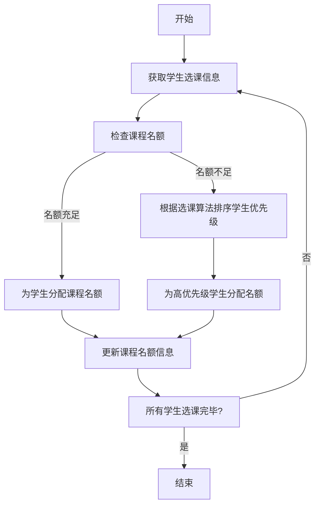
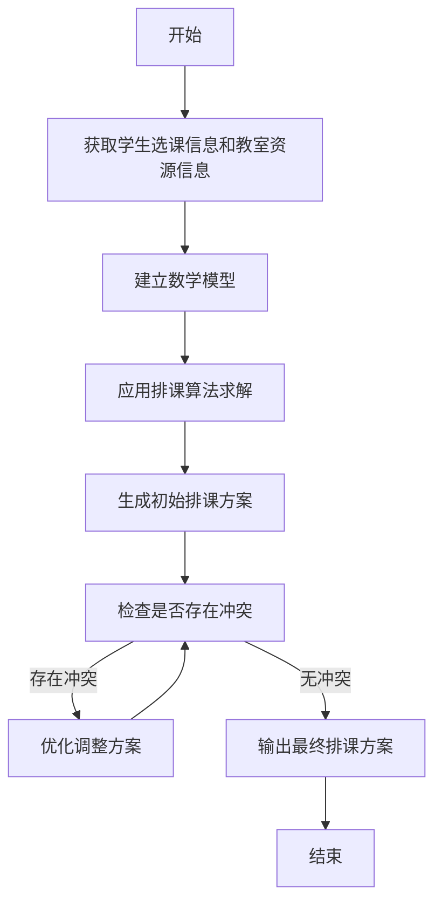
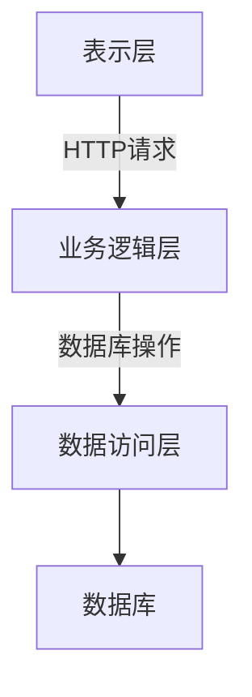

# 网上选排课系统详细设计与具体代码实现

## 1.背景介绍

随着在线教育的快速发展,网上选排课系统已经成为现代教育体系中不可或缺的重要组成部分。这种系统旨在为学生提供一个便捷的平台,方便他们根据自身的兴趣、时间安排和专业要求选择并安排课程。同时,它也为教师和管理人员提供了一个高效的工具,用于管理课程、分配教室资源以及监控学生的选课情况。

网上选排课系统的出现极大地简化了传统的手工操作流程,提高了工作效率,减轻了管理人员的工作负担。此外,这种系统还能够实时更新课程信息,确保学生获取最新的课程安排,从而提高了整个教育过程的透明度和公平性。

## 2.核心概念与联系

网上选排课系统包含以下几个核心概念:

1. **课程(Course)**: 指教师授课的具体科目,包括课程名称、课程编号、上课时间、上课地点、任课教师等信息。

2. **学生(Student)**: 系统的主要使用者,可以根据自身需求选择课程并查看个人的课程安排。

3. **教师(Teacher)**: 负责开设和授课的人员,可以在系统中维护自己的课程信息。

4. **管理员(Admin)**: 拥有最高权限,负责管理整个系统的运行,包括添加课程、分配教室资源等。

5. **选课(Course Selection)**: 学生在系统中选择自己想要修读的课程的过程。

6. **排课(Course Scheduling)**: 根据学生的选课情况以及教室资源,自动或手动安排课程的上课时间和地点。

这些核心概念相互关联,构成了整个网上选排课系统的基础框架。其中,课程是系统的核心实体,学生、教师和管理员则扮演着不同的角色,通过选课和排课等功能与课程进行交互。

## 3.核心算法原理具体操作步骤

网上选排课系统的核心算法主要包括两个部分:选课算法和排课算法。

### 3.1 选课算法

选课算法的主要目标是确保学生能够公平地选择自己想要修读的课程,同时避免出现课程冲突的情况。常见的选课算法包括:

1. **先到先得(First Come, First Served)算法**:这是最简单的选课算法,学生按照选课时间的先后顺序获得课程名额。该算法易于实现,但可能导致后来者无法选择到心仪的课程。

2. **随机选课算法**:系统会为每个学生分配一个随机数,按照随机数的大小依次选课。这种算法较为公平,但可能导致部分学生无法选择到自己想要的课程组合。

3. **优先级选课算法**:根据学生的年级、绩点等因素确定选课优先级,优先级高的学生先选课。这种算法能够满足特殊群体的需求,但可能会引起其他学生的不满。

4. **约束优化选课算法**:通过建立数学模型,将学生的课程需求、时间约束等条件作为优化目标,求解一个满足各种约束条件的最优解。这种算法能够充分考虑不同因素,但计算复杂度较高。

在实际应用中,可以根据具体情况选择合适的算法或者将多种算法相结合,以达到公平、高效的选课效果。

算法的具体操作步骤如下:



### 3.2 排课算法

排课算法的主要目标是根据学生的选课情况以及教室资源情况,为每门课程安排合理的上课时间和地点,避免出现课程时间冲突或教室资源浪费的情况。常见的排课算法包括:

1. **图着色算法**:将每门课程视为一个节点,如果两门课程的上课时间存在冲突,则在两个节点之间连一条边。着色问题即为如何为每个节点着不同的颜色,使相邻节点颜色不同,从而实现无冲突的课程安排。

2. **约束编程算法**:将排课问题建模为一个约束满足问题(Constraint Satisfaction Problem, CSP),通过搜索算法求解满足所有约束条件的最优解。

3. **启发式算法**:包括模拟退火算法、遗传算法等,通过设计合理的目标函数和搜索策略,逐步迭代优化课程安排方案。

4. **整数规划算法**:将排课问题转化为整数规划模型,利用求解器求解最优解。

算法的具体操作步骤如下:



## 4.数学模型和公式详细讲解举例说明

为了更好地描述和求解网上选排课系统中的选课和排课问题,我们可以构建数学模型,并使用相应的公式进行计算和优化。

### 4.1 选课模型

假设有 $n$ 名学生和 $m$ 门课程,我们使用一个 $n \times m$ 的矩阵 $X$ 来表示学生的选课情况,其中 $X_{ij}=1$ 表示第 $i$ 个学生选择了第 $j$ 门课程,否则 $X_{ij}=0$。我们的目标是最大化学生的选课满意度,同时满足课程容量的约束条件。

数学模型可以表示为:

$$
\max \sum_{i=1}^{n}\sum_{j=1}^{m}w_{ij}X_{ij}
$$
$$
\text{s.t.} \quad \sum_{i=1}^{n}X_{ij} \leq C_j, \quad j=1,2,\ldots,m
$$
$$
X_{ij} \in \{0,1\}, \quad i=1,2,\ldots,n, \quad j=1,2,\ldots,m
$$

其中,

- $w_{ij}$ 表示第 $i$ 个学生对第 $j$ 门课程的满意度权重,可以根据学生的兴趣爱好、专业要求等因素确定;
- $C_j$ 表示第 $j$ 门课程的容量上限。

这是一个整数规划问题,可以使用商业求解器(如 CPLEX、Gurobi 等)或者设计专门的算法(如分支定界法、列生成法等)来求解。

### 4.2 排课模型

假设有 $n$ 门课程需要排课,我们使用一个 $n \times n$ 的矩阵 $Y$ 来表示课程之间的冲突关系,其中 $Y_{ij}=1$ 表示第 $i$ 门课程和第 $j$ 门课程的上课时间存在冲突,否则 $Y_{ij}=0$。我们的目标是最小化课程冲突的数量,同时满足教室资源的约束条件。

数学模型可以表示为:

$$
\min \sum_{i=1}^{n}\sum_{j=i+1}^{n}Y_{ij}
$$
$$
\text{s.t.} \quad \sum_{i=1}^{n}R_{ik}X_{ij} \leq M_k, \quad k=1,2,\ldots,T
$$
$$
Y_{ij} \in \{0,1\}, \quad i,j=1,2,\ldots,n, \quad i \neq j
$$
$$
X_{ij} \in \{0,1\}, \quad i=1,2,\ldots,n, \quad j=1,2,\ldots,m
$$

其中,

- $R_{ik}$ 表示第 $i$ 门课程在第 $k$ 个时间段的教室需求量;
- $M_k$ 表示第 $k$ 个时间段的教室资源总量;
- $T$ 表示总的时间段数量;
- $X_{ij}$ 表示第 $i$ 门课程是否安排在第 $j$ 门课程的时间段上。

这也是一个整数规划问题,可以使用商业求解器或者设计专门的算法来求解。

以上数学模型和公式为网上选排课系统提供了理论基础,通过合理的建模和求解,可以获得较为理想的选课和排课方案。

## 5.项目实践:代码实例和详细解释说明

为了更好地理解网上选排课系统的实现过程,我们将提供一些核心代码示例,并对其进行详细的解释说明。

### 5.1 系统架构

我们采用经典的三层架构设计,包括表示层(Presentation Layer)、业务逻辑层(Business Logic Layer)和数据访问层(Data Access Layer)。



表示层负责与用户交互,包括Web界面和API接口。业务逻辑层处理具体的业务逻辑,如选课、排课等。数据访问层负责与数据库进行交互,执行数据的增删改查操作。

### 5.2 核心类设计

我们定义了以下几个核心类:

- `Course`: 表示课程实体,包含课程名称、课程编号、任课教师、上课时间、上课地点等属性。
- `Student`: 表示学生实体,包含学生姓名、学号、所选课程等属性。
- `Teacher`: 表示教师实体,包含教师姓名、工号、开设课程等属性。
- `Admin`: 表示管理员实体,拥有最高权限,可以执行添加课程、分配教室等操作。
- `CourseScheduler`: 负责执行排课算法,生成最终的课程安排方案。
- `CourseSelector`: 负责执行选课算法,为学生分配课程名额。

以 `Course` 类为例,其核心代码如下:

```python
class Course:
    def __init__(self, course_id, name, teacher, capacity):
        self.course_id = course_id
        self.name = name
        self.teacher = teacher
        self.capacity = capacity
        self.students = []
        self.schedule = None

    def add_student(self, student):
        if len(self.students) < self.capacity:
            self.students.append(student)
            return True
        else:
            return False

    def set_schedule(self, schedule):
        self.schedule = schedule

    def __str__(self):
        return f"Course(id={self.course_id}, name='{self.name}', teacher={self.teacher.name}, capacity={self.capacity})"
```

这个类包含了课程的基本属性,如课程ID、名称、任课教师和容量限制。它还提供了 `add_student` 方法用于为课程添加学生,以及 `set_schedule` 方法用于设置课程的上课时间和地点。

### 5.3 选课算法实现

我们以优先级选课算法为例,其核心代码如下:

```python
def priority_course_selection(students, courses):
    # 按照学生的优先级对学生列表进行排序
    students.sort(key=lambda s: s.priority, reverse=True)

    for student in students:
        preferred_courses = student.preferred_courses
        for course in preferred_courses:
            if course.add_student(student):
                student.enrolled_courses.append(course)
                break

    return students
```

这个算法首先会根据学生的优先级对学生列表进行排序。然后,对于每个学生,它会遍历该学生的优先选课列表,尝试为学生分配课程名额。一旦成功分配了一门课程,就跳出内层循环,继续处理下一个学生。

### 5.4 排课算法实现

我们以图着色算法为例,其核心代码如下:

```python
def graph_coloring_scheduling(courses):
    # 构建课程冲突图
    graph = build_conflict_graph(courses)

    # 执行图着色算法
    colors = graph_coloring(graph)

    # 根据着色结果生成课程安排
    schedule = generate_schedule(courses, colors)

    return schedule
```

首先,我们需要构建一个课程冲突图,其