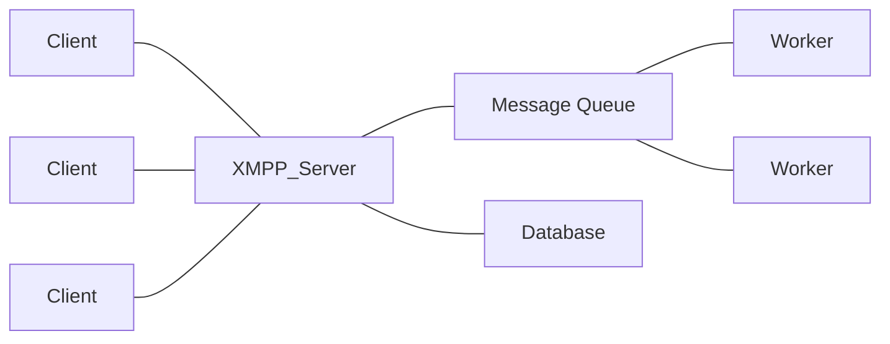

# 网络即时通信的原理和实现

## 1. 背景介绍
### 1.1 即时通信的发展历程
### 1.2 即时通信的应用场景
### 1.3 即时通信的技术挑战

## 2. 核心概念与联系
### 2.1 网络协议
#### 2.1.1 TCP/IP协议
#### 2.1.2 UDP协议
#### 2.1.3 HTTP/HTTPS协议
### 2.2 即时通信协议 
#### 2.2.1 XMPP协议
#### 2.2.2 MQTT协议
#### 2.2.3 WebSocket协议
### 2.3 消息队列
#### 2.3.1 Kafka
#### 2.3.2 RabbitMQ
#### 2.3.3 RocketMQ
### 2.4 实时数据库
#### 2.4.1 Redis
#### 2.4.2 MongoDB

## 3. 核心算法原理具体操作步骤
### 3.1 消息可靠投递
#### 3.1.1 消息持久化
#### 3.1.2 消息确认机制
#### 3.1.3 消息重试策略
### 3.2 消息实时推送
#### 3.2.1 长连接机制
#### 3.2.2 消息推送流程
#### 3.2.3 心跳保活机制
### 3.3 海量消息存储与检索
#### 3.3.1 分布式存储架构
#### 3.3.2 消息索引与检索
#### 3.3.3 消息去重与幂等

## 4. 数学模型和公式详细讲解举例说明
### 4.1 消息可靠性数学模型
### 4.2 消息实时性数学模型 
### 4.3 消息吞吐量估算公式

## 5. 项目实践：代码实例和详细解释说明
### 5.1 基于XMPP协议的即时通信系统
#### 5.1.1 系统架构设计
#### 5.1.2 客户端实现
#### 5.1.3 服务端实现
### 5.2 基于MQTT协议的物联网消息系统
#### 5.2.1 系统架构设计  
#### 5.2.2 MQTT Broker实现
#### 5.2.3 MQTT Client实现
### 5.3 基于WebSocket的Web即时通信
#### 5.3.1 系统架构设计
#### 5.3.2 WebSocket服务端实现
#### 5.3.3 WebSocket客户端实现

## 6. 实际应用场景
### 6.1 社交聊天应用
### 6.2 在线客服系统
### 6.3 物联网设备通信
### 6.4 实时协作编辑系统

## 7. 工具和资源推荐
### 7.1 开源即时通信框架
#### 7.1.1 ejabberd
#### 7.1.2 mosquitto
#### 7.1.3 socket.io
### 7.2 即时通信云服务 
#### 7.2.1 环信
#### 7.2.2 融云
#### 7.2.3 网易云信
### 7.3 学习资源
#### 7.3.1 书籍推荐
#### 7.3.2 视频教程
#### 7.3.3 技术博客

## 8. 总结：未来发展趋势与挑战
### 8.1 5G时代的机遇
### 8.2 人工智能技术的应用
### 8.3 安全与隐私保护
### 8.4 标准化与互通

## 9. 附录：常见问题与解答
### 9.1 如何选择即时通信协议？ 
### 9.2 如何保证消息的可靠投递？
### 9.3 如何实现亿级消息并发？
### 9.4 如何降低通信延迟？

即时通信已经成为互联网时代不可或缺的基础服务，支撑着社交网络、在线教育、远程医疗、物联网等众多领域的应用。随着移动互联网和5G技术的发展，用户对即时通信的实时性、可靠性和安全性提出了更高的要求。本文将深入探讨网络即时通信的原理和实现，剖析其中的关键技术，分享项目实践经验，展望未来发展趋势，为开发者和架构师提供参考和指导。

即时通信的本质是实现分布式节点之间的低时延、高可靠的双向通信。其核心在于建立一个稳定高效的网络连接，并在此基础上实现消息的可靠投递与实时推送。常见的即时通信协议有XMPP、MQTT和WebSocket等，它们在消息格式、编解码方式、服务质量保障机制等方面各有特点。

为了保证消息的可靠投递，需要采用消息持久化、确认机制和重试策略等措施。服务端将消息持久化到磁盘或数据库中，客户端收到消息后回复ACK确认，对于未确认的消息进行重试。常用的消息队列中间件如Kafka、RabbitMQ能够实现消息的可靠存储与分发。

为了实现消息的实时推送，需要维持客户端与服务端的长连接，通过心跳机制来保活。当服务端有消息到达时，立即通过长连接将消息推送给客户端，避免了轮询的延迟。在移动网络环境下，还需要处理网络切换、信号不稳等问题。

对于海量消息的存储与检索，需要采用分布式存储架构，将消息数据分片存储到多台服务器上。通过建立消息的索引，可以快速检索历史消息。针对重复消息的处理，可以通过幂等设计和去重机制来保证消息的一致性。

下面我们通过一个基于XMPP协议的即时通信系统的项目实践，来说明如何实现一个完整的即时通信解决方案。

### 系统架构设计



系统主要由XMPP服务器、消息队列、数据库和工作进程组成。客户端通过XMPP协议与服务器建立长连接，服务器将客户端发送的消息投递到消息队列中，工作进程从消息队列中取出消息，完成在线状态同步、消息存储等任务。

### 客户端实现

客户端基于XMPP协议，使用XMPPFramework等开源库，实现用户登录、收发消息、好友管理等功能。核心代码如下：

```objc
// 连接XMPP服务器
- (void)connectToServer {
    self.xmppStream = [[XMPPStream alloc] init];
    [self.xmppStream addDelegate:self delegateQueue:dispatch_get_main_queue()];
    self.xmppStream.hostName = @"localhost";
    self.xmppStream.hostPort = 5222;
    NSError *error = nil;
    if (![self.xmppStream connectWithTimeout:30 error:&error]) {
        NSLog(@"Connect error: %@", error);
    }
}

// 发送消息
- (void)sendMessage:(NSString *)text to:(XMPPJID *)jid {
    XMPPMessage *message = [XMPPMessage messageWithType:@"chat" to:jid];
    [message addBody:text];
    [self.xmppStream sendElement:message];
}

// 接收消息
- (void)xmppStream:(XMPPStream *)sender didReceiveMessage:(XMPPMessage *)message {
    NSString *body = [[message elementForName:@"body"] stringValue];
    NSString *from = [[message attributeForName:@"from"] stringValue];
    NSLog(@"Received message from %@: %@", from, body);
}
```

### 服务端实现

服务端基于ejabberd等开源XMPP服务器，通过插件机制扩展业务逻辑。在`mod_offline`插件的基础上，实现消息持久化、离线推送等功能。

```erlang
-module(mod_offline_extended).
-behavior(gen_mod).

-export([start/2, stop/1, store_packet/6, pop_offline_messages/3]).

start(Host, Opts) ->
    ejabberd_hooks:add(offline_message_hook, Host, ?MODULE, store_packet, 50),
    % 初始化数据库连接池
    ok.

stop(Host) -> 
    ejabberd_hooks:delete(offline_message_hook, Host, ?MODULE, store_packet, 50),
    ok.

store_packet(From, To, Packet, _IgnoreRequest, _IgnoreStore, Host) ->
    case ejabberd_users:is_user_online(To) of
        true -> ok;
        _ -> 
            % 将消息持久化到数据库
            {ok, _} = mysql:query(pool, <<"INSERT INTO offline_message(from_jid, to_jid, packet) VALUES (?, ?, ?)">>,[From, To, Packet]),
            % 投递离线消息推送任务到消息队列
            jobs:enqueue(offline_message_job, #{to => To, packet => Packet})
    end.

pop_offline_messages(To, _Limit, Host) ->
    % 从数据库中读取离线消息
    {ok, Result} = mysql:query(pool, <<"SELECT packet FROM offline_message WHERE to_jid=?">>,[To]),
    Packets = [mysql:get_value(packet, Row) || Row <- Result],
    % 删除已读消息
    {ok, _} = mysql:query(pool, <<"DELETE FROM offline_message WHERE to_jid=?">>,[To]),
    {ok, Packets}.
```

工作进程从消息队列中取出离线消息推送任务，通过APNs、小米推送等渠道将消息推送到客户端。

```erlang
-module(apns_worker).
-behavior(jobs_worker).

-export([perform/1]).

perform(#{to := To, packet := Packet} = Job) ->
    case apns:push(To, Packet) of
        ok -> 
            jobs:ack(Job);
        {error, Reason} ->
            jobs:nack(Job, Reason)
    end.
```

通过消息队列异步处理离线消息，可以显著提高系统的吞吐量和响应速度。

## 数学模型和公式

在即时通信系统中，需要考虑消息的可靠性和实时性。可以用数学模型来描述和优化系统的性能指标。

### 消息可靠性模型

假设消息从发送到接收需要经过 $n$ 个节点，每个节点的可靠性为 $p_i$，则端到端的消息可靠性为：

$$
R = \prod_{i=1}^n p_i
$$

为了提高可靠性，可以采用多路复用、重传等机制。假设有 $m$ 条独立的传输路径，每条路径的可靠性为 $R_j$，则总的可靠性为：

$$
R_{total} = 1 - \prod_{j=1}^m (1 - R_j)
$$

### 消息实时性模型

假设消息的平均到达时延为 $T$，服从指数分布，则时延超过 $t$ 的概率为：

$$
P(T > t) = e^{-\lambda t}
$$

其中，$\lambda$ 为到达率，反映了消息到达的频率。为了降低延迟，可以采用长连接、消息压缩等方式。

### 系统吞吐量估算

假设系统的平均请求到达率为 $\lambda$，平均服务时间为 $\bar{x}$，服务器数量为 $c$，则根据排队论中的Erlang C公式，系统的吞吐量为：

$$
X = \frac{\lambda}{\lambda \bar{x} + c - \lambda \bar{x} \cdot P_c}
$$

其中，$P_c$ 为请求等待的概率，可以通过Erlang C公式计算：

$$
P_c = \frac{\frac{(c \rho)^c}{c!}}{\sum_{k=0}^{c-1} \frac{(c \rho)^k}{k!} + \frac{(c \rho)^c}{c!} \cdot \frac{c}{c-\rho}}
$$

其中，$\rho = \lambda \bar{x}$ 为服务强度。

通过合理设置服务器数量、优化服务时间，可以提高系统的吞吐量。

## 实际应用场景

即时通信技术广泛应用于以下场景：

### 社交聊天应用

社交聊天是即时通信最常见的应用场景，如微信、QQ、WhatsApp等。用户可以与好友进行一对一或群组聊天，发送文本、图片、语音、视频等多媒体消息。

### 在线客服系统

在电商、金融、教育等行业，用户往往需要与客服人员进行实时沟通，解决问题或获取帮助。通过即时通信技术，可以实现多渠道的客户服务，提高响应速度和用户满意度。

### 物联网设备通信

随着物联网的发展，越来越多的设备需要与云端进行实时通信，如智能家居、车联网、工业控制等。MQTT等轻量级的即时通信协议适用于资源受限的物