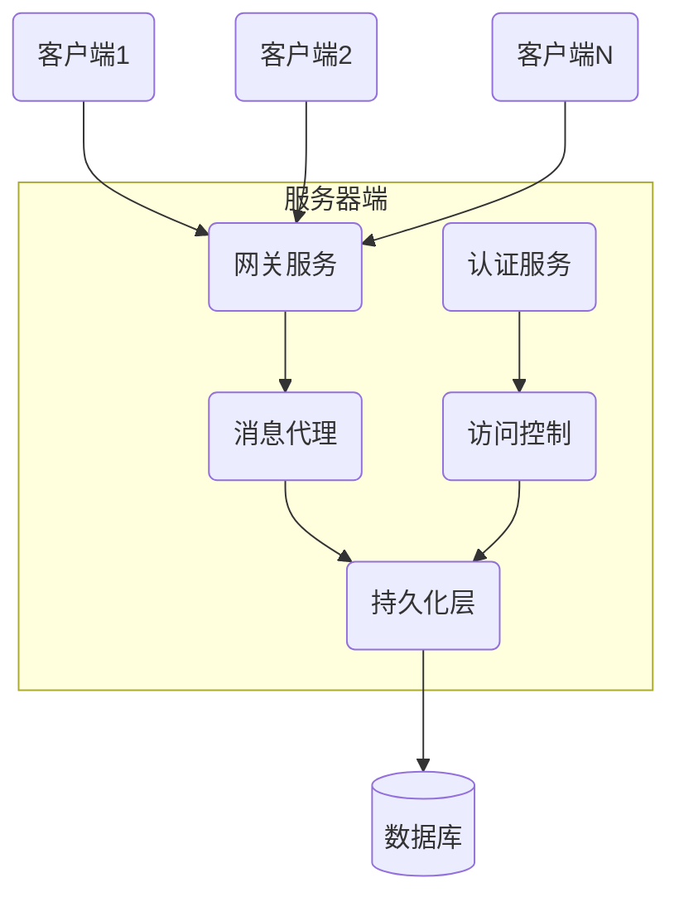
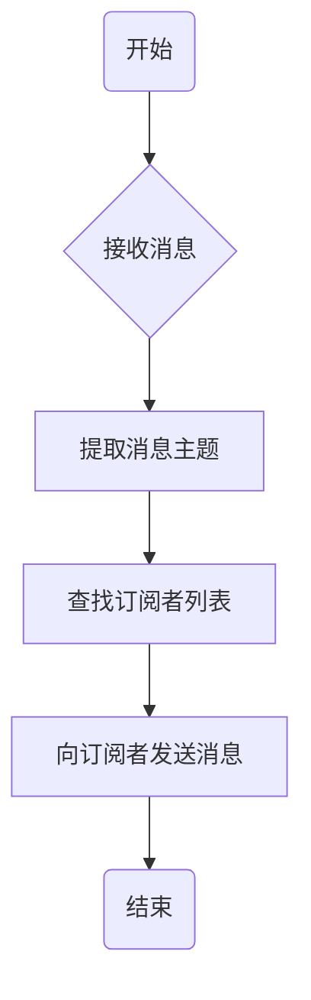
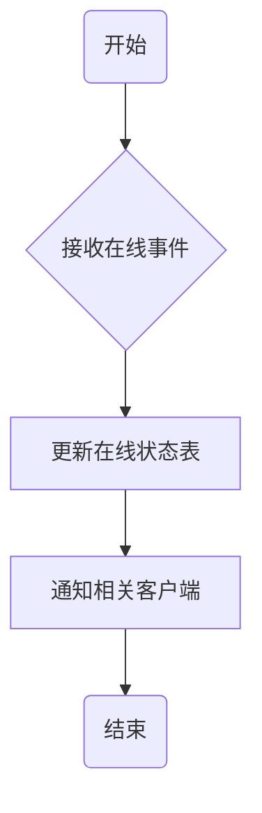
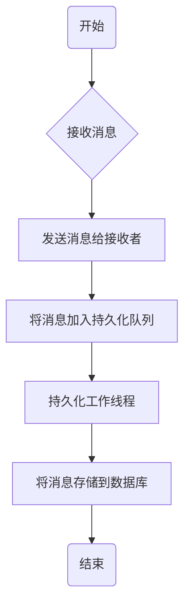

# 聊天室管理系统设计与实现

## 1.背景介绍

随着互联网技术的不断发展,实时通信应用程序变得越来越普及。聊天室作为一种重要的实时通信工具,已经广泛应用于各个领域,如在线客服、团队协作、社交娱乐等。设计和实现一个高效、安全、可扩展的聊天室管理系统,对于满足不断增长的实时通信需求至关重要。

本文将探讨聊天室管理系统的设计与实现,包括系统架构、核心算法、数学模型、代码实现、实际应用场景、工具和资源推荐等内容。通过深入分析和实践,读者能够全面了解聊天室系统的工作原理,掌握关键技术,并获得实用的设计和开发经验。

### 1.1 聊天室系统的作用

聊天室系统主要具有以下作用:

- 实时消息传递:允许用户实时发送和接收文本、图片、文件等多种格式的消息。
- 多人交流:支持多个用户同时加入同一个聊天室,实现群聊和信息共享。
- 在线状态管理:跟踪和显示用户的在线状态,方便其他用户了解可交流对象。
- 消息持久化:将聊天记录持久化存储,支持历史消息查询和审计。
- 用户权限管理:对不同用户或用户组设置不同的权限,实现有效的访问控制。

### 1.2 聊天室系统的挑战

设计和实现一个高质量的聊天室管理系统面临以下主要挑战:

- 高并发处理:需要高效处理大量用户的实时消息传输和状态查询请求。
- 消息可靠传递:确保消息能够可靠地在发送方和接收方之间传递,避免丢失或重复。
- 系统可扩展性:能够适应未来用户和流量的快速增长,实现平滑扩展。
- 安全性和隐私保护:防止未经授权的访问,保护用户的隐私信息和聊天内容。
- 跨平台支持:支持不同操作系统、浏览器、移动设备等多种客户端环境。

## 2.核心概念与联系

### 2.1 系统架构概览

聊天室管理系统通常采用客户端-服务器架构,由客户端、服务器端和数据库三个主要组件构成。下图展示了系统的整体架构:

- **客户端**:用户通过客户端应用程序(如网页、移动APP等)发送和接收消息,与服务器端进行交互。
- **网关服务**:作为客户端和服务器端之间的入口点,负责接收客户端请求并将其转发到相应的服务组件。
- **消息代理**:核心消息处理组件,负责路由、分发消息,维护在线用户状态等。
- **认证服务**:负责用户身份验证和授权,确保只有合法用户才能访问系统资源。
- **访问控制**:根据用户权限控制对聊天室和消息的访问。
- **持久化层**:将聊天消息和用户状态等数据持久化存储到数据库中。
- **数据库**:存储系统运行所需的各种数据,如用户信息、聊天记录等。

### 2.2 关键技术概念

实现聊天室管理系统需要涉及以下几个关键技术概念:

- **WebSocket**:一种在单个TCP连接上进行全双工通信的协议,可实现服务器主动向客户端推送数据。
- **长连接**:与传统的短连接(如HTTP)不同,长连接在消息传输完成后不会立即断开,可用于实时通信。
- **发布/订阅模式**:消息发送方(发布者)将消息发布到代理,订阅者通过订阅主题从代理接收消息。
- **消息队列**:用于临时存储待处理的消息,实现异步解耦和削峰填谷。
- **消息持久化**:将聊天消息持久化存储,以支持历史消息查询和审计。
- **在线状态管理**:跟踪和维护用户的在线状态,确定可与之交互的用户。
- **用户权限管理**:对不同用户或用户组设置不同的权限,控制对聊天室和消息的访问。

## 3.核心算法原理具体操作步骤

### 3.1 消息路由算法

消息路由是聊天室系统的核心功能之一。当用户发送消息时,系统需要将消息准确地路由到正确的目标聊天室或用户。常用的消息路由算法包括:

1. **主题订阅模式**:发送者将消息发布到特定主题,订阅该主题的接收者将收到该消息。适用于群聊场景。

2. **点对点模式**:发送者直接将消息发送给特定的接收者。适用于一对一私聊场景。

3. **内容过滤模式**:根据消息内容进行过滤和路由,例如根据关键字将消息发送到特定聊天室。

下面以主题订阅模式为例,介绍消息路由算法的具体操作步骤:

1. **接收消息**:服务器接收到客户端发送的消息。
2. **提取消息主题**:从消息中提取出目标主题(聊天室标识)。
3. **查找订阅者列表**:根据主题查找订阅了该主题的用户列表。
4. **向订阅者发送消息**:遍历订阅者列表,将消息发送给每个订阅者。
5. **结束**:消息路由过程结束。

### 3.2 在线状态管理算法

在聊天室系统中,需要实时跟踪和管理用户的在线状态,以确定哪些用户可以进行交互。常用的在线状态管理算法包括:

1. **集中式管理**:服务器端维护一个集中的在线用户状态表,记录每个用户的在线状态。
2. **分布式管理**:将在线用户状态分散存储在多个节点上,提高可扩展性和容错能力。
3. **基于发布/订阅的管理**:用户上线时向代理发布在线状态,其他用户订阅该状态以获取更新。

下面以集中式管理为例,介绍在线状态管理算法的具体操作步骤:

1. **接收在线事件**:服务器接收到用户上线、下线或状态变更的事件。
2. **更新在线状态表**:根据事件类型,在集中的在线状态表中更新相应用户的状态。
3. **通知相关客户端**:遍历在线状态表,将状态变更通知给与该用户相关的其他在线用户。
4. **结束**:在线状态管理过程结束。

### 3.3 消息持久化算法

为了支持历史消息查询和审计,聊天室系统需要将消息持久化存储到数据库中。常用的消息持久化算法包括:

1. **同步持久化**:在将消息发送给接收者之前,先将消息存储到数据库中。
2. **异步持久化**:先将消息发送给接收者,然后异步地将消息存储到数据库中。
3. **批量持久化**:周期性地将累积的消息批量存储到数据库中,提高性能。

下面以异步持久化为例,介绍消息持久化算法的具体操作步骤:

1. **接收消息**:服务器接收到客户端发送的消息。
2. **发送消息给接收者**:将消息发送给目标接收者,确保实时性。
3. **将消息加入持久化队列**:将消息加入持久化队列,等待异步持久化。
4. **持久化工作线程**:专门的工作线程从持久化队列中取出待持久化的消息。
5. **将消息存储到数据库**:将消息存储到数据库中,完成持久化过程。
6. **结束**:消息持久化过程结束。

## 4.数学模型和公式详细讲解举例说明

在聊天室系统中,数学模型和公式常用于性能分析和优化。下面介绍两个常见的数学模型。

### 4.1 小世界网络模型

小世界网络模型可用于描述和分析聊天室中用户之间的社交关系网络。该模型具有以下两个重要特性:

1. **聚集系数高**:网络中节点之间存在较高的聚集性,即两个节点的邻居节点之间也有较高的连接概率。在聊天室中,这体现为用户之间存在紧密的社交圈。

2. **平均最短路径长度小**:任意两个节点之间的平均最短路径长度较小,即"六度分隔理论"。在聊天室中,这意味着任意两个用户之间的社交距离都很小。

小世界网络模型可以用聚集系数 $C$ 和平均最短路径长度 $L$ 来量化描述。对于一个包含 $n$ 个节点的网络 $G$,它们的计算公式如下:

$$
C(G) = \frac{1}{n}\sum_{i=1}^{n}C_i = \frac{1}{n}\sum_{i=1}^{n}\frac{2E_i}{k_i(k_i-1)}
$$

$$
L(G) = \frac{1}{n(n-1)}\sum_{i\neq j}d(i,j)
$$

其中 $C_i$ 表示节点 $i$ 的聚集系数,即节点 $i$ 的邻居节点之间实际存在的边数与最大可能边数的比值。$E_i$ 表示节点 $i$ 的邻居节点之间实际存在的边数,$k_i$ 表示节点 $i$ 的度(邻居节点数)。$d(i,j)$ 表示节点 $i$ 和节点 $j$ 之间的最短路径长度。

通过计算和分析聊天室用户网络的聚集系数和平均最短路径长度,可以了解用户之间的社交关系模式,从而优化系统设计和信息传播策略。

### 4.2 消息队列模型

在聊天室系统中,消息队列常用于实现异步解耦和削峰填谷。下面介绍一个基于排队理论的消息队列模型。

假设消息到达服务器的过程服从泊松分布,平均到达率为 $\lambda$ 条/秒。服务器处理消息的过程服从负指数分布,平均服务率为 $\mu$ 条/秒。根据排队理论,该消息队列系统可用 $M/M/1$ 模型描述。

在稳定状态下,该系统的一些重要性能指标如下:

- 系统利用率 $\rho = \lambda / \mu$
- 平均队列长度 $L_q = \frac{\rho^2}{1-\rho}$
- 平均响应时间 $W_q = \frac{L_q}{\lambda} = \frac{\rho}{(1-\rho)\mu}$

当 $\rho < 1$ 时,系统处于稳定状态;当 $\rho \geq 1$ 时,系统将无限制地积压消息,变得不稳定。

通过调整消息到达率