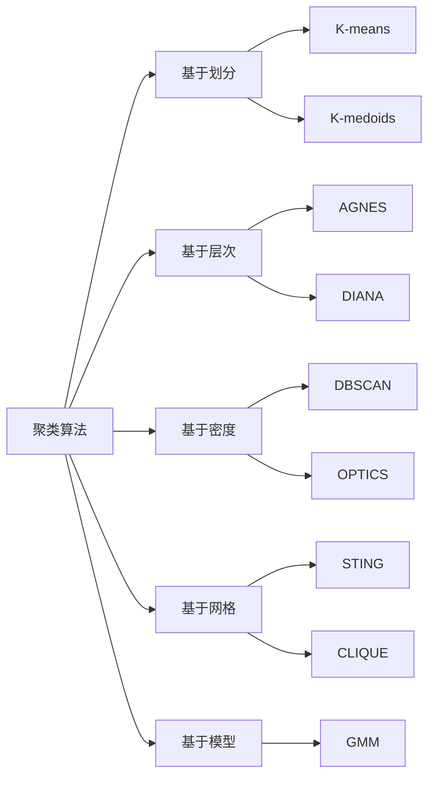

# 聚类 (Clustering) 原理与代码实例讲解

## 1. 背景介绍

聚类(Clustering)是一种无监督学习的机器学习技术,旨在将相似的数据点分组到同一个簇(Cluster)中,而不同的数据点分到不同的簇中。聚类广泛应用于数据挖掘、模式识别、图像分析、信息检索等领域。与分类不同的是,聚类是一种无监督学习,事先并不知道数据集中有多少类别,也不清楚每个类别的特征。聚类算法通过计算数据点之间的相似性,自动将数据划分为不同的簇。

聚类分析可以帮助我们发现数据内在的分布结构和规律,对理解数据有重要意义。例如,在客户细分中,聚类可以自动将客户划分为不同的群体,便于企业针对不同群体制定个性化的营销策略。在异常检测中,聚类可以自动识别出异常数据点。在推荐系统中,聚类可以将相似的用户或物品聚合在一起,实现基于用户(User-based)或基于物品(Item-based)的协同过滤。

### 1.1 聚类的定义与目标

聚类的形式化定义为:给定数据集 $D=\{x_1,x_2,...,x_n\}$,其中每个数据点 $x_i$ 是一个 $d$ 维特征向量,聚类算法将数据集 $D$ 划分为 $k$ 个不相交的子集 $C_1,C_2,...,C_k$,每个子集即为一个簇,满足:

$$\bigcup_{i=1}^k C_i = D \text{ 且 } C_i \bigcap C_j = \emptyset (i \neq j)$$

聚类的目标是使同一簇内的数据点尽可能相似,不同簇间的数据点尽可能不同。通常使用某种距离度量来衡量数据点之间的相似性,如欧氏距离、曼哈顿距离、余弦相似度等。

### 1.2 聚类的分类

根据聚类的原理和策略,可以将聚类算法分为以下几类:

1. 基于划分(Partitioning-based)的聚类:如 K-means、K-medoids 等。
2. 基于层次(Hierarchical-based)的聚类:如 AGNES、DIANA 等。
3. 基于密度(Density-based)的聚类:如 DBSCAN、OPTICS 等。
4. 基于网格(Grid-based)的聚类:如 STING、CLIQUE 等。
5. 基于模型(Model-based)的聚类:如高斯混合模型(GMM)等。

不同类型的聚类算法在原理、优缺点、适用场景等方面各有特点。在实际应用中,需要根据具体问题和数据特点选择合适的聚类算法。

## 2. 核心概念与联系

### 2.1 距离度量

在聚类中,需要度量数据点之间的相似性。通常使用距离来衡量数据点间的不相似性,距离越小表示数据点越相似。常用的距离度量有:

1. 欧氏距离(Euclidean Distance):两点间的直线距离。
2. 曼哈顿距离(Manhattan Distance):两点在各坐标轴上的距离之和。
3. 切比雪夫距离(Chebyshev Distance):两点在各坐标轴上距离的最大值。
4. 余弦相似度(Cosine Similarity):两个向量夹角的余弦值。

### 2.2 簇的质心与样本分配

在一些聚类算法中(如K-means),每个簇都有一个质心(Centroid),即簇内所有数据点的均值向量。簇质心代表了该簇的中心位置。聚类过程不断迭代,每次迭代将每个数据点分配到距离最近的簇,然后更新每个簇的质心,直到达到收敛条件。

### 2.3 簇的个数 k

很多聚类算法(如K-means)需要预先指定簇的个数 k。k 的选择对聚类结果有很大影响。k 值太小,会使原本不同的簇被合并;k 值太大,会使原本相同的簇被分裂。确定最优的 k 值是一个难题,常用的方法有肘部法(Elbow Method)、轮廓系数(Silhouette Coefficient)等。

### 2.4 聚类评价指标

为了评估聚类的质量,需要使用聚类评价指标。常用的外部指标有纯度(Purity)、F1度量(F-measure)等,需要使用带标签的数据集;常用的内部指标有轮廓系数、Calinski-Harabasz指数、Davies-Bouldin指数等,仅使用聚类结果本身来评价。

### 2.5 聚类算法间的联系

下图展示了几种经典聚类算法之间的联系:



## 3. 核心算法原理具体操作步骤

本节以K-means算法为例,详细讲解其原理和步骤。

### 3.1 K-means 算法原理

K-means是一种典型的基于划分的聚类算法,其基本思想是:首先随机选择k个初始质心,然后alternating迭代以下两个步骤直至收敛:

1. 分配步骤:将每个数据点分配到与之最近的质心所代表的簇。
2. 更新步骤:重新计算每个簇的质心。

### 3.2 K-means 算法步骤

输入:数据集 $D=\{x_1,x_2,...,x_n\}$,聚类数 $k$。  
输出:聚类结果 $C=\{C_1,C_2,...,C_k\}$。

1. 随机选择 $k$ 个数据点作为初始质心 $\{\mu_1,\mu_2,...,\mu_k\}$。
2. repeat:
   1. 分配步骤:对每个数据点 $x_i$,计算其到各个质心的距离,将其分配到距离最近的簇 $C_j$:
      $$C_j = \{x_i | \text{dist}(x_i,\mu_j) \leq \text{dist}(x_i,\mu_l),  1 \leq l \leq k\}$$
      其中 $\text{dist}$ 为距离度量,常用欧氏距离。
   2. 更新步骤:对每个簇 $C_j$,重新计算其质心 $\mu_j$:
      $$\mu_j = \frac{1}{|C_j|} \sum_{x \in C_j} x$$
3. until 质心不再变化或达到最大迭代次数。
4. 返回聚类结果 $C=\{C_1,C_2,...,C_k\}$。

### 3.3 K-means 算法复杂度分析

- 时间复杂度:设数据集大小为 $n$,数据维度为 $d$,聚类数为 $k$,迭代次数为 $t$,则K-means的时间复杂度为 $O(t \cdot k \cdot n \cdot d)$。通常 $k,d \ll n$,所以K-means的时间复杂度近似为 $O(n)$。
- 空间复杂度:K-means需要存储数据集和k个质心,空间复杂度为 $O(n \cdot d + k \cdot d)$,近似为 $O(n)$。

### 3.4 K-means 算法优缺点

优点:
1. 原理简单,易于实现。
2. 时间复杂度较低,可以处理大规模数据集。
3. 当簇近似球形,簇间距离较大时,聚类效果较好。

缺点:
1. 需要预先指定聚类数 $k$,对 $k$ 值敏感。
2. 对异常点和噪声敏感。
3. 只能发现球形簇,对非凸形的簇效果不好。
4. 容易陷入局部最优,聚类结果依赖于初始质心的选择。

## 4. 数学模型和公式详细讲解举例说明

### 4.1 目标函数

K-means聚类可以看作是最小化如下目标函数(Objective Function):

$$J(C,\mu) = \sum_{j=1}^k \sum_{x \in C_j} \text{dist}(x,\mu_j)^2$$

其中 $C=\{C_1,C_2,...,C_k\}$ 为聚类结果,$\mu=\{\mu_1,\mu_2,...,\mu_k\}$ 为各簇质心。目标函数 $J$ 表示各簇内数据点到质心的距离平方和,反映了簇内的紧凑程度。K-means的目标是找到聚类结果 $C$ 和质心 $\mu$,使得目标函数 $J$ 最小。

### 4.2 使用欧氏距离的目标函数

若使用欧氏距离作为距离度量,则目标函数可写为:

$$J(C,\mu) = \sum_{j=1}^k \sum_{x \in C_j} \|x-\mu_j\|_2^2$$

其中 $\|x-\mu_j\|_2$ 表示数据点 $x$ 到质心 $\mu_j$ 的欧氏距离。

### 4.3 目标函数的优化

K-means通过alternating优化的方式来最小化目标函数:
1. 固定质心 $\mu$,优化聚类结果 $C$:将每个数据点分配到距离最近的簇。
2. 固定聚类结果 $C$,优化质心 $\mu$:将每个簇的质心更新为簇内数据点的均值。

重复上述两个步骤,直到质心不再变化或达到最大迭代次数,算法收敛。可以证明,每次迭代都会使目标函数 $J$ 的值减小或保持不变,因此K-means算法能够收敛到一个局部最小值。

### 4.4 示例说明

考虑如下二维数据集:

```
x1 = (1, 2), x2 = (1.5, 1.8), x3 = (5, 8), x4 = (8, 8), x5 = (1, 0.6), x6 = (9, 11)
```

设置聚类数 $k=2$,随机选择 $x_1$ 和 $x_4$ 作为初始质心:

$$\mu_1^{(0)}=(1,2), \mu_2^{(0)}=(8,8)$$

第一次迭代:
1. 分配步骤:计算每个数据点到质心的欧氏距离,并将其分配到最近的簇:
   - $\text{dist}(x_1,\mu_1^{(0)})=0,\text{dist}(x_1,\mu_2^{(0)})=9.90 \Rightarrow x_1 \in C_1$
   - $\text{dist}(x_2,\mu_1^{(0)})=0.53,\text{dist}(x_2,\mu_2^{(0)})=8.32 \Rightarrow x_2 \in C_1$
   - $\text{dist}(x_3,\mu_1^{(0)})=7.21,\text{dist}(x_3,\mu_2^{(0)})=3.00 \Rightarrow x_3 \in C_2$
   - $\text{dist}(x_4,\mu_1^{(0)})=9.90,\text{dist}(x_4,\mu_2^{(0)})=0 \Rightarrow x_4 \in C_2$
   - $\text{dist}(x_5,\mu_1^{(0)})=1.40,\text{dist}(x_5,\mu_2^{(0)})=10.63 \Rightarrow x_5 \in C_1$
   - $\text{dist}(x_6,\mu_1^{(0)})=12.04,\text{dist}(x_6,\mu_2^{(0)})=3.16 \Rightarrow x_6 \in C_2$
   
   得到聚类结果:
   $$C_1^{(1)}=\{x_1,x_2,x_5\}, C_2^{(1)}=\{x_3,x_4,x_6\}$$
2. 更新步骤:重新计算每个簇的质心:
   $$\mu_1^{(1)}=\frac{x_1+x_2+x_5}{3}=(1.17,1.47), \mu_2^{(1)}=\frac{x_3+x_4+x_6}{3}=(7.33,9.