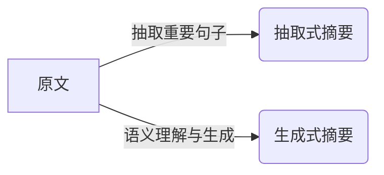
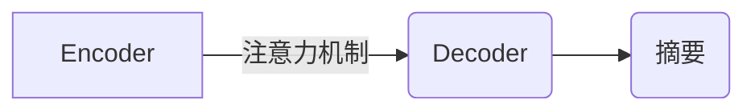

# 自动化文本摘要:从TextRank到BART

## 1.背景介绍

### 1.1 文本摘要的重要性
在当今信息爆炸的时代,我们每天都会接触到大量的文本数据,如新闻报道、科技文献、社交媒体信息等。面对如此海量的文本信息,人工阅读和总结显然是不现实的。因此,自动化文本摘要技术应运而生,它可以快速、准确地提炼出文本的核心内容,极大地提高了信息获取和理解的效率。

### 1.2 文本摘要的应用场景
文本摘要技术在很多领域都有广泛应用,例如:

- 新闻摘要:自动生成新闻的摘要,方便读者快速了解新闻要点
- 学术文献摘要:自动生成论文的摘要,帮助研究者快速把握文章主旨
- 会议纪要生成:自动总结会议讨论内容,生成会议纪要
- 产品评论总结:自动总结用户对产品的评价,挖掘用户关注的卖点和痛点

### 1.3 文本摘要的发展历程
文本摘要技术经历了从基于统计和规则到基于深度学习的发展过程。早期的文本摘要方法主要基于统计特征(如TF-IDF)和人工定义的规则(如句子位置、指示词等)来抽取重要句子形成摘要。

随着深度学习的兴起,尤其是注意力机制和预训练语言模型的出现,文本摘要的效果得到了质的飞跃。一系列基于神经网络的文本摘要模型被提出,如Seq2Seq with Attention[1]、Pointer-Generator Network[2]、BERT-based Summarizer[3]等,大幅提升了摘要的流畅度和信息覆盖率。

本文将重点介绍几种有代表性的文本摘要算法,探讨它们的原理、优缺点以及改进方向,帮助读者系统地了解文本摘要技术的发展脉络。

## 2.核心概念与联系

### 2.1 抽取式摘要与生成式摘要
根据摘要的生成方式,文本摘要可分为抽取式摘要(Extractive Summarization)和生成式摘要(Abstractive Summarization)两大类[4]:

- 抽取式摘要:通过从原文中抽取重要句子拼接而成,摘要句子都出自于原文
- 生成式摘要:通过理解原文语义,自动生成新的句子来概括原文,摘要句子是模型生成的

二者的区别可以用下面的Mermaid流程图直观地表示:

### 2.2 无监督摘要与有监督摘要
按照训练数据是否带有标注,文本摘要又可分为无监督摘要和有监督摘要:

- 无监督摘要:训练数据仅有原文本,没有标注摘要,如TextRank、Lead-3等
- 有监督摘要:训练数据包含原文本-摘要对,模型通过学习这些标注数据生成摘要,如Seq2Seq、BART等

无监督摘要虽然不需要标注数据,但效果通常不如有监督摘要。随着大规模摘要数据集的构建,有监督摘要逐渐成为主流。

### 2.3 单文档摘要与多文档摘要
根据输入是单篇还是多篇文档,文本摘要可分为单文档摘要和多文档摘要:

- 单文档摘要:输入是单篇文档,生成该文档的摘要
- 多文档摘要:输入是多篇文档,生成这些文档的综合摘要,需要考虑信息的冗余与互补

多文档摘要在新闻事件、话题追踪等场景中应用广泛,技术上更有挑战性。本文主要关注单文档摘要。

## 3.核心算法原理具体操作步骤

本节将详细介绍几种经典的文本摘要算法,包括它们的原理、步骤和优缺点。

### 3.1 TextRank
TextRank[5]是一种基于图的抽取式摘要算法,核心思想是用图模型表示文本,通过迭代计算句子的重要性得分,选取得分最高的句子作为摘要。

TextRank的具体步骤如下:

1. 将文本切分为句子,每个句子表示为一个节点
2. 计算句子之间的相似度作为边的权重,构建句子之间的有向带权图
3. 通过迭代计算每个句子节点的TextRank得分:
$TR(V_i) = (1-d) + d * \sum_{j \in In(V_i)} \frac{w_{ji}}{\sum_{k \in Out(V_j)}w_{jk}} TR(V_j)$
其中$d$为阻尼系数,$In(V_i)$和$Out(V_j)$分别表示节点$V_i$的入边和节点$V_j$的出边
4. 选取TextRank得分最高的Top-K个句子作为摘要

TextRank的优点是简单高效,不需要训练数据,而且可以捕捉文本的全局结构。但其缺点是无法考虑语义信息,且抽取的句子可能不连贯。

### 3.2 Seq2Seq with Attention
Seq2Seq with Attention[1]是一种基于RNN的生成式摘要模型,引入注意力机制来动态地聚焦输入文本的不同部分,生成更加准确和流畅的摘要。

模型结构如下图所示:

模型训练的具体步骤为:

1. 将原文本$x = (x_1, ..., x_n)$输入Encoder(通常是双向LSTM),得到各个时间步的隐藏状态$h = (h_1, ..., h_n)$
2. Decoder(通常是单向LSTM)在每个时间步$t$基于之前的隐藏状态$s_{t-1}$、之前生成的单词$y_{t-1}$以及注意力向量$c_t$来生成当前单词$y_t$:
$s_t = f(s_{t-1}, y_{t-1}, c_t)$
$p(y_t|y_1,...,y_{t-1},x) = g(s_t, y_{t-1}, c_t)$
其中注意力向量$c_t$是输入隐藏状态$h$的加权平均,权重$\alpha_{ti}$通过对齐函数$a$计算:
$c_t = \sum_{i=1}^n \alpha_{ti}h_i$
$\alpha_{ti} = \frac{exp(a(s_{t-1}, h_i))}{\sum_{j=1}^n exp(a(s_{t-1}, h_j))}$
3. 模型通过最大化条件概率$\prod_{t=1}^m p(y_t|y_1,...,y_{t-1},x)$来训练

Seq2Seq模型可以端到端地生成摘要,考虑了语义信息和全局依赖。但其缺点是需要大量标注数据,且生成的摘要可能出现重复、不相关的内容。

### 3.3 BART
BART[6]是一种基于Transformer的预训练生成式摘要模型,通过在大规模无标注文本上进行降噪自编码预训练,再在特定摘要数据集上微调,可以生成高质量的摘要。

BART的预训练任务包括:

- 文本填充:随机遮挡原文的部分片段,预测被遮挡的内容
- 句子重排:打乱原文的句子顺序,预测正确的顺序
- 文档旋转:随机选择一个分割点将文档分为两部分,交换它们的顺序并预测

微调阶段的训练步骤如下:

1. 将原文本$x$输入BART的Encoder,得到各个位置的隐藏状态$h = (h_1, ..., h_n)$
2. 将摘要$y$输入BART的Decoder,Decoder基于Self-Attention和Encoder-Decoder Attention生成摘要的概率分布$p(y_t|y_1,...,y_{t-1},x)$
3. 最大化条件概率$\prod_{t=1}^m p(y_t|y_1,...,y_{t-1},x)$来微调模型

BART利用了预训练语言模型强大的语言理解和生成能力,可以生成流畅、连贯的摘要。但其缺点是预训练和微调都需要大量计算资源。

## 4.数学模型和公式详细讲解举例说明

本节将详细讲解TextRank和Seq2Seq模型中用到的关键数学公式,并给出实例说明。

### 4.1 TextRank公式
TextRank算法中最核心的公式是迭代计算句子重要性得分的公式:

$$TR(V_i) = (1-d) + d * \sum_{j \in In(V_i)} \frac{w_{ji}}{\sum_{k \in Out(V_j)}w_{jk}} TR(V_j)$$

其中:
- $TR(V_i)$表示句子$i$的TextRank重要性得分
- $d$为阻尼系数,一般取值0.85
- $In(V_i)$表示指向句子$i$的所有句子集合
- $Out(V_j)$表示句子$j$指向的所有句子集合
- $w_{ji}$表示句子$j$到句子$i$的边的权重,通常基于句子的相似度计算,如余弦相似度、Jaccard相似度等

举例说明:假设有3个句子$S1,S2,S3$,它们的初始TextRank得分都为1,句子之间的相似度矩阵为:
$$\begin{bmatrix}
1 & 0.5 & 0.2\\ 
0.5 & 1 & 0.7\\
0.2 & 0.7 & 1
\end{bmatrix}$$

则根据TextRank公式,第一轮迭代后各句子的得分为:
$$TR(S1) = 0.15 + 0.85 * (\frac{0.5}{1.2}*1 + \frac{0.2}{0.9}*1) = 0.5042$$
$$TR(S2) = 0.15 + 0.85 * (\frac{0.5}{0.7}*0.5042 + \frac{0.7}{0.9}*1) = 0.8616$$
$$TR(S3) = 0.15 + 0.85 * (\frac{0.2}{0.7}*0.5042 + \frac{0.7}{1.2}*0.8616) = 0.7186$$

可以看出,$S2$的得分最高,其次是$S3$和$S1$,这与它们在相似度矩阵中的联系强度是一致的。TextRank通过迭代传播句子的重要性,可以挖掘出文本的关键句子。

### 4.2 Seq2Seq中的注意力机制公式
Seq2Seq模型中的注意力机制可以用数学公式表示为:

$$c_t = \sum_{i=1}^n \alpha_{ti}h_i$$
$$\alpha_{ti} = \frac{exp(a(s_{t-1}, h_i))}{\sum_{j=1}^n exp(a(s_{t-1}, h_j))}$$

其中:
- $c_t$表示时间步$t$的注意力向量,是输入隐藏状态$h$的加权平均
- $\alpha_{ti}$表示时间步$t$对输入位置$i$的注意力权重
- $a$为对齐函数,用于计算Decoder的上一个隐藏状态$s_{t-1}$和Encoder的第$i$个隐藏状态$h_i$的相似度,常见的对齐函数有:
  - 点积:$a(s_{t-1}, h_i) = s_{t-1}^Th_i$
  - 拼接:$a(s_{t-1}, h_i) = v^Ttanh(W[s_{t-1};h_i])$
  - 感知机:$a(s_{t-1}, h_i) = v^Ttanh(W_1s_{t-1} + W_2h_i)$

举例说明:假设Encoder的隐藏状态为$h=[[1,2],[3,4],[5,6]]$,Decoder上一个隐藏状态$s_{t-1}=[0.5,0.5]$,使用点积注意力,则:
$$a(s_{t-1},h_1) = [0.5,0.5] · [1,2] = 1.5$$
$$a(s_{t-1},h_2) = [0.5,0.5] · [3,4] = 3.5$$ 
$$a(s_{t-1},h_3) = [0.5,0.5] · [5,