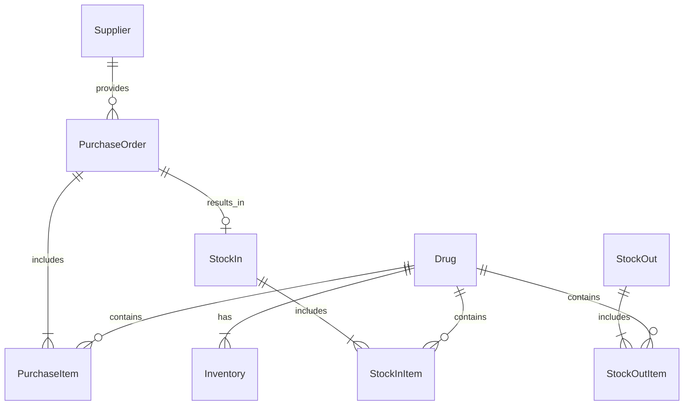

# 药品管理系统详细设计与具体代码实现

## 1. 背景介绍

### 1.1 药品管理系统的重要性

在现代医疗卫生事业中,药品管理系统扮演着至关重要的角色。高效、准确、安全的药品管理是医疗机构运营的基础,直接关系到患者的用药安全和医疗质量。随着医疗信息化的不断发展,药品管理系统已经成为现代医院不可或缺的重要组成部分。

### 1.2 传统药品管理面临的问题

传统的人工药品管理方式存在诸多问题,如:

1. 效率低下:人工登记、盘点、查询等操作耗时耗力
2. 差错风险大:人为失误导致的错发、漏发等情况时有发生  
3. 追溯困难:药品来源、去向、库存等信息难以有效追踪
4. 数据孤岛:不同环节的药品数据难以打通共享

这些问题不仅影响医疗服务质量,也给医院运营管理带来诸多隐患。因此,开发一套功能完备、性能优异的药品管理系统势在必行。

### 1.3 药品管理系统的目标

本项目旨在设计并实现一个现代化的药品管理系统,具体目标包括:

1. 实现药品信息全生命周期管理,涵盖采购、验收、入库、调拨、发药、退药等各个环节
2. 优化药品管理流程,提高工作效率,降低人工差错风险 
3. 加强药品追溯管理,确保药品来源可查、去向可追、责任可究
4. 强化数据集成共享,实现药品数据在不同系统、不同科室间的互联互通
5. 嵌入智能算法,实现库存预警、用药提示等辅助决策功能

## 2. 核心概念与关联

要设计出一个优秀的药品管理系统,首先需要理清其中的核心概念,以及它们之间的关联关系。

### 2.1 药品 Drug

药品是系统的核心实体,具有以下主要属性:
- 药品编码:唯一标识一种药品的代码
- 通用名:药品的通用名称
- 商品名:药品的商品名称
- 规格:如片剂的含量、水针的容量等
- 剂型:如片剂、胶囊、注射液等
- 包装:如盒、瓶、支等
- 生产厂家:药品的生产企业
- 批准文号:药监部门的批准文号

### 2.2 供应商 Supplier

供应商为医院提供药品,具有以下属性: 
- 供应商编码:唯一标识一个供应商的代码
- 供应商名称:供应商的企业名称
- 联系人:供应商的联系人姓名
- 联系方式:如电话、邮箱等

### 2.3 采购单 Purchase Order

采购单记录了一次药品采购的详细信息,包括:
- 采购单号:唯一标识一张采购单的编号
- 供应商:本次采购的供应商
- 采购日期:采购单的创建日期
- 采购明细:采购的药品及其数量
- 采购人员:负责本次采购的人员
- 审核人员:负责审核采购单的人员

### 2.4 入库单 Stock In

入库单记录了一次药品入库的详细信息,包括:
- 入库单号:唯一标识一张入库单的编号 
- 采购单号:对应的采购单号
- 入库日期:药品实际入库的日期
- 入库明细:入库的药品、数量、生产日期、有效期等
- 入库人员:负责药品入库操作的人员
- 验收人员:负责药品验收的人员

### 2.5 库存 Inventory

库存记录了当前各种药品的库存情况,包括:
- 药品编码:库存药品的编码
- 当前库存量:当前的库存数量
- 库存预警阈值:低于此阈值将触发预警

### 2.6 出库单 Stock Out

出库单记录了一次药品出库的详细信息,包括:
- 出库单号:唯一标识一张出库单的编号
- 领用科室:药品的去向科室
- 出库日期:药品出库的日期
- 出库明细:出库的药品及数量
- 出库人员:负责药品出库操作的人员
- 复核人员:负责复核出库单的人员

### 2.7 实体关系图

下面使用 Mermaid 绘制实体关系图,直观展示上述核心概念间的关联:



从图中可以看出:

- 药品与采购明细、入库明细、出库明细均为一对多关系
- 药品与库存为一对一关系
- 供应商与采购单为一对多关系
- 采购单与采购明细为一对多关系,与入库单为一对一关系
- 入库单与入库明细为一对多关系 
- 出库单与出库明细为一对多关系

理清了这些核心概念及其关联,就为后续的系统设计打下了坚实基础。

## 3. 核心算法原理与具体操作步骤

药品管理系统中有几个关键的业务算法,下面以库存预警为例进行详细说明。

### 3.1 库存预警算法原理

库存预警的目的是动态监测药品库存量,当库存降至预警阈值以下时,向相关人员发出预警通知,提示及时补货,避免库存脱销。其核心原理可概括为:

1. 设定预警规则:为每种药品设定一个最低库存预警阈值
2. 实时监测库存:在每次出库操作后,实时更新药品的当前库存量
3. 判断是否预警:比较当前库存与预警阈值,如果低于阈值则触发预警
4. 发送预警通知:向指定人员(如采购员、药库管理员)发送预警通知,提示及时采购

### 3.2 库存预警的具体操作步骤

结合上述原理,库存预警可分为以下几个具体步骤:

#### Step1. 设定预警阈值

管理员为每个药品设定一个最低库存预警阈值 `AlertThreshold`,可以是一个固定值(如100支),也可以是一个动态值(如1个月用量)。设定后将此阈值保存到数据库的 `Drug` 表中。

#### Step2. 更新当前库存

每次药品出库后,根据出库数量 `Quantity` 更新药品的当前库存量 `Inventory`:

```
Inventory = Inventory - Quantity
```

更新后的库存量保存到数据库的 `Inventory` 表中。

#### Step3. 判断是否预警

每次更新库存后,都要实时判断当前库存是否低于预警阈值:

```
if (Inventory < AlertThreshold) {
    // 触发预警
    Alert();
}
```

#### Step4. 发送预警通知

如果触发预警,系统自动调用 `Alert()` 函数,给相关人员发送预警通知:

```python
def Alert():
    # 查询预警药品信息
    drug = db.query(Drug).filter(Drug.id == drug_id) 
    
    # 查询需要通知的人员列表
    users = db.query(User).filter(User.role.in_(['purchaser', 'admin']))
    
    # 生成预警通知内容
    content = f"药品{drug.name}库存已低于预警阈值{drug.alert_threshold},当前库存为{drug.inventory},请及时采购!"
    
    # 调用消息模块,发送通知
    for user in users:
        send_notification(user, content)
```

`Alert()` 函数会自动查询出预警药品的信息,以及需要通知的采购员、管理员等人员列表,然后调用消息模块(如短信、邮件、站内信等)发送通知。

### 3.3 小结

通过上述四个步骤,库存预警功能就可以实现药品库存的实时监测和预警,可以有效降低药品脱销的风险,提高药品供应的及时性和连续性。同理,用药提示、近效期预警等功能也可以用类似的思路来实现。

## 4. 数学模型与公式详解

为了优化药品采购和库存管理,药品管理系统可以引入一些数学模型,如经济订货批量(EOQ)模型。下面我们就来详细讲解这个模型。

### 4.1 EOQ 模型介绍

EOQ 模型是一种确定最优订货批量的经典库存管理模型,其目标是在满足需求的前提下,通过优化每次订货量,使得总库存成本最小。EOQ 模型适用于需求速率稳定、订货提前期固定的场景。

### 4.2 EOQ 模型的假设条件

EOQ 模型基于以下几个假设:

1. 需求速率固定且已知
2. 不允许缺货
3. 补货无限制,瞬时到货
4. 订货成本固定
5. 单位库存持有成本固定
6. 不考虑数量折扣

### 4.3 EOQ 模型的参数定义

EOQ 模型涉及以下几个关键参数:

- $D$: 年需求量
- $S$: 单次订货成本
- $H$: 单位库存持有成本
- $Q$: 单次订货量
- $T$: 订货周期
- $TC$: 年总成本

其中,$Q$ 和 $T$ 为决策变量,$TC$ 为目标函数。

### 4.4 EOQ 模型的公式推导

根据上述假设和参数,EOQ 模型的目标函数 $TC$ 由两部分组成:订货成本和库存持有成本。

$$
TC = \frac{D}{Q}S + \frac{Q}{2}H
$$

其中,$\frac{D}{Q}S$ 为订货成本,$\frac{Q}{2}H$ 为库存持有成本。要求解最优订货量 $Q^*$,只需对 $TC$ 求导,令导数等于0:

$$
\frac{dTC}{dQ} = -\frac{DS}{Q^2} + \frac{H}{2} = 0
$$

解得:

$$
Q^* = \sqrt{\frac{2DS}{H}}
$$

这就是著名的 EOQ 公式,也被称为威尔逊公式(Wilson Formula)。将 $Q^*$ 代入 $TC$ 可得最小总成本:

$$
TC^* = \sqrt{2DSH}
$$

相应地,最优订货周期 $T^*$ 为:

$$
T^* = \frac{Q^*}{D} = \sqrt{\frac{2S}{DH}}
$$

### 4.5 EOQ 模型的应用实例

假设某药品的年需求量为5000盒,单次订货成本为100元,年库存持有成本为20元/盒,求最优订货量和订货周期。

代入已知条件:

$$
D=5000,S=100,H=20 
$$

根据 EOQ 公式计算:

$$
Q^* = \sqrt{\frac{2\times5000\times100}{20}} = 500
$$

$$
T^* = \sqrt{\frac{2\times100}{5000\times20}} = 0.02
$$

计算结果表明,该药品的最优订货量为500盒,最优订货周期为0.02年,即每隔一周(0.02年*52周=1.04周)订货一次,每次订500盒。

### 4.6 EOQ 模型的局限性

尽管 EOQ 简单实用,但它也有一些局限性:

1. 假设条件严格,如需求恒定、无数量折扣等,在实际中不always hold
2. 未考虑缺货情况,实际业务中常常允许一定的缺货
3. 未考虑订货提前期的不确定性,实际到货时间可能有波动

因此在实践中,我们要根据具体业务场景,对 EOQ 模型做适当改进和扩展。

## 5. 项目实践:代码实例与详解

结合上述理论知识,下面我们就用 Python 来实现一个简单的药品管理系统。

### 5.1 环境准备

首先创建一个虚拟环境,并安装所需依赖:

```bash
# 创建虚拟环境
python -m venv venv

# 激活虚拟环境
source venv/bin/activate  # Linux/Mac
venv\Scripts\activate     # Windows

# 安装依赖