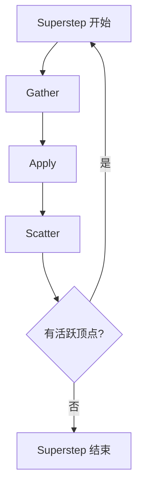

# 虚拟试验设计:Pregel模拟复杂物理系统

## 1.背景介绍

在当今科学研究和工程实践中,模拟复杂物理系统的需求越来越迫切。传统的基于方程的模拟方法往往难以捕捉系统中的微观交互和涌现行为,而这些行为对于理解系统的整体动力学至关重要。因此,基于粒子的离散元模拟方法应运而生,它能够通过模拟大量相互作用的粒子来重现复杂系统的宏观行为。

然而,由于涉及大量粒子和相互作用,离散元模拟的计算量通常是天文数字级别的,这对于单机系统来说是一个巨大的挑战。为了解决这一问题,研究人员开发了并行计算技术,例如基于Pregel的大规模图形并行处理框架。Pregel是一种用于分布式大规模图形处理的系统,它将计算过程建模为一个超大型图形,顶点表示粒子,边表示粒子之间的相互作用。通过在集群中并行执行顶点程序,Pregel可以高效地模拟涉及大量粒子和相互作用的复杂物理系统。

本文将探讨如何利用Pregel框架设计和实现虚拟试验,模拟各种复杂的物理系统,包括流体动力学、分子动力学、颗粒物流等。我们将介绍Pregel的核心概念、算法原理和实现细节,并通过实际案例展示其在模拟复杂系统中的强大功能。

## 2.核心概念与联系

### 2.1 Pregel概述

Pregel是一种基于大规模图形并行处理的框架,由Google于2010年提出。它将计算过程建模为一个巨大的有向图,顶点代表数据,边代表数据之间的关系。每个顶点都运行一个用户定义的程序,通过在集群中并行执行这些程序来实现大规模计算。

Pregel的执行过程分为多个超步(Superstep),每个超步包含以下三个阶段:

1. **Gather**:每个顶点并行收集来自入边的消息。
2. **Apply**:每个顶点并行执行用户定义的函数,基于收到的消息和当前值更新自身状态。
3. **Scatter**:每个顶点并行向出边发送消息。

该过程在所有活跃顶点都被处理后进入下一个超步,直到没有活跃顶点为止。

### 2.2 粒子系统建模

在Pregel中,我们可以将粒子系统建模为一个无向图,每个顶点代表一个粒子,边表示粒子之间的相互作用。顶点的值包含粒子的状态,如位置、速度、加速度等。在每个超步中,顶点程序根据相邻粒子的状态计算出自身的新状态。

例如,在模拟分子动力学时,每个顶点代表一个分子,边表示分子之间的相互作用力。顶点程序根据经典力学定律计算相邻分子对本分子施加的力,并更新本分子的加速度、速度和位置。

通过并行执行大量顶点程序,Pregel可以高效地模拟涉及大量粒子和相互作用的复杂物理系统。

## 3.核心算法原理具体操作步骤  

Pregel算法的核心思想是将计算过程建模为一个巨大的有向图,并通过在集群中并行执行顶点程序来实现大规模计算。下面我们将详细介绍Pregel算法的原理和具体操作步骤。

### 3.1 图形建模

第一步是将待计算的问题建模为一个有向图。在这个图中,顶点代表数据,边代表数据之间的关系。例如,在模拟分子动力学时,每个顶点代表一个分子,边表示分子之间的相互作用力。

### 3.2 顶点程序设计

接下来,我们需要为每个顶点设计一个用户定义的程序,称为顶点程序(Vertex Program)。顶点程序的主要任务是根据收到的消息和当前值更新自身状态。

在分子动力学的例子中,顶点程序需要执行以下操作:

1. 收集相邻分子发送的位置和速度信息。
2. 根据经典力学定律计算相邻分子对本分子施加的力。
3. 根据受力情况更新本分子的加速度、速度和位置。
4. 向相邻分子发送更新后的位置和速度信息。

### 3.3 Pregel执行过程

Pregel的执行过程分为多个超步(Superstep),每个超步包含以下三个阶段:

1. **Gather**:每个顶点并行收集来自入边的消息。
2. **Apply**:每个顶点并行执行用户定义的顶点程序,基于收到的消息和当前值更新自身状态。
3. **Scatter**:每个顶点并行向出边发送消息。

该过程在所有活跃顶点都被处理后进入下一个超步,直到没有活跃顶点为止。

在分子动力学的例子中,每个超步对应一个时间步长。在Gather阶段,每个顶点收集相邻分子的位置和速度信息。在Apply阶段,顶点程序计算受力情况并更新本分子的状态。在Scatter阶段,顶点向相邻分子发送更新后的位置和速度信息。

### 3.4 并行执行

Pregel的一个关键优势是能够在集群中并行执行顶点程序,从而实现大规模计算。在每个超步中,所有顶点程序都可以同时执行,而不会相互影响。

为了实现并行执行,Pregel采用了基于消息传递的松散耦合模型。每个顶点只与相邻顶点通信,通过发送和接收消息来协调计算。这种设计使得Pregel可以在分布式环境中高效地执行,并具有良好的容错性和可扩展性。

### 3.5 收敛检测

Pregel算法的执行过程将一直持续,直到没有活跃顶点为止。为了检测收敛,Pregel引入了一个标志位,表示顶点是否处于活跃状态。

在每个超步的Apply阶段,顶点程序需要根据计算结果设置自身的活跃标志位。如果顶点的状态发生了变化,它将保持活跃状态;否则,它将变为非活跃状态。

当所有顶点都处于非活跃状态时,Pregel算法就会终止执行,表示计算已经收敛。

## 4.数学模型和公式详细讲解举例说明

在模拟复杂物理系统时,我们通常需要使用数学模型和公式来描述粒子之间的相互作用力、运动规律等。下面我们将以模拟分子动力学为例,详细讲解相关的数学模型和公式。

### 4.1 分子动力学基本原理

分子动力学(Molecular Dynamics, MD)是一种计算机模拟技术,用于研究分子系统的运动和相互作用。它基于经典力学定律,将分子系统视为一组相互作用的粒子,并通过数值积分方法求解牛顿运动方程,从而预测分子的运动轨迹。

在分子动力学模拟中,我们需要计算作用在每个分子上的总力,然后根据牛顿第二定律更新分子的加速度、速度和位置。作用力通常由分子间相互作用势能函数导出,包括键长、键角、扭转、范德华力和库仑力等项。

### 4.2 力场模型

力场模型是描述分子间相互作用的数学模型,它将分子系统的总势能表示为各种相互作用项的总和:

$$
U_{total} = U_{bonds} + U_{angles} + U_{torsions} + U_{vdW} + U_{electrostatic}
$$

其中,各项分别代表键长能、键角能、扭转能、范德华能和静电能。

#### 4.2.1 键长能

键长能描述了化学键的拉伸或压缩,通常使用简谐振子模型:

$$
U_{bonds} = \sum_{bonds} \frac{1}{2}k_r(r - r_0)^2
$$

其中,$k_r$是力常数,$r$是实际键长,$r_0$是平衡键长。

#### 4.2.2 键角能

键角能描述了化学键夹角的变化,也常使用简谐振子模型:

$$
U_{angles} = \sum_{angles} \frac{1}{2}k_\theta(\theta - \theta_0)^2
$$

其中,$k_\theta$是力常数,$\theta$是实际键角,$\theta_0$是平衡键角。

#### 4.2.3 扭转能

扭转能描述了分子内部的扭转运动,通常使用周期性函数:

$$
U_{torsions} = \sum_{torsions} \frac{V_n}{2}[1 + \cos(n\phi - \gamma)]
$$

其中,$V_n$是振幅,$n$是周期性,$\phi$是扭转角,$\gamma$是相位角。

#### 4.2.4 范德华能

范德华能描述了分子间的弱相互作用,包括引力(当分子很远时)和排斥力(当分子很近时)。常用的模型是12-6 Lennard-Jones 势:

$$
U_{vdW} = \sum_{pairs} 4\epsilon\left[ \left(\frac{\sigma}{r_{ij}}\right)^{12} - \left(\frac{\sigma}{r_{ij}}\right)^6 \right]
$$

其中,$\epsilon$和$\sigma$是经验参数,$r_{ij}$是两个分子之间的距离。

#### 4.2.5 静电能

静电能描述了分子间的库仑相互作用,由库仑定律给出:

$$
U_{electrostatic} = \sum_{pairs} \frac{q_i q_j}{4\pi\epsilon_0 r_{ij}}
$$

其中,$q_i$和$q_j$是两个分子的电荷,$\epsilon_0$是真空介电常数,$r_{ij}$是两个分子之间的距离。

### 4.3 运动方程

根据牛顿第二定律,我们可以将分子的运动描述为如下微分方程:

$$
m_i\frac{d^2\vec{r}_i}{dt^2} = \vec{F}_i = -\frac{\partial U}{\partial \vec{r}_i}
$$

其中,$m_i$是分子的质量,$\vec{r}_i$是位置矢量,$\vec{F}_i$是作用在该分子上的总力,等于总势能$U$对位置的负梯度。

通过数值积分方法(如速度-Verlet算法)求解上述微分方程,我们可以获得分子的加速度、速度和位置的时间演化轨迹。

### 4.4 边界条件和周期性

在模拟分子动力学时,我们还需要考虑边界条件和周期性。对于有限的模拟体系,通常采用周期性边界条件,将系统视为在三维空间无限重复。这样可以消除表面效应,模拟无限大的体系。

为了计算周期性边界条件下的相互作用力,我们引入最小映像约定:每个分子只与最近的周围分子相互作用,而忽略其他周期映像。这样可以大大减少计算量,同时保持系统的周期性。

### 4.5 实例:Lennard-Jones 液体

作为一个简单的例子,我们来模拟一个Lennard-Jones 液体系统。Lennard-Jones 势是描述中性原子或分子之间相互作用的经典模型,其势能函数为:

$$
U(r_{ij}) = 4\epsilon\left[ \left(\frac{\sigma}{r_{ij}}\right)^{12} - \left(\frac{\sigma}{r_{ij}}\right)^6 \right]
$$

其中,$\epsilon$和$\sigma$是经验参数,$r_{ij}$是两个粒子之间的距离。

在Pregel中,我们可以将每个粒子建模为一个顶点,边表示粒子之间的相互作用力。顶点程序需要执行以下操作:

1. 收集相邻粒子的位置信息。
2. 对于每个相邻粒子,计算它们之间的距离$r_{ij}$。
3. 根据Lennard-Jones 势计算相互作用力$\vec{F}_{ij} = -\frac{\partial U}{\partial r_{ij}}\hat{r}_{ij}$。
4. 将所有相互