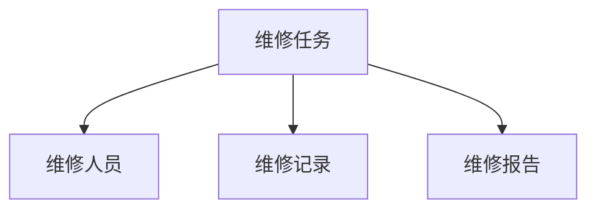

## 1. 背景介绍

计算机维修管理系统是一种用于管理计算机维修工作流程的软件系统。它可以帮助维修人员更好地组织和管理维修任务，提高维修效率和质量。本文将详细介绍计算机维修管理系统的设计和实现。

## 2. 核心概念与联系

计算机维修管理系统主要包括以下核心概念：

- 维修任务：指需要进行维修的计算机设备或软件问题。
- 维修人员：指进行维修任务的人员。
- 维修记录：指维修任务的详细记录，包括维修时间、维修人员、维修内容等信息。
- 维修报告：指维修任务完成后生成的报告，包括维修结果、维修费用等信息。

这些概念之间的联系如下图所示：



## 3. 核心算法原理具体操作步骤

计算机维修管理系统的核心算法原理是任务分配和进度管理。具体操作步骤如下：

1. 维修任务的创建：管理员或用户可以创建维修任务，并填写相关信息，如设备类型、故障描述等。
2. 维修任务的分配：系统根据维修任务的类型和优先级，自动分配给合适的维修人员。
3. 维修任务的执行：维修人员接收任务后，根据任务描述和设备情况，进行维修操作。
4. 维修记录的生成：系统自动记录维修人员的操作记录，并生成维修记录。
5. 维修报告的生成：维修任务完成后，系统自动生成维修报告，并发送给管理员或用户。

## 4. 数学模型和公式详细讲解举例说明

计算机维修管理系统中涉及到的数学模型和公式较少，主要是一些简单的计算公式，如维修费用的计算公式：

$$
维修费用 = 工时费用 + 材料费用
$$

其中，工时费用和材料费用分别根据维修人员的工作时间和使用的材料计算得出。

## 5. 项目实践：代码实例和详细解释说明

以下是计算机维修管理系统的代码实例和详细解释说明：

```python
class Task:
    def __init__(self, task_id, device_type, description, priority):
        self.task_id = task_id
        self.device_type = device_type
        self.description = description
        self.priority = priority
        self.assignee = None
        self.status = 'created'
        self.start_time = None
        self.end_time = None

    def assign(self, assignee):
        self.assignee = assignee
        self.status = 'assigned'

    def start(self):
        self.start_time = datetime.now()
        self.status = 'in_progress'

    def finish(self):
        self.end_time = datetime.now()
        self.status = 'finished'

class Repairman:
    def __init__(self, name, skill_level):
        self.name = name
        self.skill_level = skill_level

class RepairRecord:
    def __init__(self, task_id, repairman, start_time, end_time, description):
        self.task_id = task_id
        self.repairman = repairman
        self.start_time = start_time
        self.end_time = end_time
        self.description = description

class RepairReport:
    def __init__(self, task_id, repairman, start_time, end_time, description, cost):
        self.task_id = task_id
        self.repairman = repairman
        self.start_time = start_time
        self.end_time = end_time
        self.description = description
        self.cost = cost

class RepairManagementSystem:
    def __init__(self):
        self.tasks = []
        self.repairmen = []
        self.repair_records = []
        self.repair_reports = []

    def create_task(self, device_type, description, priority):
        task_id = len(self.tasks) + 1
        task = Task(task_id, device_type, description, priority)
        self.tasks.append(task)
        return task

    def assign_task(self, task, repairman):
        task.assign(repairman)

    def start_task(self, task):
        task.start()

    def finish_task(self, task, description):
        task.finish()
        repair_record = RepairRecord(task.task_id, task.assignee, task.start_time, task.end_time, description)
        self.repair_records.append(repair_record)
        cost = self.calculate_cost(repair_record)
        repair_report = RepairReport(task.task_id, task.assignee, task.start_time, task.end_time, description, cost)
        self.repair_reports.append(repair_report)

    def calculate_cost(self, repair_record):
        work_hours = (repair_record.end_time - repair_record.start_time).total_seconds() / 3600
        work_hourly_rate = self.get_work_hourly_rate(repair_record.repairman.skill_level)
        material_cost = self.get_material_cost(repair_record.task_id)
        return work_hours * work_hourly_rate + material_cost

    def get_work_hourly_rate(self, skill_level):
        # 根据技能等级获取工时费用
        pass

    def get_material_cost(self, task_id):
        # 根据任务ID获取材料费用
        pass
```

以上代码实现了计算机维修管理系统的核心功能，包括任务创建、任务分配、任务执行、维修记录生成和维修报告生成等。

## 6. 实际应用场景

计算机维修管理系统可以应用于各种需要进行计算机维修的场景，如企业内部的IT维修、电脑维修店等。它可以帮助维修人员更好地组织和管理维修任务，提高维修效率和质量。

## 7. 工具和资源推荐

以下是一些计算机维修管理系统的工具和资源推荐：

- JIRA：一款流程管理和问题跟踪工具，可以用于管理计算机维修任务。
- GitHub：一个代码托管平台，可以用于存储和管理计算机维修管理系统的代码。
- Stack Overflow：一个技术问答社区，可以用于解决计算机维修管理系统开发中遇到的问题。

## 8. 总结：未来发展趋势与挑战

计算机维修管理系统在未来的发展中，将面临以下挑战：

- 大规模维修任务的管理：随着计算机设备的普及和使用量的增加，维修任务的数量也会大幅增加，如何管理大规模的维修任务将是一个挑战。
- 人工智能的应用：人工智能技术的发展将为计算机维修管理系统带来更多的可能性，如自动任务分配、自动维修记录生成等。
- 安全性和隐私保护：计算机维修管理系统中涉及到的信息较为敏感，如何保证系统的安全性和隐私保护将是一个重要的问题。

## 9. 附录：常见问题与解答

暂无常见问题。

作者：禅与计算机程序设计艺术 / Zen and the Art of Computer Programming