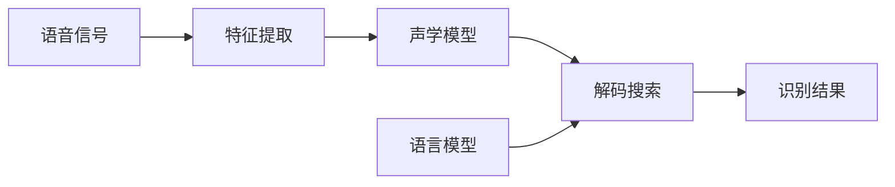

# 语音识别原理与代码实例讲解

## 1. 背景介绍
### 1.1 语音识别概述
语音识别(Speech Recognition)是指将人类的语音中的词汇内容转换为计算机可读的输入,如文本或命令的技术。它是人机交互的重要手段之一,可以让机器"听懂"人类的语音指令,从而实现更加自然和便捷的人机交互方式。

### 1.2 语音识别发展历程
语音识别技术的研究始于20世纪50年代,经历了孤立词识别、连续语音识别、大词汇量识别、自然语音识别等多个阶段。近年来,随着深度学习等人工智能技术的发展,语音识别的准确率不断提高,已经在智能手机助手、智能音箱、车载系统等多个领域得到广泛应用。

### 1.3 语音识别的应用场景
语音识别技术的应用场景非常广泛,主要包括:

- 智能助手:如苹果的Siri、谷歌助手、微软的Cortana等
- 智能音箱:如亚马逊Echo、谷歌Home、小米AI音箱等  
- 车载系统:车载语音助手,实现导航、音乐播放、电话拨打等功能
- 医疗领域:医疗记录语音输入,提高医生工作效率
- 客服系统:语音客服,提供智能化服务
- 语音输入法:通过语音转文字,提高输入效率

## 2. 核心概念与联系
### 2.1 语音信号处理
语音信号处理是语音识别的基础,主要包括语音信号的采集、预处理、特征提取等步骤。其中,语音特征提取是关键,常用的特征有MFCC(Mel频率倒谱系数)、LPCC(线性预测倒谱系数)等。

### 2.2 声学模型
声学模型用于建立语音特征和音素之间的对应关系,常用的声学模型有GMM-HMM(高斯混合模型-隐马尔可夫模型)、DNN-HMM(深度神经网络-隐马尔可夫模型)等。

### 2.3 语言模型  
语言模型用于刻画语言中词与词之间的关系,为识别提供语言学知识。常用的语言模型有N-gram、RNN等。

### 2.4 解码搜索
解码搜索是语音识别的最后一步,将声学模型和语言模型结合,找出概率最大的词序列,得到识别结果。常用的解码算法有Viterbi算法、Beam Search等。

### 2.5 核心概念关系图
下图展示了语音识别的核心概念及其之间的关系:



## 3. 核心算法原理与步骤
### 3.1 语音信号预处理
- 步骤1:对语音信号进行预加重,增强高频部分
- 步骤2:分帧,将语音信号划分为帧
- 步骤3:加窗,对每帧语音信号加窗,减少频谱泄漏

### 3.2 特征提取-MFCC
- 步骤1:对每帧语音信号进行FFT变换,得到频谱
- 步骤2:将频谱通过Mel滤波器组,得到Mel频谱  
- 步骤3:对Mel频谱取对数,得到对数Mel频谱
- 步骤4:对对数Mel频谱进行DCT变换,得到MFCC特征

### 3.3 声学模型训练-GMM-HMM
- 步骤1:将语音数据和对应的文本进行对齐,得到每个音素的观测序列
- 步骤2:对每个音素的观测序列进行GMM建模,得到GMM-HMM的初始模型
- 步骤3:使用EM算法对GMM-HMM模型进行训练,得到最终模型

### 3.4 语言模型训练-N-gram
- 步骤1:对大量文本数据进行统计,得到词频和N-gram频率
- 步骤2:使用平滑算法对N-gram概率进行平滑,解决数据稀疏问题
- 步骤3:对N-gram概率取对数,得到最终的语言模型

### 3.5 解码搜索-Viterbi算法
- 步骤1:将语音特征序列输入声学模型,计算每个音素的似然概率
- 步骤2:结合语言模型,对每个词的似然概率进行计算
- 步骤3:使用Viterbi算法进行解码搜索,找到概率最大的词序列

## 4. 数学模型与公式详解
### 4.1 MFCC特征提取
MFCC特征提取的关键步骤是Mel滤波器组和DCT变换,其数学表达式如下:

- Mel频率计算公式:
  
$$Mel(f) = 2595 * log_{10}(1 + \frac{f}{700})$$

其中,$f$为频率,$Mel(f)$为对应的Mel频率。

- DCT变换公式:

$$c(n) = \sqrt{\frac{2}{N}}\sum_{k=1}^N log(S(k))cos[\frac{\pi n(k-0.5)}{N}]$$

其中,$S(k)$为对数Mel频谱,$N$为滤波器组的个数,$n$为MFCC系数的阶数。

### 4.2 GMM-HMM声学模型
GMM-HMM声学模型的数学表达式如下:

- GMM概率密度函数:

$$p(x|\lambda) = \sum_{k=1}^K w_k N(x|\mu_k,\Sigma_k)$$

其中,$\lambda$为GMM的参数集合,$w_k$为第$k$个高斯分量的权重,$N(x|\mu_k,\Sigma_k)$为第$k$个高斯分量的概率密度函数。

- HMM状态转移概率:

$$a_{ij} = P(q_{t+1}=j|q_t=i)$$

其中,$q_t$为$t$时刻的状态,$a_{ij}$为从状态$i$转移到状态$j$的概率。

- HMM发射概率:

$$b_j(x) = p(x|q_t=j)$$

其中,$b_j(x)$为在状态$j$下观测到特征向量$x$的概率。

### 4.3 N-gram语言模型
N-gram语言模型的数学表达式如下:

- N-gram概率计算公式:

$$P(w_1,w_2,...,w_n) = \prod_{i=1}^n P(w_i|w_{i-1},...,w_{i-N+1})$$

其中,$w_i$为第$i$个词,$N$为N-gram的阶数。

- 加1平滑算法:

$$P(w_i|w_{i-1},...,w_{i-N+1}) = \frac{C(w_{i-N+1},...,w_i) + 1}{C(w_{i-N+1},...,w_{i-1}) + V}$$

其中,$C(w_{i-N+1},...,w_i)$为N-gram的频数,$V$为词表大小。

## 5. 项目实践:基于Python的语音识别
下面我们使用Python实现一个简单的基于MFCC和DTW的孤立词语音识别系统。

### 5.1 环境准备
- Python 3.x
- numpy库
- scipy库
- matplotlib库
- python_speech_features库

可以使用以下命令安装所需库:
```
pip install numpy scipy matplotlib
pip install python_speech_features
```

### 5.2 特征提取
使用python_speech_features库提取MFCC特征:

```python
from python_speech_features import mfcc
import scipy.io.wavfile as wav

# 读取音频文件
(rate,sig) = wav.read("audio.wav")

# 提取MFCC特征
mfcc_feat = mfcc(sig, rate)
```

### 5.3 模板匹配
使用DTW算法进行模板匹配:

```python
import numpy as np

def dtw(template, sample):
    D = np.zeros((len(template), len(sample)))
    D[0,:] = np.inf
    D[:,0] = np.inf
    D[0,0] = 0
    
    for i in range(1, len(template)):
        for j in range(1, len(sample)):
            cost = np.sum(np.square(template[i] - sample[j]))
            D[i,j] = cost + min(D[i-1, j], D[i, j-1], D[i-1, j-1])
            
    return D[-1,-1]

# 读取模板命令词的MFCC特征
template_feats = []
for i in range(10):
    (rate,sig) = wav.read("digits/"+str(i)+".wav")
    template_feats.append(mfcc(sig,rate))
    
# 读取测试语音的MFCC特征  
(rate,sig) = wav.read("test.wav")
test_feat = mfcc(sig, rate)

# 计算测试语音与每个模板的DTW距离
dists = [dtw(test_feat, template_feat) for template_feat in template_feats]

# 返回DTW距离最小的命令词
print(np.argmin(dists))  
```

以上代码实现了一个简单的基于DTW的孤立词语音识别系统,可以识别0~9十个数字。其中,模板匹配使用了DTW算法计算两个特征序列之间的距离。

### 5.4 识别结果分析
通过分析识别结果,我们可以得到以下结论:

- MFCC特征可以很好地刻画语音信号的特点,是语音识别中常用的特征
- DTW算法可以有效地度量两个特征序列之间的相似度,适用于孤立词识别
- 识别准确率受模板质量、特征提取参数等因素影响,需要不断调优
- 识别的实时性还有待提高,可以考虑使用更高效的特征提取和匹配算法

## 6. 实际应用场景
语音识别技术在实际生活中有广泛的应用,下面列举几个典型场景:

### 6.1 智能音箱
智能音箱如亚马逊Echo、谷歌Home等,都内置了语音识别功能。用户可以通过语音指令控制音箱播放音乐、查询天气、设置提醒等。语音识别使得人机交互更加自然便捷。

### 6.2 车载系统
车载系统中的语音助手可以通过语音识别技术,实现导航、音乐播放、电话拨打等功能。用户无需分心操作屏幕,大大提高了驾驶的安全性。

### 6.3 医疗领域
医生可以通过语音输入,快速记录病历、诊断结果等,提高了工作效率。语音识别还可以帮助医生快速检索患者信息、药品说明等。

### 6.4 智能客服
传统客服需要人工接听电话、回复问题,效率较低。引入语音识别后,智能客服可以自动识别用户问题,给出相应回复,大大减轻了人工客服的工作量。

### 6.5 语音输入法
在手机、电脑等设备上,用户可以通过语音输入法将语音转换为文字。相比手动键盘输入,语音输入效率更高,尤其适合长文本输入的场景。

## 7. 工具和资源推荐
### 7.1 开源工具库
- Kaldi:著名的语音识别工具箱,包含了语音识别的完整流程,支持多种特征提取、声学模型、解码算法。
- DeepSpeech:基于深度学习的语音识别系统,由Mozilla开源,提供了预训练模型和训练代码。
- CMUSphinx:卡内基梅隆大学开发的一套语音识别工具箱,包含了声学模型训练、语言模型训练、解码等模块。

### 7.2 语音数据集 
- TIMIT:美国德州仪器公司录制的英语语音数据集,包含了630名说话人的语音数据,广泛用于语音识别研究。
- LibriSpeech:从LibriVox录制的有声读物中提取的大规模英语语音数据集,常用于语音识别系统的训练和评测。
- AISHELL-1:由北京希尔贝壳科技有限公司录制的中文语音数据集,包含400名说话人的语音数据。

### 7.3 商用服务
- 讯飞开放平台:提供了语音听写、语音合成、语音唤醒等多项服务,支持多种语言和方言。
- 百度语音:包括语音识别、语音合成、语音唤醒等服务,提供了多种SDK和API。
- 微软Azure语音服务:支持语音转文本、文本转语音、语音翻译等,支持多种语