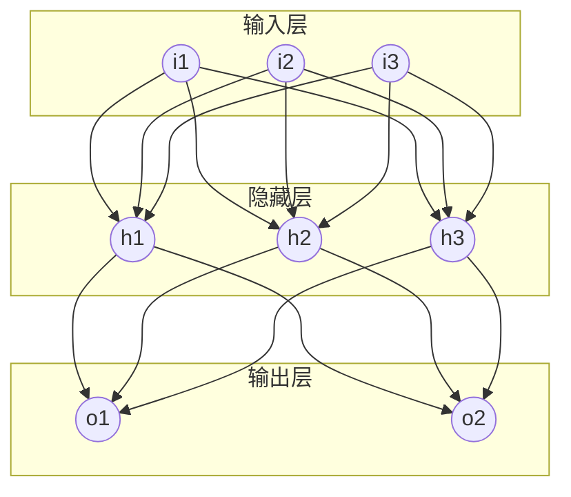

# 误差逆传播 (Backpropagation)

## 1.背景介绍

### 1.1 神经网络的发展历程

人工神经网络(Artificial Neural Networks, ANNs)是一种受生物神经系统启发而设计的计算模型,旨在模拟人脑的工作原理。神经网络的概念可以追溯到20世纪40年代,当时神经科学家沃伦·麦卡洛克(Warren McCulloch)和数理逻辑学家沃尔特·皮茨(Walter Pitts)提出了第一个神经网络模型。

然而,早期的神经网络模型存在一些局限性,例如缺乏有效的训练算法和计算能力不足。直到1986年,David Rumelhart、Geoffrey Hinton和Ronald Williams发表了著名的论文"Learning Representations by Back-propagating Errors",提出了误差反向传播(Backpropagation)算法,才使得多层神经网络的训练成为可能。这一突破性进展推动了神经网络在各个领域的广泛应用。

### 1.2 误差反向传播算法的重要性

误差反向传播算法是训练多层前馈神经网络的一种有效方法。它通过计算输出层与期望输出之间的误差,然后沿着网络反向传播这些误差,并调整每个神经元的权重和偏置,从而最小化整个网络的误差。

这种算法的出现解决了多层神经网络训练的关键问题,使得深度学习模型能够在大规模数据集上进行有效训练。它的影响不仅体现在神经网络领域,也推动了机器学习、计算机视觉、自然语言处理等多个领域的发展。

## 2.核心概念与联系

### 2.1 神经网络的基本结构

神经网络由多个节点(神经元)组成,这些节点通过加权连接进行信息传递。每个节点接收来自前一层节点的输入,对输入进行加权求和,然后通过激活函数产生输出,传递给下一层节点。



上图展示了一个典型的前馈神经网络结构,包括输入层、隐藏层和输出层。每个节点都与上一层的所有节点相连,并通过权重参数进行信息传递。

### 2.2 前向传播与反向传播

在神经网络的训练过程中,包括两个关键步骤:前向传播(Forward Propagation)和反向传播(Backpropagation)。

1. **前向传播**: 输入数据从输入层开始,经过隐藏层,最终到达输出层,产生预测输出。在这个过程中,每个节点根据加权输入和激活函数计算其输出。

2. **反向传播**: 将预测输出与真实标签进行比较,计算输出层的误差。然后,根据链式法则,计算每个权重对于该误差的梯度,并沿着网络反向传播,更新每个节点的权重和偏置,以最小化误差。

反向传播算法的核心思想是通过梯度下降法,沿着误差梯度的反方向更新网络参数,从而逐步减小预测误差。

## 3.核心算法原理具体操作步骤

误差反向传播算法的具体步骤如下:

1. **初始化网络参数**: 随机初始化每个节点的权重和偏置。

2. **前向传播**: 
   - 对于每个输入样本,计算输出层的预测值。
   - 在前向传播过程中,每个节点的输出由加权输入和激活函数决定。

3. **计算输出层误差**:
   - 计算输出层每个节点的误差,即预测值与真实标签之间的差异。
   - 对于回归问题,误差通常使用均方误差(MSE)计算;对于分类问题,可使用交叉熵损失函数。

4. **反向传播误差**:
   - 根据输出层误差,利用链式法则计算每个隐藏层节点对于该误差的梯度。
   - 将误差沿着网络反向传播,直到达到输入层。

5. **更新权重和偏置**:
   - 根据每个权重和偏置对应的梯度值,使用优化算法(如梯度下降)更新网络参数。
   - 常见的优化算法包括随机梯度下降(SGD)、动量优化、RMSProp、Adam等。

6. **重复训练**:
   - 对于训练数据中的每个样本,重复执行步骤2到步骤5。
   - 在每个训练epoch结束时,可以评估模型在验证集上的性能,并根据需要调整超参数。

7. **终止条件**:
   - 当模型在验证集上的性能不再提升,或者达到预设的最大训练轮数时,终止训练过程。

通过不断迭代上述步骤,神经网络可以逐步减小预测误差,从而学习到合适的权重和偏置参数,提高模型的泛化能力。

## 4.数学模型和公式详细讲解举例说明

### 4.1 前向传播

假设我们有一个单隐藏层的神经网络,输入层有$n$个节点,隐藏层有$m$个节点,输出层有$k$个节点。我们使用以下符号表示:

- $x_i$: 第$i$个输入节点的值
- $w_{ji}$: 从输入层第$i$个节点到隐藏层第$j$个节点的权重
- $b_j$: 隐藏层第$j$个节点的偏置
- $h_j$: 隐藏层第$j$个节点的输出
- $v_{kj}$: 从隐藏层第$j$个节点到输出层第$k$个节点的权重
- $c_k$: 输出层第$k$个节点的偏置
- $y_k$: 输出层第$k$个节点的输出
- $\sigma(\cdot)$: 激活函数(如sigmoid或ReLU)

则前向传播的数学表达式如下:

1. 隐藏层输出:

$$h_j = \sigma\left(\sum_{i=1}^{n}w_{ji}x_i + b_j\right)$$

2. 输出层输出:

$$y_k = \sigma\left(\sum_{j=1}^{m}v_{kj}h_j + c_k\right)$$

### 4.2 反向传播

我们定义损失函数$L$,用于衡量预测输出与真实标签之间的差异。对于回归问题,常用均方误差(MSE)损失函数:

$$L = \frac{1}{2}\sum_{k=1}^{K}(t_k - y_k)^2$$

其中$t_k$是第$k$个输出节点的真实标签。

反向传播的目标是计算每个权重和偏置对于损失函数的梯度,以便进行参数更新。我们使用链式法则来推导梯度公式。

1. 输出层梯度:

$$\frac{\partial L}{\partial v_{kj}} = \frac{\partial L}{\partial y_k}\frac{\partial y_k}{\partial v_{kj}} = (y_k - t_k)\sigma'(z_k)h_j$$

$$\frac{\partial L}{\partial c_k} = \frac{\partial L}{\partial y_k}\frac{\partial y_k}{\partial c_k} = (y_k - t_k)\sigma'(z_k)$$

其中$z_k$是输出层第$k$个节点的加权输入,即$z_k = \sum_{j=1}^{m}v_{kj}h_j + c_k$。

2. 隐藏层梯度:

$$\frac{\partial L}{\partial w_{ji}} = \frac{\partial L}{\partial h_j}\frac{\partial h_j}{\partial w_{ji}} = \sum_{k=1}^{K}\frac{\partial L}{\partial y_k}\frac{\partial y_k}{\partial h_j}\frac{\partial h_j}{\partial w_{ji}} = \sum_{k=1}^{K}(y_k - t_k)v_{kj}\sigma'(z_j)x_i$$

$$\frac{\partial L}{\partial b_j} = \frac{\partial L}{\partial h_j}\frac{\partial h_j}{\partial b_j} = \sum_{k=1}^{K}\frac{\partial L}{\partial y_k}\frac{\partial y_k}{\partial h_j}\frac{\partial h_j}{\partial b_j} = \sum_{k=1}^{K}(y_k - t_k)v_{kj}\sigma'(z_j)$$

其中$z_j$是隐藏层第$j$个节点的加权输入,即$z_j = \sum_{i=1}^{n}w_{ji}x_i + b_j$。

通过计算上述梯度,我们可以使用优化算法(如梯度下降)更新网络参数,从而减小损失函数的值。

### 4.3 示例:使用PyTorch实现反向传播

下面是一个使用PyTorch实现反向传播的简单示例:

```python
import torch
import torch.nn as nn

# 定义网络结构
class Net(nn.Module):
    def __init__(self, input_size, hidden_size, output_size):
        super(Net, self).__init__()
        self.fc1 = nn.Linear(input_size, hidden_size)
        self.relu = nn.ReLU()
        self.fc2 = nn.Linear(hidden_size, output_size)

    def forward(self, x):
        out = self.fc1(x)
        out = self.relu(out)
        out = self.fc2(out)
        return out

# 初始化网络和优化器
net = Net(input_size=3, hidden_size=4, output_size=2)
criterion = nn.MSELoss()
optimizer = torch.optim.SGD(net.parameters(), lr=0.01)

# 训练数据
inputs = torch.tensor([[1.0, 2.0, 3.0], [4.0, 5.0, 6.0]])
targets = torch.tensor([[0.5, 0.1], [0.9, 0.7]])

# 前向传播
outputs = net(inputs)
loss = criterion(outputs, targets)

# 反向传播和优化
optimizer.zero_grad()
loss.backward()
optimizer.step()

print(f'Loss: {loss.item()}')
```

在这个示例中,我们定义了一个简单的前馈神经网络,包含一个输入层、一个隐藏层和一个输出层。我们使用均方误差(MSE)作为损失函数,并使用随机梯度下降(SGD)作为优化算法。

在每次迭代中,我们首先进行前向传播计算输出,然后计算损失函数。接下来,我们调用`loss.backward()`方法,自动计算每个参数对于损失函数的梯度。最后,我们使用优化器`optimizer.step()`来更新网络参数。

通过多次迭代这个过程,网络可以逐步减小损失函数的值,从而学习到合适的权重和偏置参数。

## 5.项目实践:代码实例和详细解释说明

在本节中,我们将通过一个实际项目来演示如何使用PyTorch实现反向传播算法,并训练一个简单的神经网络模型。

### 5.1 项目概述

我们将构建一个简单的前馈神经网络,用于解决一个回归问题。具体来说,我们将使用波士顿房价数据集,基于房屋的各种特征(如房间数量、邻里人均收入等)来预测房屋价格。

### 5.2 数据准备

首先,我们需要导入必要的库和数据集:

```python
import torch
import torch.nn as nn
from torch.utils.data import Dataset, DataLoader
from sklearn.datasets import load_boston
from sklearn.preprocessing import StandardScaler
import numpy as np

# 加载波士顿房价数据集
boston = load_boston()
X, y = boston.data, boston.target

# 数据标准化
scaler = StandardScaler()
X = scaler.fit_transform(X)

# 将数据转换为PyTorch张量
X = torch.tensor(X, dtype=torch.float32)
y = torch.tensor(y, dtype=torch.float32).unsqueeze(1)

# 定义自定义数据集
class BostonDataset(Dataset):
    def __init__(self, X, y):
        self.X = X
        self.y = y

    def __len__(self):
        return len(self.X)

    def __getitem__(self, idx):
        return self.X[idx], self.y[idx]

# 创建数据加载器
dataset = BostonDataset(X, y)
train_loader =