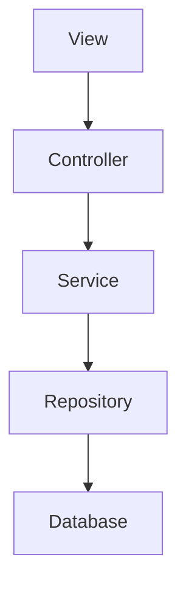

# 超市销售管理系统详细设计与具体代码实现

## 1.背景介绍

在当今快节奏的商业环境中，高效的销售管理系统对于任何零售企业的成功运营都至关重要。超市作为一种典型的零售场所,需要一个强大且易于使用的系统来管理庞大的商品种类、跟踪库存水平、处理复杂的销售交易以及分析销售数据。一个精心设计的超市销售管理系统不仅可以提高运营效率,还能为企业带来竞争优势。

## 2.核心概念与联系

超市销售管理系统涉及多个核心概念,包括:

1. **商品管理**:维护商品信息、价格、库存等数据。
2. **销售交易处理**:扫描商品条形码、计算总价、收银等。
3. **库存管理**:实时跟踪商品库存水平,及时补货。
4. **会员管理**:记录会员信息、积分、优惠等。
5. **报表和数据分析**:生成各种统计报表,分析销售趋势。

这些概念相互关联,构成了一个完整的系统。例如,销售交易会影响库存水平,库存不足时需要触发补货;会员购物可享受折扣,需要与会员信息相关联。因此,设计时需要考虑各模块之间的交互和数据流动。

## 3.核心算法原理具体操作步骤

### 3.1 商品条形码识别算法

商品条形码识别是超市销售系统的核心功能之一。常用的一维条形码识别算法步骤如下:

1. **获取图像**:使用扫描设备获取条形码图像。
2. **图像预处理**:去噪、二值化、边缘检测等,提高图像质量。
3. **定位条形码区域**:通过边缘检测或连通区域分析定位条形码。
4. **解码**:根据条形码编码规则(如EAN-13)解析条形码数字。
5. **校验**:使用校验码验证条形码的正确性。
6. **查询数据库**:根据解码结果在商品数据库中查询商品信息。

该算法的关键在于图像预处理和解码两个步骤,需要针对不同条件(如背景、光照等)进行优化,以提高识别准确率。

### 3.2 商品补货策略算法

为了保证超市货架上商品的充足供应,需要一个高效的补货策略算法:

1. **设置安全库存水平**:根据历史销售数据,为每种商品设置一个最低库存阈值。
2. **实时监控库存**:持续跟踪每种商品的实际库存水平。
3. **触发补货**:当库存低于阈值时,自动向供应商发出补货请求。
4. **优化补货量**:根据销售预测,确定每次补货的数量,避免过多或过少。
5. **考虑补货周期**:对于一些生鲜商品,需要根据保质期适当调整补货周期。

该算法的关键在于准确预测销售量和设置合理的库存阈值,以实现及时补货、减少库存成本。

## 4.数学模型和公式详细讲解举例说明

### 4.1 商品需求预测模型

为了优化补货策略,我们需要预测未来一段时间内每种商品的需求量。一种常用的时间序列预测模型是指数平滑模型:

$$
F_{t+1} = \alpha D_t + (1 - \alpha) F_t
$$

其中:
- $F_{t+1}$是对时间$t+1$的需求预测值
- $D_t$是时间$t$的实际需求量
- $\alpha$是平滑系数,取值范围$[0,1]$,决定了对新数据和旧预测值的权重

当$\alpha$较大时,模型对最新数据更加敏感;当$\alpha$较小时,模型对历史数据有更多的平滑作用。

我们可以结合商品的销售周期性,使用季节性指数平滑模型:

$$
F_{t+m} = \alpha \frac{D_t}{S_{t-L}} + (1 - \alpha)(F_{t} + S_{t-L})
$$

$$
S_t = \gamma \frac{D_t}{F_t} + (1 - \gamma)S_{t-L}
$$

其中:
- $m$是季节周期长度(如周、月等)
- $L$是季节滞后期数,即$L=m$
- $S_t$是时间$t$的季节性因子
- $\gamma$是季节性平滑系数,取值范围$[0,1]$

该模型能够较好地捕捉商品销量的周期性波动,对于生鲜类商品的补货策略优化很有帮助。

### 4.2 会员积分计算模型

为了吸引并留住会员,超市通常会设置积分制度,让会员根据消费金额累积积分,并可用于折扣或兑换礼品。假设规则如下:

- 每消费1元可获得1积分
- 每100积分可抵扣1元
- 积分有效期为1年,超期作废

我们可以用如下公式计算会员的可用积分:

$$
P = \sum_{i=1}^{n} p_i \cdot \delta(t_i - t_0 \le 365)
$$

其中:
- $P$是会员的可用积分
- $n$是会员的历史消费记录数
- $p_i$是第$i$条消费记录的获得积分
- $t_i$是第$i$条消费记录的时间戳
- $t_0$是当前时间戳
- $\delta$是指示函数,满足条件时取1,否则取0

该模型能够精确计算会员的可用积分,并自动过滤掉超期的积分。对于会员营销策略的制定很有帮助。

## 5.项目实践:代码实例和详细解释说明

为了更好地理解超市销售管理系统的实现,我们将使用Java语言,基于Spring Boot框架开发一个简单的系统原型。

### 5.1 系统架构

我们将采用经典的三层架构模式,包括表示层(View)、业务逻辑层(Controller)和数据访问层(Repository):



- **View层**:提供用户界面,接收用户输入并显示数据。
- **Controller层**:处理用户请求,调用Service层方法完成业务逻辑。
- **Service层**:实现系统的核心业务逻辑,如商品管理、销售交易等。
- **Repository层**:与数据库交互,执行数据持久化操作。
- **Database**:存储系统的所有数据。

### 5.2 数据模型

我们将使用关系型数据库(如MySQL)存储系统数据,主要包括以下几张表:

- **Product**:存储商品信息,包括ID、名称、价格、库存等字段。
- **Sale**:存储销售交易记录,包括ID、交易时间、总金额等字段。
- **SaleItem**:存储每笔交易的商品明细,包括SaleID、ProductID、数量等字段。
- **Member**:存储会员信息,包括ID、姓名、积分等字段。

这些表通过外键关联,形成一个规范的数据模型。

### 5.3 商品管理模块

我们将实现一个简单的商品管理模块,包括查看商品列表、添加商品和更新商品三个功能。

#### 5.3.1 查看商品列表

```java
// ProductController.java
@GetMapping("/products")
public List<Product> getProducts() {
    return productService.findAll();
}

// ProductService.java
public List<Product> findAll() {
    return productRepository.findAll();
}

// ProductRepository.java
public interface ProductRepository extends JpaRepository<Product, Long> {
    // JPA自动实现基本的CRUD方法
}
```

在Controller层,我们定义了一个`/products`的GET请求映射,调用Service层的`findAll()`方法获取所有商品数据。Service层则直接调用Repository层的`findAll()`方法从数据库中查询。

#### 5.3.2 添加商品

```java
// ProductController.java
@PostMapping("/products")
public Product addProduct(@RequestBody Product product) {
    return productService.save(product);
}

// ProductService.java
public Product save(Product product) {
    return productRepository.save(product);
}
```

在Controller层,我们定义了一个`/products`的POST请求映射,接收前端传递的JSON格式的商品数据,并调用Service层的`save()`方法保存到数据库中。

#### 5.3.3 更新商品

```java
// ProductController.java
@PutMapping("/products/{id}")
public Product updateProduct(@PathVariable Long id, @RequestBody Product product) {
    return productService.update(id, product);
}

// ProductService.java
public Product update(Long id, Product product) {
    Product existing = productRepository.findById(id)
        .orElseThrow(() -> new ResourceNotFoundException("Product not found"));
    existing.setName(product.getName());
    existing.setPrice(product.getPrice());
    existing.setStock(product.getStock());
    return productRepository.save(existing);
}
```

在Controller层,我们定义了一个`/products/{id}`的PUT请求映射,接收商品ID和JSON格式的商品数据,并调用Service层的`update()`方法更新数据库中的记录。在Service层,我们首先根据ID查询到现有的商品记录,然后更新其属性值,最后保存到数据库中。

### 5.4 销售交易模块

我们将实现一个简单的销售交易模块,包括扫描商品条形码、计算总价和结账三个功能。

#### 5.4.1 扫描商品条形码

```java
// SaleController.java
@PostMapping("/sales")
public SaleDTO startSale(@RequestBody List<String> barcodes) {
    return saleService.startSale(barcodes);
}

// SaleService.java
public SaleDTO startSale(List<String> barcodes) {
    Sale sale = new Sale();
    saleRepository.save(sale);
    List<SaleItem> items = new ArrayList<>();
    for (String barcode : barcodes) {
        Product product = productRepository.findByBarcode(barcode)
            .orElseThrow(() -> new ResourceNotFoundException("Product not found"));
        SaleItem item = new SaleItem(sale, product, 1);
        items.add(item);
    }
    saleItemRepository.saveAll(items);
    return mapToDTO(sale, items);
}
```

在Controller层,我们定义了一个`/sales`的POST请求映射,接收一个商品条形码列表,并调用Service层的`startSale()`方法开始一笔新的销售交易。在Service层,我们首先创建一个新的Sale记录并保存到数据库中,然后根据传入的条形码查询对应的商品信息,创建SaleItem记录并保存到数据库中。最后,我们将Sale和SaleItem数据映射为DTO对象返回给前端。

#### 5.4.2 计算总价

```java
// SaleDTO.java
public class SaleDTO {
    private Long id;
    private List<SaleItemDTO> items;
    private double totalAmount;
    
    // 计算总价的逻辑
    public double getTotalAmount() {
        return items.stream()
            .mapToDouble(item -> item.getPrice() * item.getQuantity())
            .sum();
    }
}
```

在DTO层,我们定义了一个`SaleDTO`类,包含了销售交易的ID、商品明细列表和总金额等属性。其中,`getTotalAmount()`方法使用Java 8的Stream API计算了总金额,即将每个商品的单价乘以数量,然后求和。

#### 5.4.3 结账

```java
// SaleController.java
@PostMapping("/sales/{id}/checkout")
public void checkout(@PathVariable Long id) {
    saleService.checkout(id);
}

// SaleService.java
public void checkout(Long id) {
    Sale sale = saleRepository.findById(id)
        .orElseThrow(() -> new ResourceNotFoundException("Sale not found"));
    List<SaleItem> items = saleItemRepository.findBySale(sale);
    for (SaleItem item : items) {
        Product product = item.getProduct();
        product.setStock(product.getStock() - item.getQuantity());
        productRepository.save(product);
    }
}
```

在Controller层,我们定义了一个`/sales/{id}/checkout`的POST请求映射,接收销售交易的ID,并调用Service层的`checkout()`方法完成结账操作。在Service层,我们首先根据ID查询到销售交易记录,然后遍历其中的商品明细,更新每种商品的库存量,最后保存到数据库中。

### 5.5 会员管理模块

我们将实现一个简单的会员管理模块,包括会员注册、积分累积和积分抵扣三个功能。

#### 5.5.1 会员注册

```java
// MemberController.java
@PostMapping("/members")
public Member registerMember(@RequestBody Member member) {
    return memberService.register(member);
}

// MemberService.java
public Member register(Member member) {
    member.setPoints(0);
    return memberRepository.save(member);
}
```

在Controller层,我