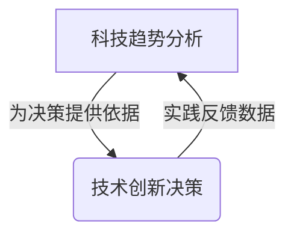
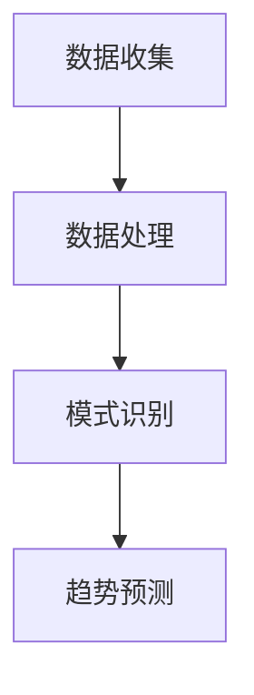

# 跟踪研究和分析科技行业的发展趋势，为公司在技术创新和科技发展方面的决策提供支持

## 1.背景介绍

### 1.1 科技创新的重要性

在当今快节奏的商业环境中，科技创新已成为推动企业发展的关键驱动力。科技的飞速进步正在重塑各个行业的格局，给传统商业模式带来前所未有的挑战和机遇。企业必须紧跟科技发展的步伐,及时把握新兴技术趋势,并将其融入业务战略和运营中,才能在激烈的市场竞争中占据优势地位。

### 1.2 科技趋势跟踪的必要性

要想保持领先地位,企业需要持续跟踪和分析科技行业的最新发展趋势。通过深入了解新兴技术的潜力、应用场景和影响,企业可以制定前瞻性的技术创新战略,提前布局并投资有前景的技术领域。同时,及时发现潜在的技术风险和挑战,也有助于企业采取应对措施,规避风险。

## 2.核心概念与联系

### 2.1 科技趋势分析

科技趋势分析是指系统地收集、分析和解读与科技相关的数据和信息,以预测未来的技术发展方向。它包括以下几个关键环节:

1. 数据收集:从各种渠道(如科技期刊、行业报告、专利数据库等)收集相关数据。
2. 数据处理:对收集的数据进行清洗、整理和结构化处理。
3. 模式识别:应用数据挖掘、机器学习等技术,发现数据中潜在的模式和趋势。
4. 趋势预测:基于识别出的模式,结合专家知识,对未来的技术发展进行预测和展望。
5. 影响评估:分析新兴技术对行业和企业的潜在影响。

### 2.2 技术创新决策

技术创新决策是指企业基于对科技趋势的分析,制定技术创新战略并做出相应的投资决策。主要包括以下几个方面:

1. 技术路线图规划:确定企业未来的技术发展方向和重点。
2. 项目评估和选择:评估不同技术项目的潜力和风险,选择最有前景的项目进行投资。
3. 资源配置:合理分配人力、财力等资源,支持技术创新项目的实施。
4. 商业模式创新:根据新技术的特点,创新企业的商业模式和运营方式。
5. 风险管控:识别和管控技术创新过程中可能存在的风险。

科技趋势分析和技术创新决策是相互关联、相辅相成的。准确的趋势分析为创新决策提供依据,而科技创新的实践又能反馈新的数据,促进趋势分析的持续优化。



## 3.核心算法原理具体操作步骤

### 3.1 数据收集

科技趋势分析的第一步是从各种渠道收集相关数据,主要包括以下几种类型:

1. **科技文献**:包括学术期刊论文、会议论文、专利等,能反映最新的科研成果和技术进展。
2. **行业报告**:由咨询公司、研究机构等发布的行业分析报告,能了解行业发展现状和趋势。
3. **新闻媒体**:科技新闻报道能及时获取最新的技术动态和热点话题。
4. **社交媒体**:包括技术博客、论坛、微博等,能捕捉到普通用户对新技术的反馈和看法。
5. **公开数据集**:政府机构、企业等发布的公开数据集,如专利数据库、产品销售数据等。

数据收集过程中需要注意以下几点:

1. 使用网络爬虫、API等工具自动化收集数据,提高效率。
2. 遵守数据使用许可,避免侵犯知识产权。
3. 对数据来源的可信度和权威性进行评估。
4. 定期更新数据,保持数据的时效性。

### 3.2 数据处理

收集到的原始数据通常是非结构化的,需要进行数据清洗和结构化处理,为后续的分析做好准备。主要包括以下步骤:

1. **数据清洗**:去除重复数据、填补缺失值、处理异常值等,提高数据质量。
2. **文本预处理**:对文本数据进行分词、去停用词、词形还原等自然语言处理,提取有用信息。
3. **特征提取**:从结构化数据和文本数据中提取特征,如主题特征、情感特征等,为模式识别做准备。
4. **数据标注**:对部分数据进行人工标注,作为监督学习算法的训练数据。

数据处理环节的自动化程度越高,能够节省大量的人力成本。可以利用各种开源工具库(如scikit-learn、NLTK等)进行数据处理。

### 3.3 模式识别

经过数据处理后,可以应用机器学习和数据挖掘算法对数据进行模式识别,发现潜在的趋势信号。常用的算法包括:

1. **主题模型**:如潜在狄利克雷分布(LDA)算法,能自动发现文本数据中的潜在主题,分析热门技术领域。
2. **聚类算法**:如K-Means、DBSCAN等,能根据数据的相似性将其划分为多个簇,发现数据内在的模式。
3. **趋势检测算法**:如STL(Season-Trend Loess)分解,能从时序数据中分离出趋势成分,用于趋势预测。
4. **异常检测算法**:如隔离森林、一类SVM等,能发现数据中的异常点,捕捉新兴的技术突破。

算法的选择需要结合具体的数据特征和分析目标。同时,也可以尝试组合使用多种算法,发挥各自的优势。

### 3.4 趋势预测

在识别出数据中的模式后,可以结合领域知识和专家经验,对未来的技术发展趋势进行预测。常用的预测方法包括:

1. **时序预测模型**:如ARIMA、指数平滑等,基于历史数据预测未来的发展轨迹。
2. **回归分析**:建立自变量(如研发投入)和因变量(如技术进步)之间的回归模型,用于趋势预测。
3. **情景分析**:设置不同的发展情景,分析每种情景下技术的发展前景。
4. **德尔菲法**:通过多轮专家调查,达成对未来趋势的共识性预测。

预测的准确性取决于数据质量、模型选择和专家经验。通常需要持续跟踪实际发展情况,并及时调整预测模型。



## 4.数学模型和公式详细讲解举例说明

在科技趋势分析中,常常需要借助数学模型和公式来量化分析数据,发现潜在的规律和趋势。下面将介绍几种常用的数学模型。

### 4.1 主题模型:LDA

潜在狄利克雷分布(Latent Dirichlet Allocation, LDA)是一种常用的主题模型,能从大量文本数据中自动发现潜在的主题。它的基本思想是:每篇文档都是由多个主题构成的,而每个主题又是由一组特征词构成的。LDA模型能够同时学习文档的主题分布和主题的词分布。

LDA模型的数学表达式如下:

$$
P(w_i|d) = \sum_{k=1}^K P(w_i|z_k)P(z_k|d)
$$

其中:
- $w_i$表示文档$d$中的第$i$个词
- $z_k$表示第$k$个主题
- $P(w_i|z_k)$表示词$w_i$在主题$z_k$下的概率分布
- $P(z_k|d)$表示文档$d$中主题$z_k$的概率分布
- $K$表示主题的总数

通过吉布斯采样或变分推理等方法,可以估计出$P(w_i|z_k)$和$P(z_k|d)$的值,从而发现文档中的主题分布。

### 4.2 趋势分解:STL

季节-趋势分解(Seasonal-Trend decomposition using Loess, STL)是一种常用的时序数据分解方法,能够将时序数据分解为趋势、周期和残差三个分量,用于分析趋势和周期性规律。

STL分解的数学表达式为:

$$
Y_t = T_t + S_t + R_t
$$

其中:
- $Y_t$表示时间$t$的观测值
- $T_t$表示时间$t$的趋势分量
- $S_t$表示时间$t$的周期分量
- $R_t$表示时间$t$的残差分量

STL使用LOESS(locally estimated scatterplot smoothing)的非参数方法来估计趋势和周期分量。具体步骤如下:

1. 使用LOESS平滑$Y_t$,得到初始趋势估计$\hat{T}_t^{(0)}$
2. 计算$Y_t - \hat{T}_t^{(0)}$,得到初始周期+残差序列
3. 使用LOESS平滑周期+残差序列,得到周期估计$\hat{S}_t$
4. 计算$Y_t - \hat{S}_t$,得到新的趋势估计$\hat{T}_t^{(1)}$
5. 重复3-4步,直到趋势和周期估计收敛

通过STL分解,可以清晰地观察到时序数据的长期趋势和周期性波动,有助于进行趋势预测和周期性规律分析。

### 4.3 异常检测:隔离森林

异常检测是发现数据中异常点(outlier)的过程,在科技趋势分析中可用于捕捉新兴的技术突破或颠覆性创新。隔离森林(Isolation Forest)是一种常用的无监督异常检测算法。

隔离森林的工作原理是:对于正常数据点,由于它们相对较为密集,因此需要较多的划分才能将其与其他数据点隔离开来;而对于异常点,由于它们相对较为稀疏,因此只需较少的划分就能将其与其他数据点隔离开来。基于这一原理,隔离森林算法通过构建多个二叉树,计算每个数据点被隔离所需的路径长度,并将路径长度较短的数据点标记为异常点。

隔离森林算法的核心是计算样本$x$的异常分数$s(x)$,定义如下:

$$
s(x) = 2^{-\frac{E(h(x))}{c(n)}}
$$

其中:
- $h(x)$表示样本$x$被隔离所需的路径长度
- $E(h(x))$表示$h(x)$的期望值
- $c(n)$是一个用于归一化的常数,取决于训练数据的大小$n$

异常分数$s(x)$的值越小,则样本$x$越有可能是异常点。通过设置异常分数的阈值,可以对异常点进行检测和标记。

隔离森林算法的优点是计算高效,无需对数据分布进行假设,并且对异常点的类型没有限制。它在科技趋势分析中可用于发现新兴的技术突破和创新信号。

## 5.项目实践:代码实例和详细解释说明

为了更好地理解科技趋势分析的实践过程,下面将通过一个基于Python的实例项目进行说明。该项目旨在从科技新闻中自动发现热门技术主题及其发展趋势。

### 5.1 数据收集

首先,我们使用Python的`newspaper3k`库从技术新闻网站(如TechCrunch、VentureBeat等)自动抓取新闻文章。

```python
from newspaper import Article

def crawl_articles(url):
    article = Article(url)
    article.download()
    article.parse()
    return article.text

urls = [...] # 新闻网站URL列表
corpus = [crawl_articles(url) for url in urls]
```

### 5.2 数据预处理

对抓取的新闻文本进行分词、去停用词等预处理,以提