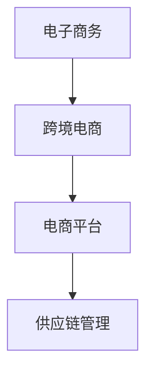

# 跨境电商全盘项目开发、管理实践

## 1.背景介绍

随着互联网和全球化的发展,跨境电商已成为当前电子商务领域的一股重要力量。跨境电商是指企业或个人通过互联网平台,将商品或服务销售给海外市场的一种新型国际贸易方式。它打破了传统贸易的地域限制,为企业开拓海外市场提供了新的机遇。

跨境电商的兴起,主要得益于以下几个原因:

1. 互联网技术的快速发展,为跨境电商提供了技术基础。
2. 全球化进程加快,消费者对国外商品的需求日益增长。
3. 物流运输和支付结算等配套服务的完善,降低了跨境交易的成本和风险。
4. 一些国家和地区出台了相关政策,为跨境电商的发展创造了良好环境。

跨境电商项目的开发和管理,需要整合多方资源,涉及技术、运营、物流、法律等多个领域,是一个系统工程。本文将从实践角度,全面介绍跨境电商项目的开发和管理流程。

## 2.核心概念与联系

跨境电商项目涉及多个核心概念,理解这些概念及其内在联系,对项目的顺利实施至关重要。

### 2.1 电子商务(E-Commerce)

电子商务是指通过互联网等信息技术手段进行商品交易活动的一种商业模式。它包括企业对消费者(B2C)、企业对企业(B2B)、消费者对消费者(C2C)等多种交易形式。

### 2.2 跨境电商(Cross-Border E-Commerce)

跨境电商是电子商务在国际贸易领域的应用,是指企业或个人通过互联网平台,将商品或服务销售给海外市场的一种新型国际贸易方式。

### 2.3 电商平台(E-Commerce Platform)

电商平台是指为买家和卖家提供在线交易场所的网站或应用程序,如亚马逊、eBay、淘宝等。平台负责构建交易环境,提供支付、物流等配套服务。

### 2.4 供应链管理(Supply Chain Management)

供应链管理是指对原材料采购、生产制造、库存管理、订单处理、运输配送等环节进行统筹协调和优化,以满足客户需求、降低成本的一种管理模式。在跨境电商中,高效的供应链管理对提升运营效率至关重要。

### 2.5 关系图

上述核心概念之间的关系可用下面的关系图直观表示:

## 3.核心算法原理具体操作步骤

跨境电商项目的核心算法主要包括以下几个方面:

### 3.1 商品推荐算法

商品推荐算法的目标是为用户推荐感兴趣的商品,提高购买转化率。常用的算法有:

1. **协同过滤算法(Collaborative Filtering)**

   根据用户的历史行为数据,找到与目标用户有相似兴趣爱好的其他用户,并推荐这些用户喜欢的商品。

   算法步骤:
   
   a. 计算用户之间的相似度
   b. 找到与目标用户最相似的 K 个用户
   c. 根据这 K 个用户的喜好,计算并推荐商品

2. **基于内容的推荐算法(Content-Based Recommendation)**

   根据用户历史浏览或购买的商品特征,推荐与之相似的商品。

   算法步骤:

   a. 提取用户历史商品的特征向量
   b. 计算候选商品与用户历史商品的相似度
   c. 推荐与用户历史商品最相似的商品

### 3.2 动态定价算法

动态定价算法根据市场供需情况、竞争对手价格等因素,自动调整商品价格,以获取最大收益。常用算法有:

1. **Ridge 回归算法**

   利用历史数据,建立商品价格与影响因素之间的线性回归模型,预测合理的价格区间。

   算法步骤:

   a. 收集影响因素数据,如库存、需求、竞争对手价格等
   b. 使用 Ridge 回归训练模型,学习影响因素与价格之间的映射关系
   c. 输入新的影响因素数据,预测商品价格

2. **强化学习算法**

   将定价问题建模为马尔可夫决策过程,利用强化学习算法自动探索最优定价策略。

   算法步骤:

   a. 构建状态空间(如库存、需求等)和行为空间(调高/调低价格)
   b. 设计奖励函数(如收益、销量等)
   c. 使用 Q-Learning 等算法,不断尝试不同的定价策略,学习获得最大收益的策略

### 3.3 物流路径优化算法

针对跨境电商的物流配送问题,需要优化运输路径,minimizeimize运输成本和时间。常用算法有:

1. **蚁群算法(Ant Colony Optimization)**

   模拟蚂蚁觅食行为,通过信息素机制,不断探索更优的路径。

   算法步骤:

   a. 构建图模型,表示物流网络
   b. 虚拟放置蚂蚁,按一定概率选择路径前进
   c. 根据路径长度、费用等,调整路径信息素浓度
   d. 重复以上过程,收敛到最优路径

2. **遗传算法(Genetic Algorithm)** 

   模拟生物进化过程,通过基因重组和自然选择,不断产生更优路径。

   算法步骤:

   a. 将路径编码为基因
   b. 根据目标函数(如成本、时间等)计算路径适应度
   c. 选择适应度高的路径进行交叉变异,产生新一代路径
   d. 重复上述过程,直至收敛

上述算法的具体实现细节较为复杂,需要结合具体问题进行建模和参数调优。在实际项目中,通常会综合运用多种算法,形成混合算法框架,以取得更好的效果。

## 4.数学模型和公式详细讲解举例说明  

在跨境电商项目中,数学模型和公式发挥着重要作用,为算法提供理论基础和量化支撑。下面将详细讲解几个典型的数学模型和公式。

### 4.1 协同过滤算法中的相似度计算

在推荐系统中,协同过滤算法需要计算用户之间或物品之间的相似度。常用的相似度计算公式有:

1. **余弦相似度(Cosine Similarity)**

   余弦相似度用于计算两个向量之间的夹角余弦值,公式如下:

   $$\text{sim}(x, y) = \cos(\theta) = \frac{x \cdot y}{\|x\|\|y\|} = \frac{\sum\limits_{i=1}^{n}x_iy_i}{\sqrt{\sum\limits_{i=1}^{n}x_i^2}\sqrt{\sum\limits_{i=1}^{n}y_i^2}}$$

   其中 $x$ 和 $y$ 分别表示两个向量,  $\theta$ 为它们的夹角。

   例如,计算用户 A 和用户 B 对商品 1、2、3 的评分向量的相似度:

   用户 A 评分: [5, 3, 0]
   用户 B 评分: [4, 0, 5]

   代入公式计算:

   $$\begin{aligned}
   \text{sim}(A, B) &= \frac{5 \times 4 + 3 \times 0 + 0 \times 5}{\sqrt{5^2 + 3^2 + 0^2} \sqrt{4^2 + 0^2 + 5^2}} \\
   &= \frac{20}{\sqrt{34} \sqrt{41}} \\
   &\approx 0.49
   \end{aligned}$$

2. **皮尔逊相关系数(Pearson Correlation Coefficient)**

   皮尔逊相关系数用于度量两个变量之间的线性相关程度,公式如下:

   $$r_{xy} = \frac{\sum\limits_{i=1}^{n}(x_i - \bar{x})(y_i - \bar{y})}{\sqrt{\sum\limits_{i=1}^{n}(x_i - \bar{x})^2\sum\limits_{i=1}^{n}(y_i - \bar{y})^2}}$$

   其中 $x_i$ 和 $y_i$ 分别表示两个变量的第 i 个观测值, $\bar{x}$ 和 $\bar{y}$ 分别表示两个变量的均值。

   例如,计算用户 A 和用户 B 对 5 个商品的评分的皮尔逊相关系数:

   用户 A 评分: [4, 5, 3, 2, 1]
   用户 B 评分: [5, 4, 4, 2, 1]

   代入公式计算:

   $$\begin{aligned}
   r_{AB} &= \frac{(4-3)(5-3) + (5-3)(4-3) + (3-3)(4-3) + (2-3)(2-3) + (1-3)(1-3)}{\sqrt{(4-3)^2 + (5-3)^2 + (3-3)^2 + (2-3)^2 + (1-3)^2} \sqrt{(5-3)^2 + (4-3)^2 + (4-3)^2 + (2-3)^2 + (1-3)^2}} \\
   &= \frac{2 + 4 + 0 + 1 + 4}{\sqrt{5} \sqrt{5}} \\
   &= \frac{11}{5} \\
   &= 0.92
   \end{aligned}$$

上述两种相似度计算方法各有优缺点,在实际应用中需要根据具体情况选择合适的方法。

### 4.2 Ridge 回归在动态定价中的应用

在动态定价算法中,Ridge 回归可用于建立商品价格与影响因素之间的回归模型。Ridge 回归是一种缩减法(Shrinkage)的线性回归模型,通过引入 L2 范数惩罚项,可以有效防止过拟合。

Ridge 回归的目标函数如下:

$$J(\theta) = \sum\limits_{i=1}^{m}(h_\theta(x^{(i)}) - y^{(i)})^2 + \lambda\sum\limits_{j=1}^{n}\theta_j^2$$

其中:

- $h_\theta(x)$ 是线性回归函数,即 $h_\theta(x) = \theta_0 + \theta_1x_1 + \theta_2x_2 + \cdots + \theta_nx_n$
- $x^{(i)}$ 是第 i 个训练样本的特征向量
- $y^{(i)}$ 是第 i 个训练样本的目标值(即价格)
- $\lambda$ 是惩罚系数,用于控制模型复杂度
- $\theta_j$ 是回归系数,不包括 $\theta_0$

通过优化上述目标函数,可以得到最优的回归系数 $\theta$,从而建立价格与影响因素之间的映射关系。

例如,假设某商品的价格受到库存量、需求量和竞争对手价格三个因素的影响。我们可以构建如下的 Ridge 回归模型:

$$\text{Price} = \theta_0 + \theta_1 \times \text{Inventory} + \theta_2 \times \text{Demand} + \theta_3 \times \text{CompetitorPrice}$$

通过训练数据拟合模型,得到回归系数 $\theta_0, \theta_1, \theta_2, \theta_3$,就可以根据新的库存、需求和竞争对手价格数据,预测商品的合理价格区间。

Ridge 回归的优点是可以有效防止过拟合,并且具有一定的解释性。但是,它假设目标值与特征之间是线性关系,如果实际情况不满足这一假设,预测效果可能不佳。在实践中,可以结合其他机器学习模型,形成混合模型框架,以提高预测精度。

### 4.3 蚁群算法在物流路径优化中的应用

蚁群算法(Ant Colony Optimization, ACO)是一种基于蚂蚁觅食行为的智能优化算法,常用于解决组合优化问题,如旅行商问题(Traveling Salesman Problem, TSP)和物流路径优化问题。

蚁群算法的基本思想是,通过模拟蚂蚁在觅食过程中释放和感知信息素的行为,不断探索更优的路径。具体来说,算法包括以