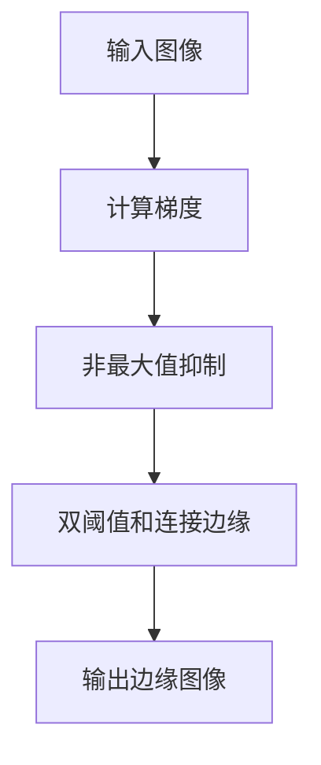

# 边缘检测原理与代码实例讲解

## 1. 背景介绍

边缘检测是图像处理和计算机视觉中的一个关键步骤,它用于识别图像中的边缘,即像素值发生剧烈变化的区域。边缘检测在许多领域都有广泛的应用,例如:

- **目标检测和识别**: 边缘检测可以帮助识别图像中的物体轮廓,为后续的目标检测和识别奠定基础。
- **图像分割**: 通过边缘检测可以将图像分割成不同的区域,这对于图像理解和分析非常有用。
- **特征提取**: 边缘是图像的重要特征之一,可用于提取图像的关键特征,用于图像匹配、跟踪等任务。
- **图像增强**: 边缘检测可以用于增强图像中的细节,提高图像质量。

## 2. 核心概念与联系

边缘检测的核心概念是**梯度(Gradient)**。梯度描述了图像亮度值在特定方向上的变化率。在二维图像中,梯度是一个二维向量,包含了水平和垂直两个方向的变化率。

梯度的幅值和方向可以通过以下公式计算:

$$
\begin{aligned}
G &= \sqrt{G_x^2 + G_y^2} \\
\theta &= \tan^{-1}(G_y / G_x)
\end{aligned}
$$

其中 $G_x$ 和 $G_y$ 分别表示水平和垂直方向的梯度分量。

边缘检测算法通常基于以下两个基本原理:

1. **梯度幅值原理**: 在边缘区域,图像亮度值发生剧烈变化,因此梯度幅值较大。
2. **梯度方向一致性原理**: 在边缘区域,梯度方向沿着边缘方向保持一致。

基于这两个原理,边缘检测算法通常包括以下几个步骤:

1. 计算梯度幅值和方向
2. 非最大值抑制(Non-Maximum Suppression)
3. 双阈值和连接边缘

下面我们将详细介绍这些步骤以及相关的数学原理和代码实现。

## 3. 核心算法原理具体操作步骤

### 3.1 计算梯度

梯度描述了图像亮度在特定方向上的变化率。在二维图像中,梯度是一个二维向量,包含了水平和垂直两个方向的变化率。

常用的计算梯度的方法有:

1. **Sobel算子**: 使用两个3x3的卷积核分别计算水平和垂直方向的梯度近似值。

   $$
   G_x = \begin{bmatrix}
   -1 & 0 & 1\\
   -2 & 0 & 2\\
   -1 & 0 & 1
   \end{bmatrix} * I
   $$

   $$
   G_y = \begin{bmatrix}
   1 & 2 & 1\\
   0 & 0 & 0\\
   -1 & -2 & -1
   \end{bmatrix} * I
   $$

   其中 $I$ 表示原始图像, $*$ 表示卷积操作。

2. **Scharr算子**: 与Sobel算子类似,但使用了更大的卷积核,对于噪声有更好的抗扰性。
3. **Prewitt算子**: 使用另一种3x3的卷积核计算梯度近似值。

计算梯度幅值和方向:

$$
\begin{aligned}
G &= \sqrt{G_x^2 + G_y^2} \\
\theta &= \tan^{-1}(G_y / G_x)
\end{aligned}
$$

### 3.2 非最大值抑制

非最大值抑制(Non-Maximum Suppression)是一种细化边缘的方法。它的基本思想是,对于每个像素点,只保留梯度方向上的最大值,而将其他方向上的值抑制为0。

具体操作步骤如下:

1. 计算每个像素点的梯度方向 $\theta$,并将其量化为水平、垂直或者两个对角线方向之一。
2. 对于每个像素点,根据其梯度方向,检查梯度值是否是该方向上的最大值。如果是,则保留该像素值;否则将其设置为0。

通过非最大值抑制,可以获得一个更细化的边缘图像,其中只保留了可能的边缘像素点。

### 3.3 双阈值和连接边缘

由于噪声和其他因素的影响,经过非最大值抑制后的边缘图像可能仍然存在一些断裂和孤立的边缘像素点。为了获得更加连续和完整的边缘,我们需要进行双阈值和连接边缘的操作。

具体步骤如下:

1. 设置两个阈值 $T_1$ 和 $T_2$,其中 $T_1 < T_2$。
2. 对于每个像素点,如果其梯度值大于 $T_2$,则将其标记为强边缘像素;如果其梯度值小于 $T_1$,则将其标记为非边缘像素;如果其梯度值介于 $T_1$ 和 $T_2$ 之间,则将其标记为弱边缘像素。
3. 对于弱边缘像素,如果它与强边缘像素相连,则将其标记为强边缘像素;否则将其标记为非边缘像素。

通过这种方式,我们可以获得更加连续和完整的边缘图像。

## 4. 数学模型和公式详细讲解举例说明

在边缘检测算法中,常用的数学模型和公式包括:

### 4.1 梯度计算

梯度描述了图像亮度在特定方向上的变化率。在二维图像中,梯度是一个二维向量,包含了水平和垂直两个方向的变化率。

对于一个二维函数 $f(x, y)$,其梯度可以表示为:

$$
\nabla f = \left( \frac{\partial f}{\partial x}, \frac{\partial f}{\partial y} \right)
$$

在离散的数字图像中,我们通常使用有限差分来近似计算梯度。常用的梯度计算算子包括:

1. **Sobel算子**:

   $$
   G_x = \begin{bmatrix}
   -1 & 0 & 1\\
   -2 & 0 & 2\\
   -1 & 0 & 1
   \end{bmatrix} * I
   $$

   $$
   G_y = \begin{bmatrix}
   1 & 2 & 1\\
   0 & 0 & 0\\
   -1 & -2 & -1
   \end{bmatrix} * I
   $$

2. **Scharr算子**:

   $$
   G_x = \begin{bmatrix}
   -3 & 0 & 3\\
   -10 & 0 & 10\\
   -3 & 0 & 3
   \end{bmatrix} * I
   $$

   $$
   G_y = \begin{bmatrix}
   3 & 10 & 3\\
   0 & 0 & 0\\
   -3 & -10 & -3
   \end{bmatrix} * I
   $$

3. **Prewitt算子**:

   $$
   G_x = \begin{bmatrix}
   -1 & 0 & 1\\
   -1 & 0 & 1\\
   -1 & 0 & 1
   \end{bmatrix} * I
   $$

   $$
   G_y = \begin{bmatrix}
   1 & 1 & 1\\
   0 & 0 & 0\\
   -1 & -1 & -1
   \end{bmatrix} * I
   $$

其中 $I$ 表示原始图像, $*$ 表示卷积操作。

计算梯度幅值和方向:

$$
\begin{aligned}
G &= \sqrt{G_x^2 + G_y^2} \\
\theta &= \tan^{-1}(G_y / G_x)
\end{aligned}
$$

**举例说明**:

假设我们有一个3x3的图像块:

$$
I = \begin{bmatrix}
1 & 2 & 3\\
4 & 5 & 6\\
7 & 8 & 9
\end{bmatrix}
$$

使用Sobel算子计算梯度:

$$
G_x = \begin{bmatrix}
-1 & 0 & 1\\
-2 & 0 & 2\\
-1 & 0 & 1
\end{bmatrix} * I = \begin{bmatrix}
-2 & 0 & 2\\
-8 & 0 & 8\\
-2 & 0 & 2
\end{bmatrix}
$$

$$
G_y = \begin{bmatrix}
1 & 2 & 1\\
0 & 0 & 0\\
-1 & -2 & -1
\end{bmatrix} * I = \begin{bmatrix}
6 & 12 & 6\\
0 & 0 & 0\\
-6 & -12 & -6
\end{bmatrix}
$$

计算梯度幅值和方向:

$$
G = \sqrt{(-2)^2 + 6^2} = \sqrt{40} \approx 6.32
$$

$$
\theta = \tan^{-1}(6 / (-2)) \approx -1.25
$$

### 4.2 非最大值抑制

非最大值抑制是一种细化边缘的方法,它的基本思想是,对于每个像素点,只保留梯度方向上的最大值,而将其他方向上的值抑制为0。

设 $G(x, y)$ 表示像素点 $(x, y)$ 处的梯度幅值, $\theta(x, y)$ 表示该点处的梯度方向。非最大值抑制的操作可以表示为:

$$
G'(x, y) = \begin{cases}
G(x, y), & \text{if } G(x, y) \text{ is maximum along } \theta(x, y) \\
0, & \text{otherwise}
\end{cases}
$$

其中 $G'(x, y)$ 表示经过非最大值抑制后的梯度值。

**举例说明**:

假设我们有一个3x3的梯度幅值矩阵:

$$
G = \begin{bmatrix}
2 & 4 & 3\\
1 & 5 & 2\\
3 & 2 & 1
\end{bmatrix}
$$

对应的梯度方向矩阵为:

$$
\theta = \begin{bmatrix}
\pi/4 & 0 & \pi/4\\
\pi/2 & - & 0\\
3\pi/4 & \pi & \pi/2
\end{bmatrix}
$$

其中 `-` 表示未定义的梯度方向。

对于像素点 $(1, 2)$,其梯度幅值为5,梯度方向为0(水平方向)。在水平方向上,它是最大值,因此保留该像素值。

对于像素点 $(2, 1)$,其梯度幅值为1,梯度方向为 $\pi/2$ (垂直方向)。在垂直方向上,它不是最大值,因此将其设置为0。

经过非最大值抑制后,我们得到:

$$
G' = \begin{bmatrix}
2 & 4 & 3\\
0 & 5 & 0\\
0 & 0 & 0
\end{bmatrix}
$$

### 4.3 双阈值和连接边缘

双阈值和连接边缘是一种获得更加连续和完整的边缘图像的方法。它的基本思想是设置两个阈值 $T_1$ 和 $T_2$,将像素点分为强边缘、弱边缘和非边缘三类,然后将弱边缘像素与强边缘像素连接起来。

设 $G(x, y)$ 表示像素点 $(x, y)$ 处的梯度幅值,则双阈值操作可以表示为:

$$
E(x, y) = \begin{cases}
1, & \text{if } G(x, y) > T_2 \\
0, & \text{if } G(x, y) < T_1 \\
\text{weak}, & \text{otherwise}
\end{cases}
$$

其中 $E(x, y)$ 表示该像素点是否为边缘像素,1表示强边缘像素,0表示非边缘像素,`weak`表示弱边缘像素。

对于弱边缘像素,我们需要检查它是否与强边缘像素相连。如果相连,则将其标记为强边缘像素;否则将其标