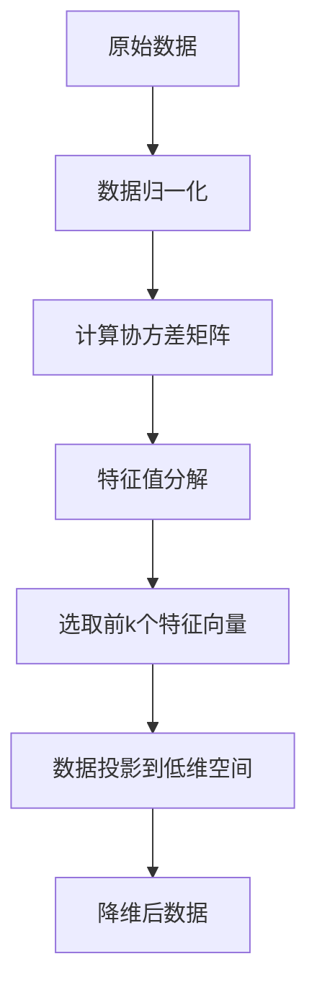
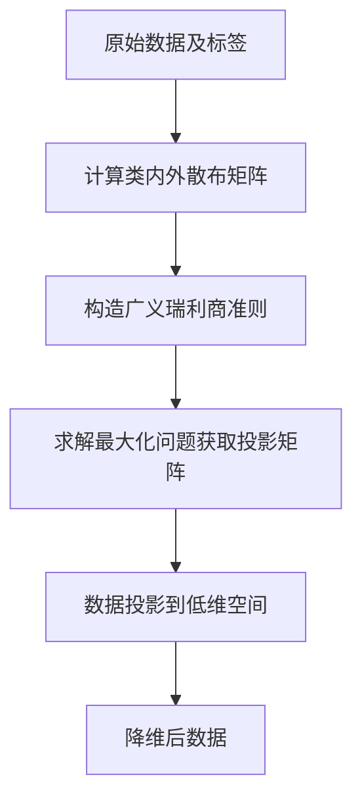
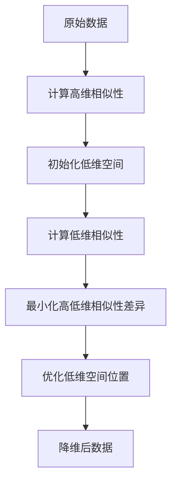

# 降维算法 原理与代码实例讲解

## 1.背景介绍

在现代数据分析和机器学习领域,我们经常会遇到高维数据集。高维数据集存在"维数灾难"(Curse of Dimensionality)问题,导致数据变得稀疏,降低了模型的准确性和泛化能力。此外,高维数据也会增加计算复杂度,降低模型的效率。因此,在处理高维数据之前,通常需要进行降维操作,将数据映射到低维空间,同时尽可能保留原始数据的特征。

降维算法在数据压缩、数据可视化、噪声消除等领域都有广泛应用。常见的降维算法包括主成分分析(PCA)、线性判别分析(LDA)、等式核映射(Isomap)、局部线性嵌入(LLE)、t-SNE等。本文将重点介绍PCA、LDA和t-SNE三种常用降维算法的原理、实现及应用场景。

## 2.核心概念与联系

### 2.1 特征提取与降维

特征提取(Feature Extraction)和降维(Dimensionality Reduction)是数据预处理中的两个重要概念,二者有一定联系但也有区别。

特征提取是从原始数据中选取出对学习任务更有意义的特征子集,目的是减少冗余特征,提高模型的泛化能力。常见的特征提取方法包括Filter方法(如卡方检验、互信息等)、Wrapper方法(如递归特征消除)和Embedded方法(如Lasso回归)。

降维则是将高维数据映射到低维空间,目的是降低数据的复杂度,提高模型的计算效率。降维算法可以看作是一种特征提取方法,但不同之处在于降维算法会构造出新的低维特征,而不仅仅是从原始特征中选取子集。

### 2.2 监督降维与无监督降维

根据是否利用数据标签信息,降维算法可分为监督降维和无监督降维两大类。

无监督降维算法(如PCA、Isomap、LLE等)仅利用数据的特征信息,不考虑数据的标签,目标是保留数据的本征结构。

监督降维算法(如LDA)则同时利用数据的特征和标签信息,目标是最大化不同类别样本之间的差异,并最小化同类样本之间的差异,从而提高降维后数据的可分性。

## 3.核心算法原理具体操作步骤

### 3.1 主成分分析(PCA)

#### 3.1.1 原理

PCA是一种经典的无监督降维方法,其核心思想是将原始数据投影到一组相互正交的低维空间中,使投影数据的方差最大化。具体步骤如下:

1. 对原始数据进行归一化处理,使每个特征的均值为0,方差为1。
2. 计算数据的协方差矩阵。
3. 对协方差矩阵进行特征值分解,得到特征值和对应的特征向量。
4. 选取前k个最大的特征值对应的特征向量作为投影矩阵。
5. 将原始数据投影到由选取的k个特征向量构成的低维空间中,得到降维后的数据。

PCA的优点是算法简单、无需标签信息、可解释性强。缺点是只能发现线性关系,对于非线性数据效果不佳。

#### 3.1.2 算法流程图



### 3.2 线性判别分析(LDA)

#### 3.2.1 原理  

LDA是一种监督降维方法,其目标是在降维的同时最大化不同类别样本之间的离散程度,最小化同类样本之间的离散程度。具体步骤如下:

1. 计算类内散布矩阵和类间散布矩阵。
2. 构造广义瑞利商准则,即类间散布矩阵与类内散布矩阵的比值。
3. 求解广义瑞利商准则的最大化问题,得到投影矩阵。
4. 将原始数据投影到由投影矩阵构成的低维空间中,得到降维后的数据。

LDA的优点是利用了标签信息,降维后数据的可分性更好。缺点是投影维数上限受限于类别数量,对于非高斯分布的数据效果不佳。

#### 3.2.2 算法流程图



### 3.3 t-SNE

#### 3.3.1 原理

t-SNE(t-Distributed Stochastic Neighbor Embedding)是一种流行的非线性降维算法,其核心思想是在高维和低维空间中均使用学生t分布对数据点之间的相似性进行建模,并最小化两个空间中相似性之间的差异。具体步骤如下:

1. 构造高维空间中数据点之间的相似性:
   - 计算每个数据点与其他数据点之间的欧氏距离
   - 基于距离构造高斯分布,得到每个数据点对其他数据点的条件概率(相似性)
2. 在低维空间中随机初始化数据点的位置
3. 在低维空间中构造数据点之间的相似性,使用t分布建模
4. 最小化高维和低维空间中相似性之间的KL散度,通过梯度下降法优化低维空间中数据点的位置
5. 迭代优化直至收敛,得到降维后的数据点位置

t-SNE的优点是能够很好地保留数据的局部和全局结构,可视化效果出色。缺点是计算复杂度较高,对超大规模数据集表现不佳。

#### 3.3.2 算法流程图  



## 4.数学模型和公式详细讲解举例说明

### 4.1 PCA数学模型

假设原始数据矩阵为$X=(x_1,x_2,...,x_n)^T$,其中$x_i$为第i个样本,维度为$d$。PCA的目标是找到一个投影矩阵$W$,使得投影后的数据$Y=XW$的方差最大化。

令$\Sigma=\frac{1}{n}\sum_{i=1}^n(x_i-\mu)(x_i-\mu)^T$为数据的协方差矩阵,其中$\mu$为数据均值。则PCA的优化目标可表示为:

$$\max\limits_{W}\text{tr}(W^T\Sigma W)$$
$$s.t.\quad W^TW=I$$

其中$\text{tr}(\cdot)$表示矩阵的迹。上式的解析解为$\Sigma$的前$k$个最大特征值对应的特征向量。

### 4.2 LDA数学模型

假设数据集$X$包含$c$个类别,第$i$类的均值向量为$\mu_i$,整体均值向量为$\mu$。LDA的目标是找到一个投影矩阵$W$,使得投影后的数据具有最佳的可分性。

定义类内散布矩阵:

$$S_w=\sum_{i=1}^c\sum_{x\in X_i}(x-\mu_i)(x-\mu_i)^T$$

定义类间散布矩阵:

$$S_b=\sum_{i=1}^c n_i(\mu_i-\mu)(\mu_i-\mu)^T$$

其中$n_i$为第$i$类样本数量。则LDA的优化目标为:

$$\max\limits_{W}\frac{W^TS_bW}{W^TS_wW}$$

上式的解析解为$S_w^{-1}S_b$的前$c-1$个最大广义特征值对应的广义特征向量。

### 4.3 t-SNE相似性计算

在t-SNE算法中,高维空间中数据点$x_i$和$x_j$之间的相似性定义为:

$$p_{j|i}=\frac{\exp(-\|x_i-x_j\|^2/2\sigma_i^2)}{\sum_{k\neq i}\exp(-\|x_i-x_k\|^2/2\sigma_i^2)}$$

其中$\sigma_i$是与$x_i$相关的带宽参数。在低维空间中,相似性定义为:

$$q_{j|i}=\frac{(1+\|y_i-y_j\|^2)^{-1}}{\sum_{k\neq i}(1+\|y_i-y_k\|^2)^{-1}}$$

其中$y_i$和$y_j$为$x_i$和$x_j$在低维空间中的映射位置。

t-SNE的优化目标是最小化高维和低维空间中相似性之间的KL散度:

$$C=\sum_i KL(P_i\|Q_i)=\sum_i\sum_jp_{j|i}\log\frac{p_{j|i}}{q_{j|i}}$$

通过梯度下降法优化$y_i$的位置,最小化上式。

## 5.项目实践:代码实例和详细解释说明

以下是使用Python中的scikit-learn库实现PCA、LDA和t-SNE三种降维算法的代码示例。

### 5.1 PCA代码示例

```python
from sklearn.datasets import load_iris
from sklearn.decomposition import PCA
import matplotlib.pyplot as plt

# 加载iris数据集
iris = load_iris()
X = iris.data

# 构建PCA模型并拟合数据
pca = PCA(n_components=2)
X_pca = pca.fit_transform(X)

# 可视化降维后的数据
plt.scatter(X_pca[:, 0], X_pca[:, 1], c=iris.target)
plt.show()
```

上述代码首先加载iris数据集,然后使用scikit-learn中的PCA类构建PCA模型,设置降维后的维数为2。通过`fit_transform`方法将原始数据拟合到PCA模型并进行降维转换。最后使用matplotlib可视化降维后的二维数据。

### 5.2 LDA代码示例  

```python
from sklearn.datasets import load_iris
from sklearn.discriminant_analysis import LinearDiscriminantAnalysis
import matplotlib.pyplot as plt

# 加载iris数据集
iris = load_iris()
X = iris.data
y = iris.target

# 构建LDA模型并拟合数据
lda = LinearDiscriminantAnalysis(n_components=2)
X_lda = lda.fit_transform(X, y)

# 可视化降维后的数据
plt.scatter(X_lda[:, 0], X_lda[:, 1], c=y)
plt.show()
```

上述代码首先加载iris数据集,然后使用scikit-learn中的LinearDiscriminantAnalysis类构建LDA模型,设置降维后的维数为2。由于LDA是监督降维算法,因此在`fit_transform`方法中需要同时提供原始数据X和标签y。最后使用matplotlib可视化降维后的二维数据。

### 5.3 t-SNE代码示例

```python
from sklearn.datasets import load_digits
from sklearn.manifold import TSNE
import matplotlib.pyplot as plt

# 加载手写数字数据集
digits = load_digits()
X = digits.data

# 构建t-SNE模型并拟合数据
tsne = TSNE(n_components=2, random_state=0)
X_tsne = tsne.fit_transform(X)

# 可视化降维后的数据
plt.scatter(X_tsne[:, 0], X_tsne[:, 1], c=digits.target)
plt.show()
```

上述代码首先加载手写数字数据集,然后使用scikit-learn中的TSNE类构建t-SNE模型,设置降维后的维数为2。通过`fit_transform`方法将原始数据拟合到t-SNE模型并进行降维转换。最后使用matplotlib可视化降维后的二维数据。

## 6.实际应用场景

降维算法在各个领域都有广泛的应用,以下列举了一些典型场景:

- **数据可视化**: 将高维数据降维到二维或三维,便于可视化分析数据的分布和结构。
- **图像处理**: 对图像数据进行降维,可以减小数据量、去除冗余信息,提高图像处理的效率。
- **基因数据分