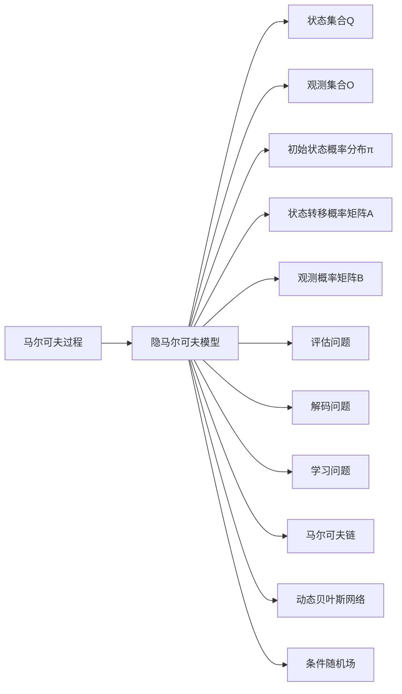

# 隐马尔可夫模型(Hidden Markov Models) - 原理与代码实例讲解

## 1. 背景介绍
### 1.1 隐马尔可夫模型概述
隐马尔可夫模型(Hidden Markov Models, HMM)是一种强大的统计学习模型,广泛应用于语音识别、自然语言处理、生物信息学等领域。它是一种概率图模型,用于描述一个包含隐藏状态的马尔可夫过程。HMM 由观测状态和隐藏状态组成,其中观测状态是可见的,而隐藏状态是不可见的。HMM 通过观测状态序列来推断最有可能的隐藏状态序列,从而实现对未知数据的预测和分类。

### 1.2 隐马尔可夫模型的历史
HMM 最早由 Leonard E. Baum 和 Ted Petrie 在 20 世纪 60 年代提出,最初用于解决语音识别问题。随后,HMM 在语音识别领域取得了巨大成功,成为语音识别的主流技术之一。20 世纪 80 年代,HMM 开始被应用于自然语言处理领域,如词性标注、命名实体识别等任务。近年来,HMM 在生物信息学领域也得到了广泛应用,如基因序列分析、蛋白质结构预测等。

### 1.3 隐马尔可夫模型的应用领域
- 语音识别:HMM 是语音识别系统的核心组件,用于对语音信号进行建模和解码。
- 自然语言处理:HMM 可用于词性标注、命名实体识别、句法分析等任务。
- 生物信息学:HMM 可用于基因序列分析、蛋白质结构预测、基因注释等任务。
- 手写识别:HMM 可用于对手写字符进行建模和识别。
- 行为识别:HMM 可用于对人的行为模式进行建模和预测。

## 2. 核心概念与联系
### 2.1 马尔可夫过程
马尔可夫过程是一种随机过程,其未来状态只依赖于当前状态,而与过去状态无关。马尔可夫过程满足马尔可夫性质,即在给定当前状态的情况下,未来状态的条件概率分布只依赖于当前状态,而与过去状态无关。马尔可夫过程可以用状态转移矩阵来描述状态之间的转移概率。

### 2.2 隐马尔可夫模型的组成
HMM 由以下五个要素组成:
- 状态集合 $Q$:包含所有可能的隐藏状态。
- 观测集合 $O$:包含所有可能的观测状态。
- 初始状态概率分布 $\pi$:表示模型初始时刻处于各个隐藏状态的概率。
- 状态转移概率矩阵 $A$:表示隐藏状态之间的转移概率。
- 观测概率矩阵 $B$:表示在给定隐藏状态的情况下,生成各个观测状态的概率。

### 2.3 隐马尔可夫模型的三个基本问题
- 评估问题:给定 HMM 模型参数和观测序列,计算观测序列出现的概率。通常使用前向算法解决。
- 解码问题:给定 HMM 模型参数和观测序列,找到最有可能生成该观测序列的隐藏状态序列。通常使用 Viterbi 算法解决。
- 学习问题:给定观测序列,估计 HMM 模型参数,使得模型生成观测序列的概率最大。通常使用 Baum-Welch 算法(前向-后向算法)解决。

### 2.4 隐马尔可夫模型与其他模型的联系
- 马尔可夫链:隐马尔可夫模型可以看作是马尔可夫链的扩展,其中马尔可夫链只有隐藏状态,而 HMM 还包含观测状态。
- 动态贝叶斯网络:隐马尔可夫模型是动态贝叶斯网络的一种特例,其中隐藏状态之间存在马尔可夫性质。
- 条件随机场:条件随机场是 HMM 的判别式对应物,其中 HMM 是生成式模型,而条件随机场是判别式模型。

下图展示了隐马尔可夫模型的核心概念与联系:

## 3. 核心算法原理具体操作步骤
### 3.1 前向算法
前向算法用于解决 HMM 的评估问题,即计算给定观测序列出现的概率。其核心思想是通过递推计算前向概率,即在时刻 $t$ 状态为 $i$ 且观测序列为 $o_1,o_2,\dots,o_t$ 的概率。

具体步骤如下:
1. 初始化:计算初始时刻的前向概率。
2. 递推:根据前一时刻的前向概率和状态转移概率,计算当前时刻的前向概率。
3. 终止:将最后一个时刻的前向概率求和,得到观测序列出现的概率。

### 3.2 Viterbi 算法
Viterbi 算法用于解决 HMM 的解码问题,即找到最有可能生成观测序列的隐藏状态序列。其核心思想是通过动态规划,在每个时刻维护最优路径的概率和对应的隐藏状态。

具体步骤如下:
1. 初始化:计算初始时刻的最优路径概率和对应的隐藏状态。
2. 递推:根据前一时刻的最优路径概率和状态转移概率,计算当前时刻的最优路径概率和对应的隐藏状态。
3. 终止:在最后一个时刻,找到概率最大的路径,得到最优隐藏状态序列。
4. 回溯:从最后一个时刻开始,根据每个时刻的最优隐藏状态,逆向回溯得到完整的最优隐藏状态序列。

### 3.3 Baum-Welch 算法
Baum-Welch 算法(也称前向-后向算法)用于解决 HMM 的学习问题,即根据观测序列估计模型参数。其核心思想是通过 EM 算法,迭代更新模型参数,使得模型生成观测序列的概率最大。

具体步骤如下:
1. 初始化:随机初始化模型参数。
2. E 步:根据当前模型参数,计算前向概率、后向概率和两个时刻状态的联合概率。
3. M 步:根据 E 步计算得到的概率,更新模型参数。
4. 重复 E 步和 M 步,直到模型参数收敛或达到最大迭代次数。

## 4. 数学模型和公式详细讲解举例说明
### 4.1 隐马尔可夫模型的数学定义
隐马尔可夫模型可以用五元组 $\lambda=(Q,O,\pi,A,B)$ 来表示,其中:
- $Q=\{q_1,q_2,\dots,q_N\}$ 是隐藏状态集合,其中 $N$ 是隐藏状态的数量。
- $O=\{o_1,o_2,\dots,o_M\}$ 是观测状态集合,其中 $M$ 是观测状态的数量。
- $\pi=\{\pi_i\},\pi_i=P(i_1=q_i),i=1,2,\dots,N$ 是初始状态概率分布,表示初始时刻处于状态 $q_i$ 的概率。
- $A=\{a_{ij}\},a_{ij}=P(i_{t+1}=q_j|i_t=q_i),i,j=1,2,\dots,N$ 是状态转移概率矩阵,表示从状态 $q_i$ 转移到状态 $q_j$ 的概率。
- $B=\{b_j(k)\},b_j(k)=P(o_t=v_k|i_t=q_j),j=1,2,\dots,N,k=1,2,\dots,M$ 是观测概率矩阵,表示在状态 $q_j$ 下生成观测 $v_k$ 的概率。

### 4.2 前向算法的数学公式
定义前向概率 $\alpha_t(i)$ 表示在时刻 $t$ 状态为 $q_i$ 且观测序列为 $o_1,o_2,\dots,o_t$ 的概率,即 $\alpha_t(i)=P(o_1,o_2,\dots,o_t,i_t=q_i|\lambda)$。

前向算法的数学公式如下:
1. 初始化:
$$
\alpha_1(i)=\pi_ib_i(o_1),i=1,2,\dots,N
$$
2. 递推:
$$
\alpha_{t+1}(j)=\left[\sum_{i=1}^N\alpha_t(i)a_{ij}\right]b_j(o_{t+1}),j=1,2,\dots,N,t=1,2,\dots,T-1
$$
3. 终止:
$$
P(O|\lambda)=\sum_{i=1}^N\alpha_T(i)
$$

例如,考虑一个简单的 HMM,其中 $Q=\{q_1,q_2\},O=\{o_1,o_2\},\pi=[0.6,0.4],A=\begin{bmatrix}0.7&0.3\\0.4&0.6\end{bmatrix},B=\begin{bmatrix}0.5&0.5\\0.3&0.7\end{bmatrix}$。给定观测序列 $O=\{o_1,o_2,o_1\}$,使用前向算法计算 $P(O|\lambda)$。

初始化:
$$
\alpha_1(1)=\pi_1b_1(o_1)=0.6\times0.5=0.3\\
\alpha_1(2)=\pi_2b_2(o_1)=0.4\times0.3=0.12
$$

递推:
$$
\alpha_2(1)=[\alpha_1(1)a_{11}+\alpha_1(2)a_{21}]b_1(o_2)=(0.3\times0.7+0.12\times0.4)\times0.5=0.135\\
\alpha_2(2)=[\alpha_1(1)a_{12}+\alpha_1(2)a_{22}]b_2(o_2)=(0.3\times0.3+0.12\times0.6)\times0.7=0.1134\\
\alpha_3(1)=[\alpha_2(1)a_{11}+\alpha_2(2)a_{21}]b_1(o_1)=(0.135\times0.7+0.1134\times0.4)\times0.5=0.07035\\
\alpha_3(2)=[\alpha_2(1)a_{12}+\alpha_2(2)a_{22}]b_2(o_1)=(0.135\times0.3+0.1134\times0.6)\times0.3=0.03402
$$

终止:
$$
P(O|\lambda)=\alpha_3(1)+\alpha_3(2)=0.07035+0.03402=0.10437
$$

因此,观测序列 $O=\{o_1,o_2,o_1\}$ 在给定 HMM 下出现的概率为 $0.10437$。

### 4.3 Viterbi 算法的数学公式
定义 $\delta_t(i)$ 表示在时刻 $t$ 状态为 $q_i$ 且观测序列为 $o_1,o_2,\dots,o_t$ 的最优路径的概率,即 $\delta_t(i)=\max_{i_1,i_2,\dots,i_{t-1}}P(i_1,i_2,\dots,i_{t-1},i_t=q_i,o_1,o_2,\dots,o_t|\lambda)$。

定义 $\psi_t(i)$ 表示在时刻 $t$ 状态为 $q_i$ 的最优路径的前一个状态,用于回溯最优路径。

Viterbi 算法的数学公式如下:
1. 初始化:
$$
\delta_1(i)=\pi_ib_i(o_1),i=1,2,\dots,N\\
\psi_1(i)=0,i=1,2,\dots,N
$$
2. 递推:
$$
\delta_t(j)=\max