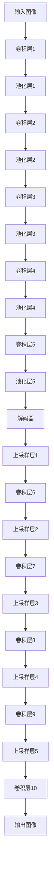

# 项目实战：应用SegNet进行视频语义分割

## 1.背景介绍

视频语义分割是计算机视觉领域中的一个重要任务，它旨在将视频中的每一帧图像进行像素级别的分类，从而识别出图像中的不同物体和场景。随着深度学习技术的快速发展，视频语义分割在自动驾驶、智能监控、医疗影像分析等领域得到了广泛应用。

SegNet是一种基于卷积神经网络（CNN）的深度学习模型，专门用于图像语义分割。它通过编码器-解码器架构对图像进行处理，能够高效地进行像素级别的分类。本文将详细介绍如何应用SegNet进行视频语义分割，并提供实际的代码示例和应用场景。

## 2.核心概念与联系

在深入探讨SegNet之前，我们需要了解一些核心概念和它们之间的联系。

### 2.1 卷积神经网络（CNN）

卷积神经网络是一种专门用于处理图像数据的深度学习模型。它通过卷积层、池化层和全连接层对图像进行特征提取和分类。CNN在图像分类、目标检测和语义分割等任务中表现出色。

### 2.2 语义分割

语义分割是计算机视觉中的一种任务，旨在将图像中的每一个像素分类到特定的类别中。与图像分类不同，语义分割需要对图像进行像素级别的分类，从而识别出图像中的不同物体和场景。

### 2.3 SegNet

SegNet是一种基于CNN的深度学习模型，专门用于图像语义分割。它采用编码器-解码器架构，通过对图像进行多层卷积和池化操作，提取图像的高层特征，并通过解码器将特征映射回原始图像的分辨率，从而实现像素级别的分类。

### 2.4 编码器-解码器架构

编码器-解码器架构是一种常见的深度学习模型架构，广泛应用于图像处理、自然语言处理等领域。编码器负责将输入数据编码为高维特征表示，解码器则将高维特征表示解码为原始数据的形式。

以下是SegNet的编码器-解码器架构的Mermaid流程图：



## 3.核心算法原理具体操作步骤

### 3.1 数据预处理

在进行视频语义分割之前，需要对视频数据进行预处理。具体步骤如下：

1. **视频帧提取**：将视频分解为一帧一帧的图像。
2. **图像归一化**：将图像像素值归一化到[0, 1]范围。
3. **数据增强**：通过旋转、翻转、裁剪等操作对图像进行数据增强，以增加数据的多样性。

### 3.2 模型训练

训练SegNet模型的具体步骤如下：

1. **模型初始化**：定义SegNet模型的架构，包括编码器和解码器的层数和参数。
2. **损失函数**：选择合适的损失函数，如交叉熵损失函数。
3. **优化器**：选择合适的优化器，如Adam优化器。
4. **训练过程**：将预处理后的图像数据输入模型，进行前向传播和反向传播，更新模型参数。

### 3.3 模型评估

在训练完成后，需要对模型进行评估。具体步骤如下：

1. **验证集评估**：使用验证集对模型进行评估，计算准确率、召回率、F1分数等指标。
2. **测试集评估**：使用测试集对模型进行最终评估，确保模型的泛化能力。

### 3.4 模型部署

在模型评估通过后，可以将模型部署到实际应用中。具体步骤如下：

1. **模型保存**：将训练好的模型参数保存为文件。
2. **模型加载**：在实际应用中加载模型参数。
3. **实时推理**：将实时视频帧输入模型，进行语义分割，输出分割结果。

## 4.数学模型和公式详细讲解举例说明

### 4.1 卷积操作

卷积操作是CNN的核心操作之一。假设输入图像为 $I$，卷积核为 $K$，则卷积操作的输出 $O$ 可以表示为：

$$
O(i, j) = \sum_{m} \sum_{n} I(i+m, j+n) \cdot K(m, n)
$$

### 4.2 池化操作

池化操作用于降低特征图的分辨率，常见的池化操作有最大池化和平均池化。假设输入特征图为 $F$，池化窗口大小为 $k \times k$，则最大池化操作的输出 $P$ 可以表示为：

$$
P(i, j) = \max_{m, n} F(i+m, j+n)
$$

### 4.3 交叉熵损失函数

交叉熵损失函数常用于分类任务中，假设预测概率为 $p$，真实标签为 $y$，则交叉熵损失函数可以表示为：

$$
L = -\sum_{i} y_i \log(p_i)
$$

### 4.4 反向传播算法

反向传播算法用于计算模型参数的梯度，并更新参数。假设损失函数为 $L$，模型参数为 $\theta$，则参数更新公式可以表示为：

$$
\theta = \theta - \eta \frac{\partial L}{\partial \theta}
$$

其中，$\eta$ 为学习率。

## 5.项目实践：代码实例和详细解释说明

### 5.1 数据预处理

以下是数据预处理的代码示例：

```python
import cv2
import numpy as np

def preprocess_video(video_path):
    cap = cv2.VideoCapture(video_path)
    frames = []
    while cap.isOpened():
        ret, frame = cap.read()
        if not ret:
            break
        frame = cv2.resize(frame, (256, 256))
        frame = frame / 255.0
        frames.append(frame)
    cap.release()
    return np.array(frames)

video_path = 'path_to_video.mp4'
frames = preprocess_video(video_path)
```

### 5.2 模型定义

以下是SegNet模型定义的代码示例：

```python
import tensorflow as tf
from tensorflow.keras import layers, models

def build_segnet(input_shape):
    inputs = layers.Input(shape=input_shape)
    
    # 编码器
    x = layers.Conv2D(64, (3, 3), activation='relu', padding='same')(inputs)
    x = layers.MaxPooling2D((2, 2), padding='same')(x)
    
    x = layers.Conv2D(128, (3, 3), activation='relu', padding='same')(x)
    x = layers.MaxPooling2D((2, 2), padding='same')(x)
    
    x = layers.Conv2D(256, (3, 3), activation='relu', padding='same')(x)
    x = layers.MaxPooling2D((2, 2), padding='same')(x)
    
    # 解码器
    x = layers.Conv2DTranspose(256, (3, 3), activation='relu', padding='same')(x)
    x = layers.UpSampling2D((2, 2))(x)
    
    x = layers.Conv2DTranspose(128, (3, 3), activation='relu', padding='same')(x)
    x = layers.UpSampling2D((2, 2))(x)
    
    x = layers.Conv2DTranspose(64, (3, 3), activation='relu', padding='same')(x)
    x = layers.UpSampling2D((2, 2))(x)
    
    outputs = layers.Conv2D(1, (1, 1), activation='sigmoid', padding='same')(x)
    
    model = models.Model(inputs, outputs)
    return model

input_shape = (256, 256, 3)
model = build_segnet(input_shape)
model.summary()
```

### 5.3 模型训练

以下是模型训练的代码示例：

```python
from tensorflow.keras.optimizers import Adam
from tensorflow.keras.losses import BinaryCrossentropy

model.compile(optimizer=Adam(learning_rate=0.001), loss=BinaryCrossentropy(), metrics=['accuracy'])

# 假设X_train和y_train是预处理后的训练数据和标签
model.fit(X_train, y_train, epochs=50, batch_size=16, validation_split=0.2)
```

### 5.4 模型评估

以下是模型评估的代码示例：

```python
# 假设X_val和y_val是预处理后的验证数据和标签
loss, accuracy = model.evaluate(X_val, y_val)
print(f'Validation Loss: {loss}')
print(f'Validation Accuracy: {accuracy}')
```

### 5.5 模型部署

以下是模型部署的代码示例：

```python
import tensorflow as tf

# 保存模型
model.save('segnet_model.h5')

# 加载模型
loaded_model = tf.keras.models.load_model('segnet_model.h5')

# 实时推理
def predict_frame(frame, model):
    frame = cv2.resize(frame, (256, 256))
    frame = frame / 255.0
    frame = np.expand_dims(frame, axis=0)
    prediction = model.predict(frame)
    return prediction[0]

# 假设cap是视频捕获对象
while cap.isOpened():
    ret, frame = cap.read()
    if not ret:
        break
    prediction = predict_frame(frame, loaded_model)
    # 处理预测结果
```

## 6.实际应用场景

### 6.1 自动驾驶

在自动驾驶中，视频语义分割可以用于识别道路、车辆、行人等，从而辅助车辆进行路径规划和避障。

### 6.2 智能监控

在智能监控中，视频语义分割可以用于识别异常行为、检测入侵者等，从而提高安全性。

### 6.3 医疗影像分析

在医疗影像分析中，视频语义分割可以用于识别病变区域、辅助医生进行诊断。

## 7.工具和资源推荐

### 7.1 深度学习框架

- TensorFlow
- PyTorch

### 7.2 数据集

- Cityscapes
- ADE20K
- PASCAL VOC

### 7.3 开源项目

- SegNet-Tutorial
- DeepLab

## 8.总结：未来发展趋势与挑战

视频语义分割作为计算机视觉领域的重要任务，具有广泛的应用前景。未来，随着深度学习技术的不断发展，视频语义分割的精度和效率将进一步提高。然而，视频语义分割仍面临一些挑战，如实时性要求高、数据标注成本高等。解决这些挑战需要研究人员和工程师的共同努力。

## 9.附录：常见问题与解答

### 9.1 如何选择合适的数据集？

选择数据集时，应根据具体应用场景选择具有代表性的数据集。例如，自动驾驶应用可以选择Cityscapes数据集，医疗影像分析可以选择专门的医学数据集。

### 9.2 如何提高模型的泛化能力？

提高模型泛化能力的方法包括数据增强、正则化、交叉验证等。

### 9.3 如何处理视频中的动态变化？

处理视频中的动态变化可以采用时序模型，如LSTM、3D卷积等，结合SegNet进行处理。

---

作者：禅与计算机程序设计艺术 / Zen and the Art of Computer Programming