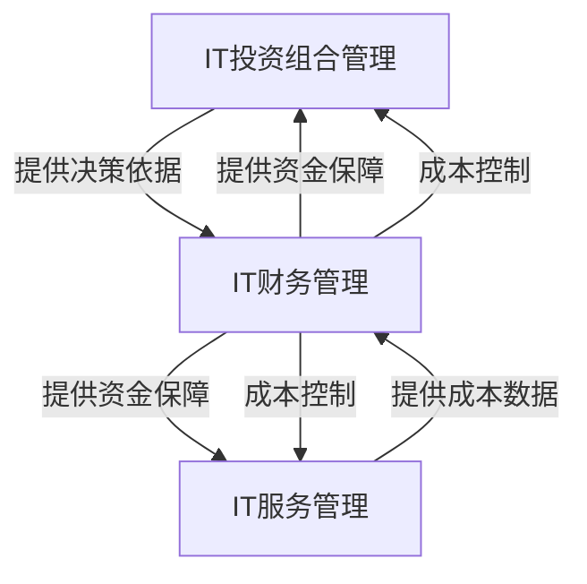

# 预算管理：制定并管理IT预算，确保资源得到高效分配，使IT投资为公司带来价值

## 1.背景介绍

### 1.1 IT预算的重要性

在当今瞬息万变的商业环境中，IT已经成为推动企业发展的关键力量。有效的IT投资不仅可以提高运营效率,还能创造新的收入来源,增强竞争优势。然而,IT支出往往占据企业总预算的很大一部分,因此如何制定并管理IT预算,确保资源得到高效分配,使IT投资为公司带来价值,就显得尤为重要。

### 1.2 IT预算管理的挑战

制定和管理IT预算面临着诸多挑战:

- **技术复杂性**:新兴技术层出不穷,企业需要评估每项技术的潜在价值和风险,做出明智的投资决策。
- **成本控制**:硬件、软件、人力资源等IT支出不断增加,企业需要在保证IT服务质量的同时,控制成本支出。
- **业务需求变化**:业务需求的频繁变化,要求IT部门具有足够的灵活性,快速响应新的需求。
- **投资回报评估**:衡量IT投资回报并非易事,需要建立科学的评估体系。

### 1.3 有效IT预算管理的意义

有效的IT预算管理有助于:

- **优化资源分配**:将有限的资源集中投放到对业务发展最关键的领域。
- **控制IT成本**:合理规划支出,避免资源浪费,实现成本节约。
- **提高IT投资回报率**:通过科学评估,选择具有最大回报潜力的IT项目。
- **支持业务发展战略**:将IT投资与企业战略目标相结合,发挥IT的战略作用。

## 2.核心概念与联系

### 2.1 IT投资组合管理

IT投资组合管理是指对企业的所有IT投资进行统一管理和优化配置,以实现战略目标。它包括:

- **项目评估和选择**:根据既定标准,评估潜在IT项目的价值、风险和可行性,选择最优投资组合。
- **资源分配**:根据项目优先级,合理分配人力、财力等资源。
- **项目监控和调整**:持续跟踪项目进展,必要时进行调整,确保投资价值最大化。

### 2.2 IT服务管理

IT服务管理是指对IT服务的全生命周期进行管理,以满足业务需求、提高服务质量、控制成本支出。主要包括:

- **服务目录管理**:定义和维护可交付的IT服务清单。
- **服务水平管理**:与业务部门协商,制定服务水平协议(SLA)。
- **服务运营管理**:确保IT服务按SLA交付,持续监控和优化。

### 2.3 IT财务管理

IT财务管理是指对IT支出进行全面管控,包括预算编制、资金管理、成本核算等,确保资金使用的合理性和透明度。主要包括:

- **IT预算编制**:根据业务需求和IT战略,编制年度IT预算。
- **资金管理**:管控资金使用流程,防止资金滥用。
- **成本核算**:跟踪和分析IT实际支出,为优化决策提供依据。

### 2.4 核心概念关系

上述三个核心概念相互关联、相互影响:

- IT投资组合管理为IT财务管理提供决策依据,确定资金投放的优先领域。
- IT服务管理为IT财务管理提供成本数据,并根据资金情况调整服务交付方式。
- IT财务管理为投资组合管理和服务管理提供资金保障,并对其进行成本控制。

三者的高度融合,构成了完整的IT预算管理体系,确保IT投资与企业战略目标保持一致,资源得到高效分配,投资回报最大化。

## 3.核心算法原理具体操作步骤

### 3.1 IT投资组合优化算法

IT投资组合优化是一个复杂的多目标决策问题,需要权衡项目价值、风险、资源占用等多个因素。常用的优化算法包括:

1. **整数规划算法**

   将投资组合优化问题转化为整数规划模型,以项目价值最大化为目标函数,以资源约束、风险约束等为约束条件,求解最优投资组合。

   算法步骤:
   
   1) 建立决策变量矩阵$X$,其中$x_{ij}$表示第$i$个项目是否被选中,取值为0或1。
   2) 确定目标函数:$\max \sum_{i=1}^{n}v_ix_{i}$,其中$v_i$为第$i$个项目的价值。
   3) 确定约束条件:
      - 资源约束:$\sum_{i=1}^{n}r_{ik}x_i \leq R_k$,其中$r_{ik}$为第$i$个项目对第$k$种资源的需求,$R_k$为第$k$种资源的总量。
      - 风险约束:$\sum_{i=1}^{n}p_ix_i \leq P$,其中$p_i$为第$i$个项目的风险值,$P$为可承受的最大风险值。
   4) 采用整数规划算法(如Branch and Bound)求解最优解$X^*$。

2. **基因算法**

   利用基因算法的全局搜索能力,从大量可能的投资组合中寻找最优解。

   算法步骤:

   1) 以二进制编码表示投资组合,编码长度为项目数$n$。
   2) 随机生成初始种群。
   3) 计算每个个体(投资组合)的适应度,可采用加权求和的方式,将项目价值、风险、资源占用等因素综合考虑。
   4) 选择、交叉、变异,产生新一代种群。
   5) 重复步骤3和4,直至满足停止条件,输出最优个体(投资组合)。

### 3.2 IT服务成本优化算法

IT服务成本优化的目标是在满足服务质量要求的前提下,最小化服务交付成本。常用的优化算法包括:

1. **线性规划算法**

   将服务成本优化问题转化为线性规划模型,以成本最小化为目标函数,以服务质量约束等为约束条件,求解最优解。

   算法步骤:

   1) 建立决策变量矩阵$X$,其中$x_j$表示第$j$种资源的分配量。
   2) 确定目标函数:$\min \sum_{j=1}^{m}c_jx_j$,其中$c_j$为第$j$种资源的单位成本。
   3) 确定约束条件:
      - 服务质量约束:$\sum_{j=1}^{m}q_{ij}x_j \geq Q_i$,其中$q_{ij}$为第$j$种资源对第$i$项服务质量的贡献,$Q_i$为第$i$项服务的质量下限。
      - 资源总量约束:$\sum_{j=1}^{m}x_j \leq R$,其中$R$为可用资源总量。
   4) 采用线性规划算法(如单纯形法)求解最优解$X^*$。

2. **模拟退火算法**

   模拟退火算法通过接受一定概率的劣解,有望逃离局部最优,从而找到全局最优解。

   算法步骤:

   1) 随机生成一个初始解(资源分配方案)$X_0$,计算其目标函数值$f(X_0)$。
   2) 设置初始温度$T_0$和终止温度$T_f$。
   3) 在当前温度$T$下,通过小扰动产生新解$X'$,计算$\Delta f=f(X')-f(X)$。
      - 若$\Delta f \leq 0$,接受新解$X'$; 
      - 若$\Delta f > 0$,以$\exp(-\Delta f/T)$的概率接受新解$X'$。
   4) 按特定策略下降温度$T$。
   5) 重复步骤3和4,直至温度下降到$T_f$,输出最优解。

以上算法可根据具体场景进行选择和调整,以求得最优的IT投资组合和服务交付方案。

## 4.数学模型和公式详细讲解举例说明

### 4.1 IT投资组合优化模型

IT投资组合优化问题可以建模为一个0-1整数规划模型,目标是在满足资源和风险约束的前提下,最大化投资组合的总价值。

假设有$n$个潜在IT项目,用$x_i$表示第$i$个项目是否被选中,其中$x_i=1$表示选中,$x_i=0$表示不选。令$v_i$为第$i$个项目的价值,$r_{ik}$为第$i$个项目对第$k$种资源的需求,$p_i$为第$i$个项目的风险值。

则该优化问题可以表示为:

$$\max \sum_{i=1}^{n}v_ix_{i}$$
$$\text{s.t.} \quad \sum_{i=1}^{n}r_{ik}x_i \leq R_k, \quad k=1,2,\cdots,m$$
$$\sum_{i=1}^{n}p_ix_i \leq P$$
$$x_i \in \{0,1\}, \quad i=1,2,\cdots,n$$

其中,$R_k$为第$k$种资源的总量,$P$为可承受的最大风险值。

**示例**:

假设有5个潜在IT项目,各项目的价值、资源需求(人力和财力)和风险值如下表所示:

| 项目 | 价值 | 人力需求 | 财力需求 | 风险值 |
|------|------|----------|----------|--------|
| 1    | 80   | 20       | 50       | 0.3    |
| 2    | 60   | 15       | 40       | 0.2    |
| 3    | 100  | 25       | 70       | 0.4    |
| 4    | 70   | 18       | 45       | 0.3    |
| 5    | 90   | 22       | 60       | 0.5    |

假设公司的人力资源总量为60人,财力资源总量为150万元,可承受的最大风险值为1。

将上述数据代入优化模型,可得:

$$\max 80x_1+60x_2+100x_3+70x_4+90x_5$$
$$\text{s.t.} \quad 20x_1+15x_2+25x_3+18x_4+22x_5 \leq 60$$
$$50x_1+40x_2+70x_3+45x_4+60x_5 \leq 150$$
$$0.3x_1+0.2x_2+0.4x_3+0.3x_4+0.5x_5 \leq 1$$
$$x_i \in \{0,1\}, \quad i=1,2,\cdots,5$$

通过整数规划算法求解,可得最优投资组合为$x_1=1,x_2=1,x_3=0,x_4=1,x_5=0$,即选择项目1、2和4,总价值为80+60+70=210。

### 4.2 IT服务成本优化模型

IT服务成本优化问题可以建模为一个线性规划模型,目标是在满足服务质量约束的前提下,最小化服务交付成本。

假设有$m$种资源可供分配,用$x_j$表示第$j$种资源的分配量,令$c_j$为第$j$种资源的单位成本。对于第$i$项服务,用$q_{ij}$表示第$j$种资源对该服务质量的贡献,$Q_i$表示该服务的质量下限。

则该优化问题可以表示为:

$$\min \sum_{j=1}^{m}c_jx_j$$
$$\text{s.t.} \quad \sum_{j=1}^{m}q_{ij}x_j \geq Q_i, \quad i=1,2,\cdots,n$$
$$\sum_{j=1}^{m}x_j \leq R$$
$$x_j \geq 0, \quad j=1,2,\cdots,m$$

其中,$R$为可用资源总量。

**示例**:

假设有3种资源(人力、硬件和软件)可供分配,用于交付2项IT服务。各资源的单位成本、对服务质量的贡献以及可用总